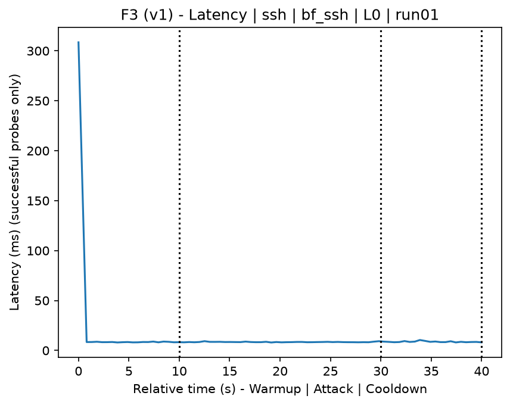
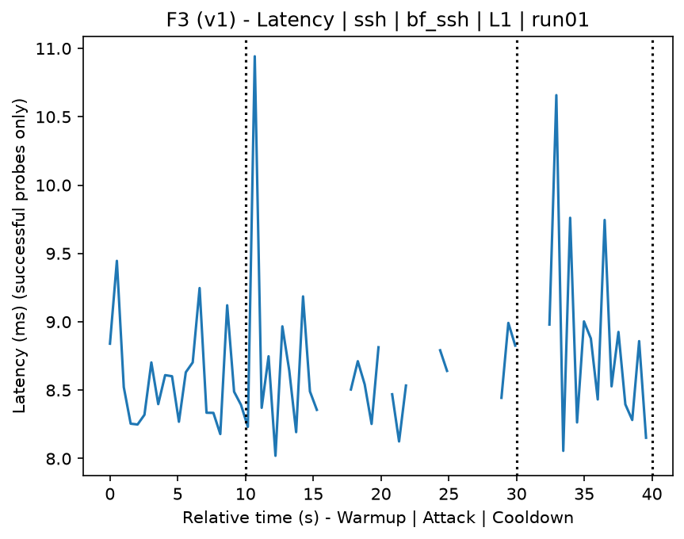
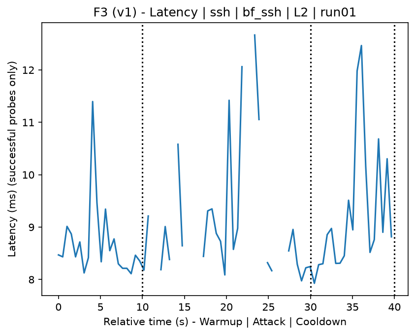
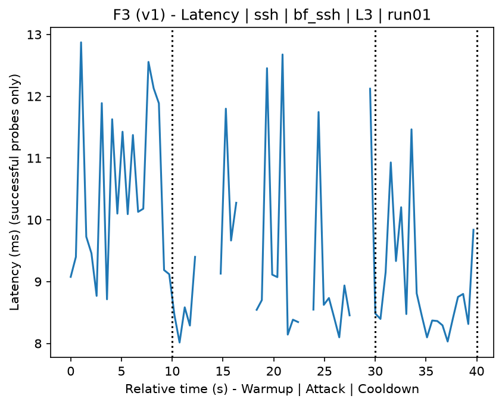
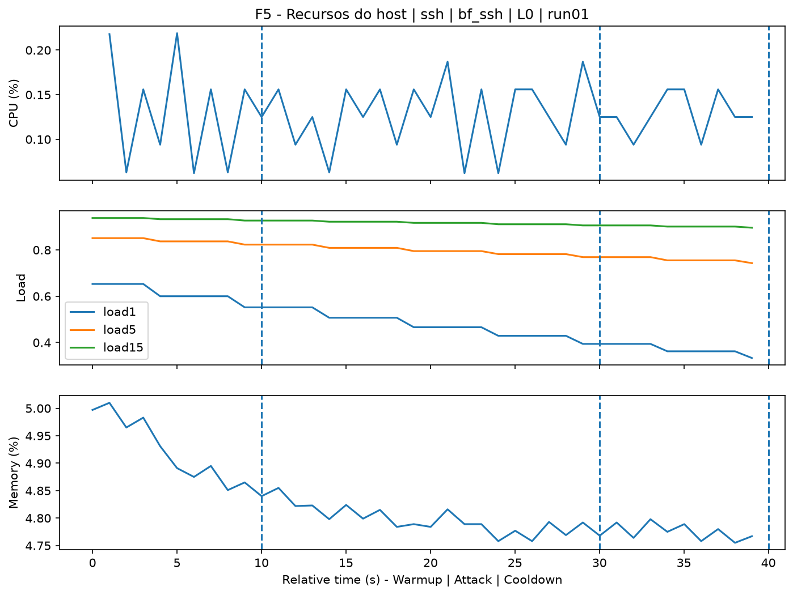
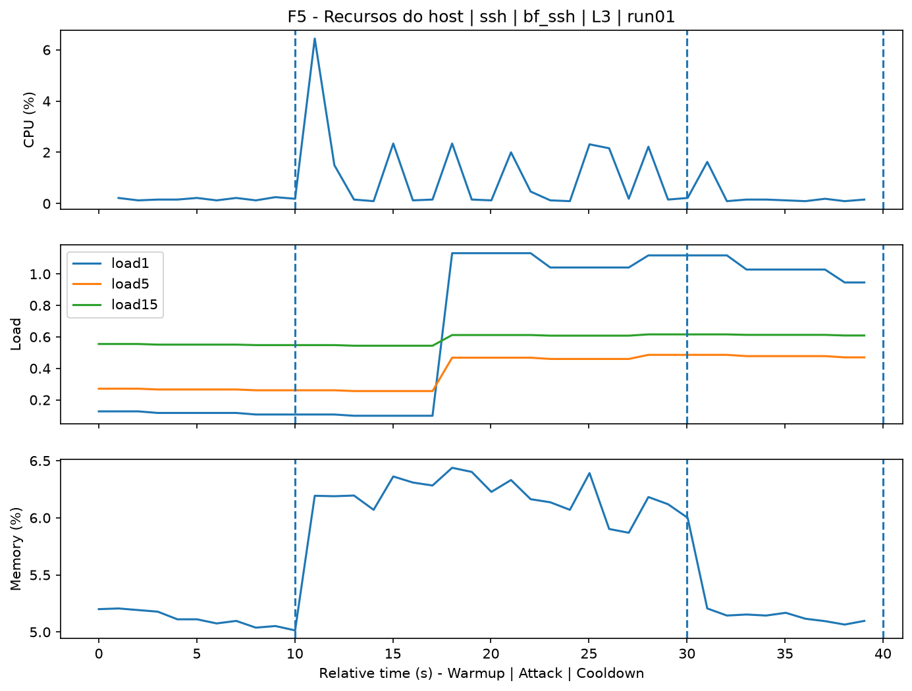
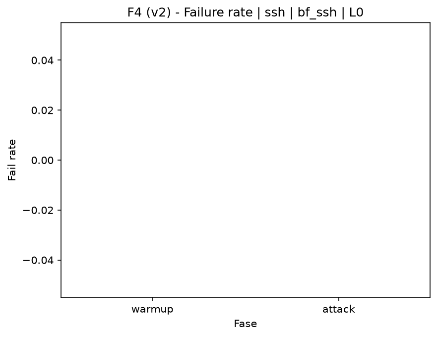
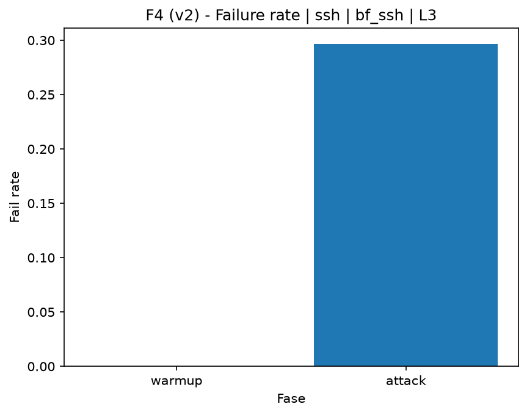

# SSH Bruteforce (`bf_ssh`)

[Campaign index](README.md)

In campaign `experiments/60att_5runs_l0l1l2l3`, this document consolidates the execution of attack `bf_ssh`. In the local catalog, the attack is described as: SSH authentication brute force. The documentation below uses only artifacts already present in the repository, mainly the tables and figures from `experiments/60att_5runs_l0l1l2l3/bf_ssh`.

## Attack Metadata

| Field | Value |
| --- | --- |
| ID | `bf_ssh` |
| Category | 4) Brute Force Against Remote Access Applications |
| Subcategory | 4.1 Brute Force |
| Target services | ssh-server |
| Image | `attack-ssh-bruteforce:latest` |
| Container | `attack-ssh-bruteforce` |
| Catalog max runtime | 10 s |
| Intensity parameters | n/a |
| MITRE ATT&CK | [https://attack.mitre.org/tactics/TA0006/](https://attack.mitre.org/tactics/TA0006/) [https://attack.mitre.org/techniques/T1110/](https://attack.mitre.org/techniques/T1110/) [https://attack.mitre.org/techniques/T1110/001/](https://attack.mitre.org/techniques/T1110/001/) |

## Statistical Summary by Level

| Level | Service | Runs | Attack samples | Mean success | Mean failure | Lat p50/p95 ms | Total PCAP MB | Mean dataset (min-max) | Mean exec s | Extractors ok/total | Mean/max CPU | Mean mem MB |
| --- | --- | --- | --- | --- | --- | --- | --- | --- | --- | --- | --- | --- |
| L0 | ssh | 5 | 195 | 100% | 0% | 8,35 / 8,95 | 0,3 | 1.327 (1.316-1.334) | 42,11 | 3/3 | 1,92% / 2% | 9,68 |
| L1 | ssh | 5 | 200 | 68,5% | 31,5% | 9,17 / 2.000 | 0,81 | 2.485 (2.326-2.552) | 42,03 | 3/3 | 25,22% / 86,38% | 37,96 |
| L2 | ssh | 5 | 199 | 73,4% | 26,6% | 9,34 / 2.000 | 0,84 | 2.551 (2.500-2.618) | 42,07 | 3/3 | 26,97% / 96,56% | 40,86 |
| L3 | ssh | 5 | 199 | 70,4% | 29,6% | 8,93 / 2.000 | 0,84 | 2.538 (2.478-2.600) | 42,09 | 3/3 | 26,83% / 94,11% | 42,03 |

## Stability Across Reruns

| Level | Metric | Runs | Mean | Deviation | CV | Min | Max |
| --- | --- | --- | --- | --- | --- | --- | --- |
| L0 | Mean CPU in attack phase | 5 | 1,92 | 0,02 | 1,26% | 1,9 | 1,96 |
| L0 | Dataset rows | 5 | 1.326,8 | 8,2 | 0,62% | 1.316 | 1.334 |
| L0 | Execution time | 5 | 42,11 | 0,81 | 1,92% | 41,73 | 43,56 |
| L0 | Failure in attack phase | 5 | 0 | 0 | n/a | 0 | 0 |
| L0 | Censored p95 latency | 5 | 8,95 | 0,2 | 2,23% | 8,61 | 9,08 |
| L1 | Mean CPU in attack phase | 5 | 25,22 | 4,19 | 16,61% | 20,65 | 30,59 |
| L1 | Dataset rows | 5 | 2.484,8 | 92,74 | 3,73% | 2.326 | 2.552 |
| L1 | Execution time | 5 | 42,03 | 0,03 | 0,08% | 42 | 42,08 |
| L1 | Failure in attack phase | 5 | 31,5 | 9,45 | 30,01% | 15 | 37,5 |
| L1 | Censored p95 latency | 5 | 2.000 | 0 | 0% | 2.000 | 2.000 |
| L2 | Mean CPU in attack phase | 5 | 26,97 | 3,13 | 11,61% | 23,53 | 30,65 |
| L2 | Dataset rows | 5 | 2.550,8 | 48,76 | 1,91% | 2.500 | 2.618 |
| L2 | Execution time | 5 | 42,07 | 0,11 | 0,25% | 42,01 | 42,26 |
| L2 | Failure in attack phase | 5 | 26,58 | 7,89 | 29,67% | 15,38 | 37,5 |
| L2 | Censored p95 latency | 5 | 2.000 | 0 | 0% | 2.000 | 2.000 |
| L3 | Mean CPU in attack phase | 5 | 26,83 | 4,19 | 15,63% | 22,3 | 32,16 |
| L3 | Dataset rows | 5 | 2.538 | 48,31 | 1,9% | 2.478 | 2.600 |
| L3 | Execution time | 5 | 42,09 | 0,11 | 0,27% | 41,98 | 42,23 |
| L3 | Failure in attack phase | 5 | 29,63 | 2,48 | 8,36% | 25,64 | 32,5 |
| L3 | Censored p95 latency | 5 | 2.000 | 0 | 0% | 2.000 | 2.000 |

## Artifact Validation

| Level | Runs | Capture | Probe | Features | Dataset | Resources | Server stats | Acceptance |
| --- | --- | --- | --- | --- | --- | --- | --- | --- |
| L0 | 5 | 5/5 | 5/5 | 5/5 | 5/5 | 5/5 | 5/5 | 5/5 |
| L1 | 5 | 5/5 | 5/5 | 5/5 | 5/5 | 5/5 | 5/5 | 5/5 |
| L2 | 5 | 5/5 | 5/5 | 5/5 | 5/5 | 5/5 | 5/5 | 5/5 |
| L3 | 5 | 5/5 | 5/5 | 5/5 | 5/5 | 5/5 | 5/5 | 5/5 |

## Selected Figures

<table>
<tr>
<td> Time series L0 run01</td>
<td> Time series L1 run01</td>
</tr>
<tr>
<td> Time series L2 run01</td>
<td> Time series L3 run01</td>
</tr>
<tr>
<td> Resources L0 run01</td>
<td> Resources L3 run01</td>
</tr>
<tr>
<td> Failure rate L0</td>
<td> Failure rate L3</td>
</tr>
</table>

## Sources Used

- Attack catalog: `docker/attackers/ssh-bruteforce/attack.yaml`
- Campaign artifacts: `experiments/60att_5runs_l0l1l2l3/bf_ssh`
