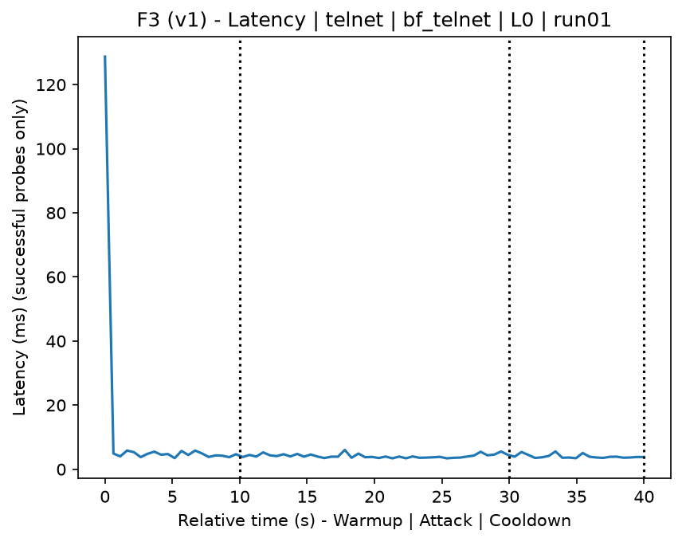
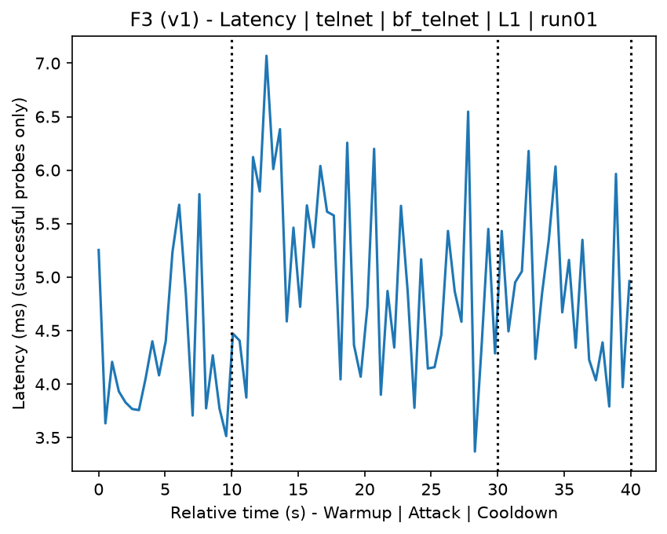
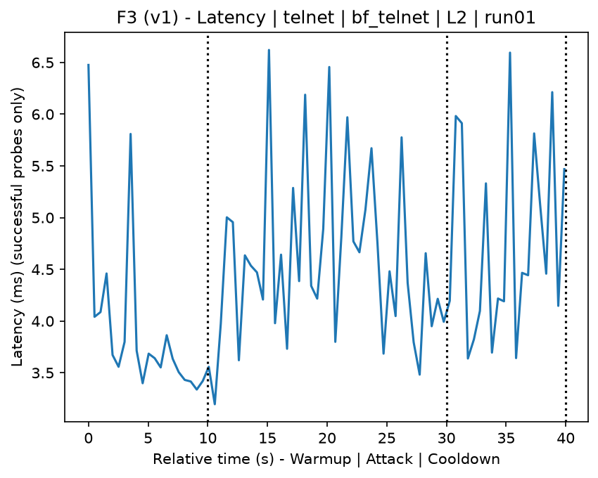
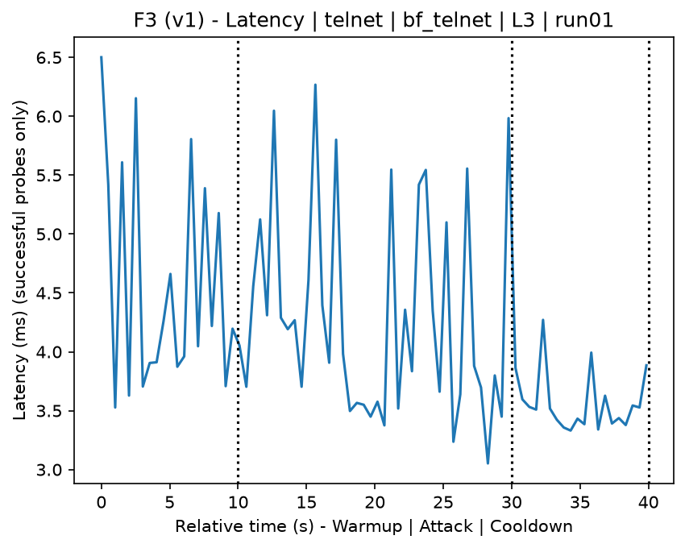
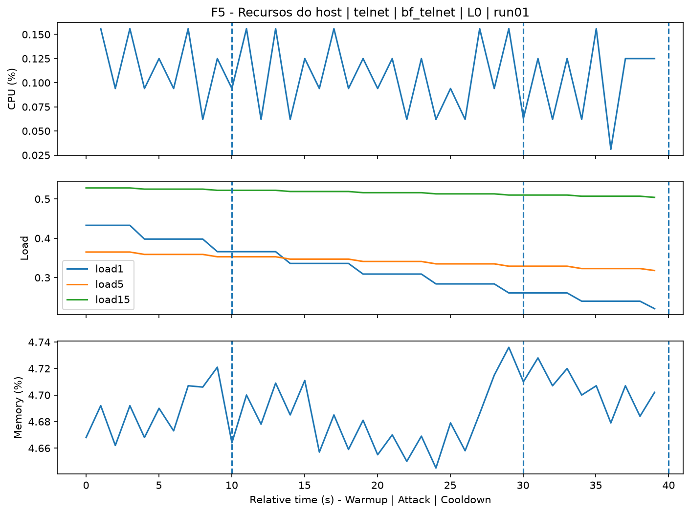
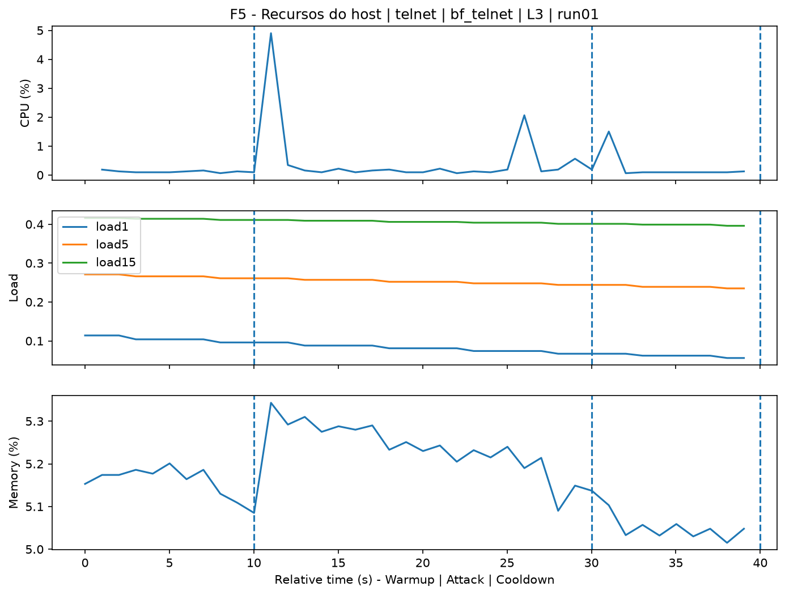
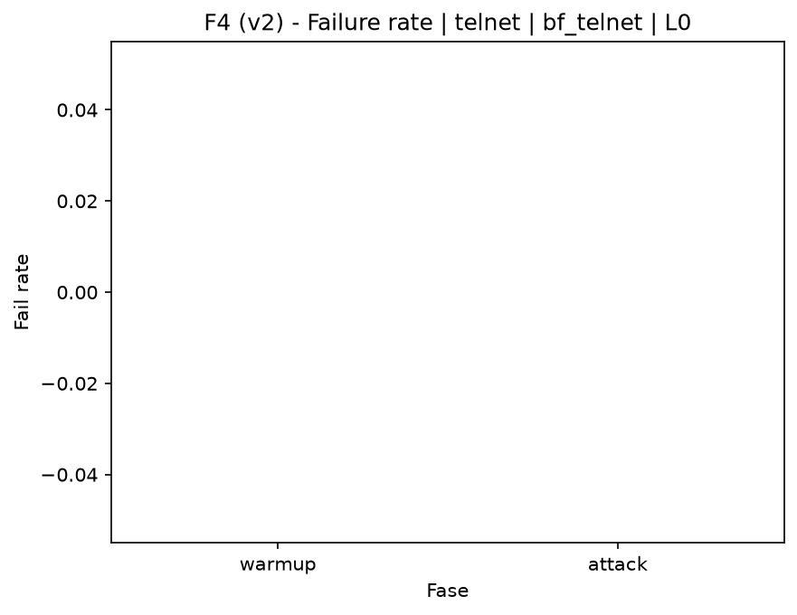
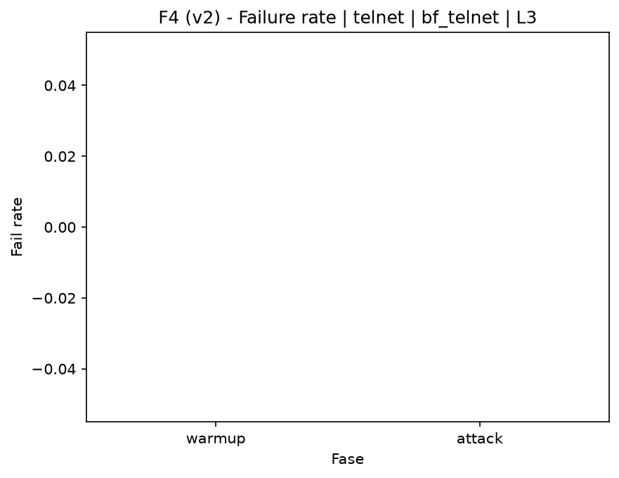

# Telnet Bruteforce (`bf_telnet`)

[Campaign index](README.md)

In campaign `experiments/60att_5runs_l0l1l2l3`, this document consolidates the execution of attack `bf_telnet`. In the local catalog, the attack is described as: Telnet authentication brute force. The documentation below uses only artifacts already present in the repository, mainly the tables and figures from `experiments/60att_5runs_l0l1l2l3/bf_telnet`.

## Attack Metadata

| Field | Value |
| --- | --- |
| ID | `bf_telnet` |
| Category | 4) Brute Force Against Remote Access Applications |
| Subcategory | 4.1 Brute Force |
| Target services | telnet-server |
| Image | `attack-telnet-bruteforce:latest` |
| Container | `attack-telnet-bruteforce` |
| Catalog max runtime | 10 s |
| Intensity parameters | n/a |
| MITRE ATT&CK | [https://attack.mitre.org/tactics/TA0006/](https://attack.mitre.org/tactics/TA0006/) [https://attack.mitre.org/techniques/T1110/](https://attack.mitre.org/techniques/T1110/) [https://attack.mitre.org/techniques/T1110/001/](https://attack.mitre.org/techniques/T1110/001/) |

## Statistical Summary by Level

| Level | Service | Runs | Attack samples | Mean success | Mean failure | Lat p50/p95 ms | Total PCAP MB | Mean dataset (min-max) | Mean exec s | Extractors ok/total | Mean/max CPU | Mean mem MB |
| --- | --- | --- | --- | --- | --- | --- | --- | --- | --- | --- | --- | --- |
| L0 | telnet | 5 | 200 | 100% | 0% | 3,71 / 4,98 | 0,29 | 1.309 (1.304-1.312) | 42,01 | 3/3 | 0,59% / 0,72% | 2,06 |
| L1 | telnet | 5 | 200 | 100% | 0% | 4,12 / 5,75 | 1,23 | 5.521 (5.498-5.548) | 42,78 | 3/3 | 3,45% / 14,67% | 17,89 |
| L2 | telnet | 5 | 200 | 100% | 0% | 3,83 / 4,82 | 1,24 | 5.558 (5.518-5.626) | 42,38 | 3/3 | 2,46% / 11,74% | 17,82 |
| L3 | telnet | 5 | 200 | 100% | 0% | 4 / 5,62 | 1,25 | 5.607 (5.468-5.782) | 42,49 | 3/3 | 2,95% / 13,39% | 17,96 |

## Stability Across Reruns

| Level | Metric | Runs | Mean | Deviation | CV | Min | Max |
| --- | --- | --- | --- | --- | --- | --- | --- |
| L0 | Mean CPU in attack phase | 5 | 0,59 | 0,03 | 5,73% | 0,55 | 0,62 |
| L0 | Dataset rows | 5 | 1.309,2 | 3,9 | 0,3% | 1.304 | 1.312 |
| L0 | Execution time | 5 | 42,01 | 0,41 | 0,97% | 41,76 | 42,73 |
| L0 | Failure in attack phase | 5 | 0 | 0 | n/a | 0 | 0 |
| L0 | Censored p95 latency | 5 | 4,98 | 0,55 | 11,12% | 4,11 | 5,47 |
| L1 | Mean CPU in attack phase | 5 | 3,45 | 0,54 | 15,71% | 2,71 | 4,14 |
| L1 | Dataset rows | 5 | 5.521,2 | 20,72 | 0,38% | 5.498 | 5.548 |
| L1 | Execution time | 5 | 42,78 | 0,61 | 1,43% | 42,44 | 43,87 |
| L1 | Failure in attack phase | 5 | 0 | 0 | n/a | 0 | 0 |
| L1 | Censored p95 latency | 5 | 5,75 | 0,71 | 12,31% | 4,91 | 6,58 |
| L2 | Mean CPU in attack phase | 5 | 2,46 | 0,43 | 17,54% | 2,17 | 3,21 |
| L2 | Dataset rows | 5 | 5.558 | 45,76 | 0,82% | 5.518 | 5.626 |
| L2 | Execution time | 5 | 42,38 | 0,04 | 0,09% | 42,31 | 42,41 |
| L2 | Failure in attack phase | 5 | 0 | 0 | n/a | 0 | 0 |
| L2 | Censored p95 latency | 5 | 4,82 | 0,89 | 18,42% | 3,79 | 6,2 |
| L3 | Mean CPU in attack phase | 5 | 2,95 | 0,65 | 21,97% | 2,17 | 3,95 |
| L3 | Dataset rows | 5 | 5.607,2 | 119,64 | 2,13% | 5.468 | 5.782 |
| L3 | Execution time | 5 | 42,49 | 0,09 | 0,21% | 42,42 | 42,63 |
| L3 | Failure in attack phase | 5 | 0 | 0 | n/a | 0 | 0 |
| L3 | Censored p95 latency | 5 | 5,62 | 0,59 | 10,58% | 4,87 | 6,28 |

## Artifact Validation

| Level | Runs | Capture | Probe | Features | Dataset | Resources | Server stats | Acceptance |
| --- | --- | --- | --- | --- | --- | --- | --- | --- |
| L0 | 5 | 5/5 | 5/5 | 5/5 | 5/5 | 5/5 | 5/5 | 5/5 |
| L1 | 5 | 5/5 | 5/5 | 5/5 | 5/5 | 5/5 | 5/5 | 5/5 |
| L2 | 5 | 5/5 | 5/5 | 5/5 | 5/5 | 5/5 | 5/5 | 5/5 |
| L3 | 5 | 5/5 | 5/5 | 5/5 | 5/5 | 5/5 | 5/5 | 5/5 |

## Selected Figures

<table>
<tr>
<td> Time series L0 run01</td>
<td> Time series L1 run01</td>
</tr>
<tr>
<td> Time series L2 run01</td>
<td> Time series L3 run01</td>
</tr>
<tr>
<td> Resources L0 run01</td>
<td> Resources L3 run01</td>
</tr>
<tr>
<td> Failure rate L0</td>
<td> Failure rate L3</td>
</tr>
</table>

## Sources Used

- Attack catalog: `docker/attackers/telnet-bruteforce/attack.yaml`
- Campaign artifacts: `experiments/60att_5runs_l0l1l2l3/bf_telnet`
