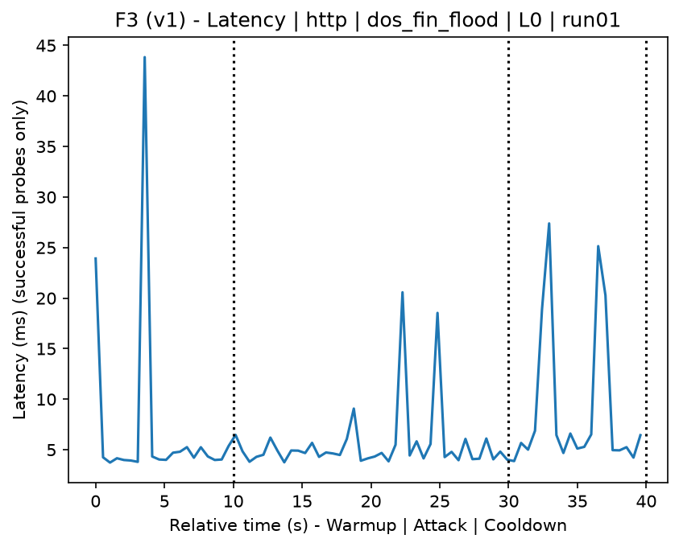
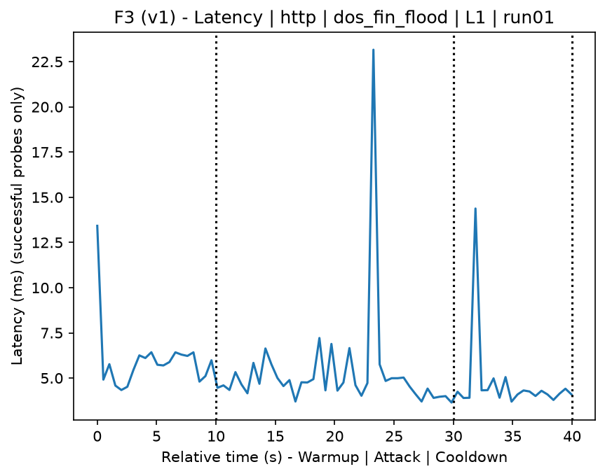
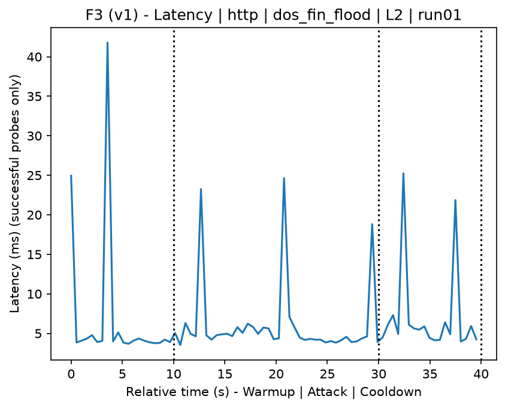
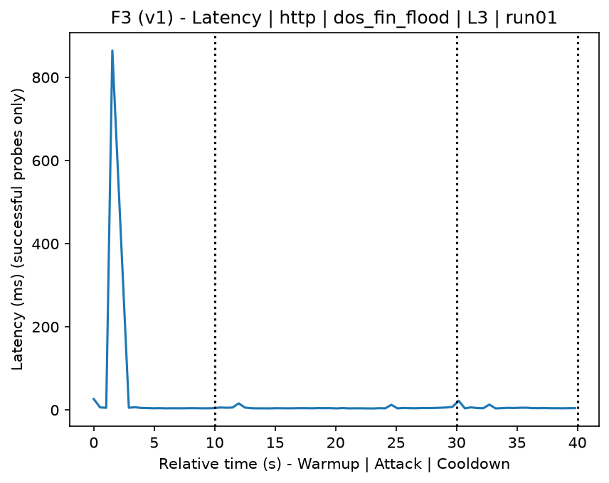
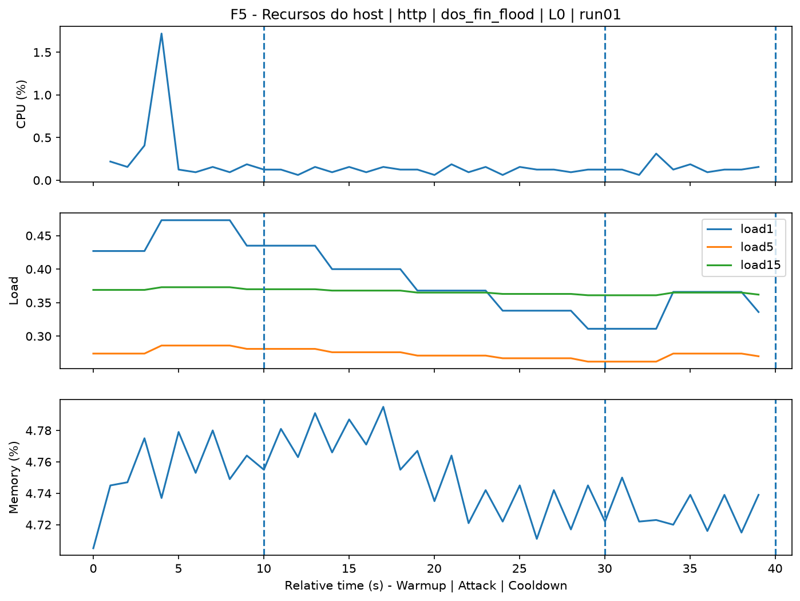
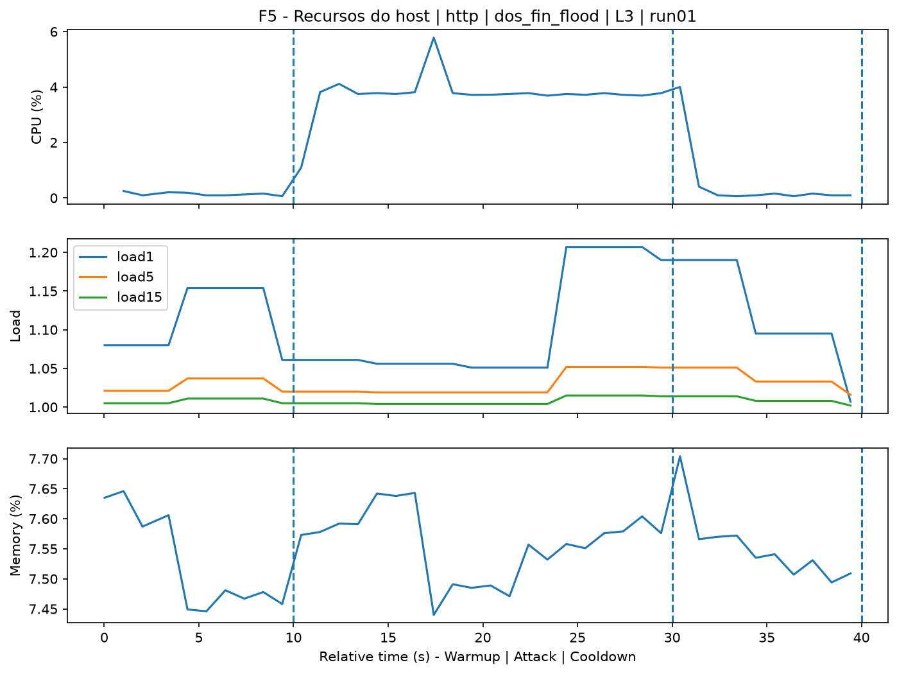
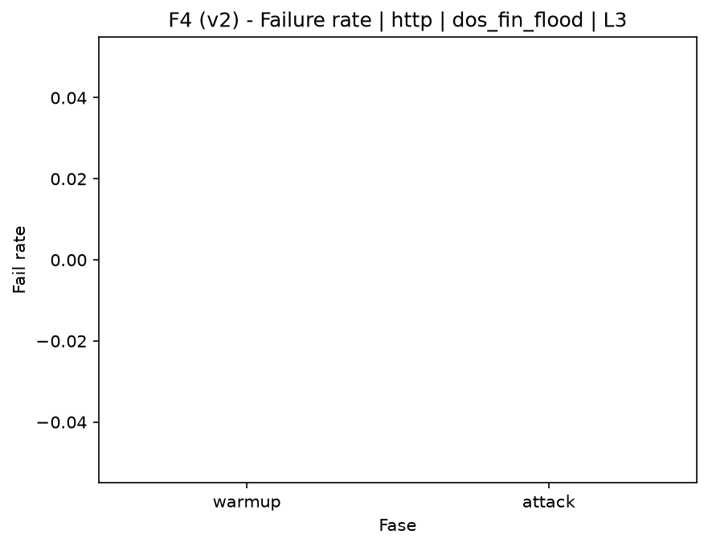

# FIN Flood (`dos_fin_flood`)

[Índice da campanha](README.md)

Na campanha `experiments/60att_5runs_l0l1l2l3`, este documento consolida a execução do ataque `dos_fin_flood`. No catálogo local, o ataque é descrito como: TCP packet flood with the FIN flag set. A documentação abaixo usa apenas artefatos já presentes no repositório, principalmente as tabelas e figuras de `experiments/60att_5runs_l0l1l2l3/dos_fin_flood`.

## Metadados do ataque

| Campo | Valor |
| --- | --- |
| ID | `dos_fin_flood` |
| Categoria | 6) Denial of Service and Impact |
| Subcategoria | 6.1 Network/transport floods (ICMP/TCP/UDP) |
| Serviços alvo | target IP service |
| Imagem | `attack-fin-flood:latest` |
| Container | `attack-fin-flood` |
| Runtime máximo do catálogo | 10 s |
| Parâmetros de intensidade | duration_s, count, rate_pps, payload_size |
| MITRE ATT&CK | [https://attack.mitre.org/tactics/TA0040/](https://attack.mitre.org/tactics/TA0040/) [https://attack.mitre.org/techniques/T1498/](https://attack.mitre.org/techniques/T1498/) [https://attack.mitre.org/techniques/T1498/001/](https://attack.mitre.org/techniques/T1498/001/) |

## Resumo estatístico por nível

| Nível | Serviço | Runs | Amostras attack | Sucesso médio | Falha média | Lat p50/p95 ms | PCAP total MB | Dataset médio (min-max) | Exec média s | Extratores ok/total | CPU média/máx | Mem MB média |
| --- | --- | --- | --- | --- | --- | --- | --- | --- | --- | --- | --- | --- |
| L0 | http | 5 | 200 | 100% | 0% | 4,32 / 11,9 | 1,66 | 3.136 (3.120-3.160) | 42,32 | 3/3 | 0,62% / 0,71% | 206,12 |
| L1 | http | 5 | 200 | 100% | 0% | 4,71 / 14,7 | 866,51 | 4.776.075 (4.696.522-4.828.354) | 622,35 | 3/3 | 0,69% / 0,86% | 208,24 |
| L2 | http | 5 | 199 | 100% | 0% | 4,31 / 13,91 | 881,93 | 4.861.187 (4.808.840-4.894.644) | 635,45 | 3/3 | 0,67% / 0,84% | 210,3 |
| L3 | http | 5 | 199 | 100% | 0% | 4,38 / 10,06 | 866,27 | 4.774.795 (4.620.766-4.867.776) | 625,09 | 3/3 | 0,69% / 0,83% | 212,33 |

## Estabilidade entre reexecuções

| Nível | Métrica | Runs | Média | Desvio | CV | Min | Max |
| --- | --- | --- | --- | --- | --- | --- | --- |
| L0 | CPU média na fase attack | 5 | 0,62 | 0,07 | 11,9% | 0,55 | 0,73 |
| L0 | Linhas do dataset | 5 | 3.136,4 | 21,56 | 0,69% | 3.120 | 3.160 |
| L0 | Tempo de execução | 5 | 42,32 | 0,42 | 0,99% | 42,02 | 43,06 |
| L0 | Falha na fase attack | 5 | 0 | 0 | n/d | 0 | 0 |
| L0 | Latência p95 censurada | 5 | 11,9 | 6,56 | 55,14% | 5,79 | 19,58 |
| L1 | CPU média na fase attack | 5 | 0,69 | 0,13 | 18,37% | 0,58 | 0,89 |
| L1 | Linhas do dataset | 5 | 4.776.075,2 | 53.051,72 | 1,11% | 4.696.522 | 4.828.354 |
| L1 | Tempo de execução | 5 | 622,35 | 8,2 | 1,32% | 614,79 | 634,2 |
| L1 | Falha na fase attack | 5 | 0 | 0 | n/d | 0 | 0 |
| L1 | Latência p95 censurada | 5 | 14,7 | 7,44 | 50,62% | 6,83 | 22,67 |
| L2 | CPU média na fase attack | 5 | 0,67 | 0,05 | 7,19% | 0,59 | 0,72 |
| L2 | Linhas do dataset | 5 | 4.861.186,8 | 35.702,19 | 0,73% | 4.808.840 | 4.894.644 |
| L2 | Tempo de execução | 5 | 635,45 | 6,21 | 0,98% | 628,9 | 643,99 |
| L2 | Falha na fase attack | 5 | 0 | 0 | n/d | 0 | 0 |
| L2 | Latência p95 censurada | 5 | 13,91 | 7,71 | 55,45% | 4,9 | 20,84 |
| L3 | CPU média na fase attack | 5 | 0,69 | 0,05 | 7,09% | 0,63 | 0,74 |
| L3 | Linhas do dataset | 5 | 4.774.794,8 | 100.583,56 | 2,11% | 4.620.766 | 4.867.776 |
| L3 | Tempo de execução | 5 | 625,09 | 11,81 | 1,89% | 608,03 | 636,72 |
| L3 | Falha na fase attack | 5 | 0 | 0 | n/d | 0 | 0 |
| L3 | Latência p95 censurada | 5 | 10,06 | 6,11 | 60,68% | 6,67 | 20,95 |

## Validação de artefatos

| Nível | Runs | Captura | Probe | Features | Dataset | Recursos | Server stats | Aceite |
| --- | --- | --- | --- | --- | --- | --- | --- | --- |
| L0 | 5 | 5/5 | 5/5 | 5/5 | 5/5 | 5/5 | 5/5 | 5/5 |
| L1 | 5 | 5/5 | 5/5 | 5/5 | 5/5 | 5/5 | 5/5 | 5/5 |
| L2 | 5 | 5/5 | 5/5 | 5/5 | 5/5 | 5/5 | 5/5 | 5/5 |
| L3 | 5 | 5/5 | 5/5 | 5/5 | 5/5 | 5/5 | 5/5 | 5/5 |

## Figuras selecionadas

<table>
<tr>
<td> Série temporal L0 run01</td>
<td> Série temporal L1 run01</td>
</tr>
<tr>
<td> Série temporal L2 run01</td>
<td> Série temporal L3 run01</td>
</tr>
<tr>
<td> Recursos L0 run01</td>
<td> Recursos L3 run01</td>
</tr>
<tr>
<td> Taxa de falha L0</td>
<td> Taxa de falha L3</td>
</tr>
</table>

## Fontes utilizadas

- Catálogo do ataque: `docker/attackers/fin-flood/attack.yaml`
- Artefatos da campanha: `experiments/60att_5runs_l0l1l2l3/dos_fin_flood`
