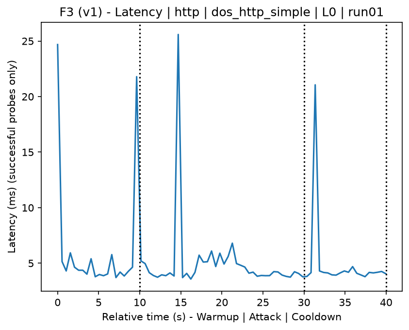
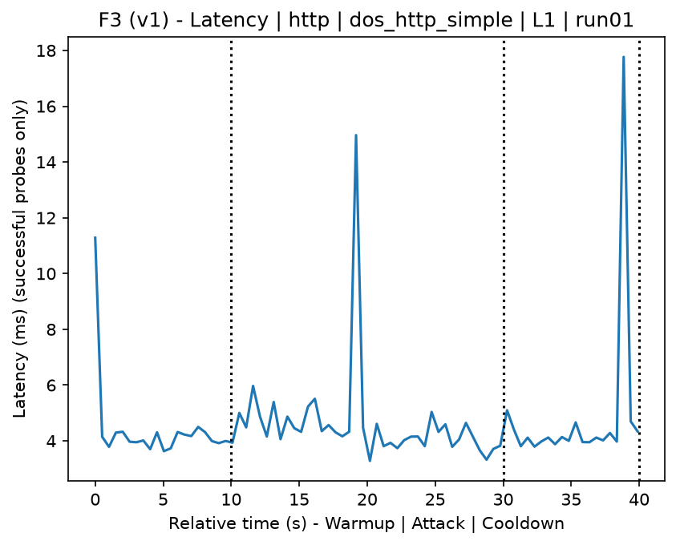
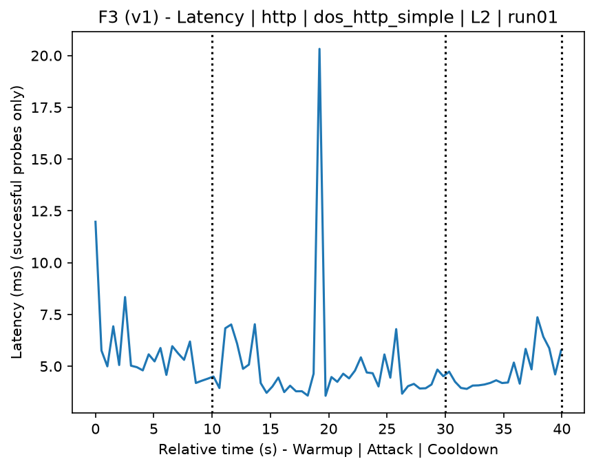
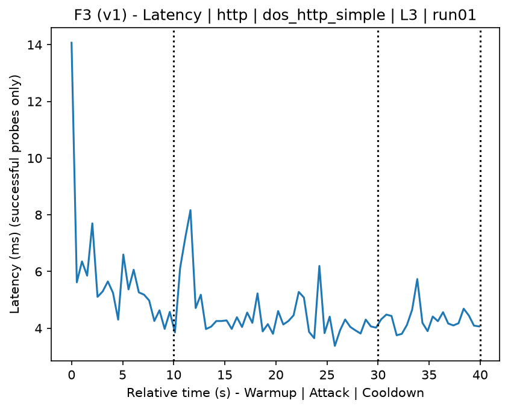
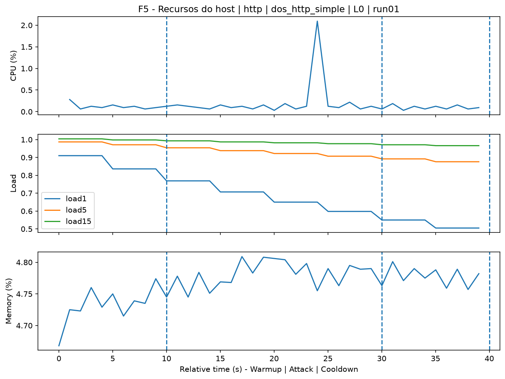
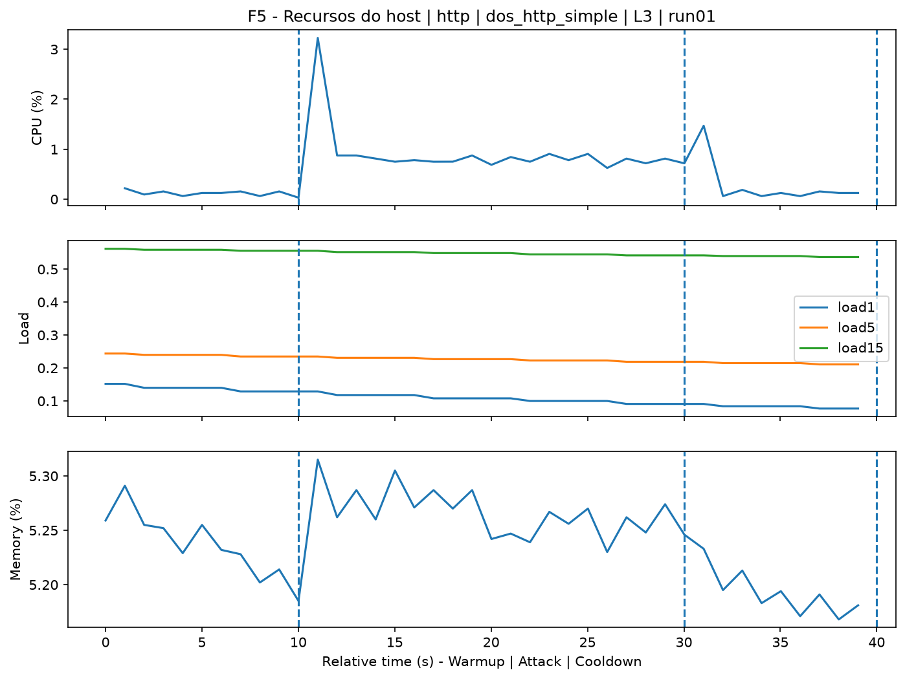
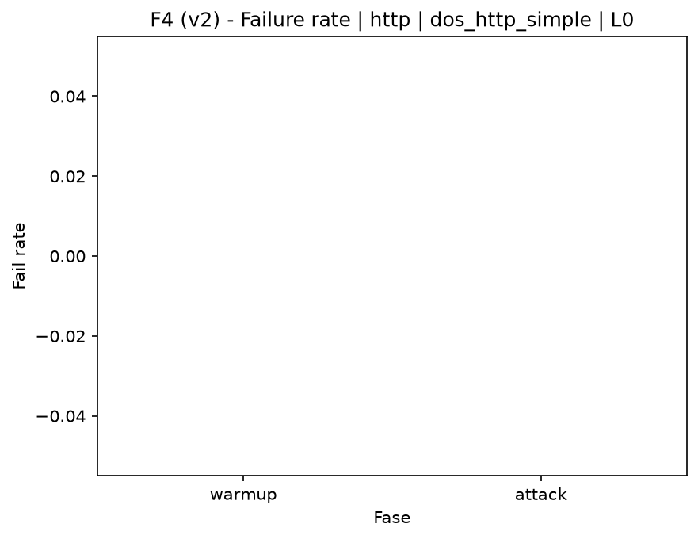
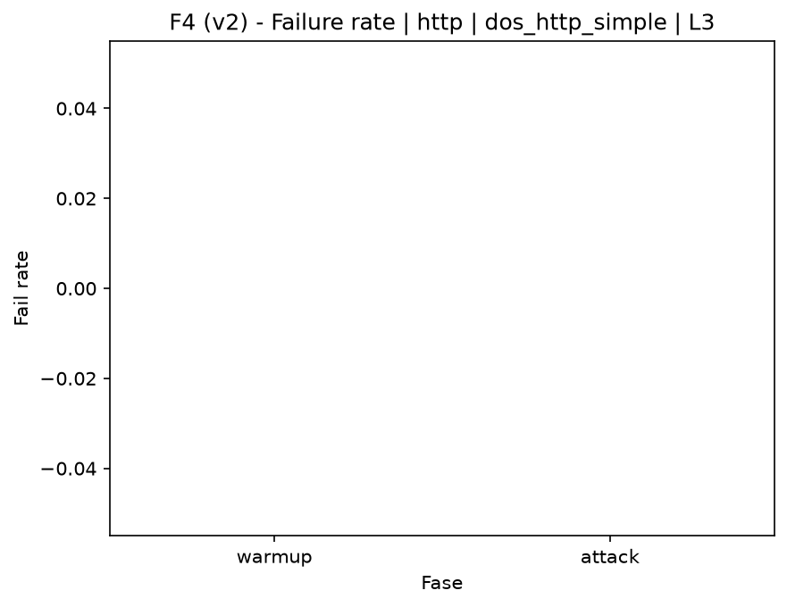

# DoS HTTP Simple (`dos_http_simple`)

[Campaign index](README.md)

This document summarizes the published campaign execution of attack `dos_http_simple`. In the local catalog, the attack is described as: Simple HTTP application DoS. The full execution artifacts are not versioned in this repository; retrieve the generated dataset CSVs from the Figshare dataset linked in the campaign index. Raw PCAP captures are not included in that archive. The selected figures below are stored under `contrib/assets/campaign_doc`.

## Attack Metadata

| Field | Value |
| --- | --- |
| ID | `dos_http_simple` |
| Category | 6) Denial of Service and Impact |
| Subcategory | 6.2 Application-layer DoS |
| Target services | http-server |
| Image | `attack-dos-http-simple:latest` |
| Container | `attack-dos-http-simple` |
| Catalog max runtime | 10 s |
| Intensity parameters | duration_s, count, concurrency, delay_ms, payload_size |
| MITRE ATT&CK | [https://attack.mitre.org/tactics/TA0040/](https://attack.mitre.org/tactics/TA0040/) [https://attack.mitre.org/techniques/T1499/](https://attack.mitre.org/techniques/T1499/) [https://attack.mitre.org/techniques/T1499/002/](https://attack.mitre.org/techniques/T1499/002/) |

## Statistical Summary by Level

| Level | Service | Runs | Attack samples | Mean success | Mean failure | Lat p50/p95 ms | Total PCAP MB | Mean dataset (min-max) | Mean exec s | Extractors ok/total | Mean/max CPU | Mean mem MB |
| --- | --- | --- | --- | --- | --- | --- | --- | --- | --- | --- | --- | --- |
| L0 | http | 5 | 200 | 100% | 0% | 4,13 / 5,18 | 1,67 | 3.168 (3.160-3.202) | 42,23 | 3/3 | 0,62% / 0,77% | 214,54 |
| L1 | http | 5 | 200 | 100% | 0% | 4,17 / 5,77 | 2,94 | 6.848 (6.800-6.880) | 42,57 | 3/3 | 1,04% / 1,19% | 217,23 |
| L2 | http | 5 | 200 | 100% | 0% | 4,36 / 5,73 | 2,93 | 6.832 (6.780-6.880) | 42,66 | 3/3 | 1,08% / 1,26% | 220,35 |
| L3 | http | 5 | 200 | 100% | 0% | 4,41 / 6,35 | 2,93 | 6.828 (6.740-6.882) | 42,72 | 3/3 | 1,12% / 1,34% | 223,4 |

## Stability Across Reruns

| Level | Metric | Runs | Mean | Deviation | CV | Min | Max |
| --- | --- | --- | --- | --- | --- | --- | --- |
| L0 | Mean CPU in attack phase | 5 | 0,62 | 0,06 | 9,31% | 0,53 | 0,69 |
| L0 | Dataset rows | 5 | 3.168,4 | 18,78 | 0,59% | 3.160 | 3.202 |
| L0 | Execution time | 5 | 42,23 | 0,34 | 0,81% | 42,04 | 42,84 |
| L0 | Failure in attack phase | 5 | 0 | 0 | n/a | 0 | 0 |
| L0 | Censored p95 latency | 5 | 5,18 | 0,68 | 13,12% | 4,53 | 6,13 |
| L1 | Mean CPU in attack phase | 5 | 1,04 | 0,03 | 3,12% | 0,98 | 1,07 |
| L1 | Dataset rows | 5 | 6.848,4 | 33,36 | 0,49% | 6.800 | 6.880 |
| L1 | Execution time | 5 | 42,57 | 0,04 | 0,09% | 42,51 | 42,62 |
| L1 | Failure in attack phase | 5 | 0 | 0 | n/a | 0 | 0 |
| L1 | Censored p95 latency | 5 | 5,77 | 1,07 | 18,46% | 4,69 | 7,53 |
| L2 | Mean CPU in attack phase | 5 | 1,08 | 0,05 | 4,93% | 1,02 | 1,13 |
| L2 | Dataset rows | 5 | 6.832 | 50,2 | 0,73% | 6.780 | 6.880 |
| L2 | Execution time | 5 | 42,66 | 0,08 | 0,2% | 42,57 | 42,76 |
| L2 | Failure in attack phase | 5 | 0 | 0 | n/a | 0 | 0 |
| L2 | Censored p95 latency | 5 | 5,73 | 0,84 | 14,64% | 4,96 | 7,02 |
| L3 | Mean CPU in attack phase | 5 | 1,12 | 0,06 | 5,4% | 1,05 | 1,2 |
| L3 | Dataset rows | 5 | 6.828,4 | 64,6 | 0,95% | 6.740 | 6.882 |
| L3 | Execution time | 5 | 42,72 | 0,08 | 0,2% | 42,63 | 42,84 |
| L3 | Failure in attack phase | 5 | 0 | 0 | n/a | 0 | 0 |
| L3 | Censored p95 latency | 5 | 6,35 | 0,45 | 7,05% | 5,7 | 6,83 |

## Artifact Validation

| Level | Runs | Capture | Probe | Features | Dataset | Resources | Server stats | Acceptance |
| --- | --- | --- | --- | --- | --- | --- | --- | --- |
| L0 | 5 | 5/5 | 5/5 | 5/5 | 5/5 | 5/5 | 5/5 | 5/5 |
| L1 | 5 | 5/5 | 5/5 | 5/5 | 5/5 | 5/5 | 5/5 | 5/5 |
| L2 | 5 | 5/5 | 5/5 | 5/5 | 5/5 | 5/5 | 5/5 | 5/5 |
| L3 | 5 | 5/5 | 5/5 | 5/5 | 5/5 | 5/5 | 5/5 | 5/5 |

## Selected Figures

<table>
<tr>
<td> Time series L0 run01</td>
<td> Time series L1 run01</td>
</tr>
<tr>
<td> Time series L2 run01</td>
<td> Time series L3 run01</td>
</tr>
<tr>
<td> Resources L0 run01</td>
<td> Resources L3 run01</td>
</tr>
<tr>
<td> Failure rate L0</td>
<td> Failure rate L3</td>
</tr>
</table>

## Sources Used

- Attack catalog: `docker/attackers/dos-http-simple/attack.yaml`
- Full campaign artifacts: available from the Figshare dataset linked in the campaign index; when extracted locally, expected under `experiments/all_5runs_4levels/dos_http_simple`.
