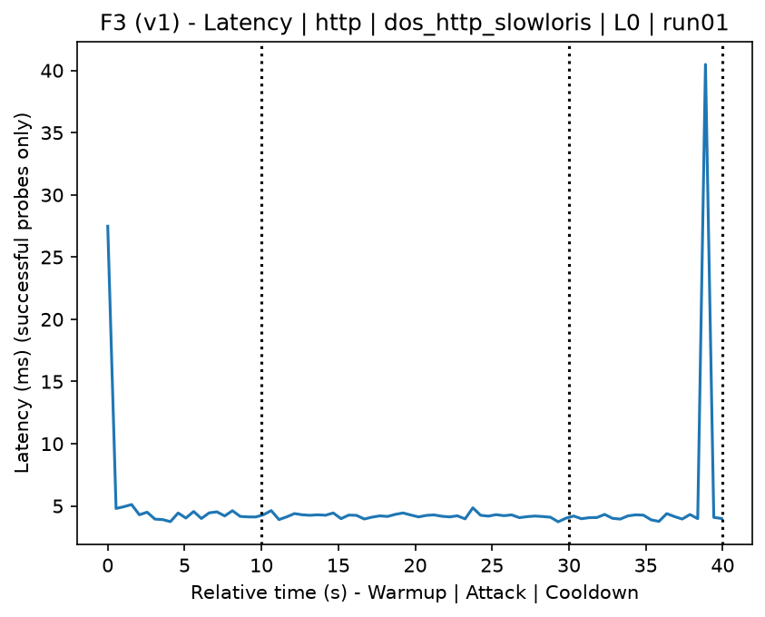
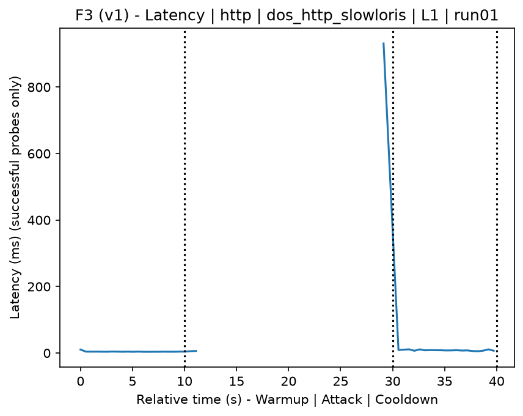
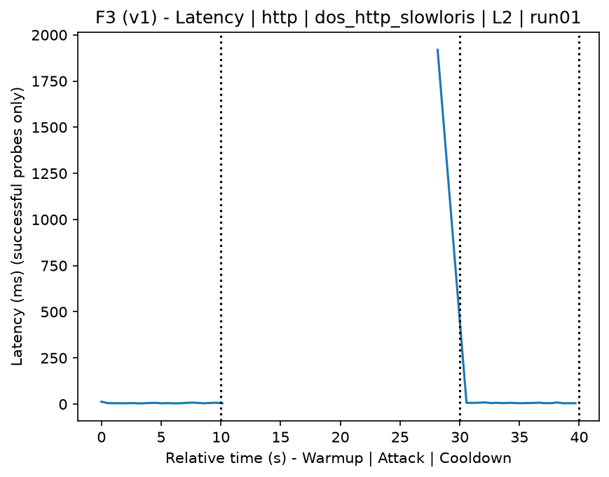
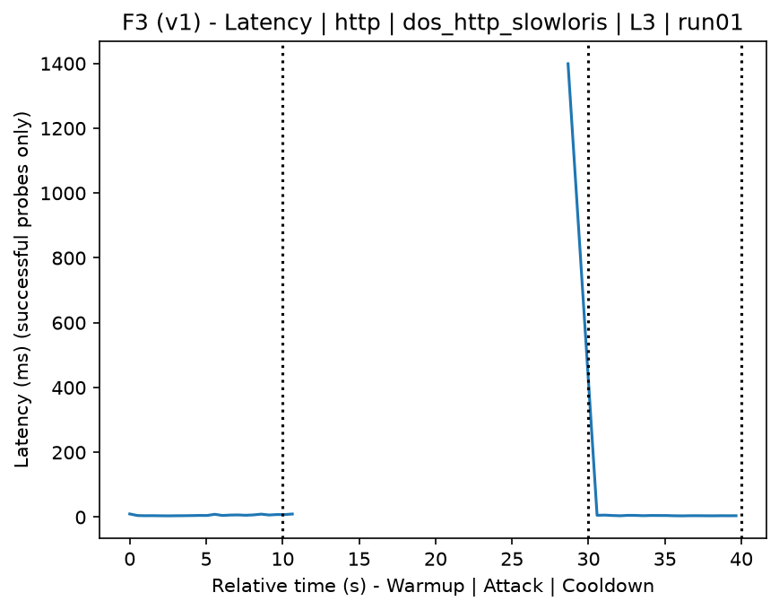
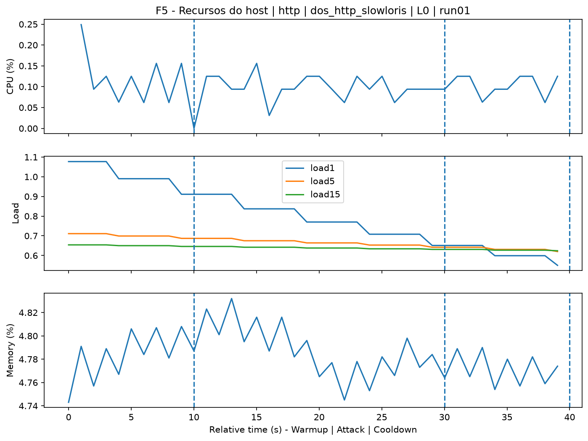
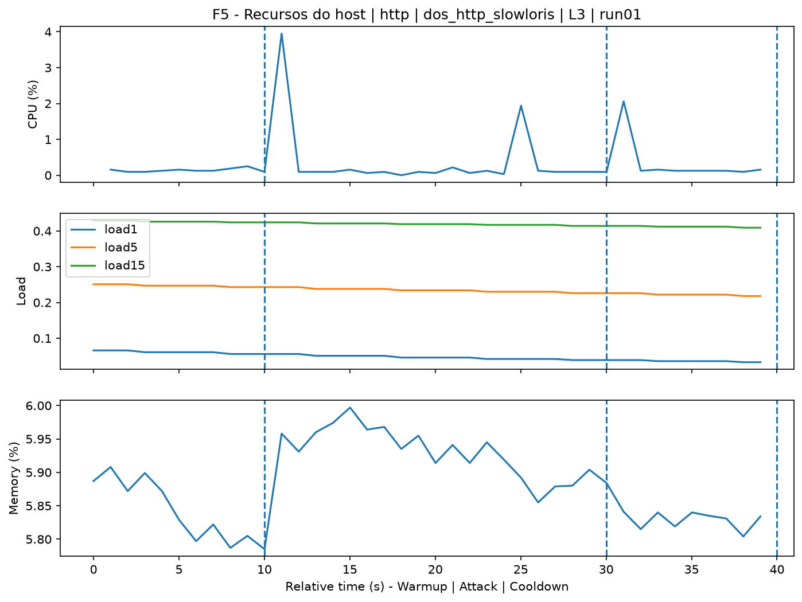
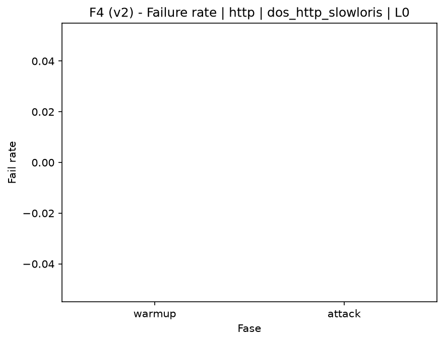
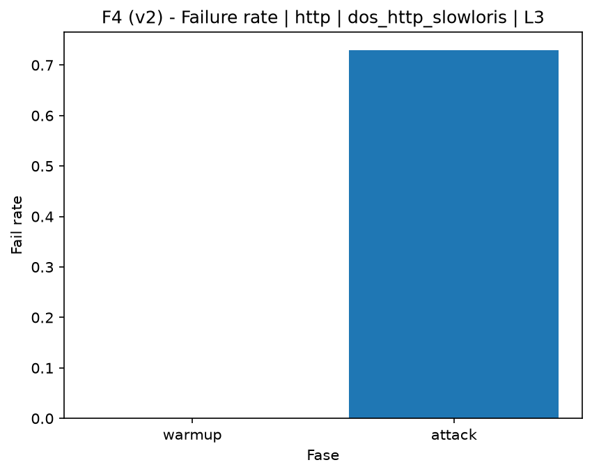

# DoS HTTP Slowloris (`dos_http_slowloris`)

[Campaign index](README.md)

In campaign `experiments/60att_5runs_l0l1l2l3`, this document consolidates the execution of attack `dos_http_slowloris`. In the local catalog, the attack is described as: Slowloris-style HTTP application DoS. The documentation below uses only artifacts already present in the repository, mainly the tables and figures from `experiments/60att_5runs_l0l1l2l3/dos_http_slowloris`.

## Attack Metadata

| Field | Value |
| --- | --- |
| ID | `dos_http_slowloris` |
| Category | 6) Denial of Service and Impact |
| Subcategory | 6.2 Application-layer DoS |
| Target services | http-server |
| Image | `attack-dos-http-slowloris:latest` |
| Container | `attack-dos-http-slowloris` |
| Catalog max runtime | 10 s |
| Intensity parameters | duration_s |
| MITRE ATT&CK | [https://attack.mitre.org/tactics/TA0040/](https://attack.mitre.org/tactics/TA0040/) [https://attack.mitre.org/techniques/T1499/](https://attack.mitre.org/techniques/T1499/) [https://attack.mitre.org/techniques/T1499/003/](https://attack.mitre.org/techniques/T1499/003/) |

## Statistical Summary by Level

| Level | Service | Runs | Attack samples | Mean success | Mean failure | Lat p50/p95 ms | Total PCAP MB | Mean dataset (min-max) | Mean exec s | Extractors ok/total | Mean/max CPU | Mean mem MB |
| --- | --- | --- | --- | --- | --- | --- | --- | --- | --- | --- | --- | --- |
| L0 | http | 5 | 200 | 100% | 0% | 4,25 / 5,31 | 1,67 | 3.168 (3.160-3.200) | 42,27 | 3/3 | 0,66% / 0,77% | 225,81 |
| L1 | http | 5 | 51 | 31,3% | 68,7% | 2.002,81 / 2.002,81 | 2,42 | 6.568 (6.546-6.606) | 42,53 | 3/3 | 0,66% / 2,46% | 408,21 |
| L2 | http | 5 | 48 | 26,9% | 73,1% | 2.002,88 / 2.002,88 | 2,42 | 6.610 (6.518-6.842) | 42,59 | 3/3 | 0,47% / 1,9% | 444,84 |
| L3 | http | 5 | 48 | 26,9% | 73,1% | 2.002,95 / 2.002,95 | 2,41 | 6.536 (6.498-6.562) | 42,55 | 3/3 | 0,52% / 1,99% | 447,77 |

## Stability Across Reruns

| Level | Metric | Runs | Mean | Deviation | CV | Min | Max |
| --- | --- | --- | --- | --- | --- | --- | --- |
| L0 | Mean CPU in attack phase | 5 | 0,66 | 0,03 | 5,16% | 0,62 | 0,7 |
| L0 | Dataset rows | 5 | 3.168,4 | 17,69 | 0,56% | 3.160 | 3.200 |
| L0 | Execution time | 5 | 42,27 | 0,46 | 1,08% | 42,01 | 43,08 |
| L0 | Failure in attack phase | 5 | 0 | 0 | n/a | 0 | 0 |
| L0 | Censored p95 latency | 5 | 5,31 | 0,8 | 15,15% | 4,45 | 6,32 |
| L1 | Mean CPU in attack phase | 5 | 0,66 | 0,36 | 54,24% | 0,43 | 1,3 |
| L1 | Dataset rows | 5 | 6.567,6 | 23,08 | 0,35% | 6.546 | 6.606 |
| L1 | Execution time | 5 | 42,53 | 0,04 | 0,09% | 42,49 | 42,58 |
| L1 | Failure in attack phase | 5 | 68,73 | 2,85 | 4,14% | 63,64 | 70 |
| L1 | Censored p95 latency | 5 | 2.002,81 | 0,07 | 0% | 2.002,76 | 2.002,94 |
| L2 | Mean CPU in attack phase | 5 | 0,47 | 0,09 | 20,2% | 0,39 | 0,63 |
| L2 | Dataset rows | 5 | 6.610 | 131,21 | 1,99% | 6.518 | 6.842 |
| L2 | Execution time | 5 | 42,59 | 0,05 | 0,11% | 42,54 | 42,64 |
| L2 | Failure in attack phase | 5 | 73,11 | 4,26 | 5,83% | 70 | 77,78 |
| L2 | Censored p95 latency | 5 | 2.002,88 | 0,29 | 0,01% | 2.002,72 | 2.003,39 |
| L3 | Mean CPU in attack phase | 5 | 0,52 | 0,11 | 20,18% | 0,43 | 0,7 |
| L3 | Dataset rows | 5 | 6.535,6 | 31,19 | 0,48% | 6.498 | 6.562 |
| L3 | Execution time | 5 | 42,55 | 0,07 | 0,17% | 42,5 | 42,68 |
| L3 | Failure in attack phase | 5 | 73,11 | 4,26 | 5,83% | 70 | 77,78 |
| L3 | Censored p95 latency | 5 | 2.002,95 | 0,35 | 0,02% | 2.002,69 | 2.003,55 |

## Artifact Validation

| Level | Runs | Capture | Probe | Features | Dataset | Resources | Server stats | Acceptance |
| --- | --- | --- | --- | --- | --- | --- | --- | --- |
| L0 | 5 | 5/5 | 5/5 | 5/5 | 5/5 | 5/5 | 5/5 | 5/5 |
| L1 | 5 | 5/5 | 5/5 | 5/5 | 5/5 | 5/5 | 5/5 | 5/5 |
| L2 | 5 | 5/5 | 5/5 | 5/5 | 5/5 | 5/5 | 5/5 | 5/5 |
| L3 | 5 | 5/5 | 5/5 | 5/5 | 5/5 | 5/5 | 5/5 | 5/5 |

## Selected Figures

<table>
<tr>
<td> Time series L0 run01</td>
<td> Time series L1 run01</td>
</tr>
<tr>
<td> Time series L2 run01</td>
<td> Time series L3 run01</td>
</tr>
<tr>
<td> Resources L0 run01</td>
<td> Resources L3 run01</td>
</tr>
<tr>
<td> Failure rate L0</td>
<td> Failure rate L3</td>
</tr>
</table>

## Sources Used

- Attack catalog: `docker/attackers/dos-http-slowloris/attack.yaml`
- Campaign artifacts: `experiments/60att_5runs_l0l1l2l3/dos_http_slowloris`
