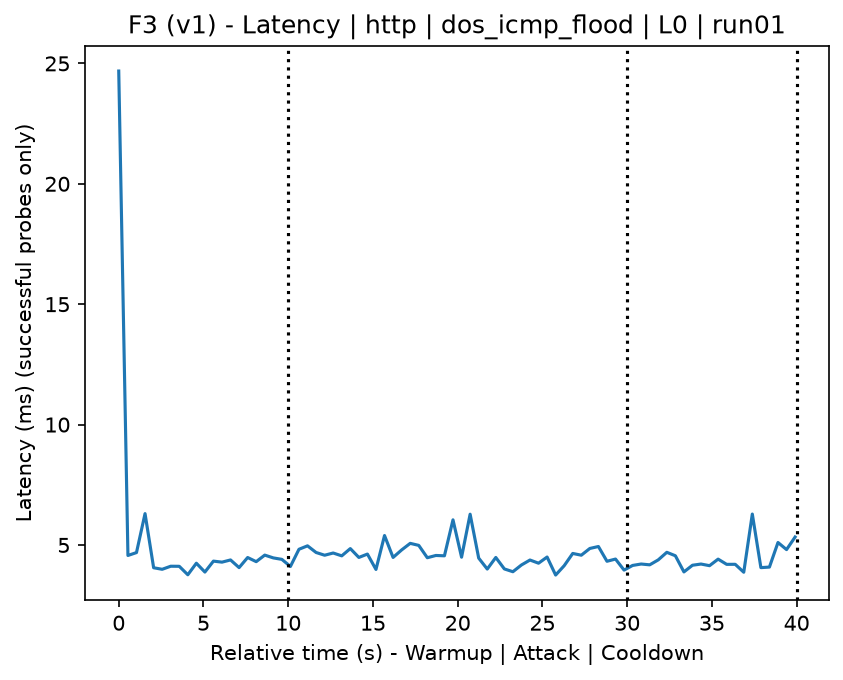
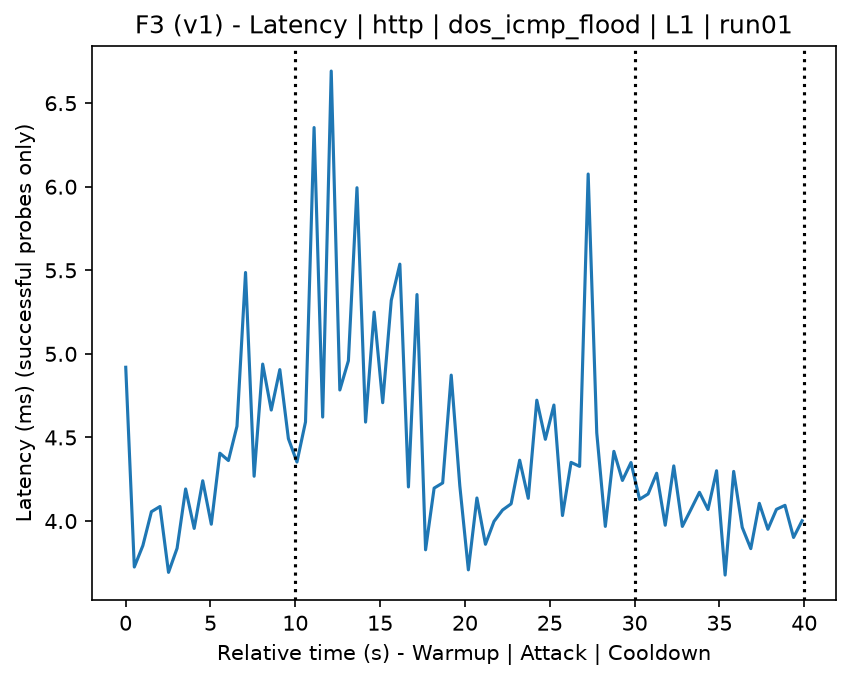
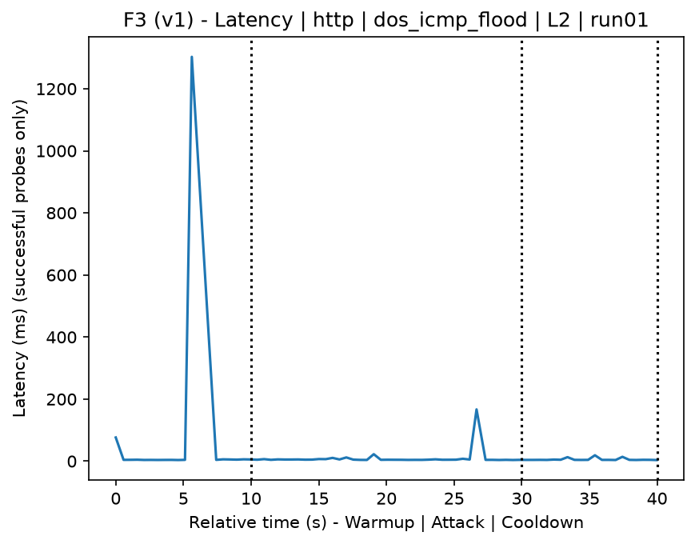
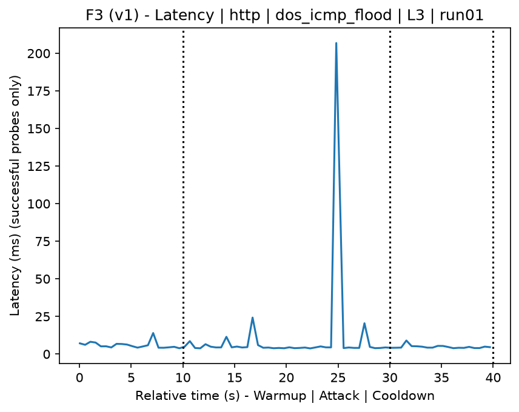
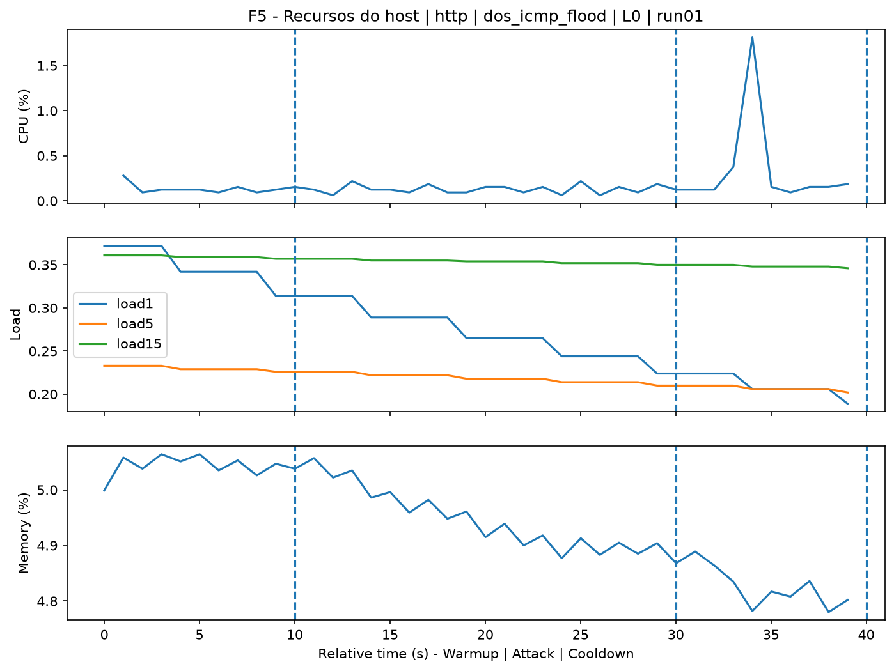
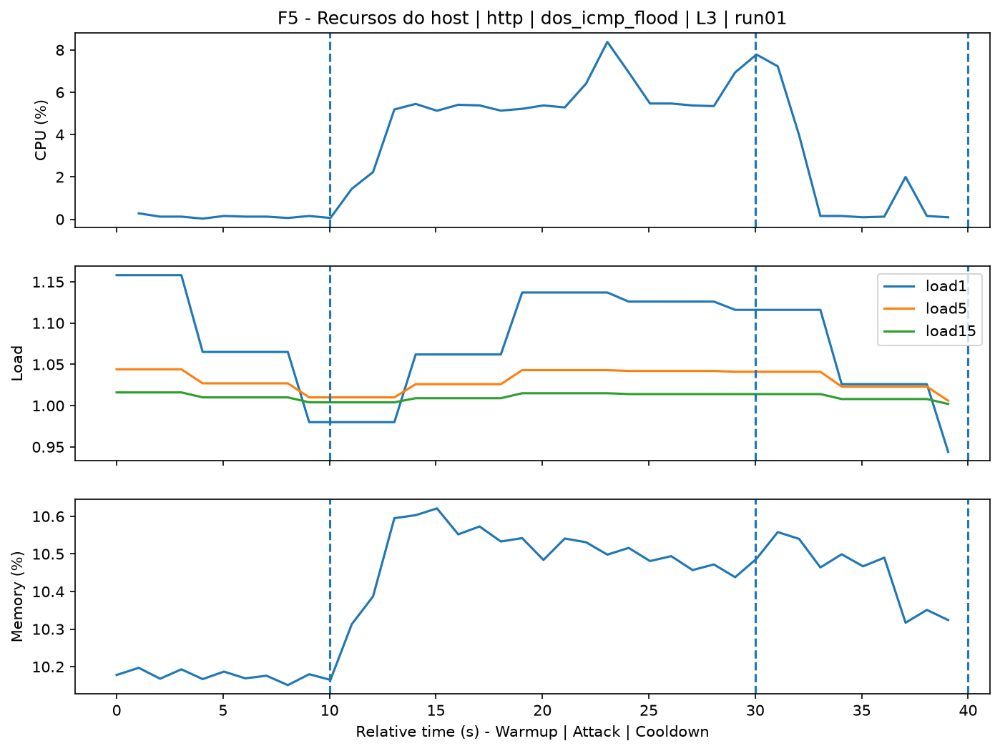
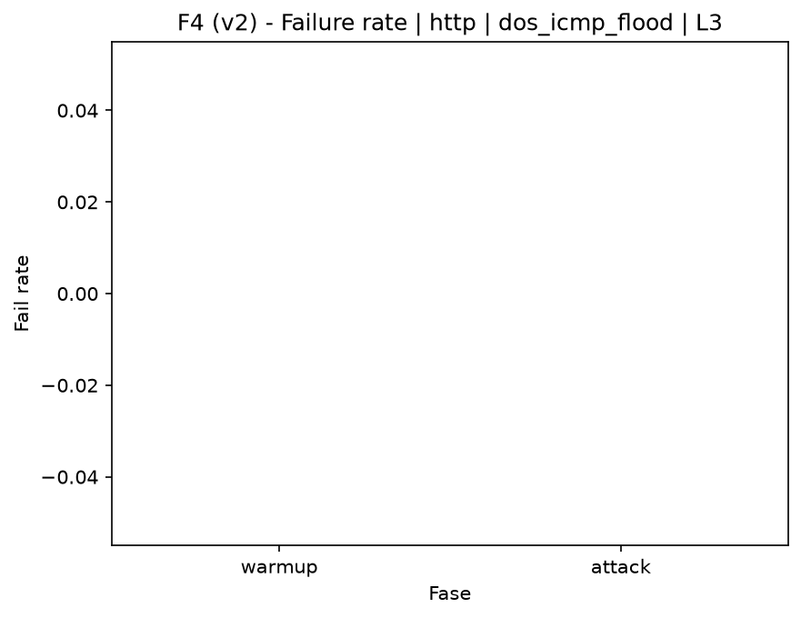

# ICMP Flood (`dos_icmp_flood`)

[Campaign index](README.md)

This document summarizes the published campaign execution of attack `dos_icmp_flood`. In the local catalog, the attack is described as: ICMP packet flood. The full execution artifacts are not versioned in this repository; retrieve them from the Figshare dataset linked in the campaign index or regenerate the figures with `run_claim_figures.sh`. The selected figures below are stored under `contrib/assets/campaign_doc`.

## Attack Metadata

| Field | Value |
| --- | --- |
| ID | `dos_icmp_flood` |
| Category | 6) Denial of Service and Impact |
| Subcategory | 6.1 Network/transport floods (ICMP/TCP/UDP) |
| Target services | target IP service |
| Image | `attack-icmp-flood:latest` |
| Container | `attack-icmp-flood` |
| Catalog max runtime | 10 s |
| Intensity parameters | duration_s, count, rate_pps, payload_size |
| MITRE ATT&CK | [https://attack.mitre.org/tactics/TA0040/](https://attack.mitre.org/tactics/TA0040/) [https://attack.mitre.org/techniques/T1498/](https://attack.mitre.org/techniques/T1498/) [https://attack.mitre.org/techniques/T1498/001/](https://attack.mitre.org/techniques/T1498/001/) |

## Statistical Summary by Level

| Level | Service | Runs | Attack samples | Mean success | Mean failure | Lat p50/p95 ms | Total PCAP MB | Mean dataset (min-max) | Mean exec s | Extractors ok/total | Mean/max CPU | Mean mem MB |
| --- | --- | --- | --- | --- | --- | --- | --- | --- | --- | --- | --- | --- |
| L0 | http | 5 | 200 | 100% | 0% | 4,33 / 5,64 | 5,06 | 9.644 (9.604-9.742) | 43,16 | 3/3 | 0,79% / 0,96% | 240,96 |
| L1 | http | 5 | 198 | 100% | 0% | 4,55 / 6,3 | 26.075,71 | 8.660.581 (7.206.650-9.628.184) | 1.446,12 | 3/3 | 0,72% / 0,9% | 233,44 |
| L2 | http | 5 | 195 | 100% | 0% | 4,75 / 23,36 | 26.213,85 | 8.706.092 (8.219.550-9.305.436) | 1.454,17 | 3/3 | 0,75% / 0,9% | 152,38 |
| L3 | http | 5 | 181 | 100% | 0% | 12,82 / 249,46 | 25.600,02 | 8.501.922 (7.479.238-9.505.306) | 1.405,23 | 3/3 | 0,61% / 0,78% | 79,1 |

## Stability Across Reruns

| Level | Metric | Runs | Mean | Deviation | CV | Min | Max |
| --- | --- | --- | --- | --- | --- | --- | --- |
| L0 | Mean CPU in attack phase | 5 | 0,79 | 0,27 | 33,92% | 0,64 | 1,27 |
| L0 | Dataset rows | 5 | 9.643,6 | 56,45 | 0,59% | 9.604 | 9.742 |
| L0 | Execution time | 5 | 43,16 | 0,44 | 1,01% | 42,93 | 43,93 |
| L0 | Failure in attack phase | 5 | 0 | 0 | n/a | 0 | 0 |
| L0 | Censored p95 latency | 5 | 5,64 | 0,99 | 17,54% | 4,85 | 7,31 |
| L1 | Mean CPU in attack phase | 5 | 0,72 | 0,04 | 5,43% | 0,67 | 0,78 |
| L1 | Dataset rows | 5 | 8.660.581,2 | 954.194,06 | 11,02% | 7.206.650 | 9.628.184 |
| L1 | Execution time | 5 | 1.446,12 | 157,99 | 10,93% | 1.210,07 | 1.608,74 |
| L1 | Failure in attack phase | 5 | 0 | 0 | n/a | 0 | 0 |
| L1 | Censored p95 latency | 5 | 6,3 | 0,66 | 10,5% | 5,66 | 7 |
| L2 | Mean CPU in attack phase | 5 | 0,75 | 0,08 | 11,31% | 0,63 | 0,87 |
| L2 | Dataset rows | 5 | 8.706.092 | 489.785,49 | 5,63% | 8.219.550 | 9.305.436 |
| L2 | Execution time | 5 | 1.454,17 | 78,95 | 5,43% | 1.377,43 | 1.554,02 |
| L2 | Failure in attack phase | 5 | 0 | 0 | n/a | 0 | 0 |
| L2 | Censored p95 latency | 5 | 23,36 | 6,4 | 27,42% | 13,12 | 29,52 |
| L3 | Mean CPU in attack phase | 5 | 0,61 | 0,05 | 7,53% | 0,57 | 0,66 |
| L3 | Dataset rows | 5 | 8.501.922 | 786.973,95 | 9,26% | 7.479.238 | 9.505.306 |
| L3 | Execution time | 5 | 1.405,23 | 133,37 | 9,49% | 1.230,82 | 1.576,02 |
| L3 | Failure in attack phase | 5 | 0 | 0 | n/a | 0 | 0 |
| L3 | Censored p95 latency | 5 | 249,46 | 194,86 | 78,11% | 20,85 | 510,26 |

## Artifact Validation

| Level | Runs | Capture | Probe | Features | Dataset | Resources | Server stats | Acceptance |
| --- | --- | --- | --- | --- | --- | --- | --- | --- |
| L0 | 5 | 5/5 | 5/5 | 5/5 | 5/5 | 5/5 | 5/5 | 5/5 |
| L1 | 5 | 5/5 | 5/5 | 5/5 | 5/5 | 5/5 | 5/5 | 5/5 |
| L2 | 5 | 5/5 | 5/5 | 5/5 | 5/5 | 5/5 | 5/5 | 5/5 |
| L3 | 5 | 5/5 | 5/5 | 5/5 | 5/5 | 5/5 | 5/5 | 5/5 |

## Selected Figures

<table>
<tr>
<td> Time series L0 run01</td>
<td> Time series L1 run01</td>
</tr>
<tr>
<td> Time series L2 run01</td>
<td> Time series L3 run01</td>
</tr>
<tr>
<td> Resources L0 run01</td>
<td> Resources L3 run01</td>
</tr>
<tr>
<td> Failure rate L0</td>
<td> Failure rate L3</td>
</tr>
</table>

## Sources Used

- Attack catalog: `docker/attackers/icmp-flood/attack.yaml`
- Full campaign artifacts: available from the Figshare dataset linked in the campaign index; when extracted locally, expected under `experiments/60att_5runs_l0l1l2l3/dos_icmp_flood`.
