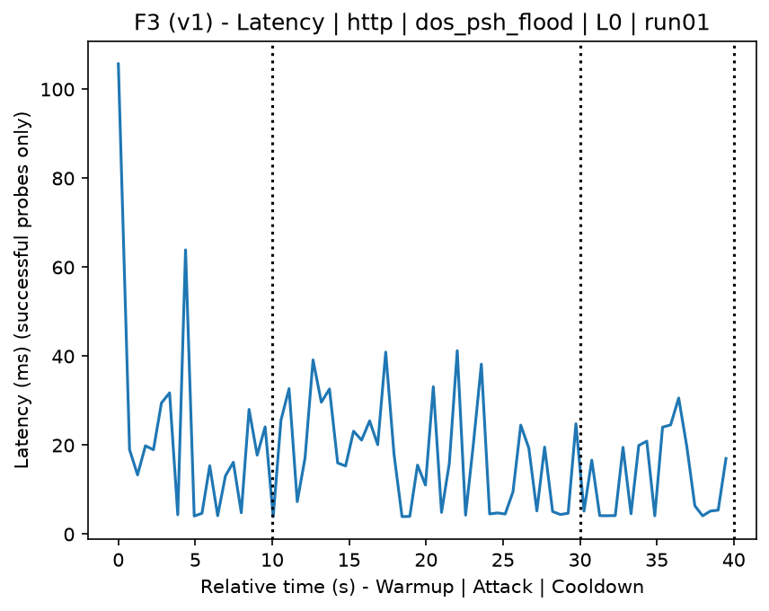
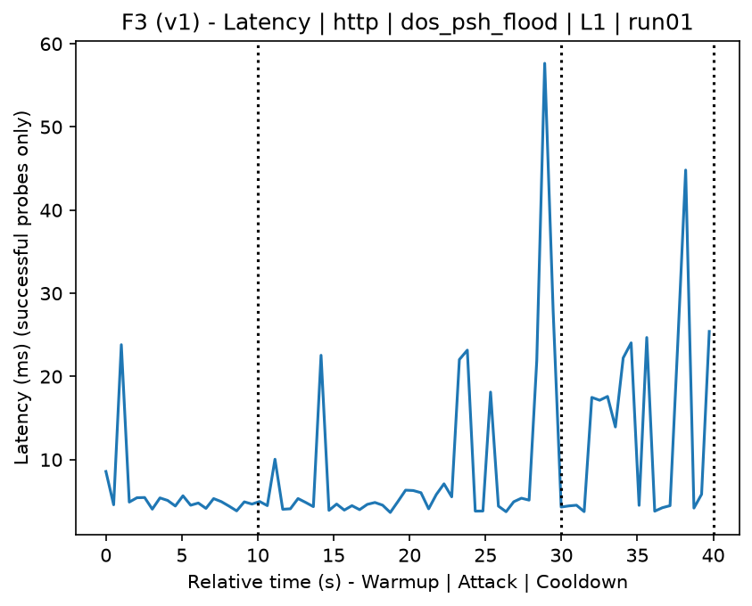
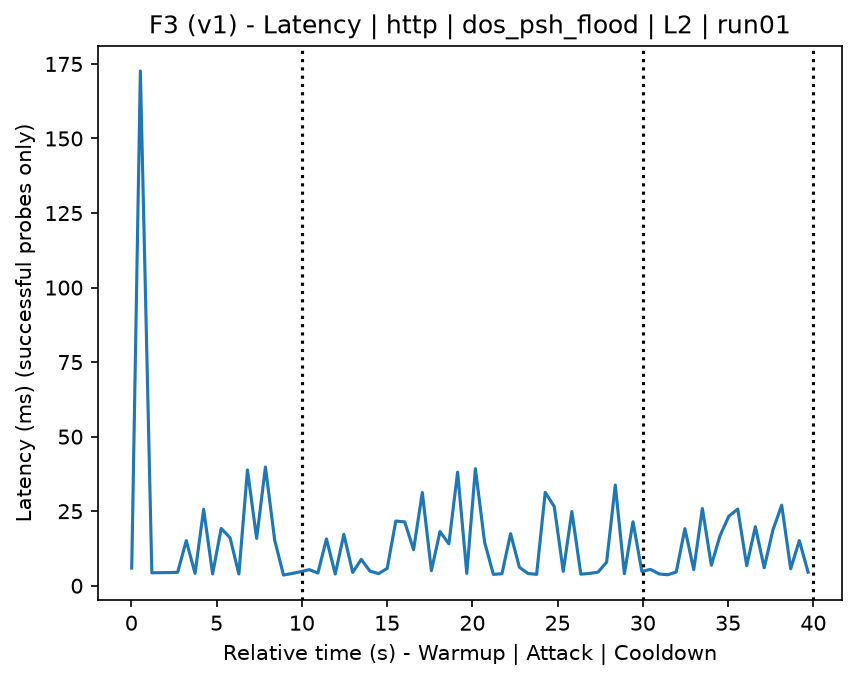
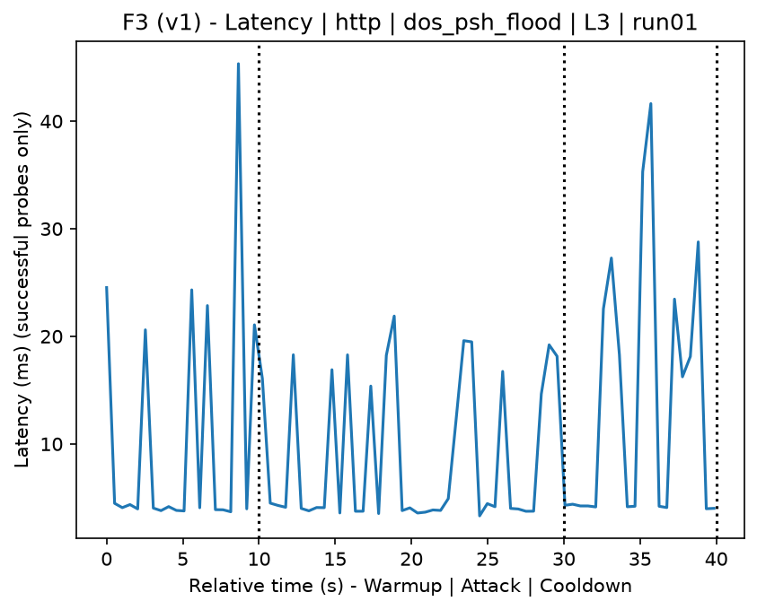
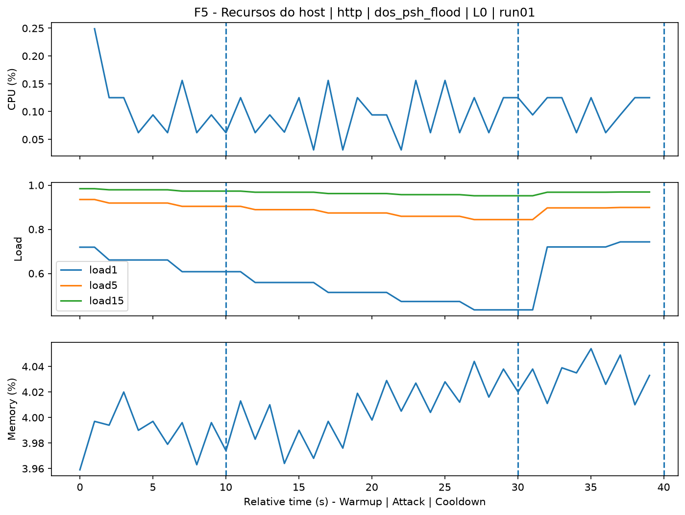
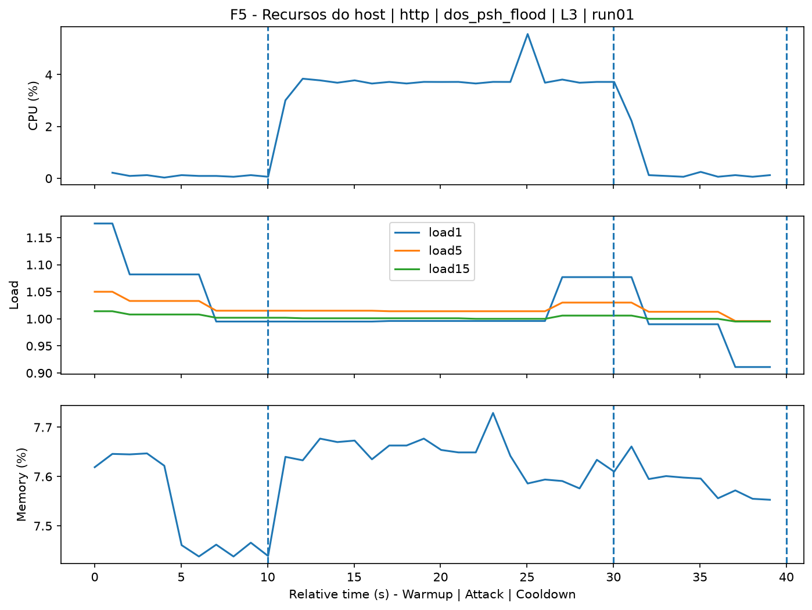
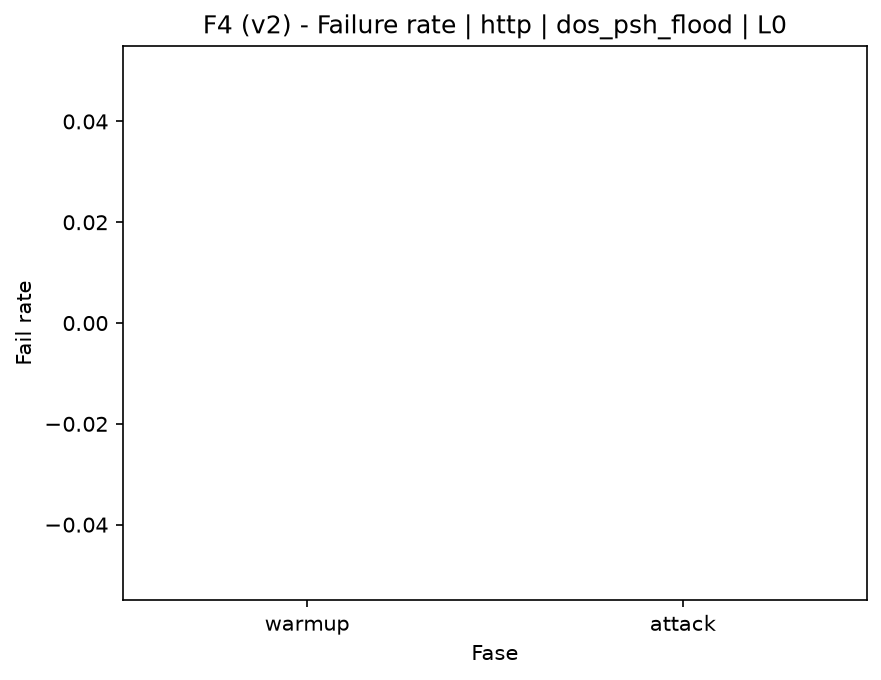
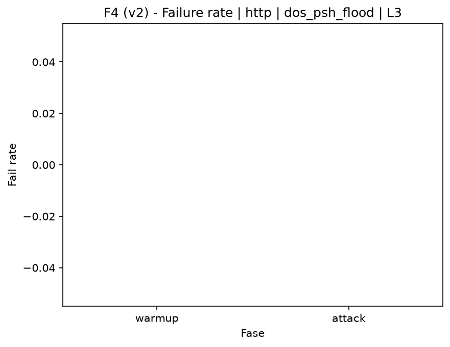

# PSH Flood (`dos_psh_flood`)

[Índice da campanha](README.md)

Na campanha `experiments/60att_5runs_l0l1l2l3`, este documento consolida a execução do ataque `dos_psh_flood`. No catálogo local, o ataque é descrito como: TCP packet flood with the PSH flag set. A documentação abaixo usa apenas artefatos já presentes no repositório, principalmente as tabelas e figuras de `experiments/60att_5runs_l0l1l2l3/dos_psh_flood`.

## Metadados do ataque

| Campo | Valor |
| --- | --- |
| ID | `dos_psh_flood` |
| Categoria | 6) Denial of Service and Impact |
| Subcategoria | 6.1 Network/transport floods (ICMP/TCP/UDP) |
| Serviços alvo | target IP service |
| Imagem | `attack-psh-flood:latest` |
| Container | `attack-psh-flood` |
| Runtime máximo do catálogo | 10 s |
| Parâmetros de intensidade | duration_s, count, rate_pps, payload_size |
| MITRE ATT&CK | [https://attack.mitre.org/tactics/TA0040/](https://attack.mitre.org/tactics/TA0040/) [https://attack.mitre.org/techniques/T1498/](https://attack.mitre.org/techniques/T1498/) [https://attack.mitre.org/techniques/T1498/001/](https://attack.mitre.org/techniques/T1498/001/) |

## Resumo estatístico por nível

| Nível | Serviço | Runs | Amostras attack | Sucesso médio | Falha média | Lat p50/p95 ms | PCAP total MB | Dataset médio (min-max) | Exec média s | Extratores ok/total | CPU média/máx | Mem MB média |
| --- | --- | --- | --- | --- | --- | --- | --- | --- | --- | --- | --- | --- |
| L0 | http | 5 | 197 | 100% | 0% | 7,48 / 26,57 | 1,65 | 3.114 (3.080-3.130) | 42,67 | 3/3 | 0,65% / 0,77% | 71,48 |
| L1 | http | 5 | 195 | 100% | 0% | 5,47 / 45,59 | 827,36 | 4.560.206 (3.987.792-4.832.552) | 577,78 | 3/3 | 0,67% / 0,79% | 73,63 |
| L2 | http | 5 | 196 | 100% | 0% | 4,92 / 26,36 | 872,49 | 4.809.211 (4.754.062-4.885.358) | 604,65 | 3/3 | 0,67% / 0,82% | 75,56 |
| L3 | http | 5 | 196 | 100% | 0% | 4,19 / 22,4 | 851,1 | 4.691.072 (4.089.574-4.897.544) | 591,97 | 3/3 | 0,62% / 0,75% | 77,7 |

## Estabilidade entre reexecuções

| Nível | Métrica | Runs | Média | Desvio | CV | Min | Max |
| --- | --- | --- | --- | --- | --- | --- | --- |
| L0 | CPU média na fase attack | 5 | 0,65 | 0,05 | 7,12% | 0,59 | 0,69 |
| L0 | Linhas do dataset | 5 | 3.114,4 | 19,67 | 0,63% | 3.080 | 3.130 |
| L0 | Tempo de execução | 5 | 42,67 | 1,13 | 2,66% | 42,11 | 44,69 |
| L0 | Falha na fase attack | 5 | 0 | 0 | n/d | 0 | 0 |
| L0 | Latência p95 censurada | 5 | 26,57 | 7,54 | 28,37% | 20,98 | 39,34 |
| L1 | CPU média na fase attack | 5 | 0,67 | 0,03 | 4,74% | 0,64 | 0,7 |
| L1 | Linhas do dataset | 5 | 4.560.206 | 339.730,25 | 7,45% | 3.987.792 | 4.832.552 |
| L1 | Tempo de execução | 5 | 577,78 | 38,13 | 6,6% | 513,24 | 606,62 |
| L1 | Falha na fase attack | 5 | 0 | 0 | n/d | 0 | 0 |
| L1 | Latência p95 censurada | 5 | 45,59 | 35,1 | 77,01% | 23,4 | 106,54 |
| L2 | CPU média na fase attack | 5 | 0,67 | 0,04 | 6,35% | 0,62 | 0,71 |
| L2 | Linhas do dataset | 5 | 4.809.211,2 | 47.596,09 | 0,99% | 4.754.062 | 4.885.358 |
| L2 | Tempo de execução | 5 | 604,65 | 5,23 | 0,87% | 597,76 | 612,49 |
| L2 | Falha na fase attack | 5 | 0 | 0 | n/d | 0 | 0 |
| L2 | Latência p95 censurada | 5 | 26,36 | 4,48 | 17,01% | 22,93 | 34,2 |
| L3 | CPU média na fase attack | 5 | 0,62 | 0,04 | 5,76% | 0,58 | 0,68 |
| L3 | Linhas do dataset | 5 | 4.691.072 | 338.496,59 | 7,22% | 4.089.574 | 4.897.544 |
| L3 | Tempo de execução | 5 | 591,97 | 37,9 | 6,4% | 524,37 | 613,72 |
| L3 | Falha na fase attack | 5 | 0 | 0 | n/d | 0 | 0 |
| L3 | Latência p95 censurada | 5 | 22,4 | 3,39 | 15,13% | 19,29 | 27,62 |

## Validação de artefatos

| Nível | Runs | Captura | Probe | Features | Dataset | Recursos | Server stats | Aceite |
| --- | --- | --- | --- | --- | --- | --- | --- | --- |
| L0 | 5 | 5/5 | 5/5 | 5/5 | 5/5 | 5/5 | 5/5 | 5/5 |
| L1 | 5 | 5/5 | 5/5 | 5/5 | 5/5 | 5/5 | 5/5 | 5/5 |
| L2 | 5 | 5/5 | 5/5 | 5/5 | 5/5 | 5/5 | 5/5 | 5/5 |
| L3 | 5 | 5/5 | 5/5 | 5/5 | 5/5 | 5/5 | 5/5 | 5/5 |

## Figuras selecionadas

<table>
<tr>
<td> Série temporal L0 run01</td>
<td> Série temporal L1 run01</td>
</tr>
<tr>
<td> Série temporal L2 run01</td>
<td> Série temporal L3 run01</td>
</tr>
<tr>
<td> Recursos L0 run01</td>
<td> Recursos L3 run01</td>
</tr>
<tr>
<td> Taxa de falha L0</td>
<td> Taxa de falha L3</td>
</tr>
</table>

## Fontes utilizadas

- Catálogo do ataque: `docker/attackers/psh-flood/attack.yaml`
- Artefatos da campanha: `experiments/60att_5runs_l0l1l2l3/dos_psh_flood`
