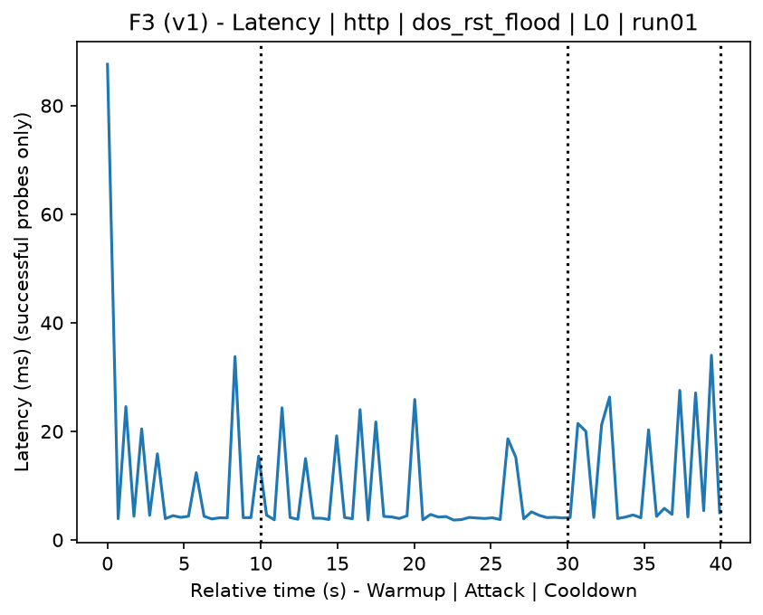
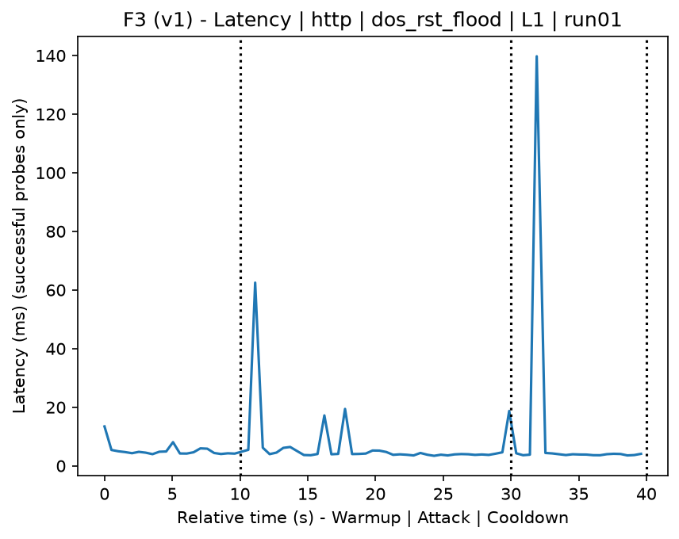
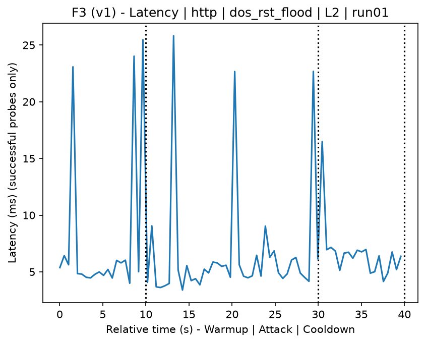
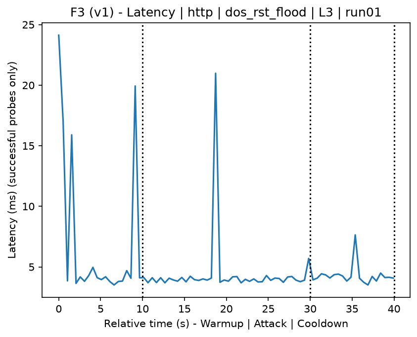
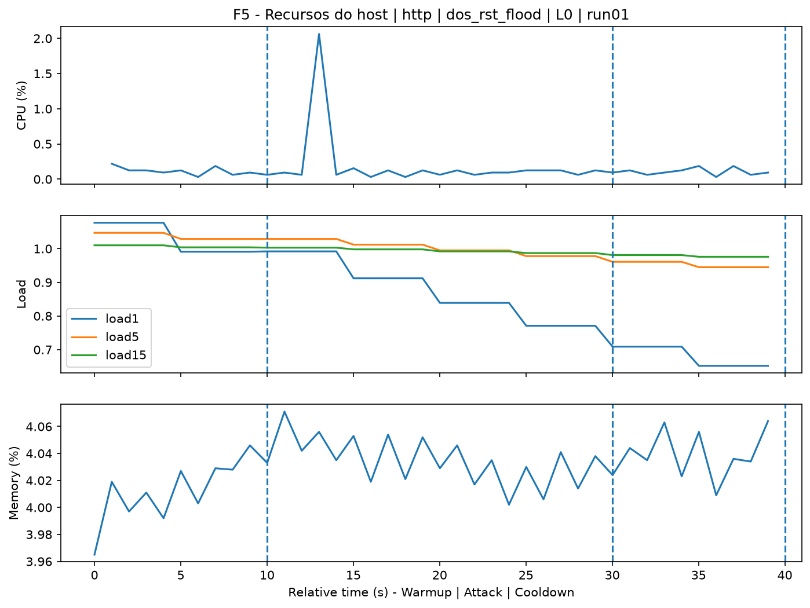
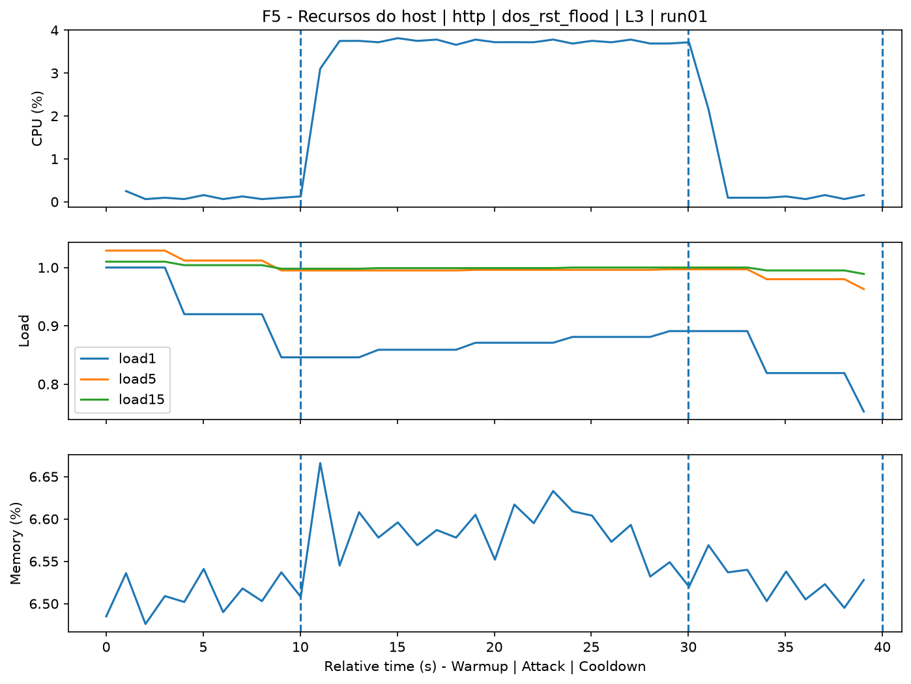
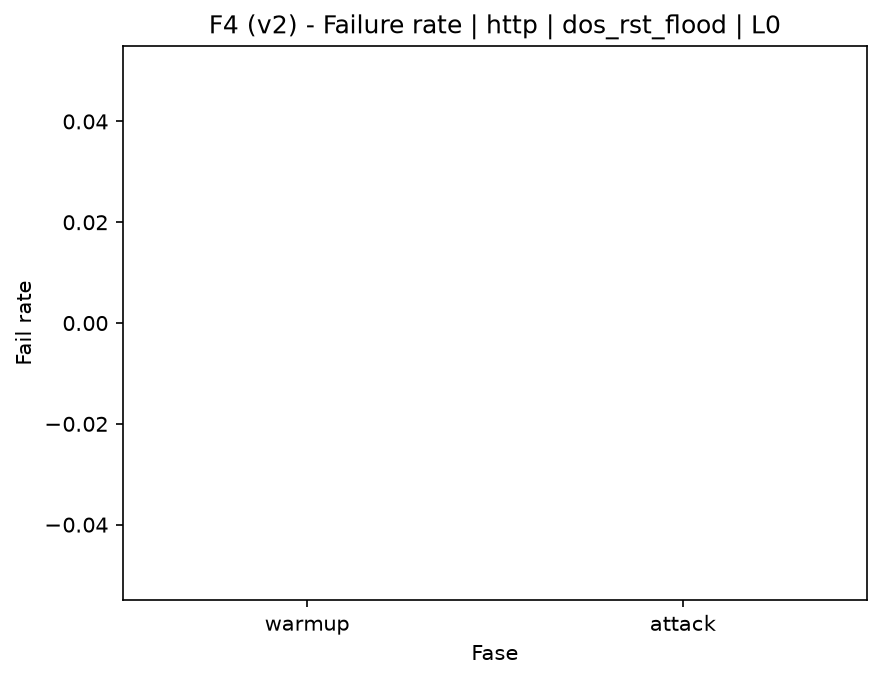
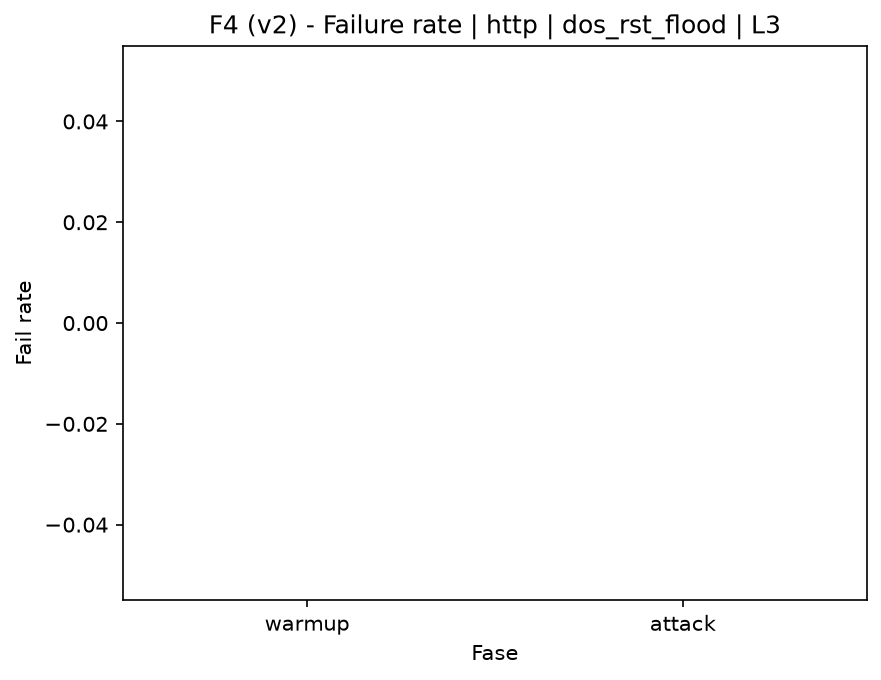

# RST Flood (`dos_rst_flood`)

[Campaign index](README.md)

This document summarizes the published campaign execution of attack `dos_rst_flood`. In the local catalog, the attack is described as: TCP packet flood with the RST flag set. The full execution artifacts are not versioned in this repository; retrieve them from the Figshare dataset linked in the campaign index or regenerate the figures with `run_claim_figures.sh`. The selected figures below are stored under `contrib/assets/campaign_doc`.

## Attack Metadata

| Field | Value |
| --- | --- |
| ID | `dos_rst_flood` |
| Category | 6) Denial of Service and Impact |
| Subcategory | 6.1 Network/transport floods (ICMP/TCP/UDP) |
| Target services | target IP service |
| Image | `attack-rst-flood:latest` |
| Container | `attack-rst-flood` |
| Catalog max runtime | 10 s |
| Intensity parameters | duration_s, count, rate_pps, payload_size |
| MITRE ATT&CK | [https://attack.mitre.org/tactics/TA0040/](https://attack.mitre.org/tactics/TA0040/) [https://attack.mitre.org/techniques/T1498/](https://attack.mitre.org/techniques/T1498/) [https://attack.mitre.org/techniques/T1498/001/](https://attack.mitre.org/techniques/T1498/001/) |

## Statistical Summary by Level

| Level | Service | Runs | Attack samples | Mean success | Mean failure | Lat p50/p95 ms | Total PCAP MB | Mean dataset (min-max) | Mean exec s | Extractors ok/total | Mean/max CPU | Mean mem MB |
| --- | --- | --- | --- | --- | --- | --- | --- | --- | --- | --- | --- | --- |
| L0 | http | 5 | 199 | 100% | 0% | 4,07 / 20,47 | 1,66 | 3.136 (3.120-3.162) | 42,37 | 3/3 | 0,61% / 0,7% | 79,84 |
| L1 | http | 5 | 199 | 100% | 0% | 4,52 / 15,8 | 860,41 | 4.742.488 (4.561.396-4.850.748) | 598,24 | 3/3 | 0,71% / 0,93% | 81,94 |
| L2 | http | 5 | 196 | 100% | 0% | 4,37 / 40,5 | 837,06 | 4.613.701 (3.977.122-4.903.038) | 580,78 | 3/3 | 0,7% / 1,16% | 86,26 |
| L3 | http | 5 | 200 | 100% | 0% | 4 / 8,76 | 838,25 | 4.620.094 (3.875.808-4.913.302) | 581,89 | 3/3 | 0,61% / 0,75% | 101,84 |

## Stability Across Reruns

| Level | Metric | Runs | Mean | Deviation | CV | Min | Max |
| --- | --- | --- | --- | --- | --- | --- | --- |
| L0 | Mean CPU in attack phase | 5 | 0,61 | 0,04 | 7,26% | 0,53 | 0,64 |
| L0 | Dataset rows | 5 | 3.136,4 | 22,47 | 0,72% | 3.120 | 3.162 |
| L0 | Execution time | 5 | 42,37 | 0,63 | 1,48% | 42,03 | 43,47 |
| L0 | Failure in attack phase | 5 | 0 | 0 | n/a | 0 | 0 |
| L0 | Censored p95 latency | 5 | 20,47 | 2,45 | 11,97% | 18,19 | 24,03 |
| L1 | Mean CPU in attack phase | 5 | 0,71 | 0,09 | 12,1% | 0,58 | 0,8 |
| L1 | Dataset rows | 5 | 4.742.487,6 | 109.806,47 | 2,32% | 4.561.396 | 4.850.748 |
| L1 | Execution time | 5 | 598,24 | 12,35 | 2,06% | 577,61 | 609,4 |
| L1 | Failure in attack phase | 5 | 0 | 0 | n/a | 0 | 0 |
| L1 | Censored p95 latency | 5 | 15,8 | 6,61 | 41,85% | 4,83 | 20,48 |
| L2 | Mean CPU in attack phase | 5 | 0,7 | 0,1 | 14,9% | 0,63 | 0,88 |
| L2 | Dataset rows | 5 | 4.613.701,2 | 364.149,29 | 7,89% | 3.977.122 | 4.903.038 |
| L2 | Execution time | 5 | 580,78 | 42,07 | 7,24% | 507,25 | 614,26 |
| L2 | Failure in attack phase | 5 | 0 | 0 | n/a | 0 | 0 |
| L2 | Censored p95 latency | 5 | 40,5 | 47,15 | 116,43% | 14,46 | 124,67 |
| L3 | Mean CPU in attack phase | 5 | 0,61 | 0,06 | 9,26% | 0,53 | 0,67 |
| L3 | Dataset rows | 5 | 4.620.093,6 | 420.807,39 | 9,11% | 3.875.808 | 4.913.302 |
| L3 | Execution time | 5 | 581,89 | 49,38 | 8,49% | 494,41 | 614,74 |
| L3 | Failure in attack phase | 5 | 0 | 0 | n/a | 0 | 0 |
| L3 | Censored p95 latency | 5 | 8,76 | 5,35 | 61,05% | 4,36 | 16,09 |

## Artifact Validation

| Level | Runs | Capture | Probe | Features | Dataset | Resources | Server stats | Acceptance |
| --- | --- | --- | --- | --- | --- | --- | --- | --- |
| L0 | 5 | 5/5 | 5/5 | 5/5 | 5/5 | 5/5 | 5/5 | 5/5 |
| L1 | 5 | 5/5 | 5/5 | 5/5 | 5/5 | 5/5 | 5/5 | 5/5 |
| L2 | 5 | 5/5 | 5/5 | 5/5 | 5/5 | 5/5 | 5/5 | 5/5 |
| L3 | 5 | 5/5 | 5/5 | 5/5 | 5/5 | 5/5 | 5/5 | 5/5 |

## Selected Figures

<table>
<tr>
<td> Time series L0 run01</td>
<td> Time series L1 run01</td>
</tr>
<tr>
<td> Time series L2 run01</td>
<td> Time series L3 run01</td>
</tr>
<tr>
<td> Resources L0 run01</td>
<td> Resources L3 run01</td>
</tr>
<tr>
<td> Failure rate L0</td>
<td> Failure rate L3</td>
</tr>
</table>

## Sources Used

- Attack catalog: `docker/attackers/rst-flood/attack.yaml`
- Full campaign artifacts: available from the Figshare dataset linked in the campaign index; when extracted locally, expected under `experiments/60att_5runs_l0l1l2l3/dos_rst_flood`.
