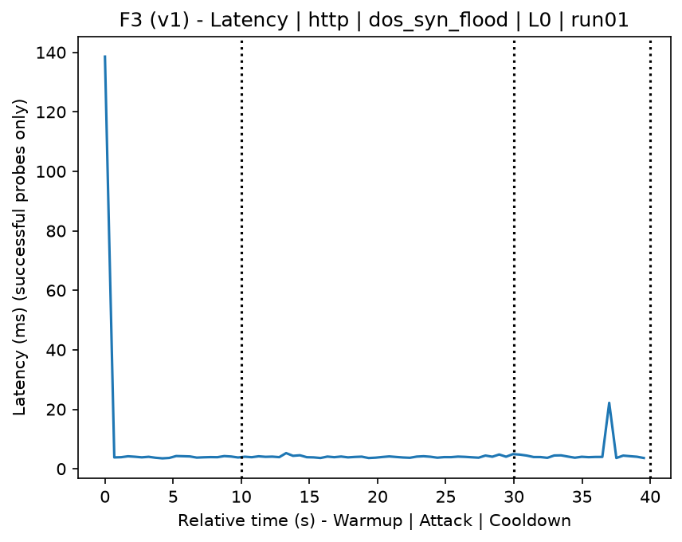
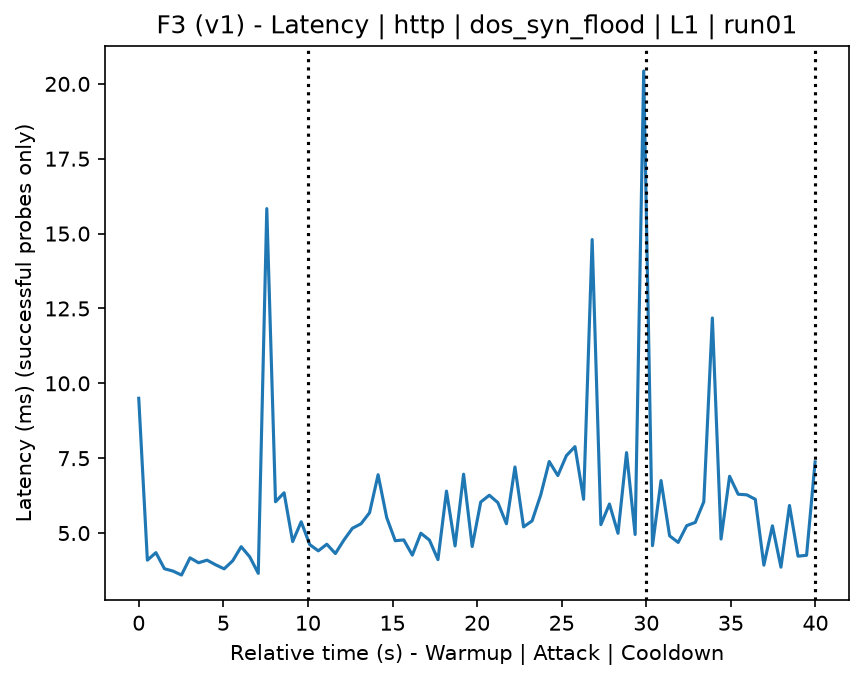
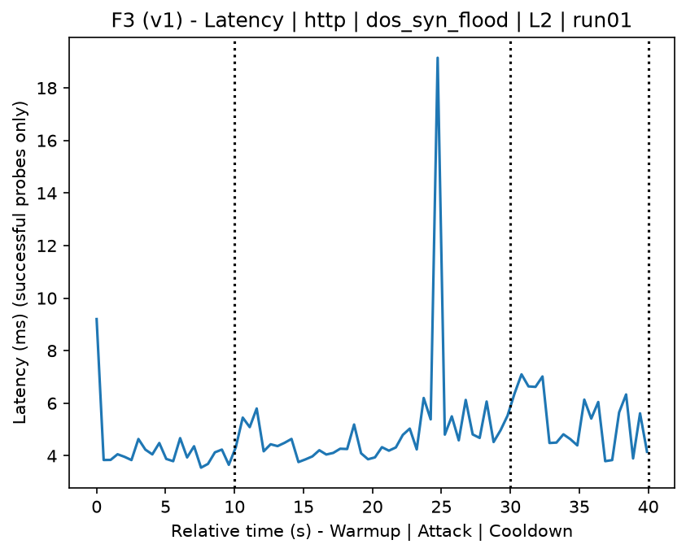
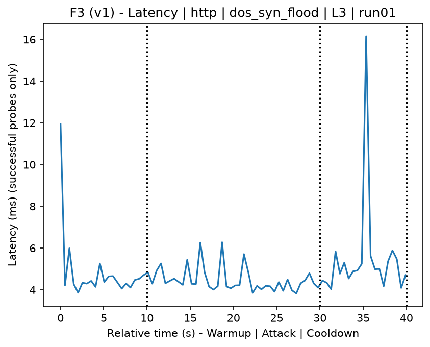
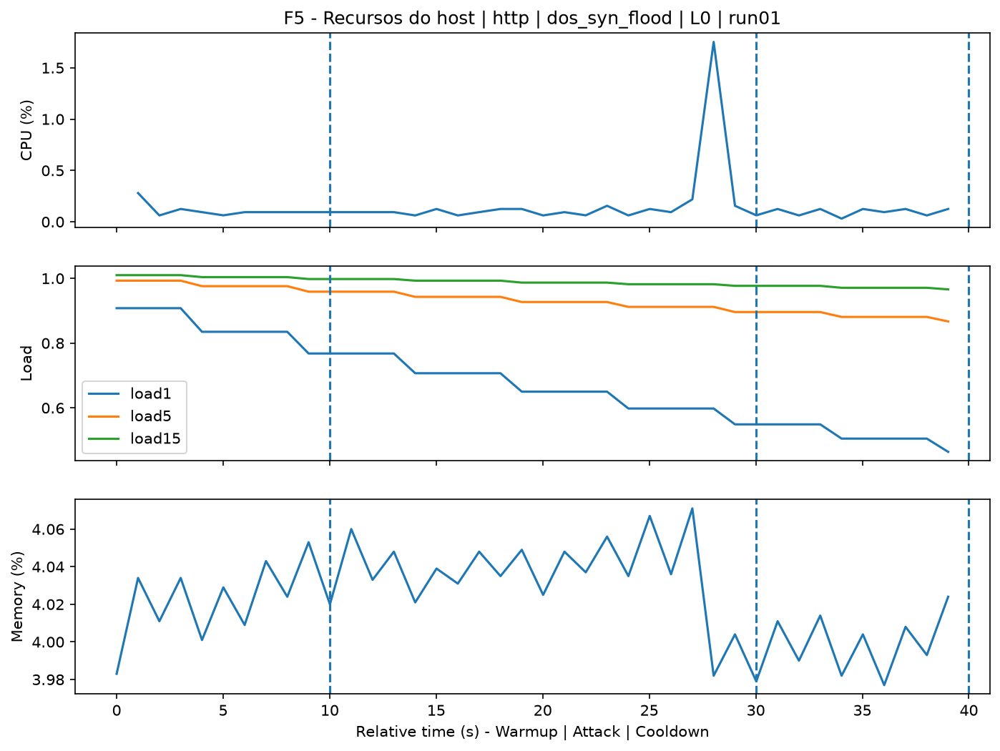
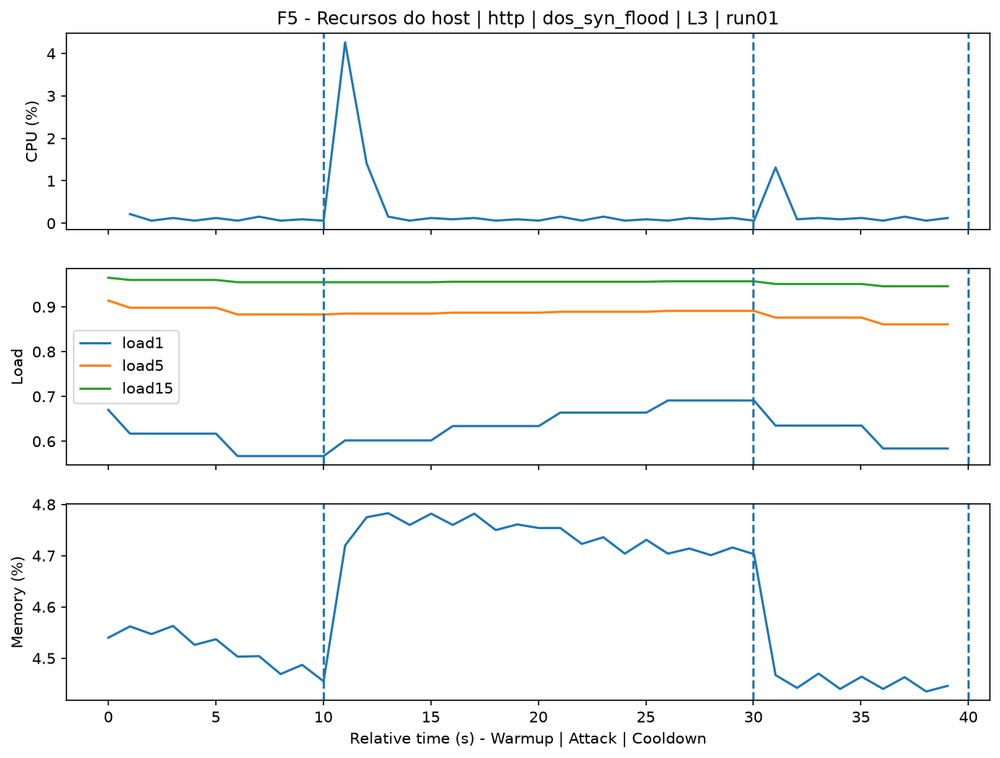
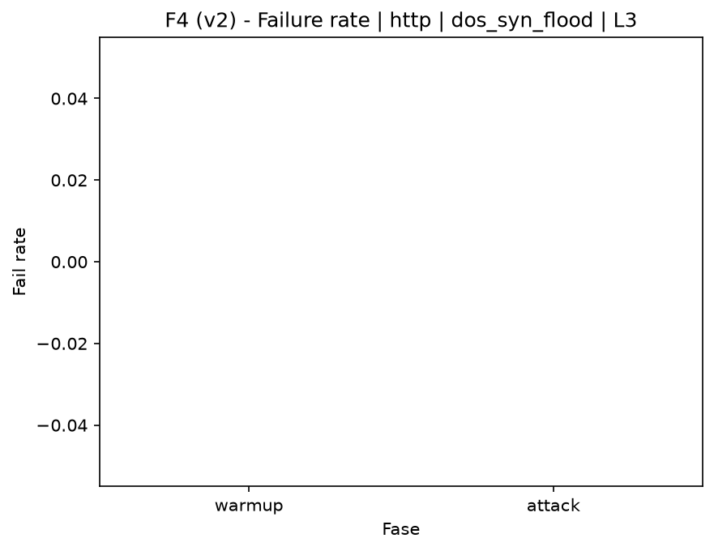

# SYN Flood (`dos_syn_flood`)

[Campaign index](README.md)

This document summarizes the published campaign execution of attack `dos_syn_flood`. In the local catalog, the attack is described as: TCP packet flood with the SYN flag set. The full execution artifacts are not versioned in this repository; retrieve the generated dataset CSVs from the Figshare dataset linked in the campaign index. Raw PCAP captures are not included in that archive. The selected figures below are stored under `contrib/assets/campaign_doc`.

## Attack Metadata

| Field | Value |
| --- | --- |
| ID | `dos_syn_flood` |
| Category | 6) Denial of Service and Impact |
| Subcategory | 6.1 Network/transport floods (ICMP/TCP/UDP) |
| Target services | target IP service |
| Image | `attack-syn-flood:latest` |
| Container | `attack-syn-flood` |
| Catalog max runtime | 10 s |
| Intensity parameters | duration_s, count, rate_pps, delay_ms, payload_size |
| MITRE ATT&CK | [https://attack.mitre.org/tactics/TA0040/](https://attack.mitre.org/tactics/TA0040/) [https://attack.mitre.org/techniques/T1498/](https://attack.mitre.org/techniques/T1498/) [https://attack.mitre.org/techniques/T1498/001/](https://attack.mitre.org/techniques/T1498/001/) |

## Statistical Summary by Level

| Level | Service | Runs | Attack samples | Mean success | Mean failure | Lat p50/p95 ms | Total PCAP MB | Mean dataset (min-max) | Mean exec s | Extractors ok/total | Mean/max CPU | Mean mem MB |
| --- | --- | --- | --- | --- | --- | --- | --- | --- | --- | --- | --- | --- |
| L0 | http | 5 | 200 | 100% | 0% | 4,06 / 8,03 | 1,67 | 3.161 (3.160-3.164) | 42,34 | 3/3 | 0,6% / 0,65% | 104,03 |
| L1 | http | 5 | 200 | 100% | 0% | 4,45 / 7,75 | 2,36 | 6.952 (6.278-7.212) | 42,61 | 3/3 | 0,7% / 0,8% | 106,13 |
| L2 | http | 5 | 200 | 100% | 0% | 4,48 / 5,76 | 2,38 | 7.012 (6.872-7.194) | 42,51 | 3/3 | 0,69% / 0,83% | 108,25 |
| L3 | http | 5 | 200 | 100% | 0% | 4,14 / 4,97 | 2,4 | 7.136 (7.046-7.192) | 42,54 | 3/3 | 0,64% / 0,74% | 110,43 |

## Stability Across Reruns

| Level | Metric | Runs | Mean | Deviation | CV | Min | Max |
| --- | --- | --- | --- | --- | --- | --- | --- |
| L0 | Mean CPU in attack phase | 5 | 0,6 | 0,04 | 6,2% | 0,55 | 0,63 |
| L0 | Dataset rows | 5 | 3.161,2 | 1,79 | 0,06% | 3.160 | 3.164 |
| L0 | Execution time | 5 | 42,34 | 0,58 | 1,38% | 42,06 | 43,38 |
| L0 | Failure in attack phase | 5 | 0 | 0 | n/a | 0 | 0 |
| L0 | Censored p95 latency | 5 | 8,03 | 6,83 | 85,02% | 4,62 | 20,24 |
| L1 | Mean CPU in attack phase | 5 | 0,7 | 0,12 | 17,13% | 0,58 | 0,86 |
| L1 | Dataset rows | 5 | 6.952,4 | 385,23 | 5,54% | 6.278 | 7.212 |
| L1 | Execution time | 5 | 42,61 | 0,11 | 0,26% | 42,43 | 42,7 |
| L1 | Failure in attack phase | 5 | 0 | 0 | n/a | 0 | 0 |
| L1 | Censored p95 latency | 5 | 7,75 | 5 | 64,51% | 4,1 | 16,21 |
| L2 | Mean CPU in attack phase | 5 | 0,69 | 0,09 | 12,48% | 0,61 | 0,81 |
| L2 | Dataset rows | 5 | 7.011,6 | 116,69 | 1,66% | 6.872 | 7.194 |
| L2 | Execution time | 5 | 42,51 | 0,06 | 0,13% | 42,44 | 42,6 |
| L2 | Failure in attack phase | 5 | 0 | 0 | n/a | 0 | 0 |
| L2 | Censored p95 latency | 5 | 5,76 | 1,23 | 21,3% | 4,33 | 7,13 |
| L3 | Mean CPU in attack phase | 5 | 0,64 | 0,04 | 5,84% | 0,59 | 0,69 |
| L3 | Dataset rows | 5 | 7.135,6 | 57,61 | 0,81% | 7.046 | 7.192 |
| L3 | Execution time | 5 | 42,54 | 0,08 | 0,2% | 42,43 | 42,66 |
| L3 | Failure in attack phase | 5 | 0 | 0 | n/a | 0 | 0 |
| L3 | Censored p95 latency | 5 | 4,97 | 0,76 | 15,39% | 4,29 | 5,86 |

## Artifact Validation

| Level | Runs | Capture | Probe | Features | Dataset | Resources | Server stats | Acceptance |
| --- | --- | --- | --- | --- | --- | --- | --- | --- |
| L0 | 5 | 5/5 | 5/5 | 5/5 | 5/5 | 5/5 | 5/5 | 5/5 |
| L1 | 5 | 5/5 | 5/5 | 5/5 | 5/5 | 5/5 | 5/5 | 5/5 |
| L2 | 5 | 5/5 | 5/5 | 5/5 | 5/5 | 5/5 | 5/5 | 5/5 |
| L3 | 5 | 5/5 | 5/5 | 5/5 | 5/5 | 5/5 | 5/5 | 5/5 |

## Selected Figures

<table>
<tr>
<td> Time series L0 run01</td>
<td> Time series L1 run01</td>
</tr>
<tr>
<td> Time series L2 run01</td>
<td> Time series L3 run01</td>
</tr>
<tr>
<td> Resources L0 run01</td>
<td> Resources L3 run01</td>
</tr>
<tr>
<td> Failure rate L0</td>
<td> Failure rate L3</td>
</tr>
</table>

## Sources Used

- Attack catalog: `docker/attackers/syn-flood/attack.yaml`
- Full campaign artifacts: available from the Figshare dataset linked in the campaign index; when extracted locally, expected under `experiments/60att_5runs_l0l1l2l3/dos_syn_flood`.
