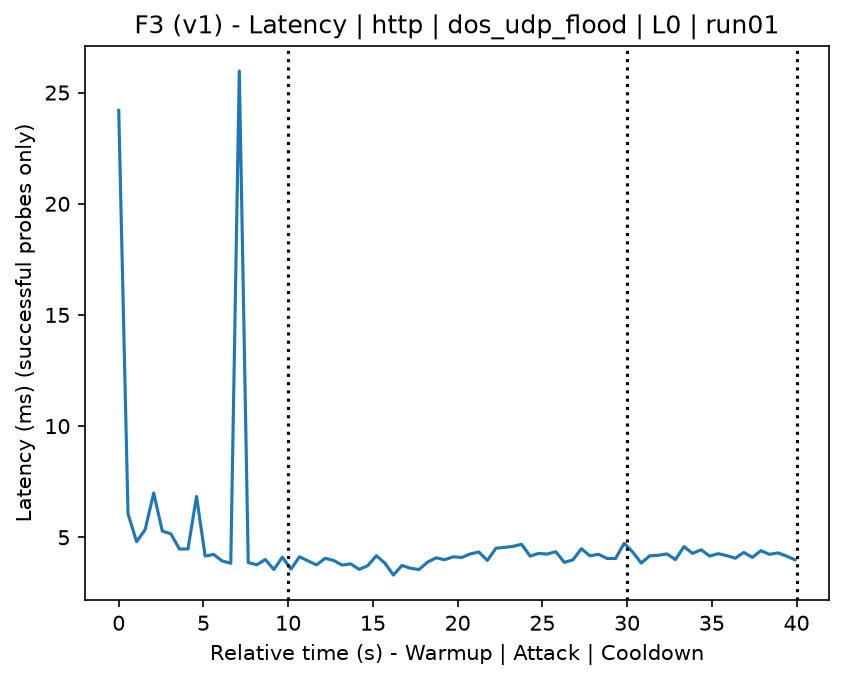
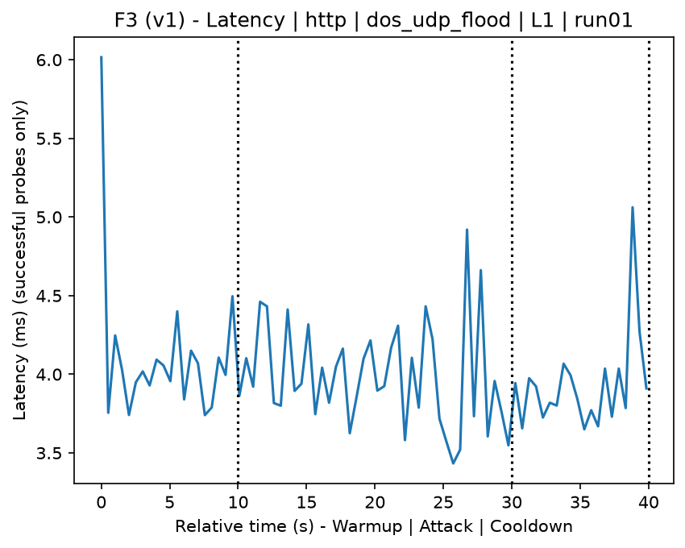
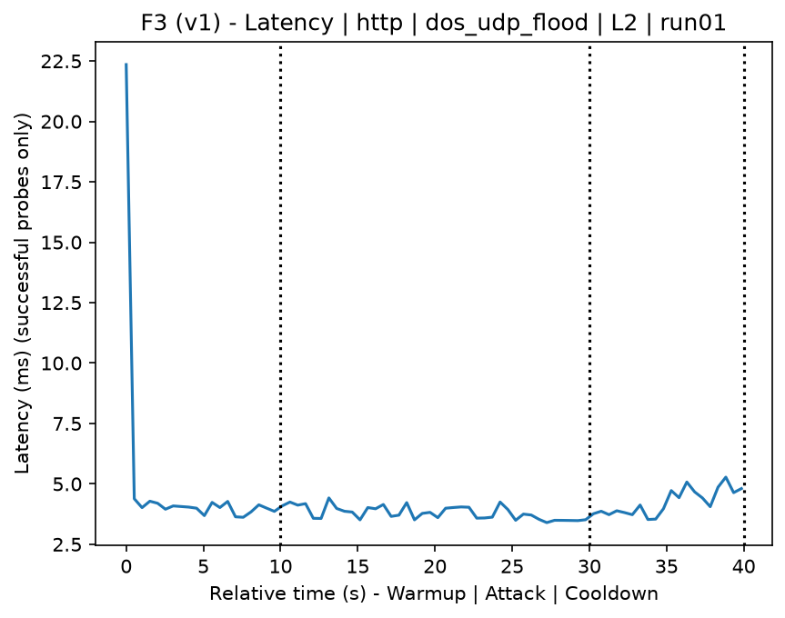
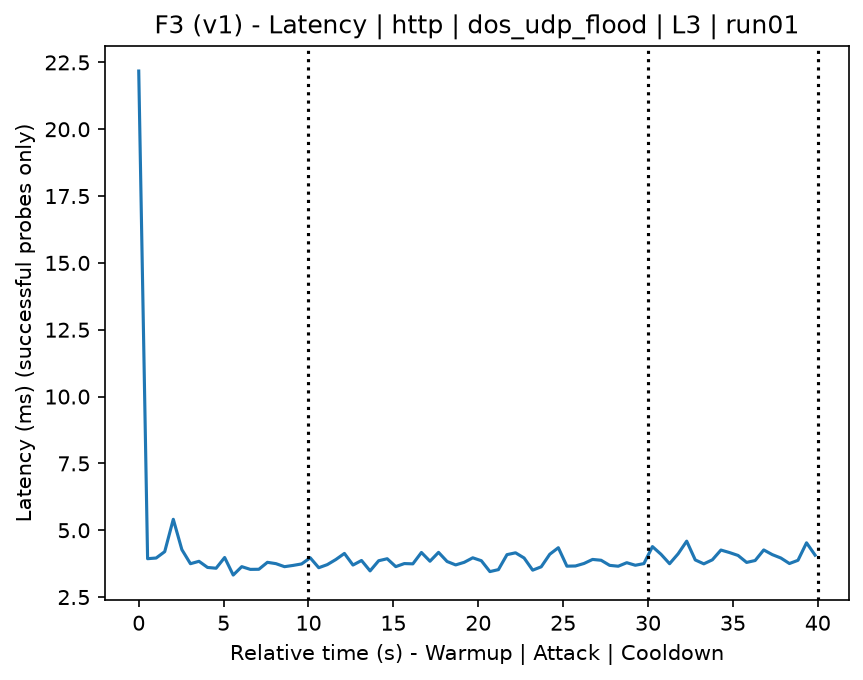
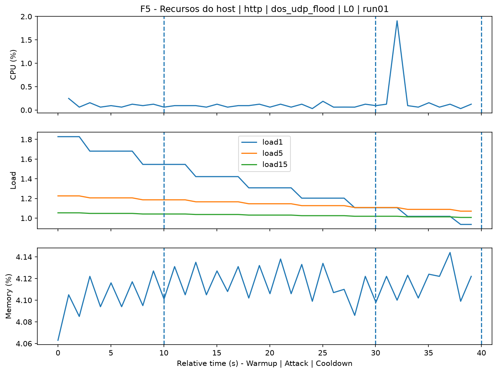
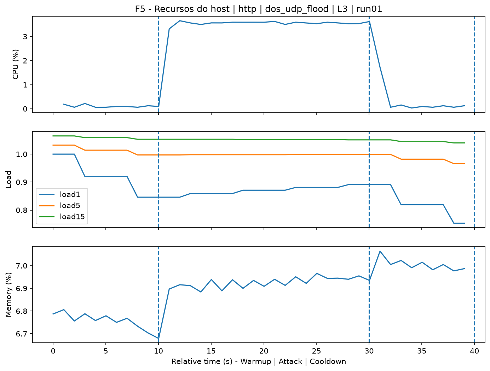
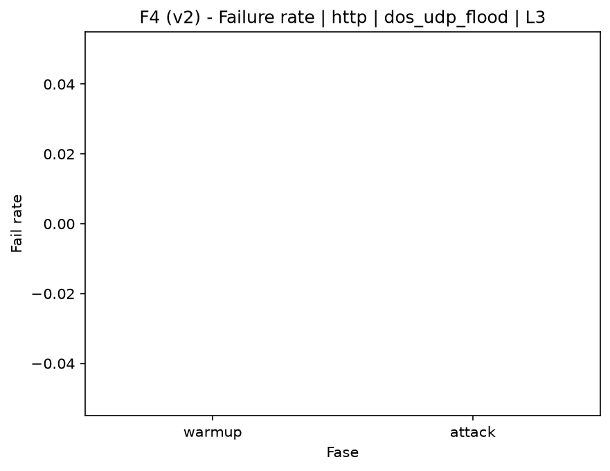

# UDP Flood (`dos_udp_flood`)

[Índice da campanha](README.md)

Na campanha `experiments/60att_5runs_l0l1l2l3`, este documento consolida a execução do ataque `dos_udp_flood`. No catálogo local, o ataque é descrito como: UDP packet flood. A documentação abaixo usa apenas artefatos já presentes no repositório, principalmente as tabelas e figuras de `experiments/60att_5runs_l0l1l2l3/dos_udp_flood`.

## Metadados do ataque

| Campo | Valor |
| --- | --- |
| ID | `dos_udp_flood` |
| Categoria | 6) Denial of Service and Impact |
| Subcategoria | 6.1 Network/transport floods (ICMP/TCP/UDP) |
| Serviços alvo | target IP service |
| Imagem | `attack-udp-flood:latest` |
| Container | `attack-udp-flood` |
| Runtime máximo do catálogo | 10 s |
| Parâmetros de intensidade | duration_s, count, rate_pps, payload_size |
| MITRE ATT&CK | [https://attack.mitre.org/tactics/TA0040/](https://attack.mitre.org/tactics/TA0040/) [https://attack.mitre.org/techniques/T1498/](https://attack.mitre.org/techniques/T1498/) [https://attack.mitre.org/techniques/T1498/001/](https://attack.mitre.org/techniques/T1498/001/) |

## Resumo estatístico por nível

| Nível | Serviço | Runs | Amostras attack | Sucesso médio | Falha média | Lat p50/p95 ms | PCAP total MB | Dataset médio (min-max) | Exec média s | Extratores ok/total | CPU média/máx | Mem MB média |
| --- | --- | --- | --- | --- | --- | --- | --- | --- | --- | --- | --- | --- |
| L0 | http | 5 | 200 | 100% | 0% | 4,09 / 4,85 | 1,67 | 3.168 (3.160-3.200) | 42,18 | 3/3 | 0,63% / 0,7% | 112,53 |
| L1 | http | 5 | 200 | 100% | 0% | 4,14 / 4,97 | 507,73 | 3.319.656 (3.259.102-3.366.376) | 375,3 | 3/3 | 0,65% / 0,78% | 114,56 |
| L2 | http | 5 | 199 | 100% | 0% | 4,19 / 5,26 | 510,65 | 3.338.827 (3.285.548-3.393.784) | 376,55 | 3/3 | 0,66% / 0,8% | 116,64 |
| L3 | http | 5 | 200 | 100% | 0% | 3,9 / 4,78 | 485,27 | 3.172.456 (2.558.216-3.394.568) | 361,2 | 3/3 | 0,6% / 0,66% | 118,8 |

## Estabilidade entre reexecuções

| Nível | Métrica | Runs | Média | Desvio | CV | Min | Max |
| --- | --- | --- | --- | --- | --- | --- | --- |
| L0 | CPU média na fase attack | 5 | 0,63 | 0,05 | 7,54% | 0,59 | 0,71 |
| L0 | Linhas do dataset | 5 | 3.168 | 17,89 | 0,56% | 3.160 | 3.200 |
| L0 | Tempo de execução | 5 | 42,18 | 0,36 | 0,85% | 41,98 | 42,82 |
| L0 | Falha na fase attack | 5 | 0 | 0 | n/d | 0 | 0 |
| L0 | Latência p95 censurada | 5 | 4,85 | 0,73 | 15,14% | 4,22 | 6,12 |
| L1 | CPU média na fase attack | 5 | 0,65 | 0,1 | 15,47% | 0,58 | 0,83 |
| L1 | Linhas do dataset | 5 | 3.319.655,6 | 49.263,14 | 1,48% | 3.259.102 | 3.366.376 |
| L1 | Tempo de execução | 5 | 375,3 | 4,94 | 1,31% | 368,87 | 380,65 |
| L1 | Falha na fase attack | 5 | 0 | 0 | n/d | 0 | 0 |
| L1 | Latência p95 censurada | 5 | 4,97 | 0,76 | 15,2% | 4,46 | 6,17 |
| L2 | CPU média na fase attack | 5 | 0,66 | 0,08 | 12,33% | 0,57 | 0,78 |
| L2 | Linhas do dataset | 5 | 3.338.826,8 | 49.514,41 | 1,48% | 3.285.548 | 3.393.784 |
| L2 | Tempo de execução | 5 | 376,55 | 6,19 | 1,64% | 369,91 | 383,25 |
| L2 | Falha na fase attack | 5 | 0 | 0 | n/d | 0 | 0 |
| L2 | Latência p95 censurada | 5 | 5,26 | 1,04 | 19,78% | 4,25 | 6,81 |
| L3 | CPU média na fase attack | 5 | 0,6 | 0,02 | 4,08% | 0,57 | 0,63 |
| L3 | Linhas do dataset | 5 | 3.172.456,4 | 350.806,33 | 11,06% | 2.558.216 | 3.394.568 |
| L3 | Tempo de execução | 5 | 361,2 | 35,66 | 9,87% | 299,07 | 386,96 |
| L3 | Falha na fase attack | 5 | 0 | 0 | n/d | 0 | 0 |
| L3 | Latência p95 censurada | 5 | 4,78 | 0,62 | 13,03% | 4,17 | 5,52 |

## Validação de artefatos

| Nível | Runs | Captura | Probe | Features | Dataset | Recursos | Server stats | Aceite |
| --- | --- | --- | --- | --- | --- | --- | --- | --- |
| L0 | 5 | 5/5 | 5/5 | 5/5 | 5/5 | 5/5 | 5/5 | 5/5 |
| L1 | 5 | 5/5 | 5/5 | 5/5 | 5/5 | 5/5 | 5/5 | 5/5 |
| L2 | 5 | 5/5 | 5/5 | 5/5 | 5/5 | 5/5 | 5/5 | 5/5 |
| L3 | 5 | 5/5 | 5/5 | 5/5 | 5/5 | 5/5 | 5/5 | 5/5 |

## Figuras selecionadas

<table>
<tr>
<td> Série temporal L0 run01</td>
<td> Série temporal L1 run01</td>
</tr>
<tr>
<td> Série temporal L2 run01</td>
<td> Série temporal L3 run01</td>
</tr>
<tr>
<td> Recursos L0 run01</td>
<td> Recursos L3 run01</td>
</tr>
<tr>
<td> Taxa de falha L0</td>
<td> Taxa de falha L3</td>
</tr>
</table>

## Fontes utilizadas

- Catálogo do ataque: `docker/attackers/udp-flood/attack.yaml`
- Artefatos da campanha: `experiments/60att_5runs_l0l1l2l3/dos_udp_flood`
