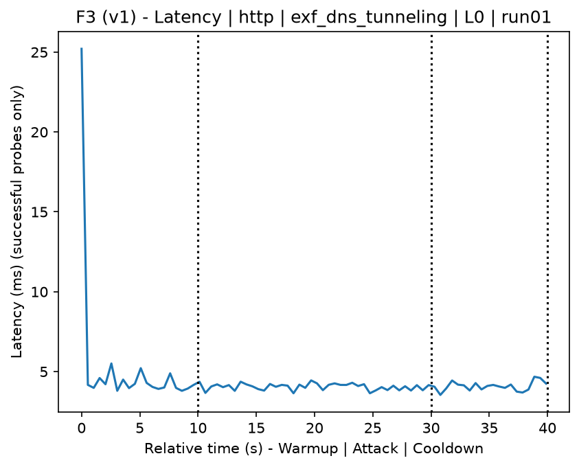
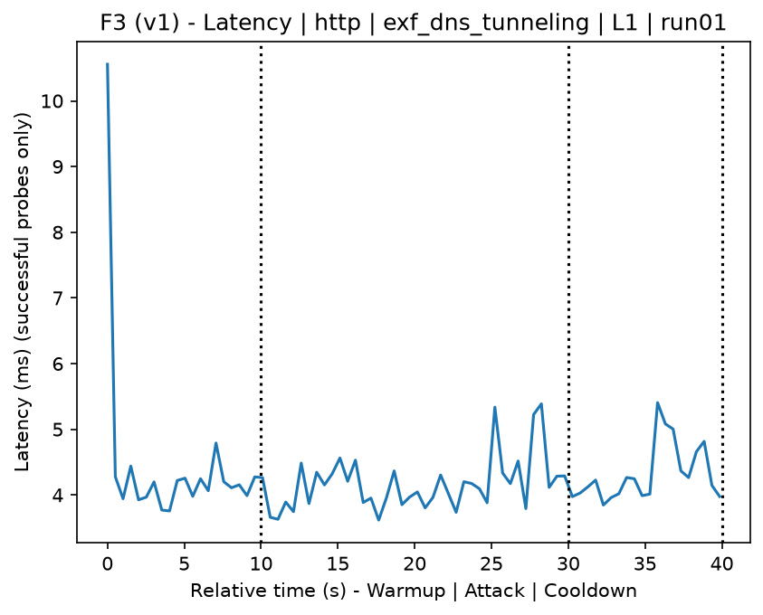
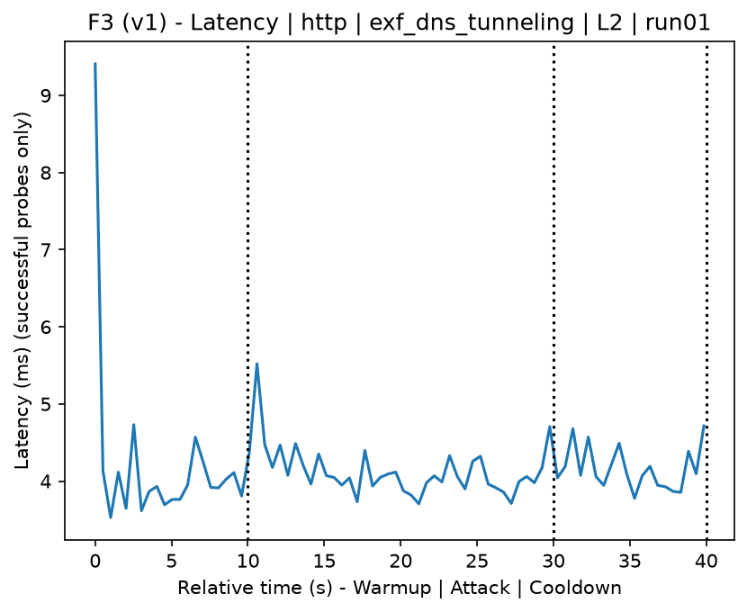
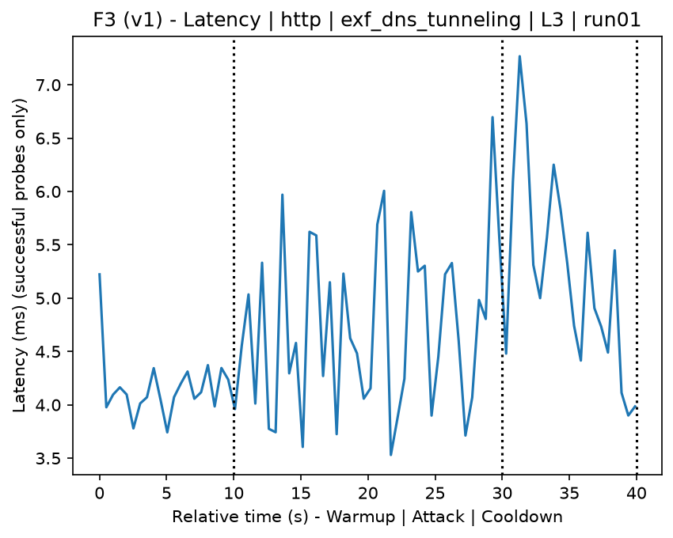
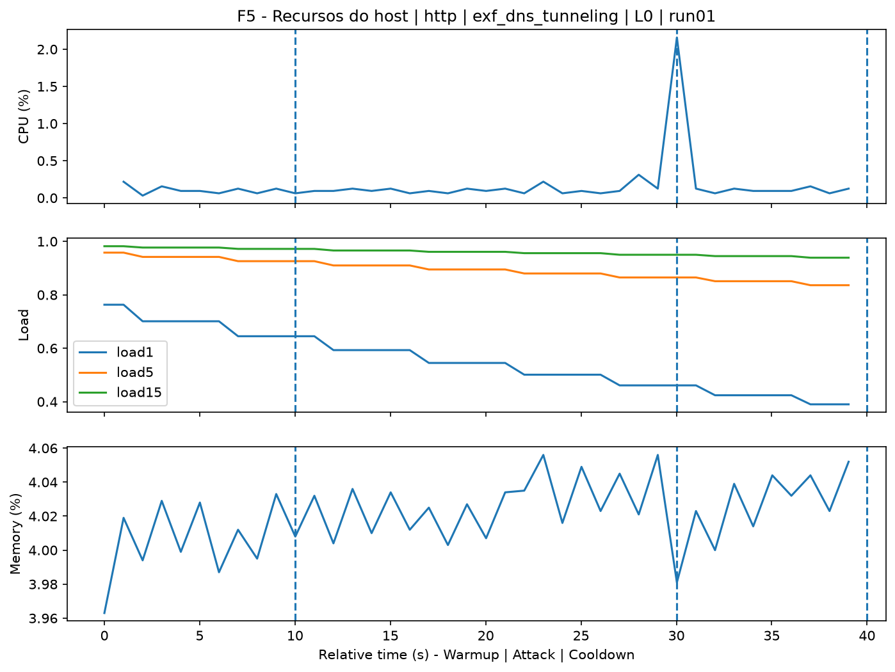
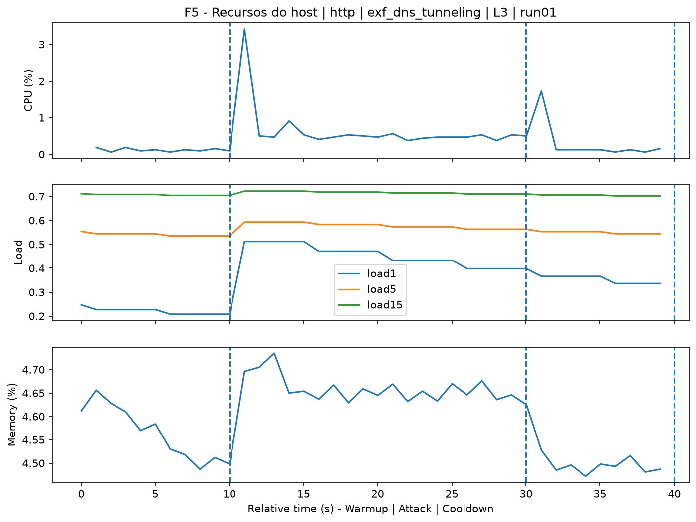
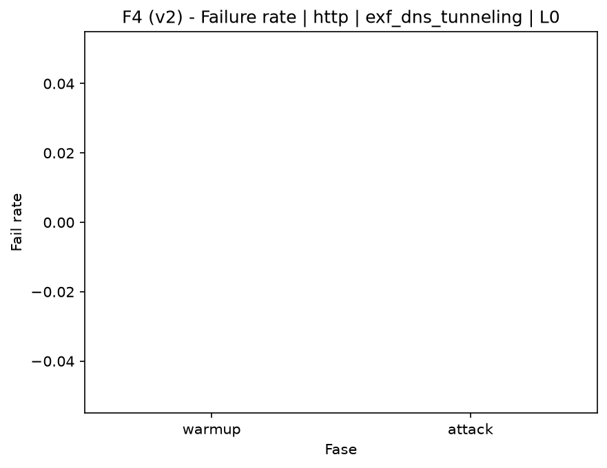
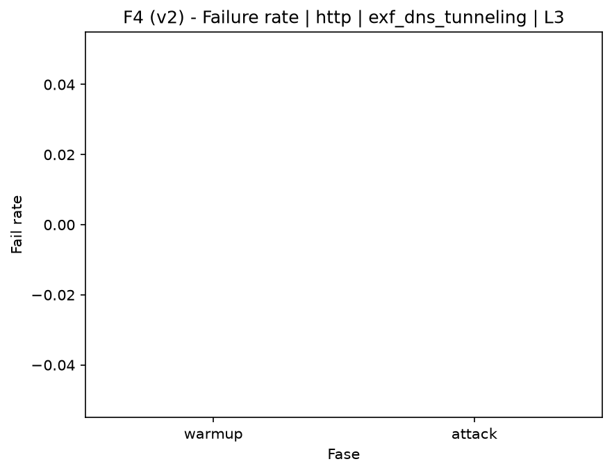

# DNS Tunneling (`exf_dns_tunneling`)

[Campaign index](README.md)

This document summarizes the published campaign execution of attack `exf_dns_tunneling`. In the local catalog, the attack is described as: DNS tunneling exfiltration behavior through random domain name resolution. The full execution artifacts are not versioned in this repository; retrieve the generated dataset CSVs from the Figshare dataset linked in the campaign index. Raw PCAP captures are not included in that archive. The selected figures below are stored under `contrib/assets/campaign_doc`.

## Attack Metadata

| Field | Value |
| --- | --- |
| ID | `exf_dns_tunneling` |
| Category | 5) Exfiltration and Tunneling |
| Subcategory | 5.1 Exfiltration and Tunneling |
| Target services | external/local DNS resolver |
| Image | `attack-dns-tunneling:latest` |
| Container | `attack-dns-tunneling` |
| Catalog max runtime | 10 s |
| Intensity parameters | duration_s, count, delay_ms, payload_size |
| MITRE ATT&CK | [https://attack.mitre.org/tactics/TA0010/](https://attack.mitre.org/tactics/TA0010/) [https://attack.mitre.org/tactics/TA0011/](https://attack.mitre.org/tactics/TA0011/) [https://attack.mitre.org/techniques/T1048/](https://attack.mitre.org/techniques/T1048/) [https://attack.mitre.org/techniques/T1048/003/](https://attack.mitre.org/techniques/T1048/003/) [https://attack.mitre.org/techniques/T1071/](https://attack.mitre.org/techniques/T1071/) [https://attack.mitre.org/techniques/T1071/004/](https://attack.mitre.org/techniques/T1071/004/) |

## Statistical Summary by Level

| Level | Service | Runs | Attack samples | Mean success | Mean failure | Lat p50/p95 ms | Total PCAP MB | Mean dataset (min-max) | Mean exec s | Extractors ok/total | Mean/max CPU | Mean mem MB |
| --- | --- | --- | --- | --- | --- | --- | --- | --- | --- | --- | --- | --- |
| L0 | http | 5 | 200 | 100% | 0% | 4,13 / 4,76 | 5,06 | 9.640 (9.604-9.760) | 43,06 | 3/3 | 0,64% / 0,72% | 120,93 |
| L1 | http | 5 | 200 | 100% | 0% | 4,06 / 5,16 | 5,28 | 10.293 (10.282-10.302) | 43,06 | 3/3 | 0,63% / 0,74% | 123,07 |
| L2 | http | 5 | 200 | 100% | 0% | 4,36 / 5,5 | 5,28 | 10.305 (10.294-10.312) | 43,07 | 3/3 | 0,71% / 0,84% | 125,34 |
| L3 | http | 5 | 200 | 100% | 0% | 4,14 / 4,92 | 5,28 | 10.307 (10.302-10.310) | 43,08 | 3/3 | 0,65% / 0,77% | 127,32 |

## Stability Across Reruns

| Level | Metric | Runs | Mean | Deviation | CV | Min | Max |
| --- | --- | --- | --- | --- | --- | --- | --- |
| L0 | Mean CPU in attack phase | 5 | 0,64 | 0,07 | 11,03% | 0,59 | 0,76 |
| L0 | Dataset rows | 5 | 9.640,4 | 67,12 | 0,7% | 9.604 | 9.760 |
| L0 | Execution time | 5 | 43,06 | 0,41 | 0,95% | 42,84 | 43,79 |
| L0 | Failure in attack phase | 5 | 0 | 0 | n/a | 0 | 0 |
| L0 | Censored p95 latency | 5 | 4,76 | 0,61 | 12,89% | 4,36 | 5,84 |
| L1 | Mean CPU in attack phase | 5 | 0,63 | 0,02 | 3,65% | 0,6 | 0,65 |
| L1 | Dataset rows | 5 | 10.293,2 | 7,69 | 0,07% | 10.282 | 10.302 |
| L1 | Execution time | 5 | 43,06 | 0,07 | 0,16% | 43 | 43,17 |
| L1 | Failure in attack phase | 5 | 0 | 0 | n/a | 0 | 0 |
| L1 | Censored p95 latency | 5 | 5,16 | 0,83 | 16,18% | 4,38 | 6,52 |
| L2 | Mean CPU in attack phase | 5 | 0,71 | 0,11 | 15,06% | 0,59 | 0,82 |
| L2 | Dataset rows | 5 | 10.304,8 | 7,01 | 0,07% | 10.294 | 10.312 |
| L2 | Execution time | 5 | 43,07 | 0,06 | 0,13% | 42,99 | 43,14 |
| L2 | Failure in attack phase | 5 | 0 | 0 | n/a | 0 | 0 |
| L2 | Censored p95 latency | 5 | 5,5 | 1,12 | 20,31% | 4,27 | 6,97 |
| L3 | Mean CPU in attack phase | 5 | 0,65 | 0,06 | 8,88% | 0,61 | 0,75 |
| L3 | Dataset rows | 5 | 10.306,8 | 3,63 | 0,04% | 10.302 | 10.310 |
| L3 | Execution time | 5 | 43,08 | 0,02 | 0,05% | 43,04 | 43,09 |
| L3 | Failure in attack phase | 5 | 0 | 0 | n/a | 0 | 0 |
| L3 | Censored p95 latency | 5 | 4,92 | 0,71 | 14,4% | 4,26 | 5,97 |

## Artifact Validation

| Level | Runs | Capture | Probe | Features | Dataset | Resources | Server stats | Acceptance |
| --- | --- | --- | --- | --- | --- | --- | --- | --- |
| L0 | 5 | 5/5 | 5/5 | 5/5 | 5/5 | 5/5 | 5/5 | 5/5 |
| L1 | 5 | 5/5 | 5/5 | 5/5 | 5/5 | 5/5 | 5/5 | 5/5 |
| L2 | 5 | 5/5 | 5/5 | 5/5 | 5/5 | 5/5 | 5/5 | 5/5 |
| L3 | 5 | 5/5 | 5/5 | 5/5 | 5/5 | 5/5 | 5/5 | 5/5 |

## Selected Figures

<table>
<tr>
<td> Time series L0 run01</td>
<td> Time series L1 run01</td>
</tr>
<tr>
<td> Time series L2 run01</td>
<td> Time series L3 run01</td>
</tr>
<tr>
<td> Resources L0 run01</td>
<td> Resources L3 run01</td>
</tr>
<tr>
<td> Failure rate L0</td>
<td> Failure rate L3</td>
</tr>
</table>

## Sources Used

- Attack catalog: `docker/attackers/dns-tunneling/attack.yaml`
- Full campaign artifacts: available from the Figshare dataset linked in the campaign index; when extracted locally, expected under `experiments/60att_5runs_l0l1l2l3/exf_dns_tunneling`.
