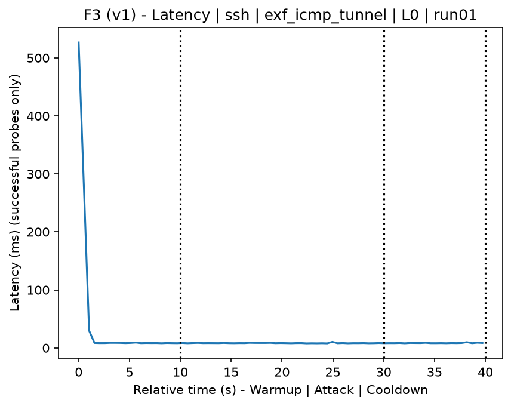
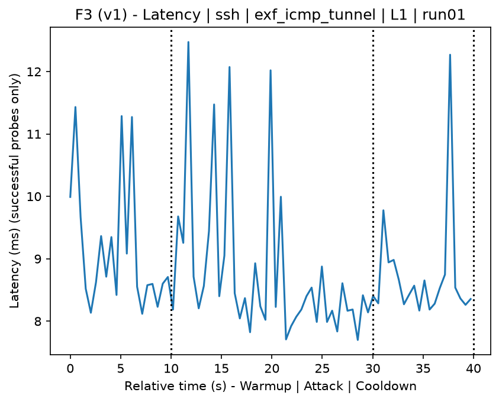
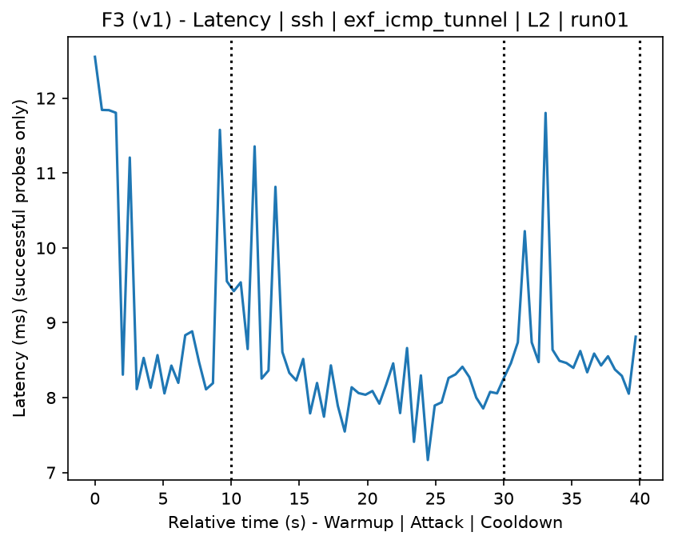
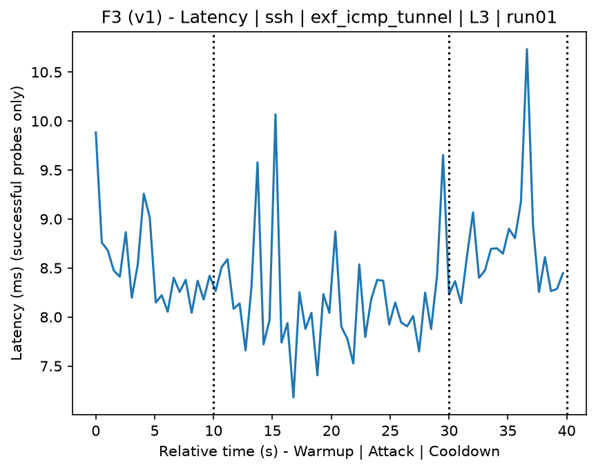
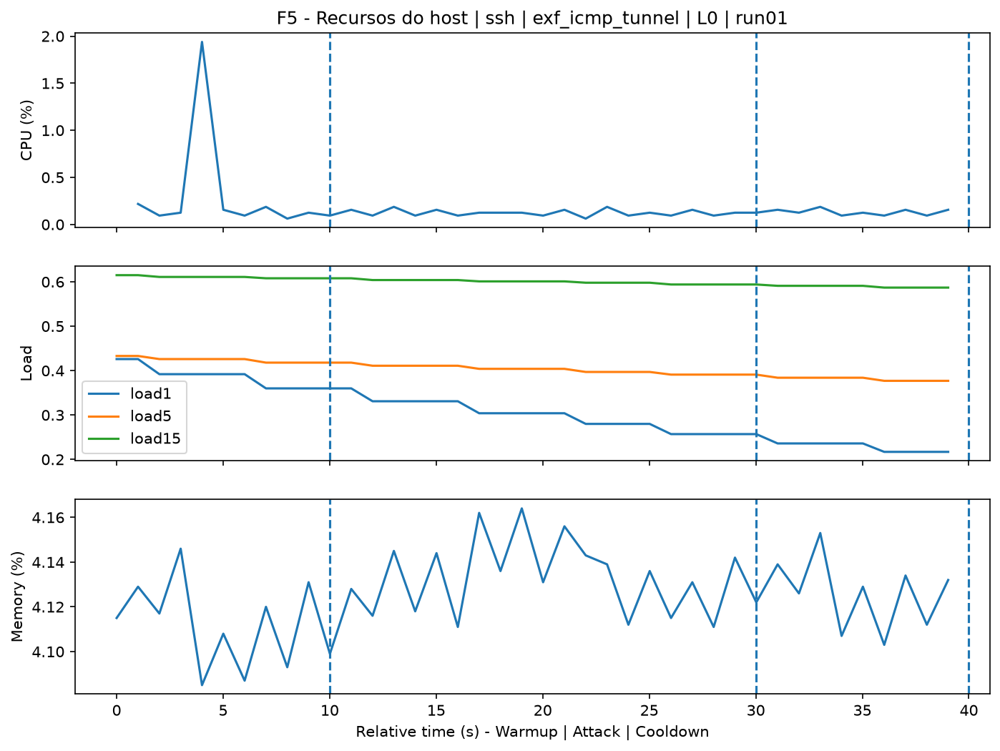
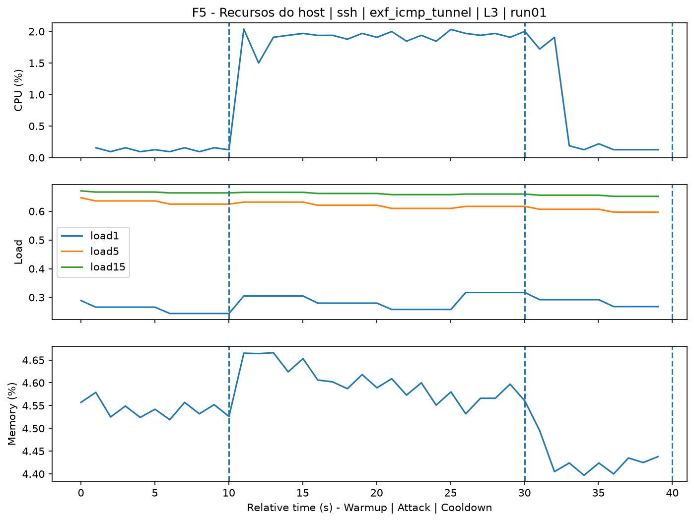
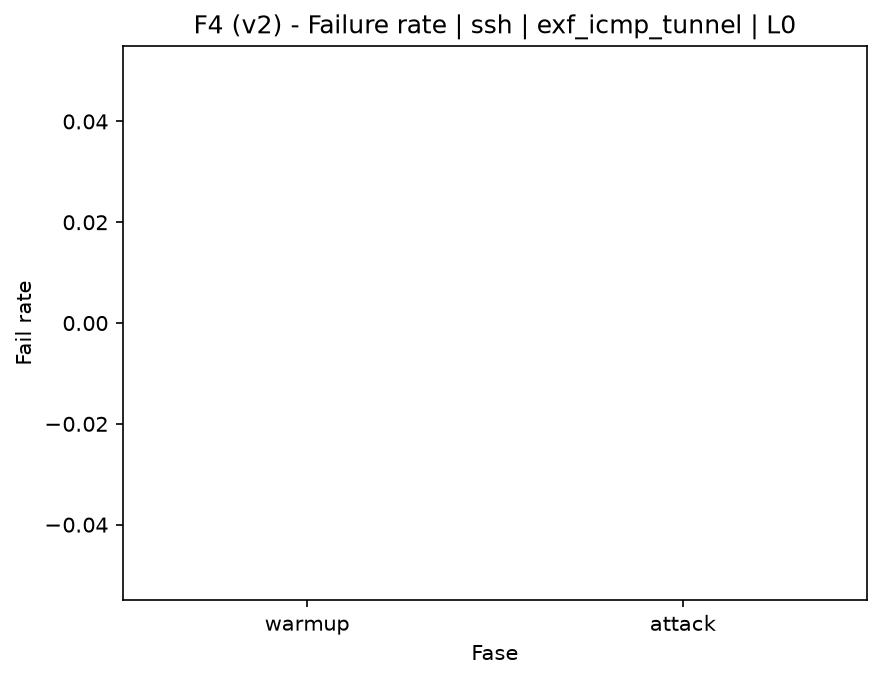
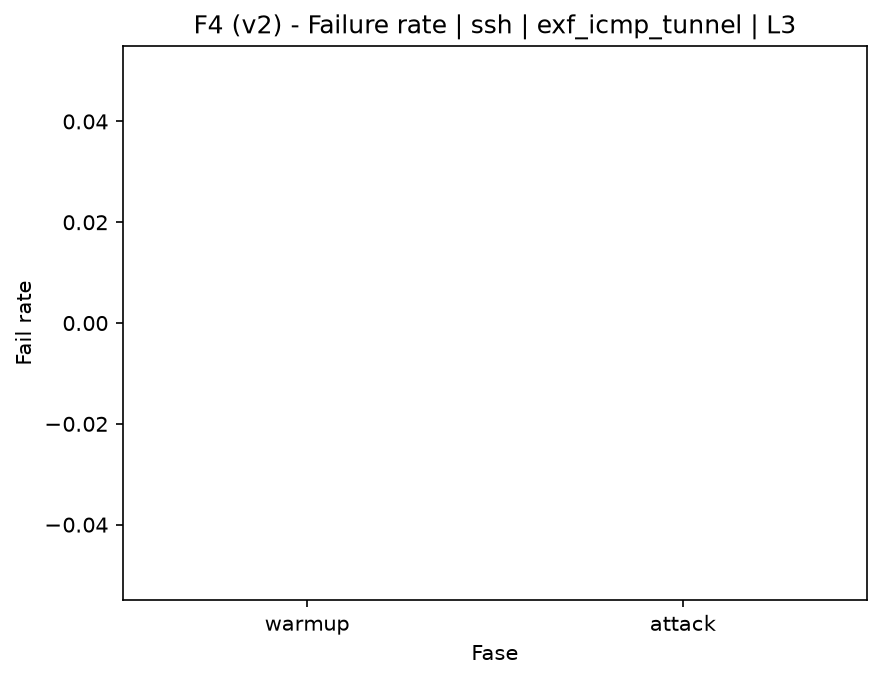

# ICMP Tunnel (`exf_icmp_tunnel`)

[Campaign index](README.md)

This document summarizes the published campaign execution of attack `exf_icmp_tunnel`. In the local catalog, the attack is described as: TCP port 22 (SSH) tunnel over ICMP (pings). The full execution artifacts are not versioned in this repository; retrieve them from the Figshare dataset linked in the campaign index or regenerate the figures with `run_claim_figures.sh`. The selected figures below are stored under `contrib/assets/campaign_doc`.

## Attack Metadata

| Field | Value |
| --- | --- |
| ID | `exf_icmp_tunnel` |
| Category | 5) Exfiltration and Tunneling |
| Subcategory | 5.1 Exfiltration and Tunneling |
| Target services | ssh-server |
| Image | `attack-icmp-tunnel:latest` |
| Container | `attack-icmp-tunnel` |
| Catalog max runtime | 10 s |
| Intensity parameters | n/a |
| MITRE ATT&CK | [https://attack.mitre.org/tactics/TA0011/](https://attack.mitre.org/tactics/TA0011/) [https://attack.mitre.org/techniques/T1090/](https://attack.mitre.org/techniques/T1090/) [https://attack.mitre.org/techniques/T1095/](https://attack.mitre.org/techniques/T1095/) [https://attack.mitre.org/techniques/T1572/](https://attack.mitre.org/techniques/T1572/) |

## Statistical Summary by Level

| Level | Service | Runs | Attack samples | Mean success | Mean failure | Lat p50/p95 ms | Total PCAP MB | Mean dataset (min-max) | Mean exec s | Extractors ok/total | Mean/max CPU | Mean mem MB |
| --- | --- | --- | --- | --- | --- | --- | --- | --- | --- | --- | --- | --- |
| L0 | ssh | 5 | 195 | 100% | 0% | 8,49 / 10,01 | 0,3 | 1.333 (1.314-1.342) | 42,06 | 3/3 | 1,96% / 2,22% | 10,77 |
| L1 | ssh | 5 | 195 | 100% | 0% | 8,45 / 11,26 | 4,29 | 6.680 (6.602-6.726) | 42,55 | 3/3 | 13,77% / 16,26% | 13,01 |
| L2 | ssh | 5 | 196 | 100% | 0% | 8,16 / 9,32 | 4,3 | 6.698 (6.658-6.720) | 42,53 | 3/3 | 13,15% / 15,01% | 13,23 |
| L3 | ssh | 5 | 196 | 100% | 0% | 8,19 / 10,11 | 4,31 | 6.701 (6.684-6.712) | 42,53 | 3/3 | 13,3% / 15,29% | 13,04 |

## Stability Across Reruns

| Level | Metric | Runs | Mean | Deviation | CV | Min | Max |
| --- | --- | --- | --- | --- | --- | --- | --- |
| L0 | Mean CPU in attack phase | 5 | 1,96 | 0,12 | 6,06% | 1,79 | 2,12 |
| L0 | Dataset rows | 5 | 1.332,8 | 10,92 | 0,82% | 1.314 | 1.342 |
| L0 | Execution time | 5 | 42,06 | 0,38 | 0,91% | 41,82 | 42,74 |
| L0 | Failure in attack phase | 5 | 0 | 0 | n/a | 0 | 0 |
| L0 | Censored p95 latency | 5 | 10,01 | 1,24 | 12,38% | 8,86 | 12,12 |
| L1 | Mean CPU in attack phase | 5 | 13,77 | 0,5 | 3,6% | 13,07 | 14,37 |
| L1 | Dataset rows | 5 | 6.680 | 48,12 | 0,72% | 6.602 | 6.726 |
| L1 | Execution time | 5 | 42,55 | 0,06 | 0,15% | 42,45 | 42,61 |
| L1 | Failure in attack phase | 5 | 0 | 0 | n/a | 0 | 0 |
| L1 | Censored p95 latency | 5 | 11,26 | 1,68 | 14,89% | 8,95 | 13,29 |
| L2 | Mean CPU in attack phase | 5 | 13,15 | 0,2 | 1,5% | 12,87 | 13,41 |
| L2 | Dataset rows | 5 | 6.698,4 | 23,93 | 0,36% | 6.658 | 6.720 |
| L2 | Execution time | 5 | 42,53 | 0,05 | 0,11% | 42,48 | 42,6 |
| L2 | Failure in attack phase | 5 | 0 | 0 | n/a | 0 | 0 |
| L2 | Censored p95 latency | 5 | 9,32 | 0,77 | 8,3% | 8,49 | 10,48 |
| L3 | Mean CPU in attack phase | 5 | 13,3 | 0,26 | 1,97% | 13 | 13,59 |
| L3 | Dataset rows | 5 | 6.701,2 | 11,8 | 0,18% | 6.684 | 6.712 |
| L3 | Execution time | 5 | 42,53 | 0,05 | 0,11% | 42,5 | 42,62 |
| L3 | Failure in attack phase | 5 | 0 | 0 | n/a | 0 | 0 |
| L3 | Censored p95 latency | 5 | 10,11 | 1,37 | 13,58% | 8,75 | 11,74 |

## Artifact Validation

| Level | Runs | Capture | Probe | Features | Dataset | Resources | Server stats | Acceptance |
| --- | --- | --- | --- | --- | --- | --- | --- | --- |
| L0 | 5 | 5/5 | 5/5 | 5/5 | 5/5 | 5/5 | 5/5 | 5/5 |
| L1 | 5 | 5/5 | 5/5 | 5/5 | 5/5 | 5/5 | 5/5 | 5/5 |
| L2 | 5 | 5/5 | 5/5 | 5/5 | 5/5 | 5/5 | 5/5 | 5/5 |
| L3 | 5 | 5/5 | 5/5 | 5/5 | 5/5 | 5/5 | 5/5 | 5/5 |

## Selected Figures

<table>
<tr>
<td> Time series L0 run01</td>
<td> Time series L1 run01</td>
</tr>
<tr>
<td> Time series L2 run01</td>
<td> Time series L3 run01</td>
</tr>
<tr>
<td> Resources L0 run01</td>
<td> Resources L3 run01</td>
</tr>
<tr>
<td> Failure rate L0</td>
<td> Failure rate L3</td>
</tr>
</table>

## Sources Used

- Attack catalog: `docker/attackers/icmp-tunnel/attack.yaml`
- Full campaign artifacts: available from the Figshare dataset linked in the campaign index; when extracted locally, expected under `experiments/60att_5runs_l0l1l2l3/exf_icmp_tunnel`.
