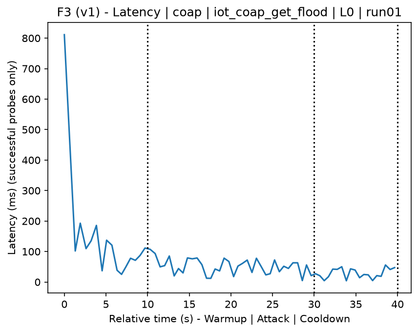
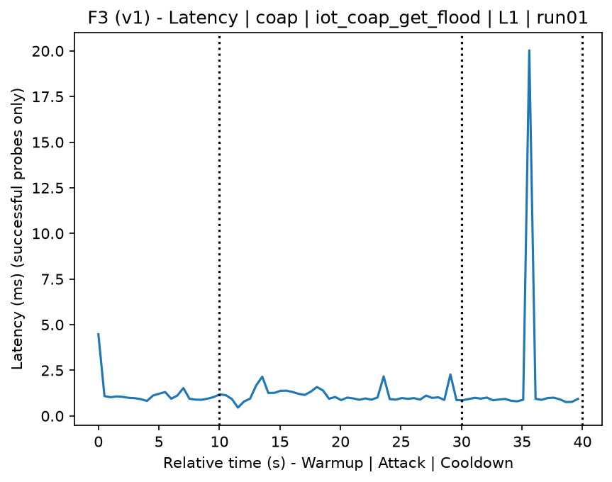
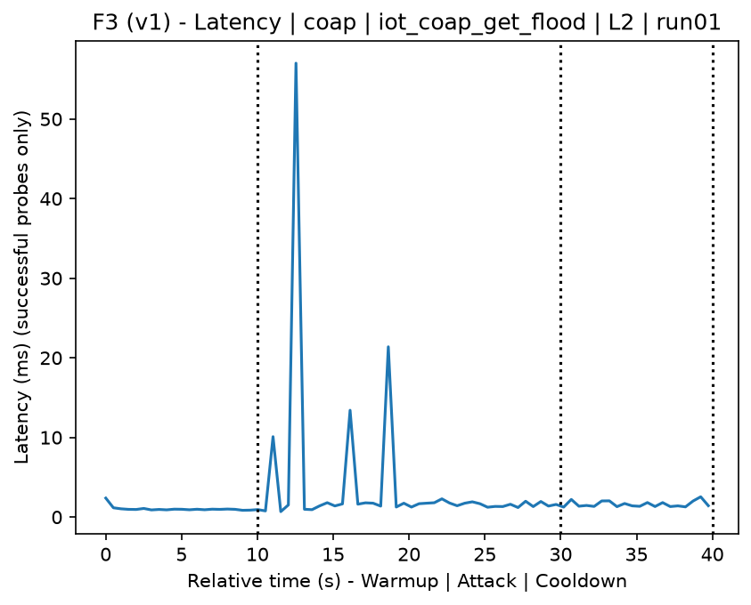
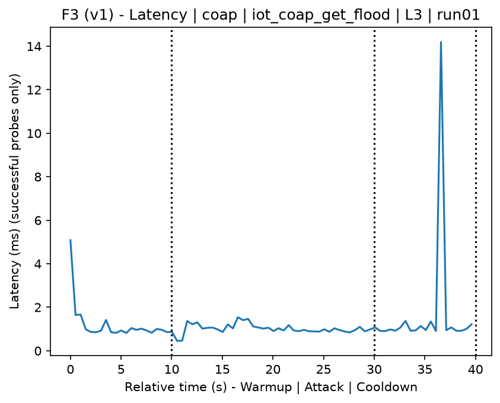
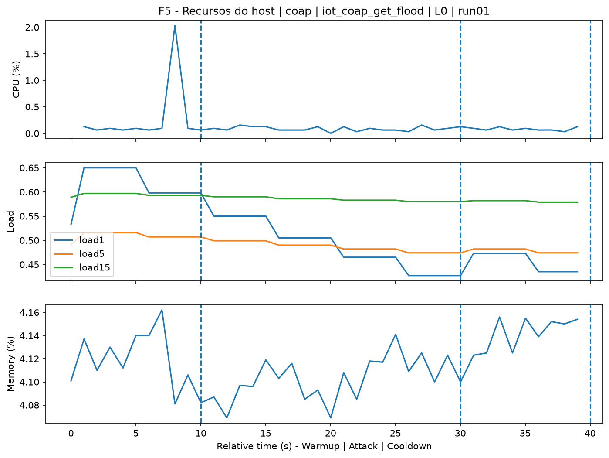
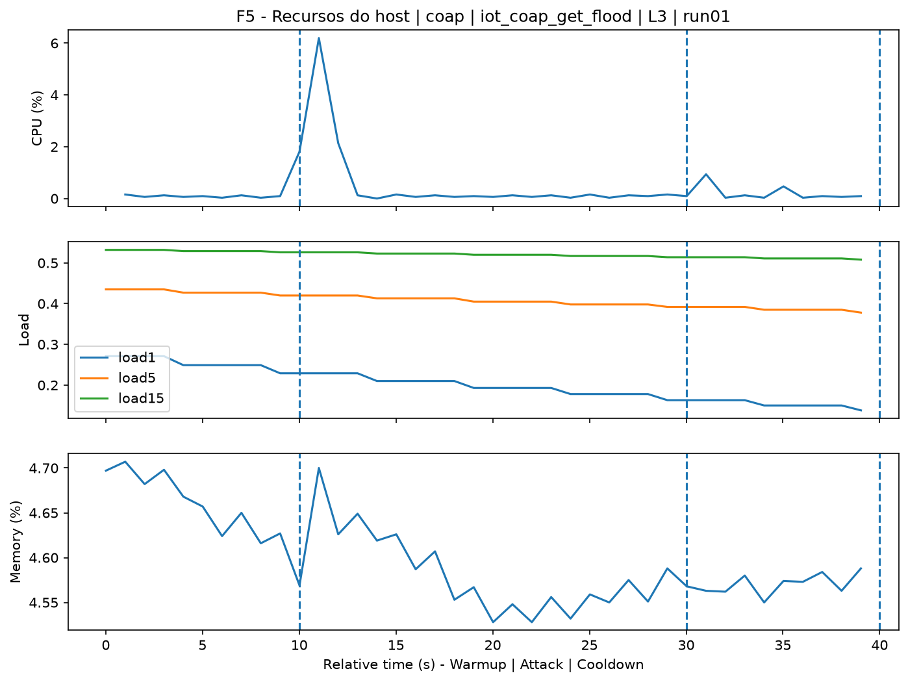
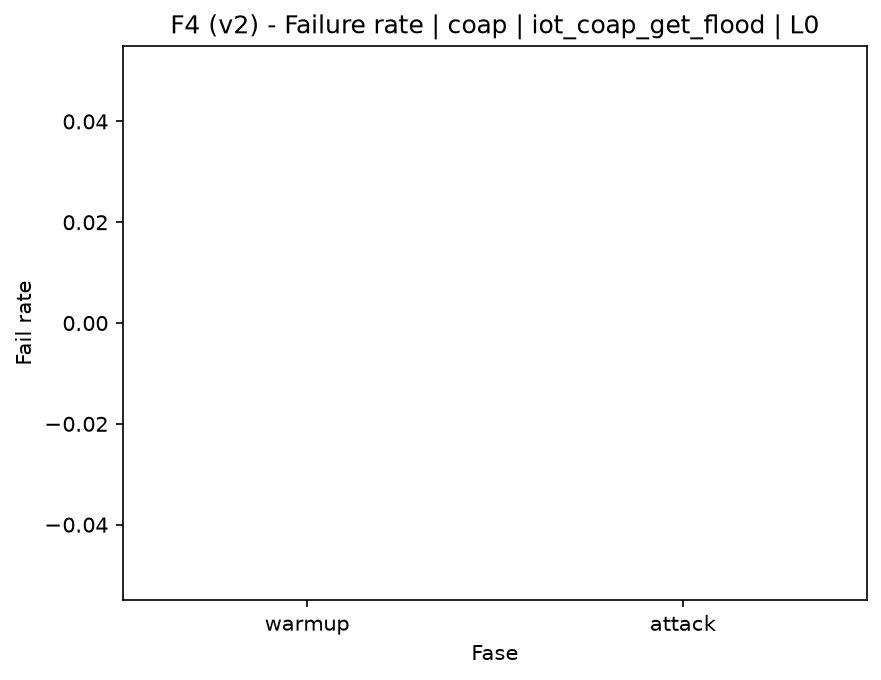
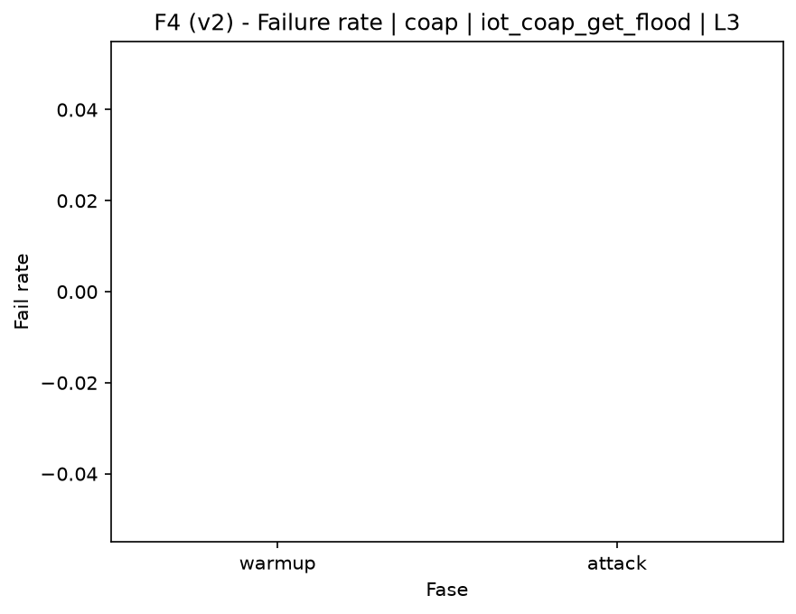

# CoAP GET Flood (`iot_coap_get_flood`)

[Índice da campanha](README.md)

Na campanha `experiments/60att_5runs_l0l1l2l3`, este documento consolida a execução do ataque `iot_coap_get_flood`. No catálogo local, o ataque é descrito como: Burst of CoAP GET requests against the target CoAP/IoT service to overload the application layer. A documentação abaixo usa apenas artefatos já presentes no repositório, principalmente as tabelas e figuras de `experiments/60att_5runs_l0l1l2l3/iot_coap_get_flood`.

## Metadados do ataque

| Campo | Valor |
| --- | --- |
| ID | `iot_coap_get_flood` |
| Categoria | 7) IoT |
| Subcategoria | 7.1 IoT Protocols / CoAP |
| Serviços alvo | coap-server |
| Imagem | `attack-coap-get-flood:latest` |
| Container | `attack-coap-get-flood` |
| Runtime máximo do catálogo | 10 s |
| Parâmetros de intensidade | duration_s, count, delay_ms |
| MITRE ATT&CK | [https://attack.mitre.org/tactics/TA0040/](https://attack.mitre.org/tactics/TA0040/) [https://attack.mitre.org/techniques/T1499/](https://attack.mitre.org/techniques/T1499/) [https://attack.mitre.org/techniques/T1499/002/](https://attack.mitre.org/techniques/T1499/002/) [https://attack.mitre.org/techniques/T1499/003/](https://attack.mitre.org/techniques/T1499/003/) |

## Resumo estatístico por nível

| Nível | Serviço | Runs | Amostras attack | Sucesso médio | Falha média | Lat p50/p95 ms | PCAP total MB | Dataset médio (min-max) | Exec média s | Extratores ok/total | CPU média/máx | Mem MB média |
| --- | --- | --- | --- | --- | --- | --- | --- | --- | --- | --- | --- | --- |
| L0 | coap | 5 | 194 | 100% | 0% | 13,96 / 32,24 | 0,21 | 925 (868-948) | 42 | 3/3 | 0,11% / 0,12% | 6,34 |
| L1 | coap | 5 | 200 | 100% | 0% | 0,99 / 6,05 | 4,97 | 24.948 (24.948-24.948) | 45,13 | 3/3 | 2,84% / 27,41% | 6,37 |
| L2 | coap | 5 | 200 | 100% | 0% | 1,2 / 12,18 | 4,97 | 24.948 (24.948-24.948) | 45,23 | 3/3 | 3,43% / 33,07% | 6,39 |
| L3 | coap | 5 | 200 | 100% | 0% | 1,15 / 1,62 | 4,97 | 24.948 (24.948-24.948) | 45,24 | 3/3 | 3,77% / 36,43% | 6,38 |

## Estabilidade entre reexecuções

| Nível | Métrica | Runs | Média | Desvio | CV | Min | Max |
| --- | --- | --- | --- | --- | --- | --- | --- |
| L0 | CPU média na fase attack | 5 | 0,11 | 0,01 | 4,72% | 0,11 | 0,12 |
| L0 | Linhas do dataset | 5 | 925,2 | 35,2 | 3,8% | 868 | 948 |
| L0 | Tempo de execução | 5 | 42 | 0,51 | 1,22% | 41,74 | 42,92 |
| L0 | Falha na fase attack | 5 | 0 | 0 | n/d | 0 | 0 |
| L0 | Latência p95 censurada | 5 | 32,24 | 36,31 | 112,61% | 1,42 | 87,31 |
| L1 | CPU média na fase attack | 5 | 2,84 | 1,59 | 55,92% | 0,11 | 3,99 |
| L1 | Linhas do dataset | 5 | 24.948 | 0 | 0% | 24.948 | 24.948 |
| L1 | Tempo de execução | 5 | 45,13 | 0,09 | 0,2% | 45,03 | 45,23 |
| L1 | Falha na fase attack | 5 | 0 | 0 | n/d | 0 | 0 |
| L1 | Latência p95 censurada | 5 | 6,05 | 10,15 | 167,89% | 1,08 | 24,2 |
| L2 | CPU média na fase attack | 5 | 3,43 | 0,38 | 11,14% | 2,97 | 3,78 |
| L2 | Linhas do dataset | 5 | 24.948 | 0 | 0% | 24.948 | 24.948 |
| L2 | Tempo de execução | 5 | 45,23 | 0,09 | 0,19% | 45,17 | 45,35 |
| L2 | Falha na fase attack | 5 | 0 | 0 | n/d | 0 | 0 |
| L2 | Latência p95 censurada | 5 | 12,18 | 17,68 | 145,11% | 1,26 | 42,34 |
| L3 | CPU média na fase attack | 5 | 3,77 | 0,33 | 8,82% | 3,28 | 4,13 |
| L3 | Linhas do dataset | 5 | 24.948 | 0 | 0% | 24.948 | 24.948 |
| L3 | Tempo de execução | 5 | 45,24 | 0,13 | 0,29% | 45,1 | 45,46 |
| L3 | Falha na fase attack | 5 | 0 | 0 | n/d | 0 | 0 |
| L3 | Latência p95 censurada | 5 | 1,62 | 0,45 | 27,48% | 1,23 | 2,15 |

## Validação de artefatos

| Nível | Runs | Captura | Probe | Features | Dataset | Recursos | Server stats | Aceite |
| --- | --- | --- | --- | --- | --- | --- | --- | --- |
| L0 | 5 | 5/5 | 5/5 | 5/5 | 5/5 | 5/5 | 5/5 | 5/5 |
| L1 | 5 | 5/5 | 5/5 | 5/5 | 5/5 | 5/5 | 5/5 | 5/5 |
| L2 | 5 | 5/5 | 5/5 | 5/5 | 5/5 | 5/5 | 5/5 | 5/5 |
| L3 | 5 | 5/5 | 5/5 | 5/5 | 5/5 | 5/5 | 5/5 | 5/5 |

## Figuras selecionadas

<table>
<tr>
<td> Série temporal L0 run01</td>
<td> Série temporal L1 run01</td>
</tr>
<tr>
<td> Série temporal L2 run01</td>
<td> Série temporal L3 run01</td>
</tr>
<tr>
<td> Recursos L0 run01</td>
<td> Recursos L3 run01</td>
</tr>
<tr>
<td> Taxa de falha L0</td>
<td> Taxa de falha L3</td>
</tr>
</table>

## Fontes utilizadas

- Catálogo do ataque: `docker/attackers/coap-get-flood/attack.yaml`
- Artefatos da campanha: `experiments/60att_5runs_l0l1l2l3/iot_coap_get_flood`
