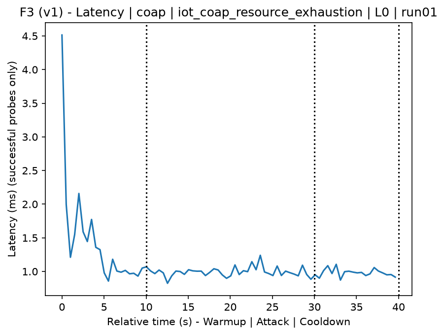
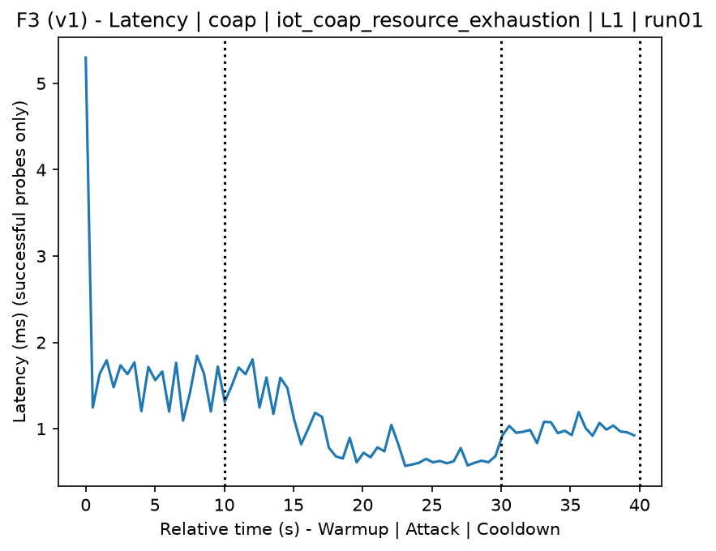
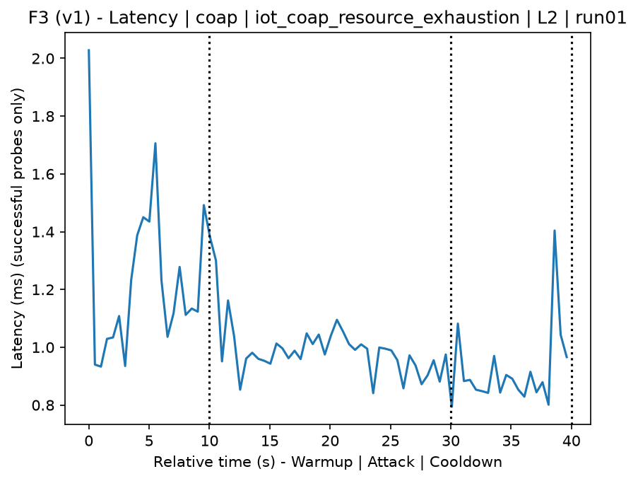
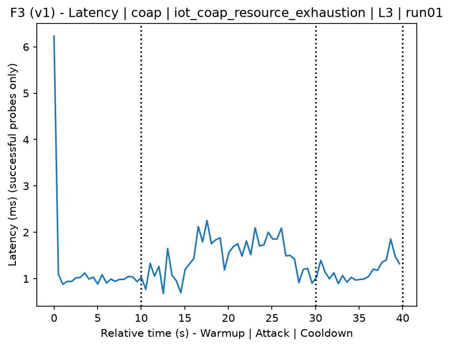
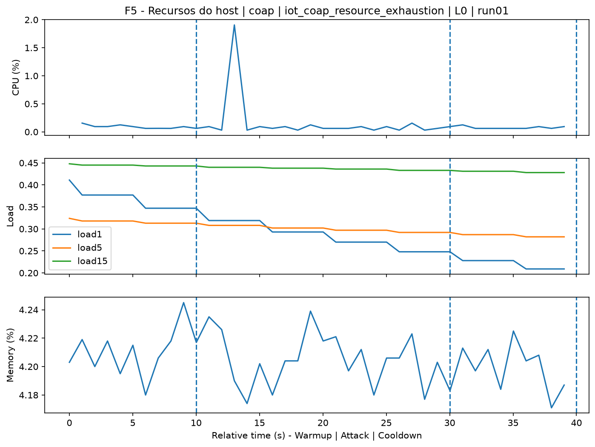
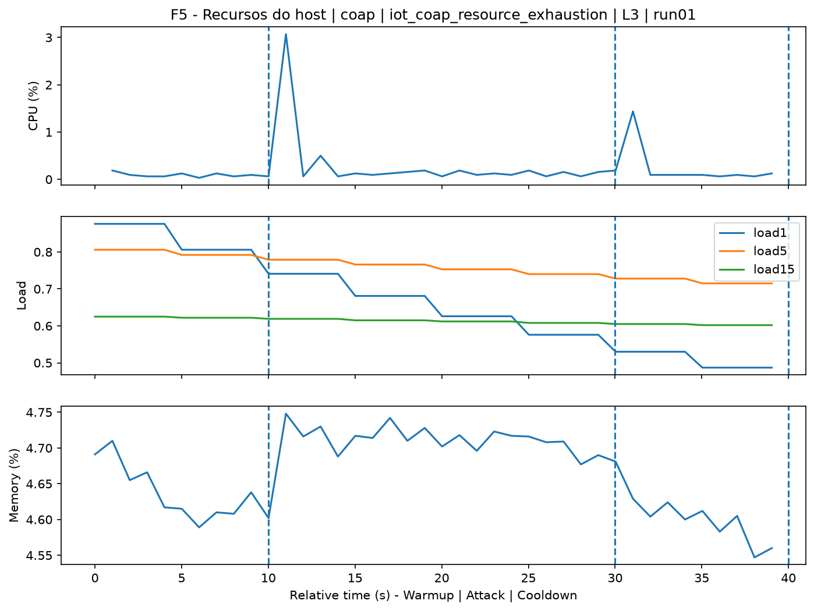
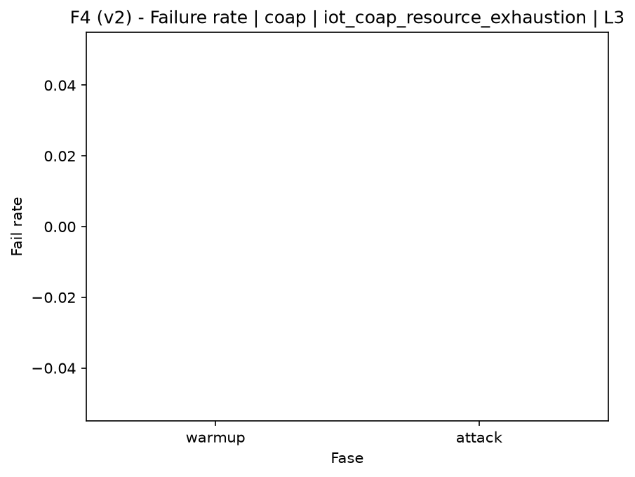

# CoAP Resource Discovery Exhaustion (`iot_coap_resource_exhaustion`)

[Campaign index](README.md)

This document summarizes the published campaign execution of attack `iot_coap_resource_exhaustion`. In the local catalog, the attack is described as: Burst of CoAP resource discovery/mapping messages, typically against /.well-known/core, intended to exhaust target resources. The full execution artifacts are not versioned in this repository; retrieve the generated dataset CSVs from the Figshare dataset linked in the campaign index. Raw PCAP captures are not included in that archive. The selected figures below are stored under `contrib/assets/campaign_doc`.

## Attack Metadata

| Field | Value |
| --- | --- |
| ID | `iot_coap_resource_exhaustion` |
| Category | 7) IoT |
| Subcategory | 7.1 IoT Protocols / CoAP |
| Target services | coap-server |
| Image | `attack-coap-resource-exhaustion:latest` |
| Container | `attack-coap-resource-exhaustion` |
| Catalog max runtime | 10 s |
| Intensity parameters | n/a |
| MITRE ATT&CK | [https://attack.mitre.org/tactics/TA0043/](https://attack.mitre.org/tactics/TA0043/) [https://attack.mitre.org/tactics/TA0040/](https://attack.mitre.org/tactics/TA0040/) [https://attack.mitre.org/techniques/T1595/](https://attack.mitre.org/techniques/T1595/) [https://attack.mitre.org/techniques/T1595/003/](https://attack.mitre.org/techniques/T1595/003/) [https://attack.mitre.org/techniques/T1499/](https://attack.mitre.org/techniques/T1499/) [https://attack.mitre.org/techniques/T1499/003/](https://attack.mitre.org/techniques/T1499/003/) |

## Statistical Summary by Level

| Level | Service | Runs | Attack samples | Mean success | Mean failure | Lat p50/p95 ms | Total PCAP MB | Mean dataset (min-max) | Mean exec s | Extractors ok/total | Mean/max CPU | Mean mem MB |
| --- | --- | --- | --- | --- | --- | --- | --- | --- | --- | --- | --- | --- |
| L0 | coap | 5 | 200 | 100% | 0% | 1,09 / 1,59 | 0,21 | 948 (948-948) | 42,04 | 3/3 | 0,12% / 0,17% | 6,34 |
| L1 | coap | 5 | 200 | 100% | 0% | 1,04 / 1,57 | 0,56 | 2.666 (2.628-2.676) | 42,09 | 3/3 | 0,43% / 1,89% | 6,37 |
| L2 | coap | 5 | 200 | 100% | 0% | 1,05 / 1,35 | 0,56 | 2.676 (2.676-2.676) | 42,04 | 3/3 | 0,45% / 2,26% | 6,38 |
| L3 | coap | 5 | 200 | 100% | 0% | 1,25 / 1,8 | 0,56 | 2.676 (2.676-2.676) | 42,19 | 3/3 | 0,49% / 2,29% | 6,36 |

## Stability Across Reruns

| Level | Metric | Runs | Mean | Deviation | CV | Min | Max |
| --- | --- | --- | --- | --- | --- | --- | --- |
| L0 | Mean CPU in attack phase | 5 | 0,12 | 0,01 | 9,76% | 0,11 | 0,14 |
| L0 | Dataset rows | 5 | 948 | 0 | 0% | 948 | 948 |
| L0 | Execution time | 5 | 42,04 | 0,26 | 0,63% | 41,9 | 42,51 |
| L0 | Failure in attack phase | 5 | 0 | 0 | n/a | 0 | 0 |
| L0 | Censored p95 latency | 5 | 1,59 | 0,31 | 19,68% | 1,1 | 1,96 |
| L1 | Mean CPU in attack phase | 5 | 0,43 | 0,12 | 28,58% | 0,23 | 0,54 |
| L1 | Dataset rows | 5 | 2.666,4 | 21,47 | 0,81% | 2.628 | 2.676 |
| L1 | Execution time | 5 | 42,09 | 0,06 | 0,14% | 42,05 | 42,19 |
| L1 | Failure in attack phase | 5 | 0 | 0 | n/a | 0 | 0 |
| L1 | Censored p95 latency | 5 | 1,57 | 0,44 | 28,21% | 1,09 | 2,02 |
| L2 | Mean CPU in attack phase | 5 | 0,45 | 0,04 | 8,69% | 0,41 | 0,51 |
| L2 | Dataset rows | 5 | 2.676 | 0 | 0% | 2.676 | 2.676 |
| L2 | Execution time | 5 | 42,04 | 0,05 | 0,12% | 41,98 | 42,11 |
| L2 | Failure in attack phase | 5 | 0 | 0 | n/a | 0 | 0 |
| L2 | Censored p95 latency | 5 | 1,35 | 0,36 | 26,44% | 1,13 | 1,97 |
| L3 | Mean CPU in attack phase | 5 | 0,49 | 0,03 | 5,98% | 0,45 | 0,52 |
| L3 | Dataset rows | 5 | 2.676 | 0 | 0% | 2.676 | 2.676 |
| L3 | Execution time | 5 | 42,19 | 0,1 | 0,24% | 42,06 | 42,33 |
| L3 | Failure in attack phase | 5 | 0 | 0 | n/a | 0 | 0 |
| L3 | Censored p95 latency | 5 | 1,8 | 0,29 | 16,33% | 1,31 | 2,1 |

## Artifact Validation

| Level | Runs | Capture | Probe | Features | Dataset | Resources | Server stats | Acceptance |
| --- | --- | --- | --- | --- | --- | --- | --- | --- |
| L0 | 5 | 5/5 | 5/5 | 5/5 | 5/5 | 5/5 | 5/5 | 5/5 |
| L1 | 5 | 5/5 | 5/5 | 5/5 | 5/5 | 5/5 | 5/5 | 5/5 |
| L2 | 5 | 5/5 | 5/5 | 5/5 | 5/5 | 5/5 | 5/5 | 5/5 |
| L3 | 5 | 5/5 | 5/5 | 5/5 | 5/5 | 5/5 | 5/5 | 5/5 |

## Selected Figures

<table>
<tr>
<td> Time series L0 run01</td>
<td> Time series L1 run01</td>
</tr>
<tr>
<td> Time series L2 run01</td>
<td> Time series L3 run01</td>
</tr>
<tr>
<td> Resources L0 run01</td>
<td> Resources L3 run01</td>
</tr>
<tr>
<td> Failure rate L0</td>
<td> Failure rate L3</td>
</tr>
</table>

## Sources Used

- Attack catalog: `docker/attackers/coap-resource-exhaustion/attack.yaml`
- Full campaign artifacts: available from the Figshare dataset linked in the campaign index; when extracted locally, expected under `experiments/all_5runs_4levels/iot_coap_resource_exhaustion`.
