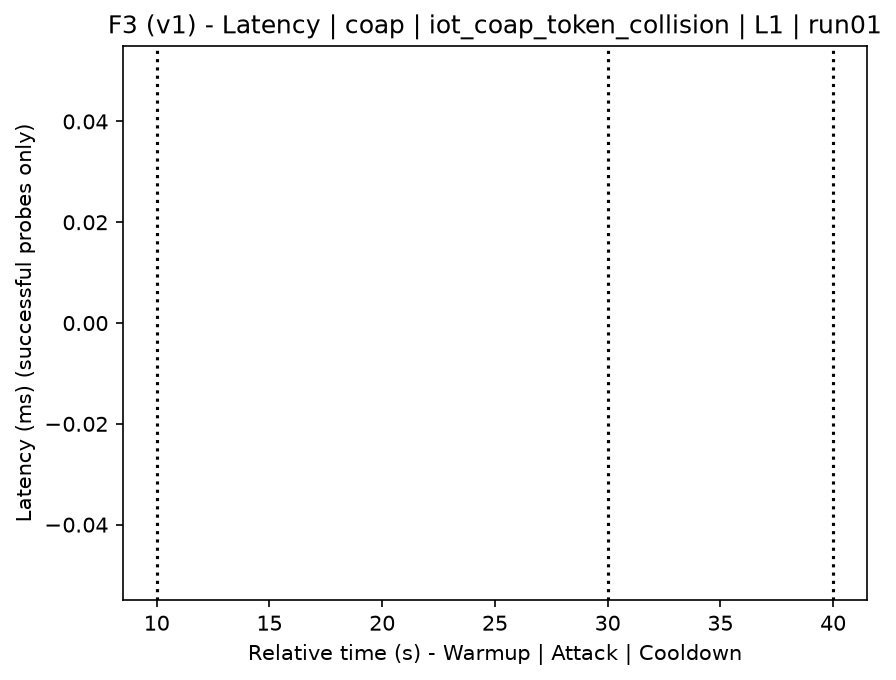
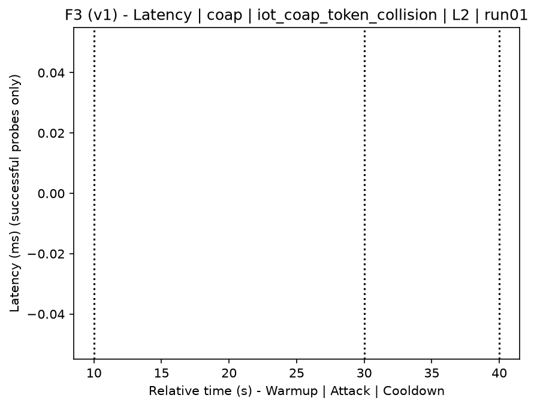
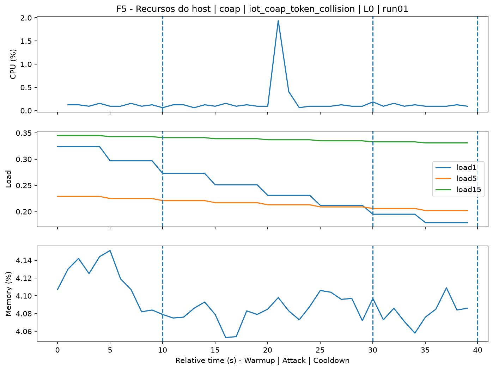
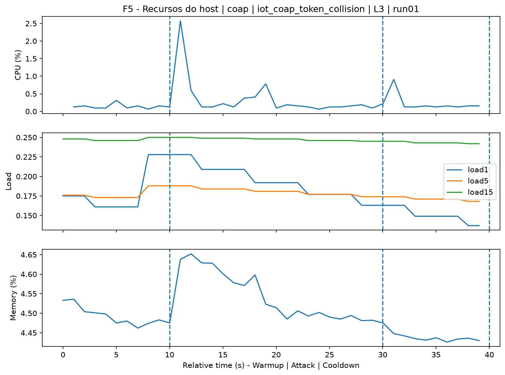
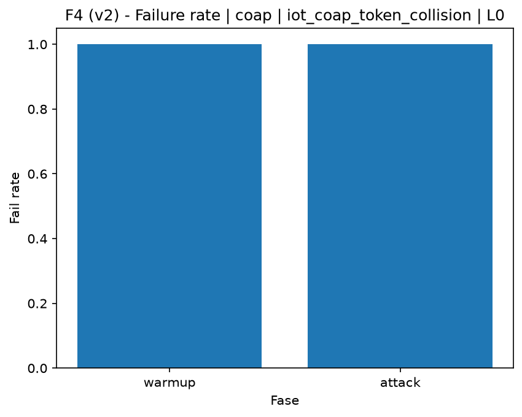
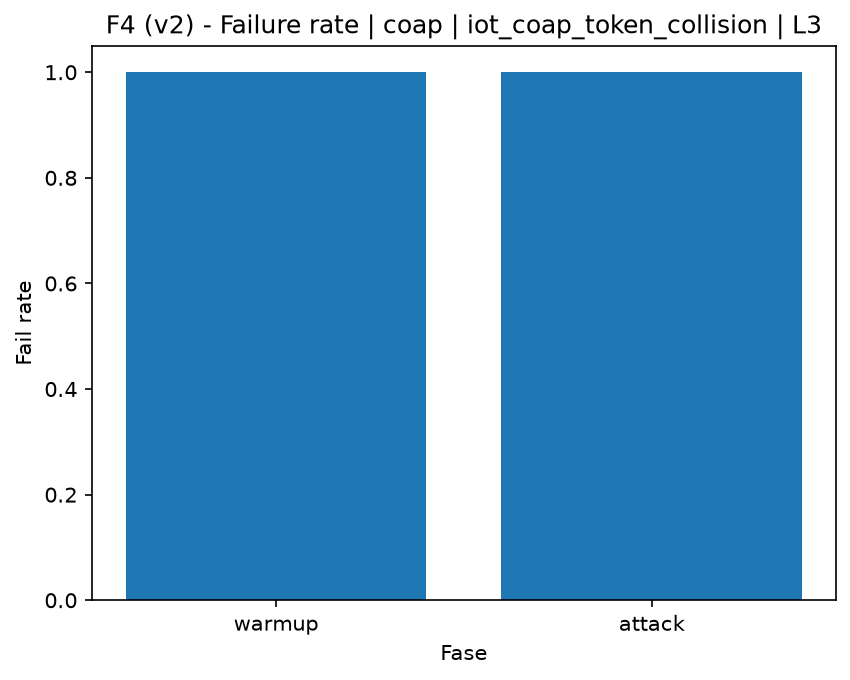

# CoAP Token Collision (`iot_coap_token_collision`)

[Campaign index](README.md)

This document summarizes the published campaign execution of attack `iot_coap_token_collision`. In the local catalog, the attack is described as: Burst of CoAP messages that forces token reuse or collisions to degrade target state tracking and transaction correlation. The full execution artifacts are not versioned in this repository; retrieve them from the Figshare dataset linked in the campaign index or regenerate the figures with `run_claim_figures.sh`. The selected figures below are stored under `contrib/assets/campaign_doc`.

## Attack Metadata

| Field | Value |
| --- | --- |
| ID | `iot_coap_token_collision` |
| Category | 7) IoT |
| Subcategory | 7.1 IoT Protocols / CoAP |
| Target services | coap-server |
| Image | `attack-coap-token-collision:latest` |
| Container | `attack-coap-token-collision` |
| Catalog max runtime | 10 s |
| Intensity parameters | n/a |
| MITRE ATT&CK | [https://attack.mitre.org/tactics/TA0040/](https://attack.mitre.org/tactics/TA0040/) [https://attack.mitre.org/techniques/T1499/](https://attack.mitre.org/techniques/T1499/) [https://attack.mitre.org/techniques/T1499/003/](https://attack.mitre.org/techniques/T1499/003/) [https://attack.mitre.org/techniques/T1565/](https://attack.mitre.org/techniques/T1565/) [https://attack.mitre.org/techniques/T1565/002/](https://attack.mitre.org/techniques/T1565/002/) |

## Statistical Summary by Level

| Level | Service | Runs | Attack samples | Mean success | Mean failure | Lat p50/p95 ms | Total PCAP MB | Mean dataset (min-max) | Mean exec s | Extractors ok/total | Mean/max CPU | Mean mem MB |
| --- | --- | --- | --- | --- | --- | --- | --- | --- | --- | --- | --- | --- |
| L0 | coap | 5 | 200 | 0% | 100% | 2.000 / 2.000 | 0,03 | 158 (158-158) | 42,19 | 3/3 | 0,15% / 0,89% | 1.383,55 |
| L1 | coap | 5 | 200 | 0% | 100% | 2.000 / 2.000 | 0,19 | 970 (970-970) | 42,03 | 3/3 | 0,39% / 2,93% | 1.447,16 |
| L2 | coap | 5 | 200 | 0% | 100% | 2.000 / 2.000 | 0,19 | 970 (970-970) | 42,23 | 3/3 | 0,4% / 2,81% | 1.454,97 |
| L3 | coap | 5 | 200 | 0% | 100% | 2.000 / 2.000 | 0,19 | 970 (970-970) | 42,09 | 3/3 | 0,4% / 2,75% | 1.453,34 |

## Stability Across Reruns

| Level | Metric | Runs | Mean | Deviation | CV | Min | Max |
| --- | --- | --- | --- | --- | --- | --- | --- |
| L0 | Mean CPU in attack phase | 5 | 0,15 | 0,05 | 33,99% | 0,11 | 0,21 |
| L0 | Dataset rows | 5 | 158 | 0 | 0% | 158 | 158 |
| L0 | Execution time | 5 | 42,19 | 0,44 | 1,04% | 41,93 | 42,97 |
| L0 | Failure in attack phase | 5 | 100 | 0 | 0% | 100 | 100 |
| L0 | Censored p95 latency | 5 | 2.000 | 0 | 0% | 2.000 | 2.000 |
| L1 | Mean CPU in attack phase | 5 | 0,39 | 0,05 | 11,93% | 0,34 | 0,44 |
| L1 | Dataset rows | 5 | 970 | 0 | 0% | 970 | 970 |
| L1 | Execution time | 5 | 42,03 | 0,31 | 0,75% | 41,48 | 42,23 |
| L1 | Failure in attack phase | 5 | 100 | 0 | 0% | 100 | 100 |
| L1 | Censored p95 latency | 5 | 2.000 | 0 | 0% | 2.000 | 2.000 |
| L2 | Mean CPU in attack phase | 5 | 0,4 | 0,06 | 14,85% | 0,34 | 0,47 |
| L2 | Dataset rows | 5 | 970 | 0 | 0% | 970 | 970 |
| L2 | Execution time | 5 | 42,23 | 0,04 | 0,1% | 42,19 | 42,28 |
| L2 | Failure in attack phase | 5 | 100 | 0 | 0% | 100 | 100 |
| L2 | Censored p95 latency | 5 | 2.000 | 0 | 0% | 2.000 | 2.000 |
| L3 | Mean CPU in attack phase | 5 | 0,4 | 0,07 | 18,17% | 0,33 | 0,48 |
| L3 | Dataset rows | 5 | 970 | 0 | 0% | 970 | 970 |
| L3 | Execution time | 5 | 42,09 | 0,38 | 0,9% | 41,42 | 42,37 |
| L3 | Failure in attack phase | 5 | 100 | 0 | 0% | 100 | 100 |
| L3 | Censored p95 latency | 5 | 2.000 | 0 | 0% | 2.000 | 2.000 |

## Artifact Validation

| Level | Runs | Capture | Probe | Features | Dataset | Resources | Server stats | Acceptance |
| --- | --- | --- | --- | --- | --- | --- | --- | --- |
| L0 | 5 | 5/5 | 5/5 | 5/5 | 5/5 | 5/5 | 5/5 | 5/5 |
| L1 | 5 | 5/5 | 5/5 | 5/5 | 5/5 | 5/5 | 5/5 | 5/5 |
| L2 | 5 | 5/5 | 5/5 | 5/5 | 5/5 | 5/5 | 5/5 | 5/5 |
| L3 | 5 | 5/5 | 5/5 | 5/5 | 5/5 | 5/5 | 5/5 | 5/5 |

## Selected Figures

<table>
<tr>
<td> Time series L0 run01</td>
<td> Time series L1 run01</td>
</tr>
<tr>
<td> Time series L2 run01</td>
<td> Time series L3 run01</td>
</tr>
<tr>
<td> Resources L0 run01</td>
<td> Resources L3 run01</td>
</tr>
<tr>
<td> Failure rate L0</td>
<td> Failure rate L3</td>
</tr>
</table>

## Sources Used

- Attack catalog: `docker/attackers/coap-token-collision/attack.yaml`
- Full campaign artifacts: available from the Figshare dataset linked in the campaign index; when extracted locally, expected under `experiments/60att_5runs_l0l1l2l3/iot_coap_token_collision`.
