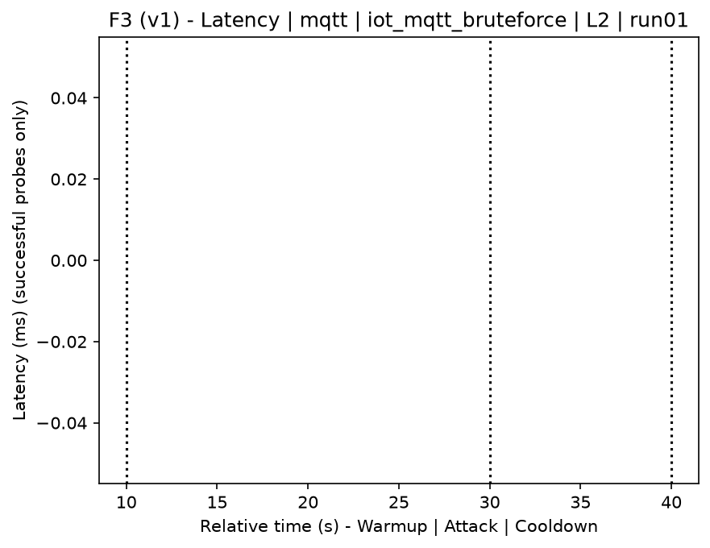
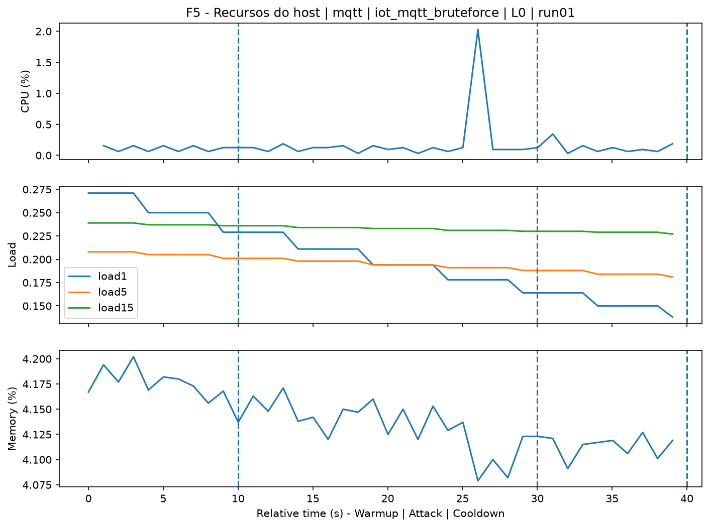
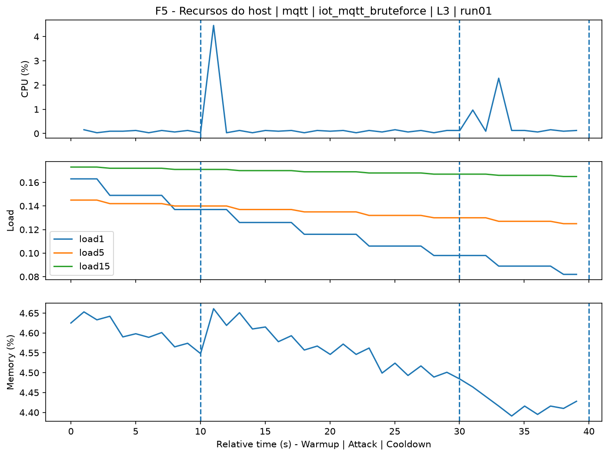
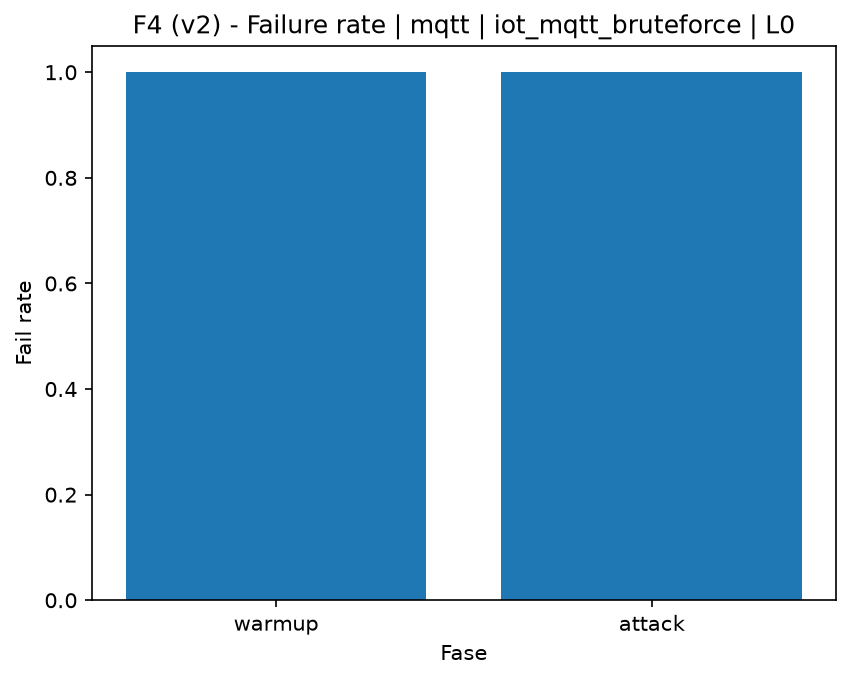

# MQTT Bruteforce (`iot_mqtt_bruteforce`)

[Campaign index](README.md)

This document summarizes the published campaign execution of attack `iot_mqtt_bruteforce`. In the local catalog, the attack is described as: MQTT authentication brute force against the target broker using a controlled wordlist. The full execution artifacts are not versioned in this repository; retrieve the generated dataset CSVs from the Figshare dataset linked in the campaign index. Raw PCAP captures are not included in that archive. The selected figures below are stored under `contrib/assets/campaign_doc`.

## Attack Metadata

| Field | Value |
| --- | --- |
| ID | `iot_mqtt_bruteforce` |
| Category | 7) IoT |
| Subcategory | 7.1 IoT Protocols / MQTT |
| Target services | mqtt-broker |
| Image | `attack-mqtt-bruteforce:latest` |
| Container | `attack-mqtt-bruteforce` |
| Catalog max runtime | 10 s |
| Intensity parameters | n/a |
| MITRE ATT&CK | [https://attack.mitre.org/tactics/TA0006/](https://attack.mitre.org/tactics/TA0006/) [https://attack.mitre.org/techniques/T1110/](https://attack.mitre.org/techniques/T1110/) [https://attack.mitre.org/techniques/T1110/001/](https://attack.mitre.org/techniques/T1110/001/) |

## Statistical Summary by Level

| Level | Service | Runs | Attack samples | Mean success | Mean failure | Lat p50/p95 ms | Total PCAP MB | Mean dataset (min-max) | Mean exec s | Extractors ok/total | Mean/max CPU | Mean mem MB |
| --- | --- | --- | --- | --- | --- | --- | --- | --- | --- | --- | --- | --- |
| L0 | mqtt | 5 | 200 | 0% | 100% | 2.000 / 2.000 | 1,05 | 4.770 (4.768-4.772) | 42,67 | 3/3 | 0,1% / 0,12% | 1,66 |
| L1 | mqtt | 5 | 200 | 0% | 100% | 2.000 / 2.000 | 4,41 | 19.897 (19.892-19.904) | 44,35 | 3/3 | 0,41% / 3,09% | 5,08 |
| L2 | mqtt | 5 | 200 | 0% | 100% | 2.000 / 2.000 | 4,4 | 19.888 (19.874-19.908) | 44,21 | 3/3 | 0,36% / 2,88% | 5,17 |
| L3 | mqtt | 5 | 200 | 0% | 100% | 2.000 / 2.000 | 4,41 | 19.895 (19.890-19.904) | 44,28 | 3/3 | 0,45% / 3,71% | 5,18 |

## Stability Across Reruns

| Level | Metric | Runs | Mean | Deviation | CV | Min | Max |
| --- | --- | --- | --- | --- | --- | --- | --- |
| L0 | Mean CPU in attack phase | 5 | 0,1 | 0,01 | 5,58% | 0,09 | 0,11 |
| L0 | Dataset rows | 5 | 4.770,4 | 1,67 | 0,04% | 4.768 | 4.772 |
| L0 | Execution time | 5 | 42,67 | 0,58 | 1,35% | 42,36 | 43,7 |
| L0 | Failure in attack phase | 5 | 100 | 0 | 0% | 100 | 100 |
| L0 | Censored p95 latency | 5 | 2.000 | 0 | 0% | 2.000 | 2.000 |
| L1 | Mean CPU in attack phase | 5 | 0,41 | 0,16 | 38,38% | 0,15 | 0,53 |
| L1 | Dataset rows | 5 | 19.896,8 | 5,22 | 0,03% | 19.892 | 19.904 |
| L1 | Execution time | 5 | 44,35 | 0,13 | 0,29% | 44,17 | 44,49 |
| L1 | Failure in attack phase | 5 | 100 | 0 | 0% | 100 | 100 |
| L1 | Censored p95 latency | 5 | 2.000 | 0 | 0% | 2.000 | 2.000 |
| L2 | Mean CPU in attack phase | 5 | 0,36 | 0,12 | 34,68% | 0,14 | 0,42 |
| L2 | Dataset rows | 5 | 19.887,6 | 14,79 | 0,07% | 19.874 | 19.908 |
| L2 | Execution time | 5 | 44,21 | 0,07 | 0,15% | 44,12 | 44,29 |
| L2 | Failure in attack phase | 5 | 100 | 0 | 0% | 100 | 100 |
| L2 | Censored p95 latency | 5 | 2.000 | 0 | 0% | 2.000 | 2.000 |
| L3 | Mean CPU in attack phase | 5 | 0,45 | 0,02 | 4,75% | 0,43 | 0,48 |
| L3 | Dataset rows | 5 | 19.895,2 | 5,76 | 0,03% | 19.890 | 19.904 |
| L3 | Execution time | 5 | 44,28 | 0,04 | 0,09% | 44,23 | 44,32 |
| L3 | Failure in attack phase | 5 | 100 | 0 | 0% | 100 | 100 |
| L3 | Censored p95 latency | 5 | 2.000 | 0 | 0% | 2.000 | 2.000 |

## Artifact Validation

| Level | Runs | Capture | Probe | Features | Dataset | Resources | Server stats | Acceptance |
| --- | --- | --- | --- | --- | --- | --- | --- | --- |
| L0 | 5 | 5/5 | 5/5 | 5/5 | 5/5 | 5/5 | 5/5 | 5/5 |
| L1 | 5 | 5/5 | 5/5 | 5/5 | 5/5 | 5/5 | 5/5 | 5/5 |
| L2 | 5 | 5/5 | 5/5 | 5/5 | 5/5 | 5/5 | 5/5 | 5/5 |
| L3 | 5 | 5/5 | 5/5 | 5/5 | 5/5 | 5/5 | 5/5 | 5/5 |

## Selected Figures

<table>
<tr>
<td> Time series L0 run01</td>
<td> Time series L1 run01</td>
</tr>
<tr>
<td> Time series L2 run01</td>
<td> Time series L3 run01</td>
</tr>
<tr>
<td> Resources L0 run01</td>
<td> Resources L3 run01</td>
</tr>
<tr>
<td> Failure rate L0</td>
<td> Failure rate L3</td>
</tr>
</table>

## Sources Used

- Attack catalog: `docker/attackers/mqtt-bruteforce/attack.yaml`
- Full campaign artifacts: available from the Figshare dataset linked in the campaign index; when extracted locally, expected under `experiments/all_5runs_4levels/iot_mqtt_bruteforce`.
