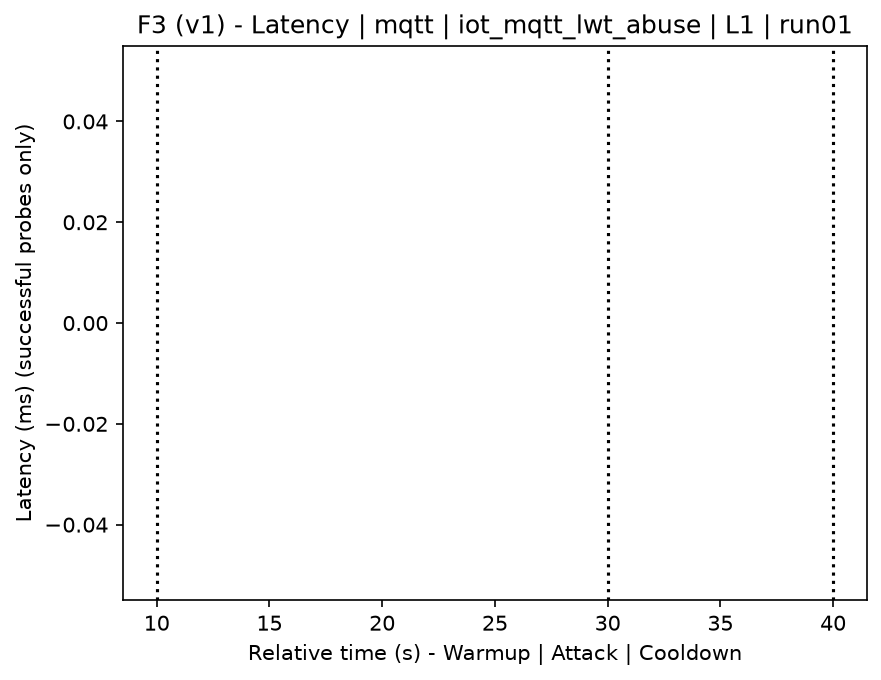
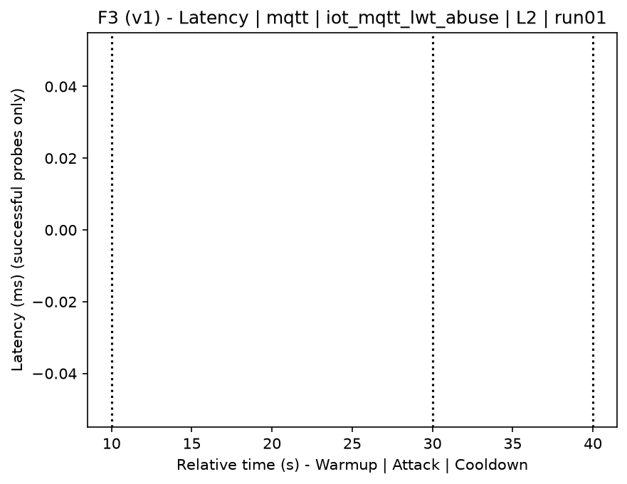
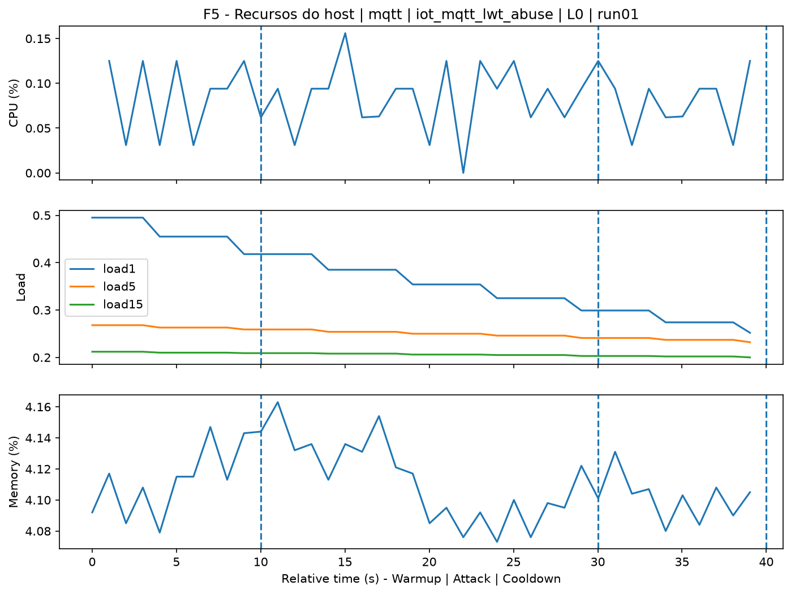
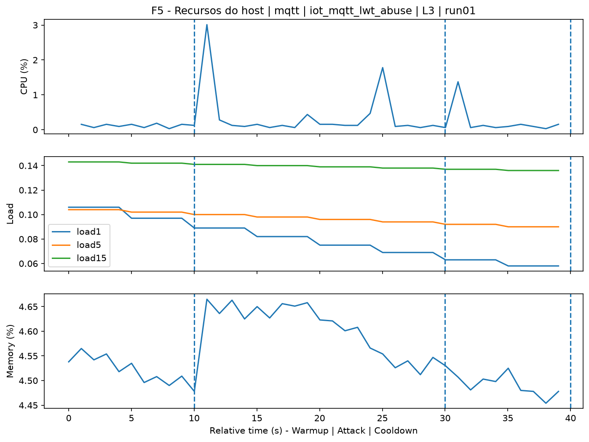
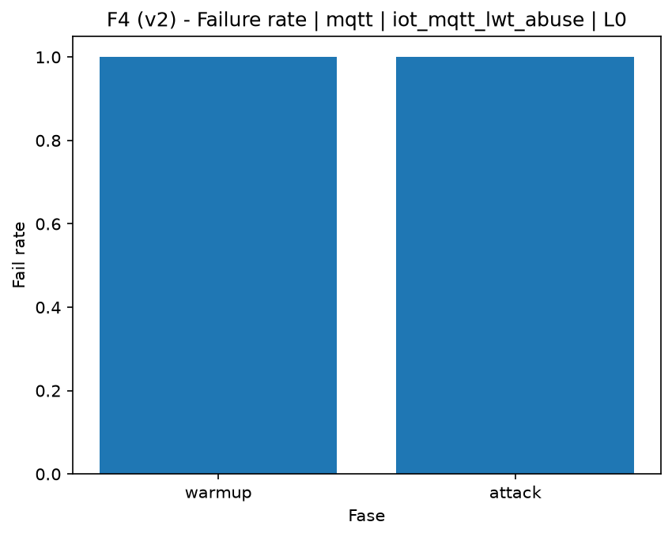

# MQTT LWT Abuse (`iot_mqtt_lwt_abuse`)

[Campaign index](README.md)

In campaign `experiments/60att_5runs_l0l1l2l3`, this document consolidates the execution of attack `iot_mqtt_lwt_abuse`. In the local catalog, the attack is described as: Abuse of the MQTT Last Will and Testament mechanism to force critical publications or false alarms on sensitive topics. The documentation below uses only artifacts already present in the repository, mainly the tables and figures from `experiments/60att_5runs_l0l1l2l3/iot_mqtt_lwt_abuse`.

## Attack Metadata

| Field | Value |
| --- | --- |
| ID | `iot_mqtt_lwt_abuse` |
| Category | 7) IoT |
| Subcategory | 7.1 IoT Protocols / MQTT |
| Target services | mqtt-broker |
| Image | `attack-mqtt-lwt-abuse:latest` |
| Container | `attack-mqtt-lwt-abuse` |
| Catalog max runtime | 10 s |
| Intensity parameters | count, delay_ms |
| MITRE ATT&CK | [https://attack.mitre.org/tactics/TA0040/](https://attack.mitre.org/tactics/TA0040/) [https://attack.mitre.org/techniques/T1565/](https://attack.mitre.org/techniques/T1565/) [https://attack.mitre.org/techniques/T1565/001/](https://attack.mitre.org/techniques/T1565/001/) [https://attack.mitre.org/techniques/T1565/002/](https://attack.mitre.org/techniques/T1565/002/) |

## Statistical Summary by Level

| Level | Service | Runs | Attack samples | Mean success | Mean failure | Lat p50/p95 ms | Total PCAP MB | Mean dataset (min-max) | Mean exec s | Extractors ok/total | Mean/max CPU | Mean mem MB |
| --- | --- | --- | --- | --- | --- | --- | --- | --- | --- | --- | --- | --- |
| L0 | mqtt | 5 | 200 | 0% | 100% | 2.000 / 2.000 | 1,05 | 4.768 (4.760-4.778) | 42,48 | 3/3 | 0,08% / 0,09% | 5,18 |
| L1 | mqtt | 5 | 200 | 0% | 100% | 2.000 / 2.000 | 1,57 | 6.938 (6.890-6.974) | 42,61 | 3/3 | 0,13% / 0,19% | 5,2 |
| L2 | mqtt | 5 | 200 | 0% | 100% | 2.000 / 2.000 | 1,57 | 6.951 (6.944-6.968) | 42,68 | 3/3 | 0,14% / 0,21% | 5,2 |
| L3 | mqtt | 5 | 200 | 0% | 100% | 2.000 / 2.000 | 1,57 | 6.942 (6.930-6.954) | 42,65 | 3/3 | 0,13% / 0,16% | 5,2 |

## Stability Across Reruns

| Level | Metric | Runs | Mean | Deviation | CV | Min | Max |
| --- | --- | --- | --- | --- | --- | --- | --- |
| L0 | Mean CPU in attack phase | 5 | 0,08 | 0 | 5,08% | 0,07 | 0,08 |
| L0 | Dataset rows | 5 | 4.768,4 | 6,99 | 0,15% | 4.760 | 4.778 |
| L0 | Execution time | 5 | 42,48 | 0,35 | 0,83% | 42,25 | 43,1 |
| L0 | Failure in attack phase | 5 | 100 | 0 | 0% | 100 | 100 |
| L0 | Censored p95 latency | 5 | 2.000 | 0 | 0% | 2.000 | 2.000 |
| L1 | Mean CPU in attack phase | 5 | 0,13 | 0,02 | 17,34% | 0,11 | 0,16 |
| L1 | Dataset rows | 5 | 6.938 | 30,89 | 0,45% | 6.890 | 6.974 |
| L1 | Execution time | 5 | 42,61 | 0,07 | 0,17% | 42,51 | 42,72 |
| L1 | Failure in attack phase | 5 | 100 | 0 | 0% | 100 | 100 |
| L1 | Censored p95 latency | 5 | 2.000 | 0 | 0% | 2.000 | 2.000 |
| L2 | Mean CPU in attack phase | 5 | 0,14 | 0,02 | 15,26% | 0,12 | 0,17 |
| L2 | Dataset rows | 5 | 6.951,2 | 10,26 | 0,15% | 6.944 | 6.968 |
| L2 | Execution time | 5 | 42,68 | 0,07 | 0,15% | 42,57 | 42,74 |
| L2 | Failure in attack phase | 5 | 100 | 0 | 0% | 100 | 100 |
| L2 | Censored p95 latency | 5 | 2.000 | 0 | 0% | 2.000 | 2.000 |
| L3 | Mean CPU in attack phase | 5 | 0,13 | 0,02 | 15,48% | 0,11 | 0,16 |
| L3 | Dataset rows | 5 | 6.942,4 | 10,24 | 0,15% | 6.930 | 6.954 |
| L3 | Execution time | 5 | 42,65 | 0,12 | 0,27% | 42,49 | 42,8 |
| L3 | Failure in attack phase | 5 | 100 | 0 | 0% | 100 | 100 |
| L3 | Censored p95 latency | 5 | 2.000 | 0 | 0% | 2.000 | 2.000 |

## Artifact Validation

| Level | Runs | Capture | Probe | Features | Dataset | Resources | Server stats | Acceptance |
| --- | --- | --- | --- | --- | --- | --- | --- | --- |
| L0 | 5 | 5/5 | 5/5 | 5/5 | 5/5 | 5/5 | 5/5 | 5/5 |
| L1 | 5 | 5/5 | 5/5 | 5/5 | 5/5 | 5/5 | 5/5 | 5/5 |
| L2 | 5 | 5/5 | 5/5 | 5/5 | 5/5 | 5/5 | 5/5 | 5/5 |
| L3 | 5 | 5/5 | 5/5 | 5/5 | 5/5 | 5/5 | 5/5 | 5/5 |

## Selected Figures

<table>
<tr>
<td> Time series L0 run01</td>
<td> Time series L1 run01</td>
</tr>
<tr>
<td> Time series L2 run01</td>
<td> Time series L3 run01</td>
</tr>
<tr>
<td> Resources L0 run01</td>
<td> Resources L3 run01</td>
</tr>
<tr>
<td> Failure rate L0</td>
<td> Failure rate L3</td>
</tr>
</table>

## Sources Used

- Attack catalog: `docker/attackers/mqtt-lwt-abuse/attack.yaml`
- Campaign artifacts: `experiments/60att_5runs_l0l1l2l3/iot_mqtt_lwt_abuse`
