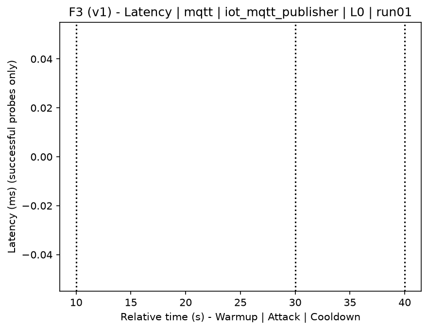
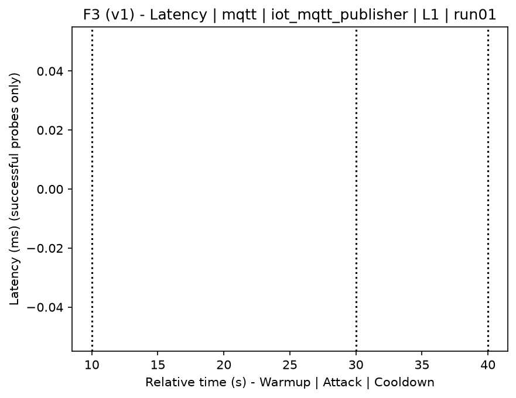
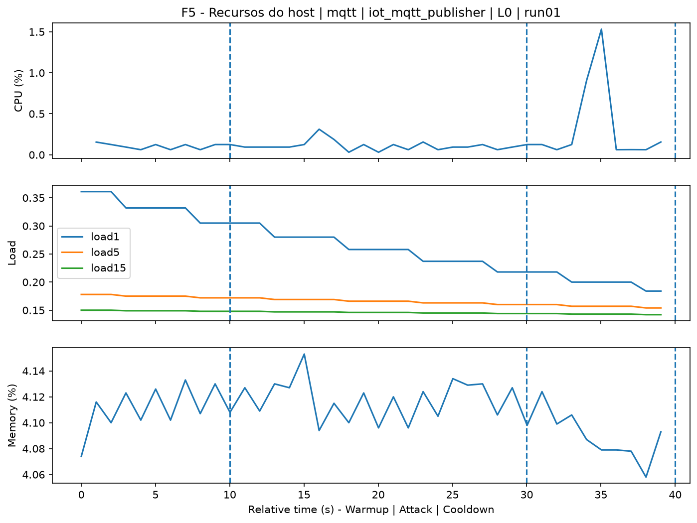
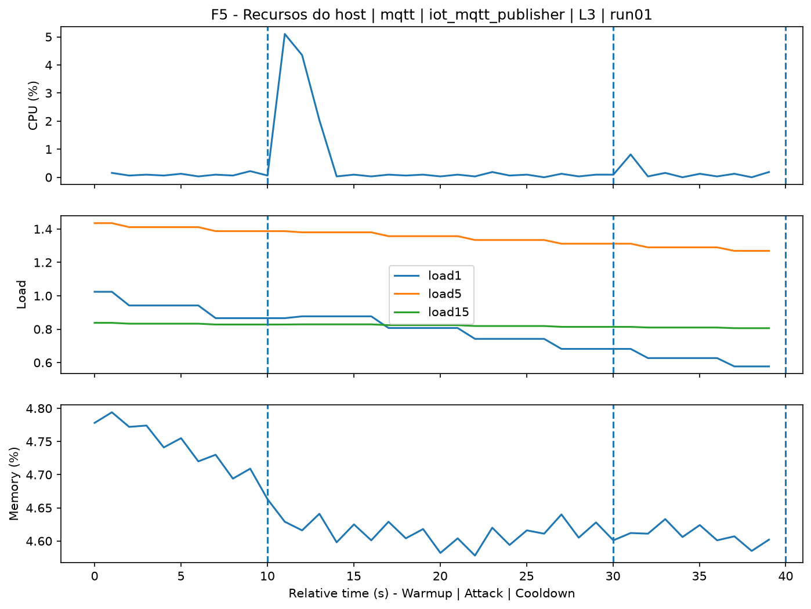
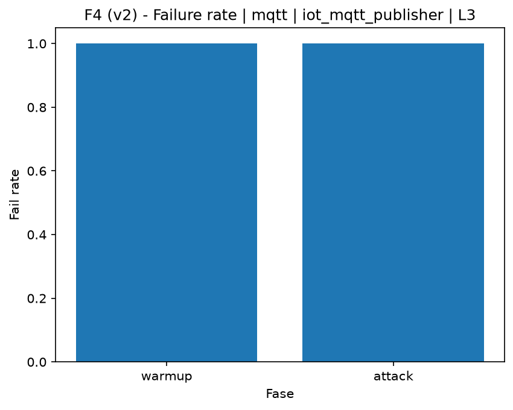

# MQTT Publisher Flood (`iot_mqtt_publisher`)

[Campaign index](README.md)

In campaign `experiments/60att_5runs_l0l1l2l3`, this document consolidates the execution of attack `iot_mqtt_publisher`. In the local catalog, the attack is described as: MQTT publish flood to evaluate broker availability and behavior under load. The documentation below uses only artifacts already present in the repository, mainly the tables and figures from `experiments/60att_5runs_l0l1l2l3/iot_mqtt_publisher`.

## Attack Metadata

| Field | Value |
| --- | --- |
| ID | `iot_mqtt_publisher` |
| Category | 7) IoT |
| Subcategory | 7.1 IoT Protocols / MQTT |
| Target services | mqtt-broker |
| Image | `attack-mqtt-publisher:latest` |
| Container | `attack-mqtt-publisher` |
| Catalog max runtime | 10 s |
| Intensity parameters | count, delay_ms, payload_size |
| MITRE ATT&CK | [https://attack.mitre.org/tactics/TA0040/](https://attack.mitre.org/tactics/TA0040/) [https://attack.mitre.org/techniques/T1499/](https://attack.mitre.org/techniques/T1499/) [https://attack.mitre.org/techniques/T1499/002/](https://attack.mitre.org/techniques/T1499/002/) |

## Statistical Summary by Level

| Level | Service | Runs | Attack samples | Mean success | Mean failure | Lat p50/p95 ms | Total PCAP MB | Mean dataset (min-max) | Mean exec s | Extractors ok/total | Mean/max CPU | Mean mem MB |
| --- | --- | --- | --- | --- | --- | --- | --- | --- | --- | --- | --- | --- |
| L0 | mqtt | 5 | 200 | 0% | 100% | 2.000 / 2.000 | 1,06 | 4.778 (4.766-4.788) | 42,52 | 3/3 | 0,09% / 0,12% | 5,2 |
| L1 | mqtt | 5 | 200 | 0% | 100% | 2.000 / 2.000 | 14,28 | 64.859 (64.778-65.002) | 49,89 | 3/3 | 0,88% / 4,39% | 5,22 |
| L2 | mqtt | 5 | 200 | 0% | 100% | 2.000 / 2.000 | 14,28 | 64.870 (64.858-64.886) | 49,9 | 3/3 | 0,83% / 4,72% | 5,25 |
| L3 | mqtt | 5 | 200 | 0% | 100% | 2.000 / 2.000 | 14,28 | 64.884 (64.846-64.924) | 49,94 | 3/3 | 0,81% / 5,4% | 5,27 |

## Stability Across Reruns

| Level | Metric | Runs | Mean | Deviation | CV | Min | Max |
| --- | --- | --- | --- | --- | --- | --- | --- |
| L0 | Mean CPU in attack phase | 5 | 0,09 | 0,01 | 14,37% | 0,07 | 0,1 |
| L0 | Dataset rows | 5 | 4.777,6 | 8,65 | 0,18% | 4.766 | 4.788 |
| L0 | Execution time | 5 | 42,52 | 0,33 | 0,77% | 42,32 | 43,1 |
| L0 | Failure in attack phase | 5 | 100 | 0 | 0% | 100 | 100 |
| L0 | Censored p95 latency | 5 | 2.000 | 0 | 0% | 2.000 | 2.000 |
| L1 | Mean CPU in attack phase | 5 | 0,88 | 0,09 | 10,19% | 0,77 | 0,96 |
| L1 | Dataset rows | 5 | 64.858,8 | 87,56 | 0,14% | 64.778 | 65.002 |
| L1 | Execution time | 5 | 49,89 | 0,13 | 0,27% | 49,66 | 49,97 |
| L1 | Failure in attack phase | 5 | 100 | 0 | 0% | 100 | 100 |
| L1 | Censored p95 latency | 5 | 2.000 | 0 | 0% | 2.000 | 2.000 |
| L2 | Mean CPU in attack phase | 5 | 0,83 | 0,05 | 5,95% | 0,77 | 0,89 |
| L2 | Dataset rows | 5 | 64.870,4 | 11,35 | 0,02% | 64.858 | 64.886 |
| L2 | Execution time | 5 | 49,9 | 0,06 | 0,12% | 49,83 | 49,99 |
| L2 | Failure in attack phase | 5 | 100 | 0 | 0% | 100 | 100 |
| L2 | Censored p95 latency | 5 | 2.000 | 0 | 0% | 2.000 | 2.000 |
| L3 | Mean CPU in attack phase | 5 | 0,81 | 0,04 | 4,82% | 0,77 | 0,86 |
| L3 | Dataset rows | 5 | 64.883,6 | 36,75 | 0,06% | 64.846 | 64.924 |
| L3 | Execution time | 5 | 49,94 | 0,12 | 0,24% | 49,82 | 50,07 |
| L3 | Failure in attack phase | 5 | 100 | 0 | 0% | 100 | 100 |
| L3 | Censored p95 latency | 5 | 2.000 | 0 | 0% | 2.000 | 2.000 |

## Artifact Validation

| Level | Runs | Capture | Probe | Features | Dataset | Resources | Server stats | Acceptance |
| --- | --- | --- | --- | --- | --- | --- | --- | --- |
| L0 | 5 | 5/5 | 5/5 | 5/5 | 5/5 | 5/5 | 5/5 | 5/5 |
| L1 | 5 | 5/5 | 5/5 | 5/5 | 5/5 | 5/5 | 5/5 | 5/5 |
| L2 | 5 | 5/5 | 5/5 | 5/5 | 5/5 | 5/5 | 5/5 | 5/5 |
| L3 | 5 | 5/5 | 5/5 | 5/5 | 5/5 | 5/5 | 5/5 | 5/5 |

## Selected Figures

<table>
<tr>
<td> Time series L0 run01</td>
<td> Time series L1 run01</td>
</tr>
<tr>
<td> Time series L2 run01</td>
<td> Time series L3 run01</td>
</tr>
<tr>
<td> Resources L0 run01</td>
<td> Resources L3 run01</td>
</tr>
<tr>
<td> Failure rate L0</td>
<td> Failure rate L3</td>
</tr>
</table>

## Sources Used

- Attack catalog: `docker/attackers/mqtt-publisher-flood/attack.yaml`
- Campaign artifacts: `experiments/60att_5runs_l0l1l2l3/iot_mqtt_publisher`
