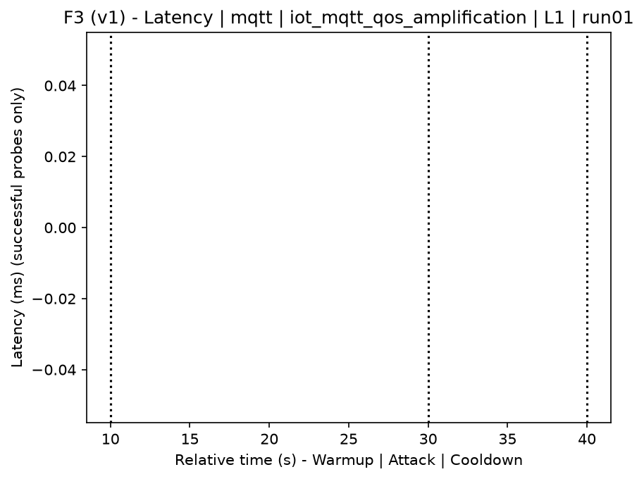
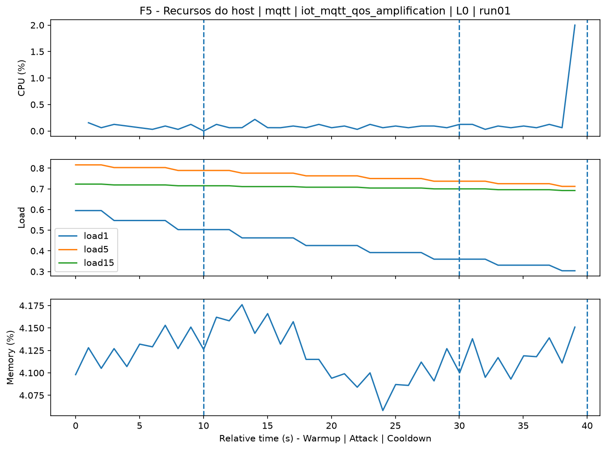
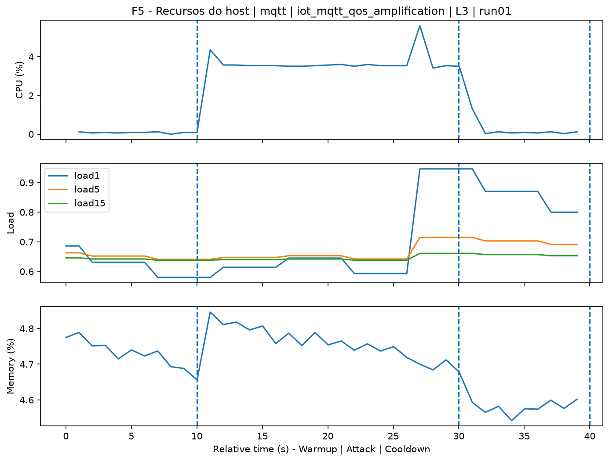
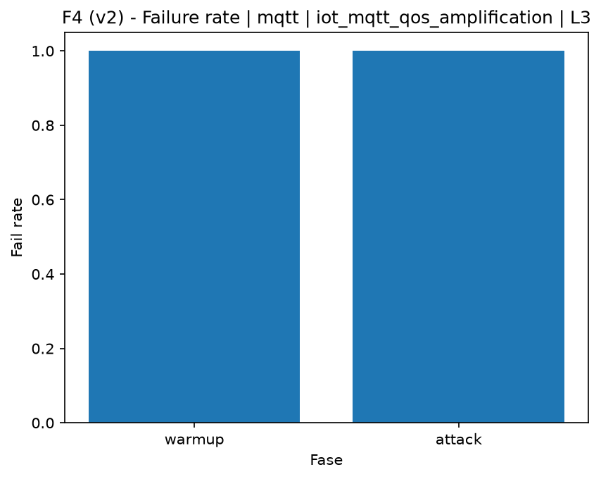

# MQTT QoS 2 Amplification (`iot_mqtt_qos_amplification`)

[Campaign index](README.md)

This document summarizes the published campaign execution of attack `iot_mqtt_qos_amplification`. In the local catalog, the attack is described as: Traffic and state-load amplification on the MQTT broker through multiple QoS 2 handshakes. The full execution artifacts are not versioned in this repository; retrieve the generated dataset CSVs from the Figshare dataset linked in the campaign index. Raw PCAP captures are not included in that archive. The selected figures below are stored under `contrib/assets/campaign_doc`.

## Attack Metadata

| Field | Value |
| --- | --- |
| ID | `iot_mqtt_qos_amplification` |
| Category | 7) IoT |
| Subcategory | 7.1 IoT Protocols / MQTT |
| Target services | mqtt-broker |
| Image | `attack-mqtt-qos-amplification:latest` |
| Container | `attack-mqtt-qos-amplification` |
| Catalog max runtime | 10 s |
| Intensity parameters | threads, count, delay_ms |
| MITRE ATT&CK | [https://attack.mitre.org/tactics/TA0040/](https://attack.mitre.org/tactics/TA0040/) [https://attack.mitre.org/techniques/T1499/](https://attack.mitre.org/techniques/T1499/) [https://attack.mitre.org/techniques/T1499/003/](https://attack.mitre.org/techniques/T1499/003/) |

## Statistical Summary by Level

| Level | Service | Runs | Attack samples | Mean success | Mean failure | Lat p50/p95 ms | Total PCAP MB | Mean dataset (min-max) | Mean exec s | Extractors ok/total | Mean/max CPU | Mean mem MB |
| --- | --- | --- | --- | --- | --- | --- | --- | --- | --- | --- | --- | --- |
| L0 | mqtt | 5 | 200 | 0% | 100% | 2.000 / 2.000 | 1,06 | 4.775 (4.760-4.814) | 42,41 | 3/3 | 0,08% / 0,09% | 5,27 |
| L1 | mqtt | 5 | 200 | 0% | 100% | 2.000 / 2.000 | 20,73 | 82.533 (77.952-88.974) | 52,38 | 3/3 | 1,1% / 1,24% | 5,48 |
| L2 | mqtt | 5 | 200 | 0% | 100% | 2.000 / 2.000 | 20,98 | 83.498 (78.242-86.070) | 52,41 | 3/3 | 1,11% / 1,28% | 5,48 |
| L3 | mqtt | 5 | 200 | 0% | 100% | 2.000 / 2.000 | 20,95 | 83.388 (76.100-88.590) | 52,32 | 3/3 | 1,09% / 1,26% | 5,51 |

## Stability Across Reruns

| Level | Metric | Runs | Mean | Deviation | CV | Min | Max |
| --- | --- | --- | --- | --- | --- | --- | --- |
| L0 | Mean CPU in attack phase | 5 | 0,08 | 0 | 3,59% | 0,08 | 0,08 |
| L0 | Dataset rows | 5 | 4.775,2 | 22,03 | 0,46% | 4.760 | 4.814 |
| L0 | Execution time | 5 | 42,41 | 0,35 | 0,83% | 42,2 | 43,04 |
| L0 | Failure in attack phase | 5 | 100 | 0 | 0% | 100 | 100 |
| L0 | Censored p95 latency | 5 | 2.000 | 0 | 0% | 2.000 | 2.000 |
| L1 | Mean CPU in attack phase | 5 | 1,1 | 0,05 | 4,35% | 1,04 | 1,16 |
| L1 | Dataset rows | 5 | 82.533,2 | 5.297,56 | 6,42% | 77.952 | 88.974 |
| L1 | Execution time | 5 | 52,38 | 0,7 | 1,34% | 51,75 | 53,19 |
| L1 | Failure in attack phase | 5 | 100 | 0 | 0% | 100 | 100 |
| L1 | Censored p95 latency | 5 | 2.000 | 0 | 0% | 2.000 | 2.000 |
| L2 | Mean CPU in attack phase | 5 | 1,11 | 0,02 | 2,08% | 1,08 | 1,14 |
| L2 | Dataset rows | 5 | 83.497,6 | 3.087,03 | 3,7% | 78.242 | 86.070 |
| L2 | Execution time | 5 | 52,41 | 0,34 | 0,64% | 51,84 | 52,71 |
| L2 | Failure in attack phase | 5 | 100 | 0 | 0% | 100 | 100 |
| L2 | Censored p95 latency | 5 | 2.000 | 0 | 0% | 2.000 | 2.000 |
| L3 | Mean CPU in attack phase | 5 | 1,09 | 0,08 | 7,43% | 0,98 | 1,18 |
| L3 | Dataset rows | 5 | 83.388 | 5.284,58 | 6,34% | 76.100 | 88.590 |
| L3 | Execution time | 5 | 52,32 | 0,75 | 1,44% | 51,29 | 53,18 |
| L3 | Failure in attack phase | 5 | 100 | 0 | 0% | 100 | 100 |
| L3 | Censored p95 latency | 5 | 2.000 | 0 | 0% | 2.000 | 2.000 |

## Artifact Validation

| Level | Runs | Capture | Probe | Features | Dataset | Resources | Server stats | Acceptance |
| --- | --- | --- | --- | --- | --- | --- | --- | --- |
| L0 | 5 | 5/5 | 5/5 | 5/5 | 5/5 | 5/5 | 5/5 | 5/5 |
| L1 | 5 | 5/5 | 5/5 | 5/5 | 5/5 | 5/5 | 5/5 | 5/5 |
| L2 | 5 | 5/5 | 5/5 | 5/5 | 5/5 | 5/5 | 5/5 | 5/5 |
| L3 | 5 | 5/5 | 5/5 | 5/5 | 5/5 | 5/5 | 5/5 | 5/5 |

## Selected Figures

<table>
<tr>
<td> Time series L0 run01</td>
<td> Time series L1 run01</td>
</tr>
<tr>
<td> Time series L2 run01</td>
<td> Time series L3 run01</td>
</tr>
<tr>
<td> Resources L0 run01</td>
<td> Resources L3 run01</td>
</tr>
<tr>
<td> Failure rate L0</td>
<td> Failure rate L3</td>
</tr>
</table>

## Sources Used

- Attack catalog: `docker/attackers/mqtt-qos-amplification/attack.yaml`
- Full campaign artifacts: available from the Figshare dataset linked in the campaign index; when extracted locally, expected under `experiments/all_5runs_4levels/iot_mqtt_qos_amplification`.
