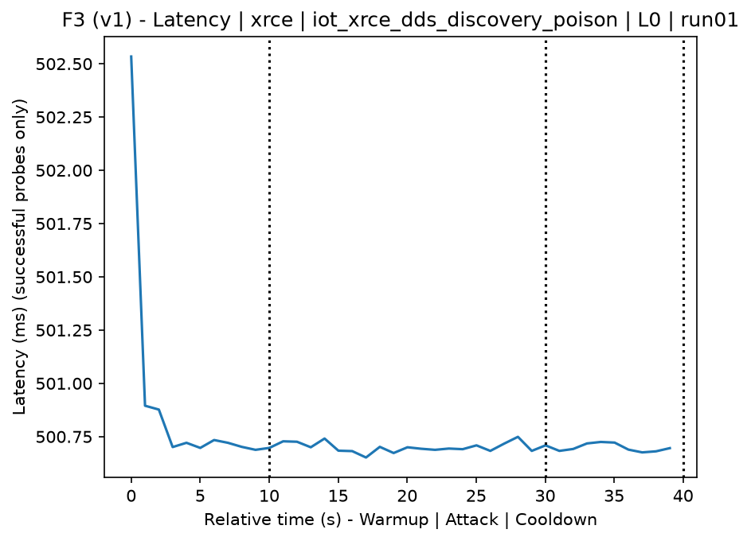
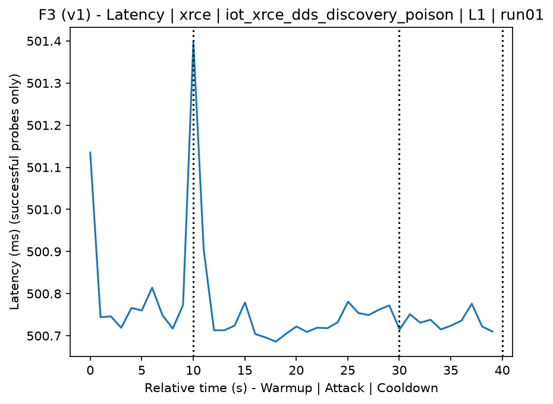
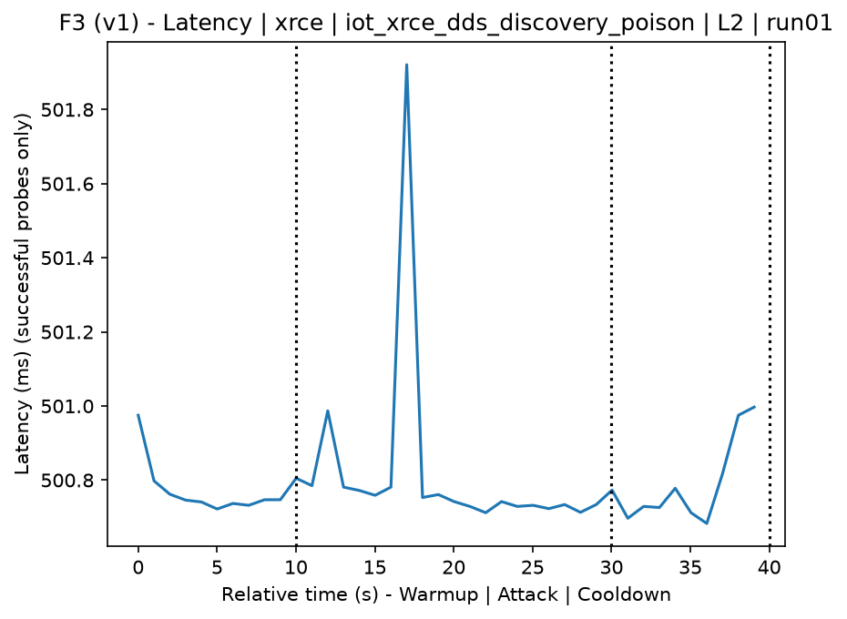
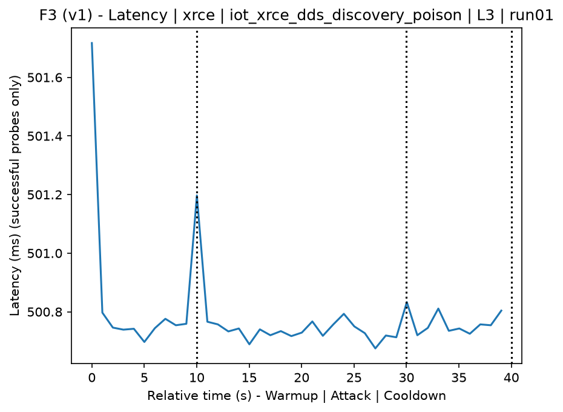
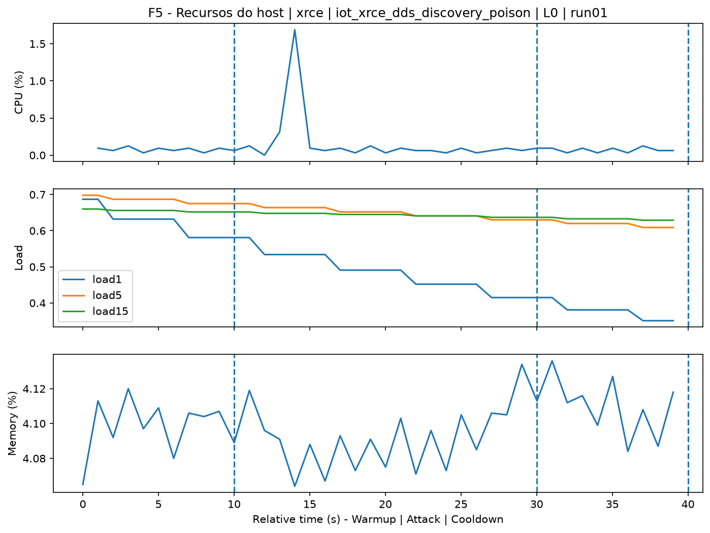
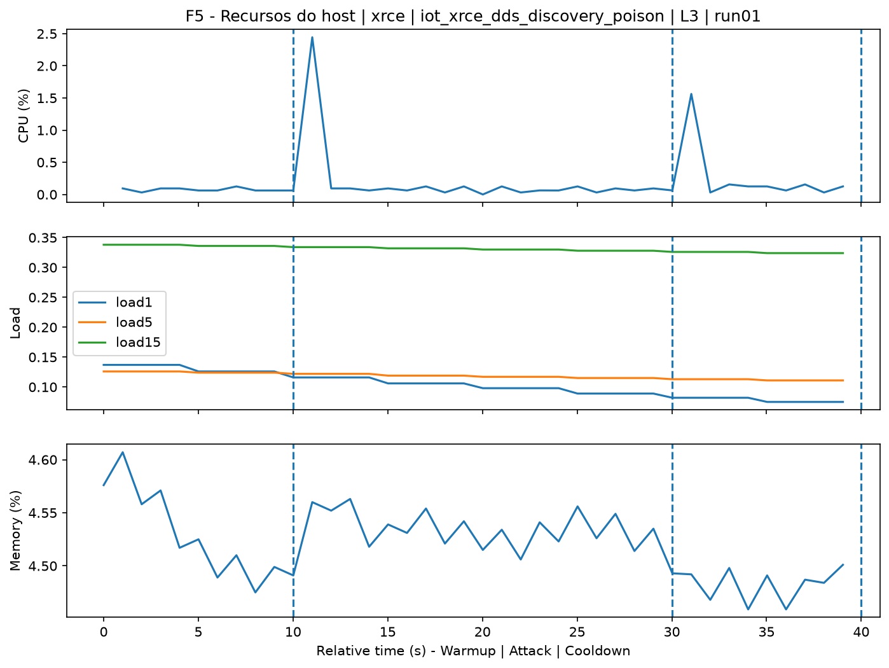
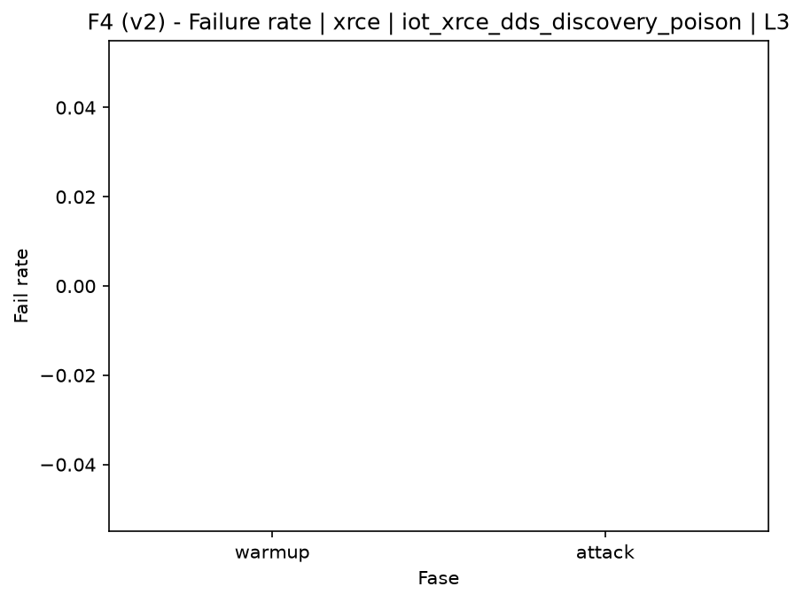

# XRCE-DDS Discovery Poisoning (`iot_xrce_dds_discovery_poison`)

[Campaign index](README.md)

This document summarizes the published campaign execution of attack `iot_xrce_dds_discovery_poison`. In the local catalog, the attack is described as: Poisoning or manipulation of XRCE-DDS agent discovery messages to induce incorrect association, redirection, or discovery degradation. The full execution artifacts are not versioned in this repository; retrieve the generated dataset CSVs from the Figshare dataset linked in the campaign index. Raw PCAP captures are not included in that archive. The selected figures below are stored under `contrib/assets/campaign_doc`.

## Attack Metadata

| Field | Value |
| --- | --- |
| ID | `iot_xrce_dds_discovery_poison` |
| Category | 7) IoT |
| Subcategory | 7.1 IoT Protocols / XRCE-DDS |
| Target services | xrce-dds-agent |
| Image | `attack-xrce-dds-discovery-poison:latest` |
| Container | `attack-xrce-dds-discovery-poison` |
| Catalog max runtime | 10 s |
| Intensity parameters | duration_s |
| MITRE ATT&CK | [https://attack.mitre.org/tactics/TA0006/](https://attack.mitre.org/tactics/TA0006/) [https://attack.mitre.org/tactics/TA0009/](https://attack.mitre.org/tactics/TA0009/) [https://attack.mitre.org/tactics/TA0040/](https://attack.mitre.org/tactics/TA0040/) [https://attack.mitre.org/techniques/T1557/](https://attack.mitre.org/techniques/T1557/) [https://attack.mitre.org/techniques/T1565/](https://attack.mitre.org/techniques/T1565/) [https://attack.mitre.org/techniques/T1565/002/](https://attack.mitre.org/techniques/T1565/002/) |

## Statistical Summary by Level

| Level | Service | Runs | Attack samples | Mean success | Mean failure | Lat p50/p95 ms | Total PCAP MB | Mean dataset (min-max) | Mean exec s | Extractors ok/total | Mean/max CPU | Mean mem MB |
| --- | --- | --- | --- | --- | --- | --- | --- | --- | --- | --- | --- | --- |
| L0 | xrce | 5 | 100 | 100% | 0% | 500,73 / 500,78 | 0,05 | 255 (234-334) | 41,87 | 3/3 | 0,03% / 0,03% | 2,24 |
| L1 | xrce | 5 | 100 | 100% | 0% | 500,78 / 501,02 | 0,05 | 234 (234-234) | 41,71 | 3/3 | 0,03% / 0,03% | 2,24 |
| L2 | xrce | 5 | 100 | 100% | 0% | 500,77 / 501,01 | 0,05 | 234 (234-234) | 41,83 | 3/3 | 0,03% / 0,04% | 2,24 |
| L3 | xrce | 5 | 100 | 100% | 0% | 500,76 / 500,9 | 0,05 | 234 (234-234) | 41,74 | 3/3 | 0,03% / 0,04% | 2,24 |

## Stability Across Reruns

| Level | Metric | Runs | Mean | Deviation | CV | Min | Max |
| --- | --- | --- | --- | --- | --- | --- | --- |
| L0 | Mean CPU in attack phase | 5 | 0,03 | 0 | 14,09% | 0,02 | 0,03 |
| L0 | Dataset rows | 5 | 254,8 | 44,31 | 17,39% | 234 | 334 |
| L0 | Execution time | 5 | 41,87 | 0,51 | 1,22% | 41,62 | 42,78 |
| L0 | Failure in attack phase | 5 | 0 | 0 | n/a | 0 | 0 |
| L0 | Censored p95 latency | 5 | 500,78 | 0,02 | 0% | 500,74 | 500,79 |
| L1 | Mean CPU in attack phase | 5 | 0,03 | 0 | 15,74% | 0,02 | 0,04 |
| L1 | Dataset rows | 5 | 234 | 0 | 0% | 234 | 234 |
| L1 | Execution time | 5 | 41,71 | 0,07 | 0,17% | 41,62 | 41,8 |
| L1 | Failure in attack phase | 5 | 0 | 0 | n/a | 0 | 0 |
| L1 | Censored p95 latency | 5 | 501,02 | 0,5 | 0,1% | 500,75 | 501,91 |
| L2 | Mean CPU in attack phase | 5 | 0,03 | 0 | 12,7% | 0,03 | 0,04 |
| L2 | Dataset rows | 5 | 234 | 0 | 0% | 234 | 234 |
| L2 | Execution time | 5 | 41,83 | 0,08 | 0,2% | 41,75 | 41,96 |
| L2 | Failure in attack phase | 5 | 0 | 0 | n/a | 0 | 0 |
| L2 | Censored p95 latency | 5 | 501,01 | 0,14 | 0,03% | 500,79 | 501,16 |
| L3 | Mean CPU in attack phase | 5 | 0,03 | 0 | 13,37% | 0,03 | 0,04 |
| L3 | Dataset rows | 5 | 234 | 0 | 0% | 234 | 234 |
| L3 | Execution time | 5 | 41,74 | 0,04 | 0,09% | 41,71 | 41,8 |
| L3 | Failure in attack phase | 5 | 0 | 0 | n/a | 0 | 0 |
| L3 | Censored p95 latency | 5 | 500,9 | 0,18 | 0,04% | 500,8 | 501,21 |

## Artifact Validation

| Level | Runs | Capture | Probe | Features | Dataset | Resources | Server stats | Acceptance |
| --- | --- | --- | --- | --- | --- | --- | --- | --- |
| L0 | 5 | 5/5 | 5/5 | 5/5 | 5/5 | 5/5 | 5/5 | 5/5 |
| L1 | 5 | 5/5 | 5/5 | 5/5 | 5/5 | 5/5 | 5/5 | 5/5 |
| L2 | 5 | 5/5 | 5/5 | 5/5 | 5/5 | 5/5 | 5/5 | 5/5 |
| L3 | 5 | 5/5 | 5/5 | 5/5 | 5/5 | 5/5 | 5/5 | 5/5 |

## Selected Figures

<table>
<tr>
<td> Time series L0 run01</td>
<td> Time series L1 run01</td>
</tr>
<tr>
<td> Time series L2 run01</td>
<td> Time series L3 run01</td>
</tr>
<tr>
<td> Resources L0 run01</td>
<td> Resources L3 run01</td>
</tr>
<tr>
<td> Failure rate L0</td>
<td> Failure rate L3</td>
</tr>
</table>

## Sources Used

- Attack catalog: `docker/attackers/xrce-dds-discovery-poison/attack.yaml`
- Full campaign artifacts: available from the Figshare dataset linked in the campaign index; when extracted locally, expected under `experiments/60att_5runs_l0l1l2l3/iot_xrce_dds_discovery_poison`.
