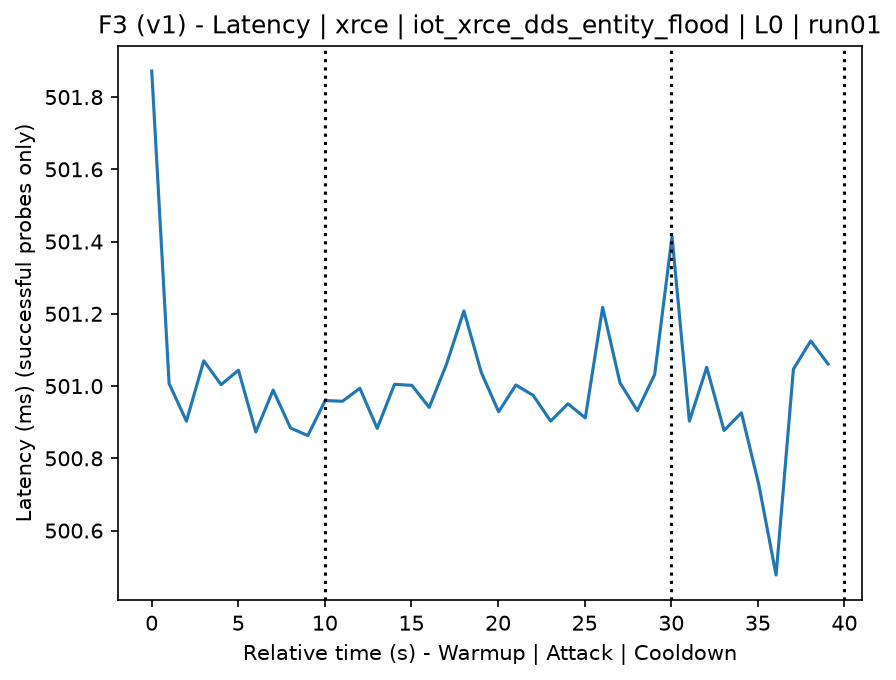
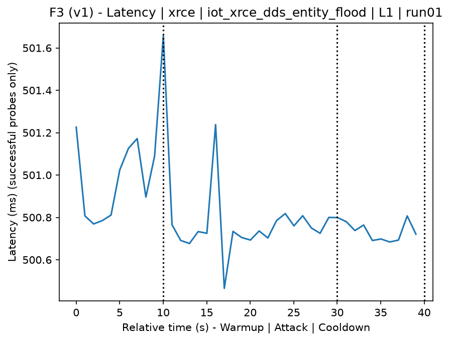
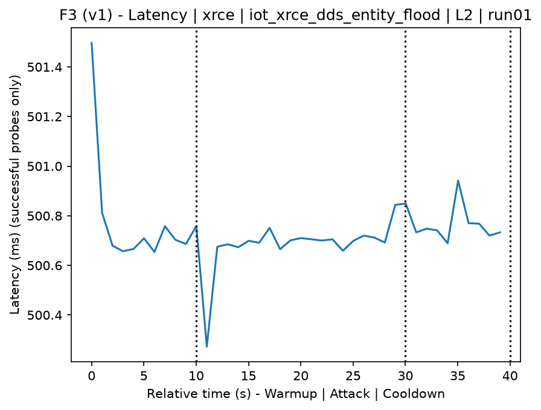
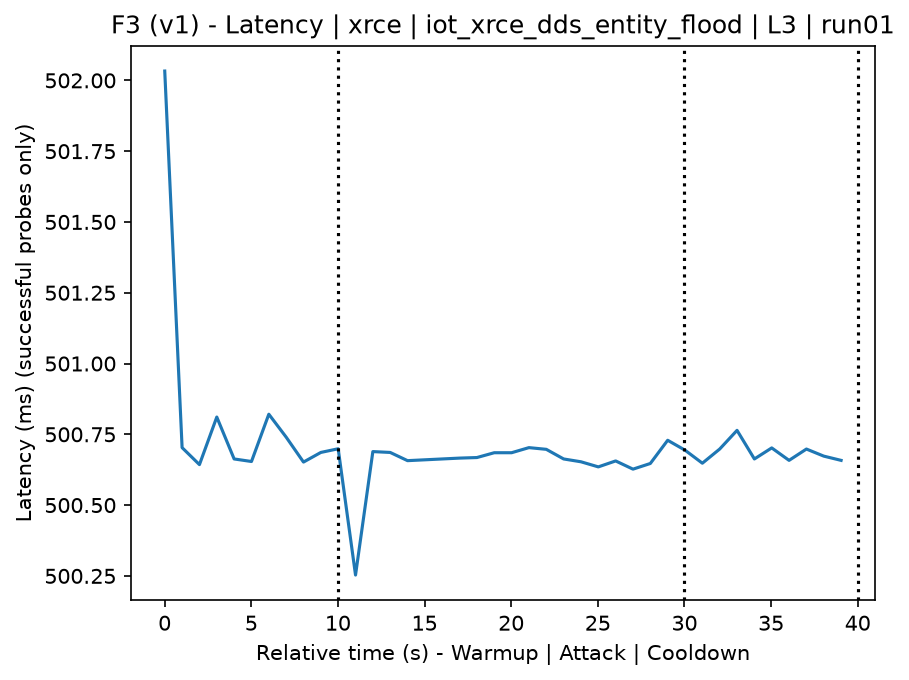
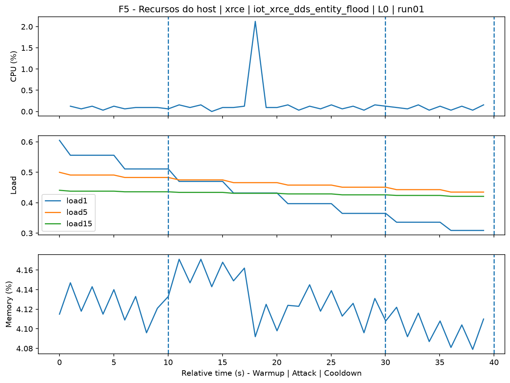
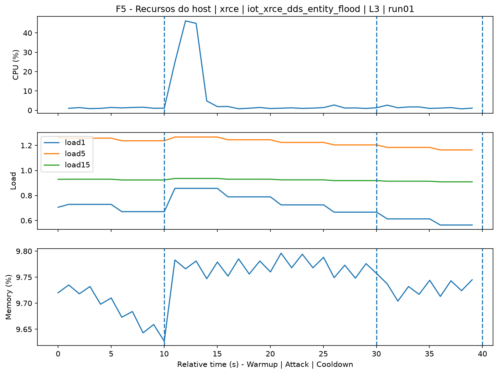
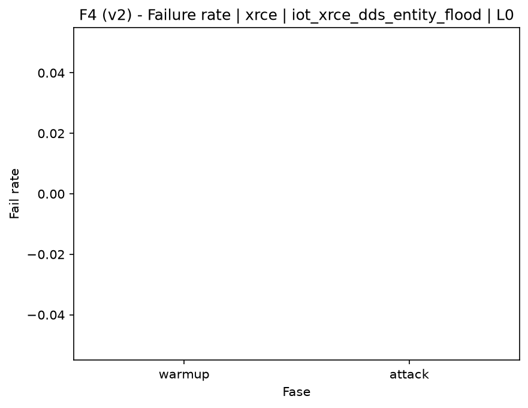
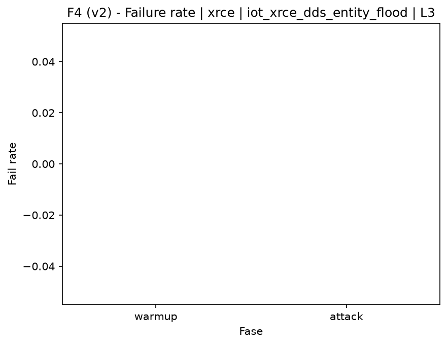

# XRCE-DDS Entity Flood (`iot_xrce_dds_entity_flood`)

[Índice da campanha](README.md)

Na campanha `experiments/60att_5runs_l0l1l2l3`, este documento consolida a execução do ataque `iot_xrce_dds_entity_flood`. No catálogo local, o ataque é descrito como: Mass creation of XRCE-DDS entities to consume session, memory, and control resources on the agent. A documentação abaixo usa apenas artefatos já presentes no repositório, principalmente as tabelas e figuras de `experiments/60att_5runs_l0l1l2l3/iot_xrce_dds_entity_flood`.

## Metadados do ataque

| Campo | Valor |
| --- | --- |
| ID | `iot_xrce_dds_entity_flood` |
| Categoria | 7) IoT |
| Subcategoria | 7.1 IoT Protocols / XRCE-DDS |
| Serviços alvo | xrce-dds-agent |
| Imagem | `attack-xrce-dds-entity-flood:latest` |
| Container | `attack-xrce-dds-entity-flood` |
| Runtime máximo do catálogo | 10 s |
| Parâmetros de intensidade | duration_s |
| MITRE ATT&CK | [https://attack.mitre.org/tactics/TA0040/](https://attack.mitre.org/tactics/TA0040/) [https://attack.mitre.org/techniques/T1499/](https://attack.mitre.org/techniques/T1499/) [https://attack.mitre.org/techniques/T1499/003/](https://attack.mitre.org/techniques/T1499/003/) |

## Resumo estatístico por nível

| Nível | Serviço | Runs | Amostras attack | Sucesso médio | Falha média | Lat p50/p95 ms | PCAP total MB | Dataset médio (min-max) | Exec média s | Extratores ok/total | CPU média/máx | Mem MB média |
| --- | --- | --- | --- | --- | --- | --- | --- | --- | --- | --- | --- | --- |
| L0 | xrce | 5 | 100 | 100% | 0% | 500,81 / 501,13 | 0,05 | 234 (234-234) | 41,95 | 3/3 | 0,03% / 0,05% | 2,24 |
| L1 | xrce | 5 | 100 | 100% | 0% | 500,72 / 501,05 | 11,72 | 19.849 (14.604-24.212) | 44,64 | 3/3 | 238,33% / 1.306,79% | 1.302,53 |
| L2 | xrce | 5 | 100 | 100% | 0% | 500,7 / 500,77 | 10,64 | 18.411 (14.580-22.992) | 44,38 | 3/3 | 250,31% / 1.229,64% | 1.703,62 |
| L3 | xrce | 5 | 100 | 100% | 0% | 500,69 / 500,85 | 9,78 | 17.335 (15.228-19.604) | 44,16 | 3/3 | 254,18% / 1.387,37% | 1.750,07 |

## Estabilidade entre reexecuções

| Nível | Métrica | Runs | Média | Desvio | CV | Min | Max |
| --- | --- | --- | --- | --- | --- | --- | --- |
| L0 | CPU média na fase attack | 5 | 0,03 | 0 | 14,53% | 0,03 | 0,04 |
| L0 | Linhas do dataset | 5 | 234 | 0 | 0% | 234 | 234 |
| L0 | Tempo de execução | 5 | 41,95 | 0,37 | 0,87% | 41,71 | 42,59 |
| L0 | Falha na fase attack | 5 | 0 | 0 | n/d | 0 | 0 |
| L0 | Latência p95 censurada | 5 | 501,13 | 0,28 | 0,06% | 500,75 | 501,49 |
| L1 | CPU média na fase attack | 5 | 238,33 | 29,17 | 12,24% | 191,81 | 262,89 |
| L1 | Linhas do dataset | 5 | 19.848,8 | 3.750,48 | 18,9% | 14.604 | 24.212 |
| L1 | Tempo de execução | 5 | 44,64 | 0,59 | 1,32% | 43,94 | 45,46 |
| L1 | Falha na fase attack | 5 | 0 | 0 | n/d | 0 | 0 |
| L1 | Latência p95 censurada | 5 | 501,05 | 0,19 | 0,04% | 500,81 | 501,26 |
| L2 | CPU média na fase attack | 5 | 250,31 | 12,41 | 4,96% | 240,14 | 271,78 |
| L2 | Linhas do dataset | 5 | 18.410,8 | 3.344,91 | 18,17% | 14.580 | 22.992 |
| L2 | Tempo de execução | 5 | 44,38 | 0,46 | 1,03% | 43,76 | 44,94 |
| L2 | Falha na fase attack | 5 | 0 | 0 | n/d | 0 | 0 |
| L2 | Latência p95 censurada | 5 | 500,77 | 0,01 | 0% | 500,76 | 500,79 |
| L3 | CPU média na fase attack | 5 | 254,18 | 10,18 | 4% | 238,2 | 263,26 |
| L3 | Linhas do dataset | 5 | 17.334,8 | 1.985,4 | 11,45% | 15.228 | 19.604 |
| L3 | Tempo de execução | 5 | 44,16 | 0,3 | 0,67% | 43,82 | 44,45 |
| L3 | Falha na fase attack | 5 | 0 | 0 | n/d | 0 | 0 |
| L3 | Latência p95 censurada | 5 | 500,85 | 0,13 | 0,03% | 500,7 | 501,02 |

## Validação de artefatos

| Nível | Runs | Captura | Probe | Features | Dataset | Recursos | Server stats | Aceite |
| --- | --- | --- | --- | --- | --- | --- | --- | --- |
| L0 | 5 | 5/5 | 5/5 | 5/5 | 5/5 | 5/5 | 5/5 | 5/5 |
| L1 | 5 | 5/5 | 5/5 | 5/5 | 5/5 | 5/5 | 5/5 | 5/5 |
| L2 | 5 | 5/5 | 5/5 | 5/5 | 5/5 | 5/5 | 5/5 | 5/5 |
| L3 | 5 | 5/5 | 5/5 | 5/5 | 5/5 | 5/5 | 5/5 | 5/5 |

## Figuras selecionadas

<table>
<tr>
<td> Série temporal L0 run01</td>
<td> Série temporal L1 run01</td>
</tr>
<tr>
<td> Série temporal L2 run01</td>
<td> Série temporal L3 run01</td>
</tr>
<tr>
<td> Recursos L0 run01</td>
<td> Recursos L3 run01</td>
</tr>
<tr>
<td> Taxa de falha L0</td>
<td> Taxa de falha L3</td>
</tr>
</table>

## Fontes utilizadas

- Catálogo do ataque: `docker/attackers/xrce-dds-entity-flood/attack.yaml`
- Artefatos da campanha: `experiments/60att_5runs_l0l1l2l3/iot_xrce_dds_entity_flood`
