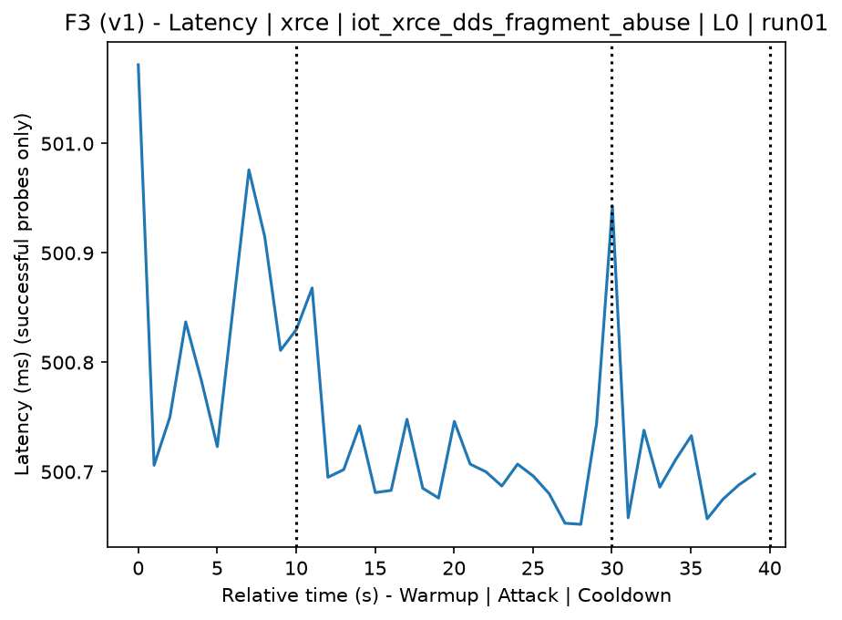
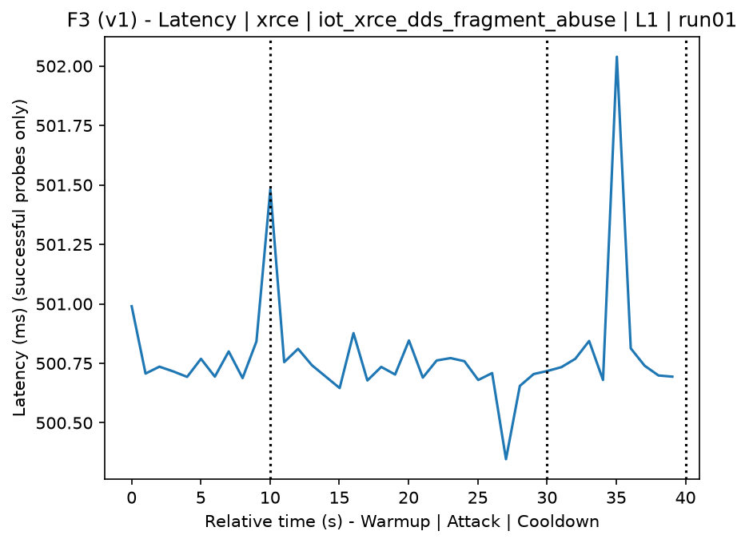
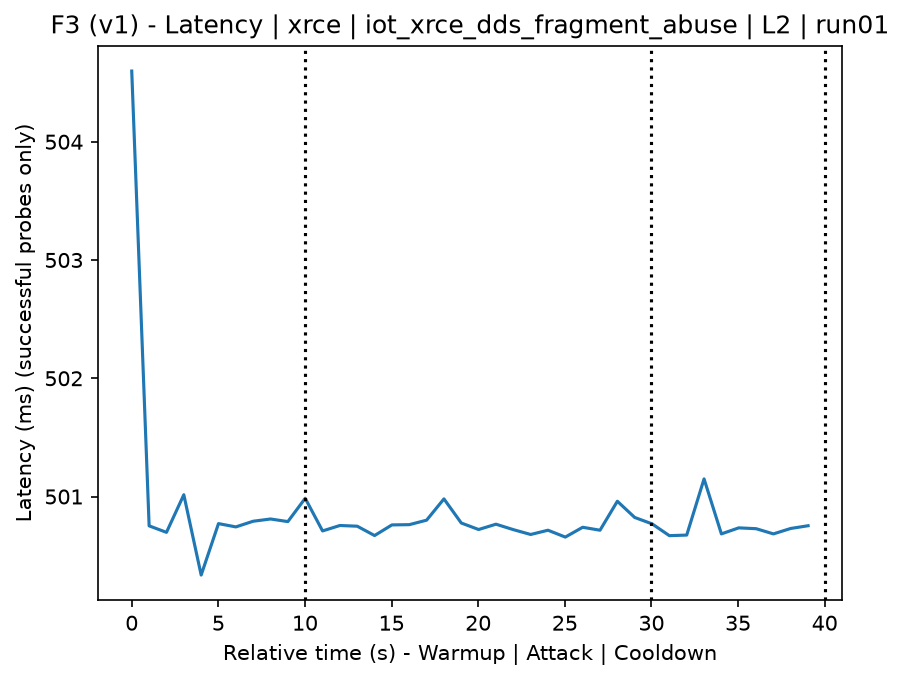
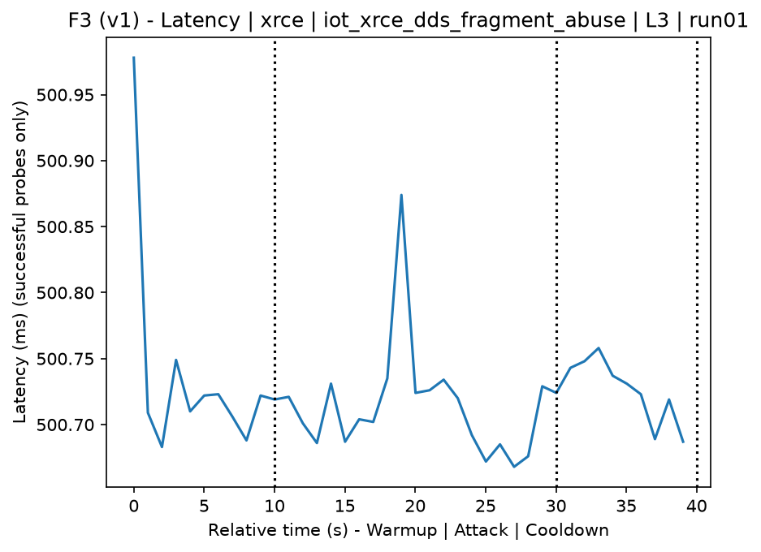
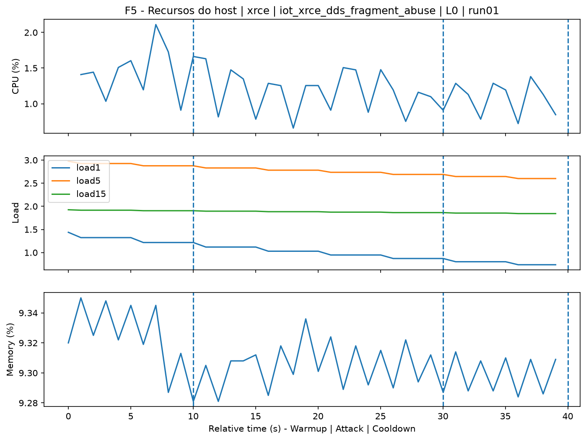
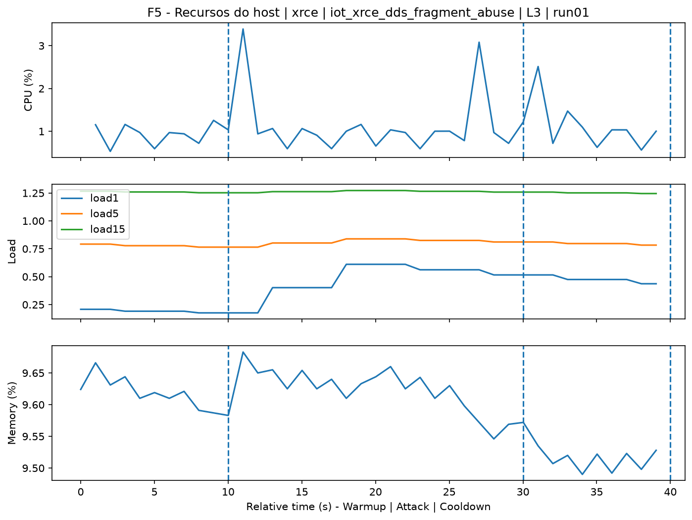
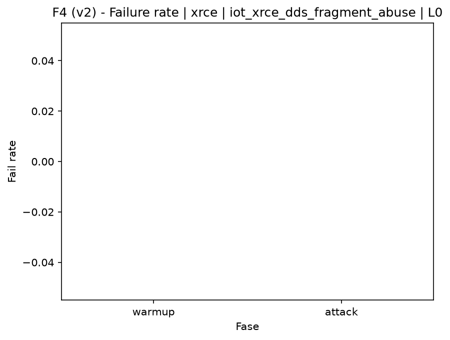

# XRCE-DDS Fragment Abuse (`iot_xrce_dds_fragment_abuse`)

[Campaign index](README.md)

In campaign `experiments/60att_5runs_l0l1l2l3`, this document consolidates the execution of attack `iot_xrce_dds_fragment_abuse`. In the local catalog, the attack is described as: Fragmented, incomplete, or overlapping XRCE-DDS publications that stress reassembly, queues, and fragment handling on the agent. The documentation below uses only artifacts already present in the repository, mainly the tables and figures from `experiments/60att_5runs_l0l1l2l3/iot_xrce_dds_fragment_abuse`.

## Attack Metadata

| Field | Value |
| --- | --- |
| ID | `iot_xrce_dds_fragment_abuse` |
| Category | 7) IoT |
| Subcategory | 7.1 IoT Protocols / XRCE-DDS |
| Target services | xrce-dds-agent |
| Image | `attack-xrce-dds-fragment-abuse:latest` |
| Container | `attack-xrce-dds-fragment-abuse` |
| Catalog max runtime | 30 s |
| Intensity parameters | duration_s |
| MITRE ATT&CK | [https://attack.mitre.org/tactics/TA0040/](https://attack.mitre.org/tactics/TA0040/) [https://attack.mitre.org/techniques/T1499/](https://attack.mitre.org/techniques/T1499/) [https://attack.mitre.org/techniques/T1499/003/](https://attack.mitre.org/techniques/T1499/003/) [https://attack.mitre.org/techniques/T1499/004/](https://attack.mitre.org/techniques/T1499/004/) |

## Statistical Summary by Level

| Level | Service | Runs | Attack samples | Mean success | Mean failure | Lat p50/p95 ms | Total PCAP MB | Mean dataset (min-max) | Mean exec s | Extractors ok/total | Mean/max CPU | Mean mem MB |
| --- | --- | --- | --- | --- | --- | --- | --- | --- | --- | --- | --- | --- |
| L0 | xrce | 5 | 100 | 100% | 0% | 500,71 / 500,82 | 0,05 | 234 (234-234) | 41,97 | 3/3 | 45,36% / 63,2% | 1.749,13 |
| L1 | xrce | 5 | 100 | 100% | 0% | 500,72 / 500,86 | 0,06 | 306 (306-306) | 41,81 | 3/3 | 47,08% / 63,92% | 1.749,13 |
| L2 | xrce | 5 | 100 | 100% | 0% | 500,71 / 500,89 | 0,06 | 308 (306-318) | 41,77 | 3/3 | 41,85% / 78,72% | 1.732,22 |
| L3 | xrce | 5 | 100 | 100% | 0% | 500,73 / 500,83 | 0,06 | 306 (306-306) | 41,75 | 3/3 | 35,52% / 50,95% | 1.719,06 |

## Stability Across Reruns

| Level | Metric | Runs | Mean | Deviation | CV | Min | Max |
| --- | --- | --- | --- | --- | --- | --- | --- |
| L0 | Mean CPU in attack phase | 5 | 45,36 | 3,25 | 7,17% | 41,37 | 48,96 |
| L0 | Dataset rows | 5 | 234 | 0 | 0% | 234 | 234 |
| L0 | Execution time | 5 | 41,97 | 0,31 | 0,73% | 41,73 | 42,5 |
| L0 | Failure in attack phase | 5 | 0 | 0 | n/a | 0 | 0 |
| L0 | Censored p95 latency | 5 | 500,82 | 0,04 | 0,01% | 500,78 | 500,88 |
| L1 | Mean CPU in attack phase | 5 | 47,08 | 1,21 | 2,58% | 46,13 | 48,8 |
| L1 | Dataset rows | 5 | 306 | 0 | 0% | 306 | 306 |
| L1 | Execution time | 5 | 41,81 | 0,05 | 0,11% | 41,74 | 41,85 |
| L1 | Failure in attack phase | 5 | 0 | 0 | n/a | 0 | 0 |
| L1 | Censored p95 latency | 5 | 500,86 | 0,09 | 0,02% | 500,77 | 500,98 |
| L2 | Mean CPU in attack phase | 5 | 41,85 | 6,54 | 15,64% | 32,78 | 47,48 |
| L2 | Dataset rows | 5 | 308,4 | 5,37 | 1,74% | 306 | 318 |
| L2 | Execution time | 5 | 41,77 | 0,09 | 0,23% | 41,69 | 41,93 |
| L2 | Failure in attack phase | 5 | 0 | 0 | n/a | 0 | 0 |
| L2 | Censored p95 latency | 5 | 500,89 | 0,09 | 0,02% | 500,74 | 500,98 |
| L3 | Mean CPU in attack phase | 5 | 35,52 | 2,95 | 8,3% | 32,88 | 40,19 |
| L3 | Dataset rows | 5 | 306 | 0 | 0% | 306 | 306 |
| L3 | Execution time | 5 | 41,75 | 0,03 | 0,07% | 41,72 | 41,79 |
| L3 | Failure in attack phase | 5 | 0 | 0 | n/a | 0 | 0 |
| L3 | Censored p95 latency | 5 | 500,83 | 0,1 | 0,02% | 500,74 | 500,99 |

## Artifact Validation

| Level | Runs | Capture | Probe | Features | Dataset | Resources | Server stats | Acceptance |
| --- | --- | --- | --- | --- | --- | --- | --- | --- |
| L0 | 5 | 5/5 | 5/5 | 5/5 | 5/5 | 5/5 | 5/5 | 5/5 |
| L1 | 5 | 5/5 | 5/5 | 5/5 | 5/5 | 5/5 | 5/5 | 5/5 |
| L2 | 5 | 5/5 | 5/5 | 5/5 | 5/5 | 5/5 | 5/5 | 5/5 |
| L3 | 5 | 5/5 | 5/5 | 5/5 | 5/5 | 5/5 | 5/5 | 5/5 |

## Selected Figures

<table>
<tr>
<td> Time series L0 run01</td>
<td> Time series L1 run01</td>
</tr>
<tr>
<td> Time series L2 run01</td>
<td> Time series L3 run01</td>
</tr>
<tr>
<td> Resources L0 run01</td>
<td> Resources L3 run01</td>
</tr>
<tr>
<td> Failure rate L0</td>
<td> Failure rate L3</td>
</tr>
</table>

## Sources Used

- Attack catalog: `docker/attackers/xrce-dds-fragment-abuse/attack.yaml`
- Campaign artifacts: `experiments/60att_5runs_l0l1l2l3/iot_xrce_dds_fragment_abuse`
