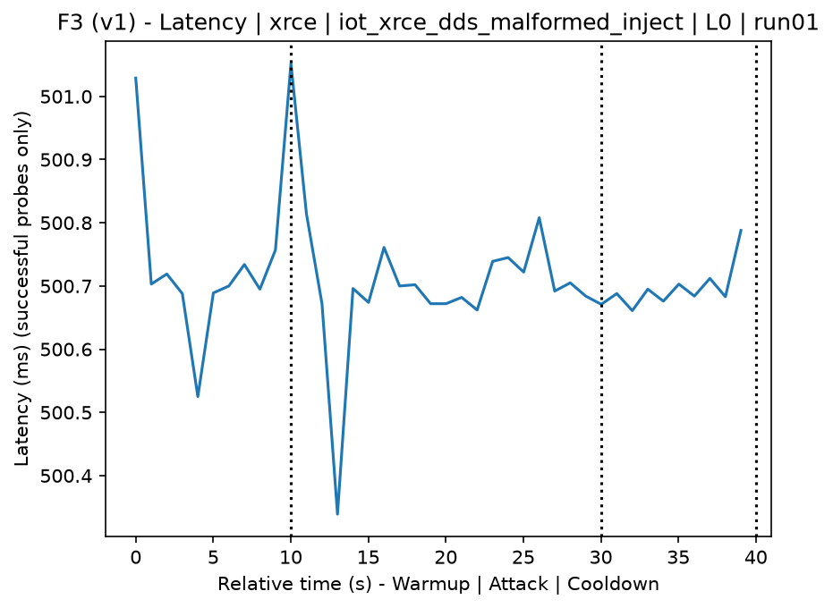
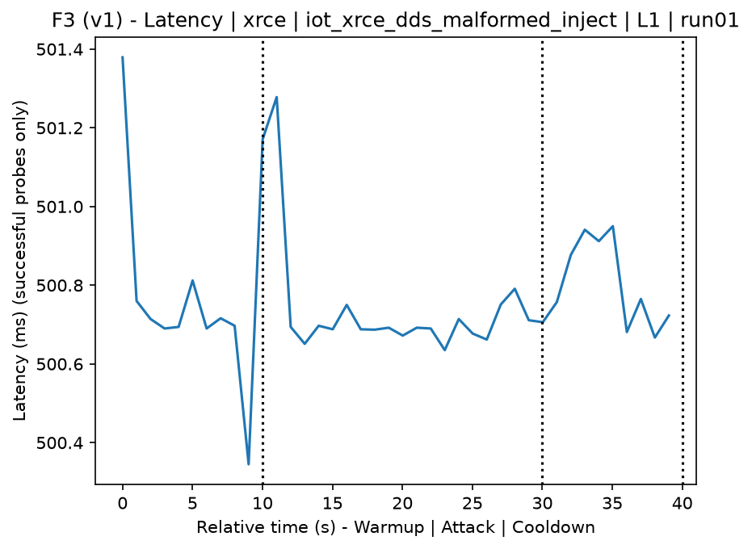
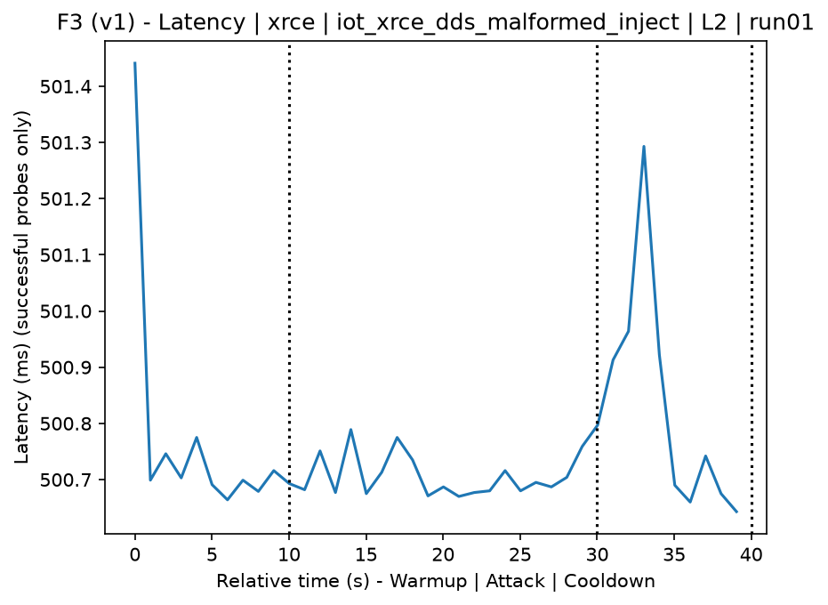
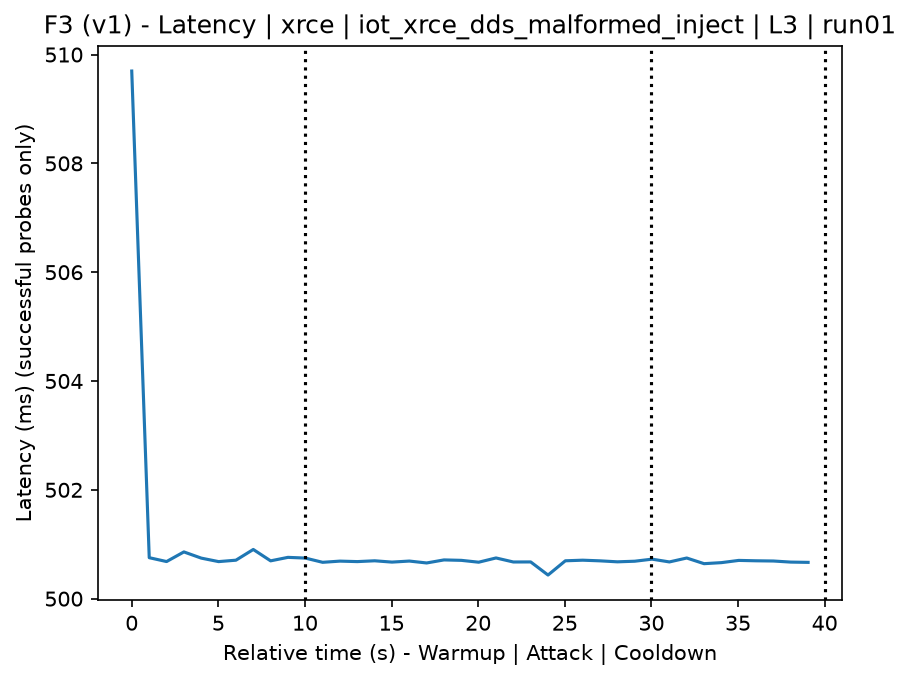
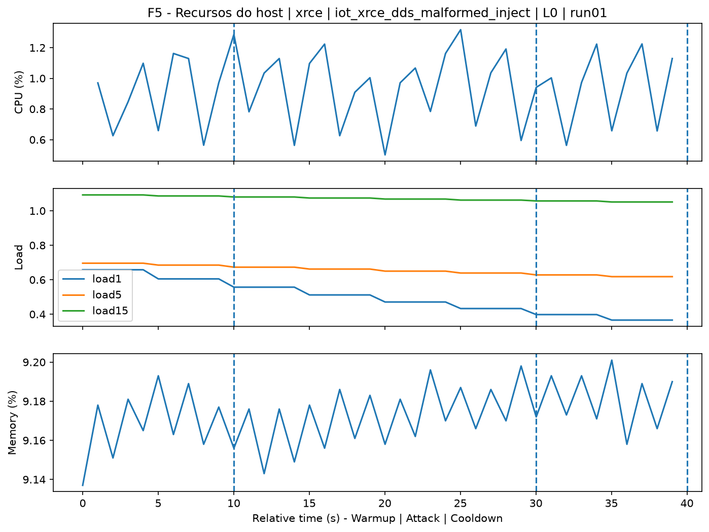
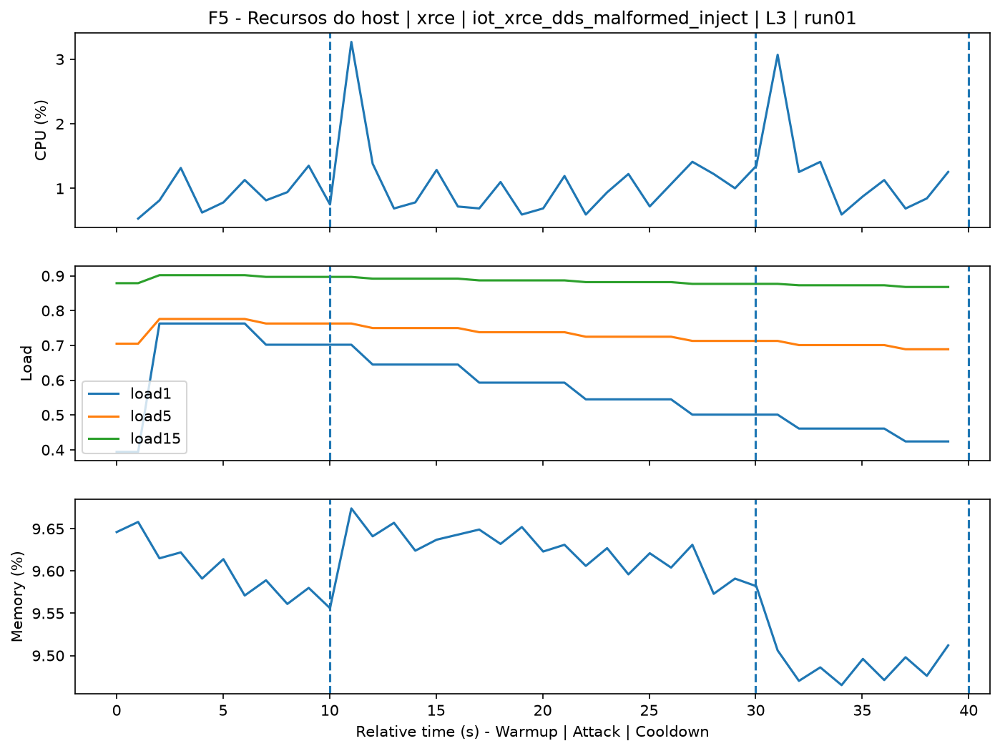
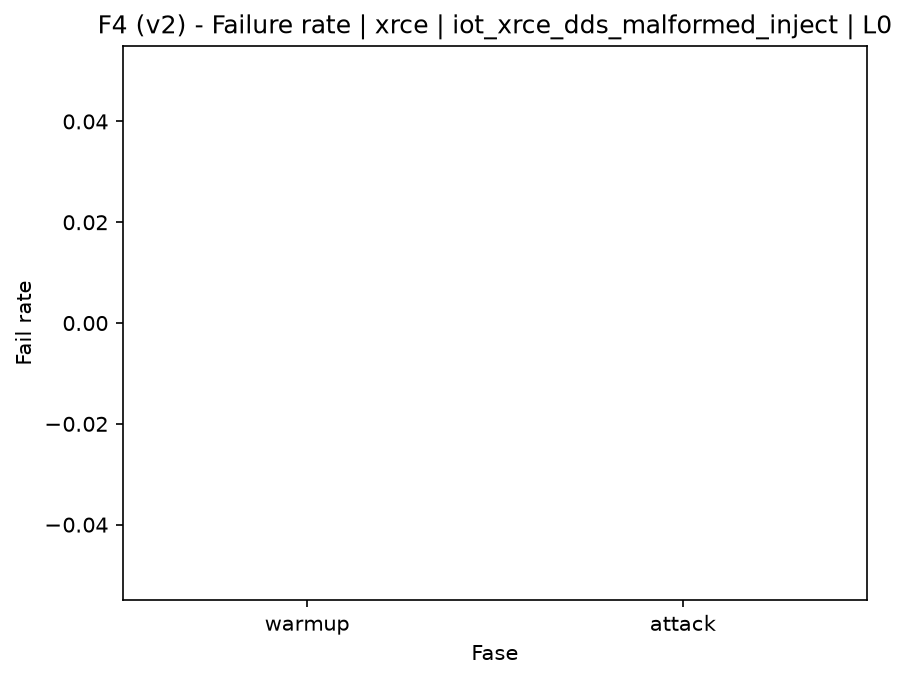
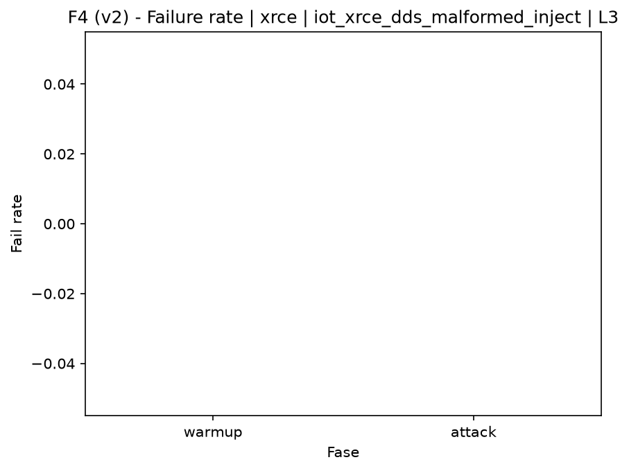

# XRCE-DDS Malformed Injection (`iot_xrce_dds_malformed_inject`)

[Campaign index](README.md)

This document summarizes the published campaign execution of attack `iot_xrce_dds_malformed_inject`. In the local catalog, the attack is described as: Injection of malformed XRCE-DDS publications or messages against the agent to trigger errors, exceptions, or crashes. The full execution artifacts are not versioned in this repository; retrieve the generated dataset CSVs from the Figshare dataset linked in the campaign index. Raw PCAP captures are not included in that archive. The selected figures below are stored under `contrib/assets/campaign_doc`.

## Attack Metadata

| Field | Value |
| --- | --- |
| ID | `iot_xrce_dds_malformed_inject` |
| Category | 7) IoT |
| Subcategory | 7.1 IoT Protocols / XRCE-DDS |
| Target services | xrce-dds-agent |
| Image | `attack-xrce-dds-malformed-inject:latest` |
| Container | `attack-xrce-dds-malformed-inject` |
| Catalog max runtime | 30 s |
| Intensity parameters | duration_s |
| MITRE ATT&CK | [https://attack.mitre.org/tactics/TA0043/](https://attack.mitre.org/tactics/TA0043/) [https://attack.mitre.org/tactics/TA0001/](https://attack.mitre.org/tactics/TA0001/) [https://attack.mitre.org/tactics/TA0040/](https://attack.mitre.org/tactics/TA0040/) [https://attack.mitre.org/techniques/T1595/](https://attack.mitre.org/techniques/T1595/) [https://attack.mitre.org/techniques/T1595/002/](https://attack.mitre.org/techniques/T1595/002/) [https://attack.mitre.org/techniques/T1190/](https://attack.mitre.org/techniques/T1190/) [https://attack.mitre.org/techniques/T1499/](https://attack.mitre.org/techniques/T1499/) [https://attack.mitre.org/techniques/T1499/004/](https://attack.mitre.org/techniques/T1499/004/) |

## Statistical Summary by Level

| Level | Service | Runs | Attack samples | Mean success | Mean failure | Lat p50/p95 ms | Total PCAP MB | Mean dataset (min-max) | Mean exec s | Extractors ok/total | Mean/max CPU | Mean mem MB |
| --- | --- | --- | --- | --- | --- | --- | --- | --- | --- | --- | --- | --- |
| L0 | xrce | 5 | 100 | 100% | 0% | 500,73 / 500,85 | 0,05 | 234 (234-234) | 41,95 | 3/3 | 34,28% / 48,76% | 1.719,06 |
| L1 | xrce | 5 | 100 | 100% | 0% | 500,71 / 501,01 | 0,17 | 498 (498-498) | 41,79 | 3/3 | 36,78% / 54,3% | 1.717,75 |
| L2 | xrce | 5 | 100 | 100% | 0% | 500,7 / 500,8 | 0,17 | 498 (498-498) | 41,77 | 3/3 | 36,17% / 63,3% | 1.715,99 |
| L3 | xrce | 5 | 100 | 100% | 0% | 500,73 / 500,87 | 0,17 | 498 (498-498) | 41,77 | 3/3 | 35,21% / 49,81% | 1.716,03 |

## Stability Across Reruns

| Level | Metric | Runs | Mean | Deviation | CV | Min | Max |
| --- | --- | --- | --- | --- | --- | --- | --- |
| L0 | Mean CPU in attack phase | 5 | 34,28 | 2,51 | 7,31% | 32,59 | 38,6 |
| L0 | Dataset rows | 5 | 234 | 0 | 0% | 234 | 234 |
| L0 | Execution time | 5 | 41,95 | 0,4 | 0,94% | 41,73 | 42,65 |
| L0 | Failure in attack phase | 5 | 0 | 0 | n/a | 0 | 0 |
| L0 | Censored p95 latency | 5 | 500,85 | 0,08 | 0,02% | 500,78 | 500,99 |
| L1 | Mean CPU in attack phase | 5 | 36,78 | 2 | 5,45% | 33,75 | 39,12 |
| L1 | Dataset rows | 5 | 498 | 0 | 0% | 498 | 498 |
| L1 | Execution time | 5 | 41,79 | 0,08 | 0,19% | 41,71 | 41,91 |
| L1 | Failure in attack phase | 5 | 0 | 0 | n/a | 0 | 0 |
| L1 | Censored p95 latency | 5 | 501,01 | 0,21 | 0,04% | 500,8 | 501,29 |
| L2 | Mean CPU in attack phase | 5 | 36,17 | 1,4 | 3,86% | 34,73 | 38,49 |
| L2 | Dataset rows | 5 | 498 | 0 | 0% | 498 | 498 |
| L2 | Execution time | 5 | 41,77 | 0,02 | 0,05% | 41,75 | 41,8 |
| L2 | Failure in attack phase | 5 | 0 | 0 | n/a | 0 | 0 |
| L2 | Censored p95 latency | 5 | 500,8 | 0,08 | 0,02% | 500,72 | 500,94 |
| L3 | Mean CPU in attack phase | 5 | 35,21 | 2,61 | 7,41% | 33,56 | 39,77 |
| L3 | Dataset rows | 5 | 498 | 0 | 0% | 498 | 498 |
| L3 | Execution time | 5 | 41,77 | 0,03 | 0,07% | 41,72 | 41,8 |
| L3 | Failure in attack phase | 5 | 0 | 0 | n/a | 0 | 0 |
| L3 | Censored p95 latency | 5 | 500,87 | 0,09 | 0,02% | 500,75 | 500,96 |

## Artifact Validation

| Level | Runs | Capture | Probe | Features | Dataset | Resources | Server stats | Acceptance |
| --- | --- | --- | --- | --- | --- | --- | --- | --- |
| L0 | 5 | 5/5 | 5/5 | 5/5 | 5/5 | 5/5 | 5/5 | 5/5 |
| L1 | 5 | 5/5 | 5/5 | 5/5 | 5/5 | 5/5 | 5/5 | 5/5 |
| L2 | 5 | 5/5 | 5/5 | 5/5 | 5/5 | 5/5 | 5/5 | 5/5 |
| L3 | 5 | 5/5 | 5/5 | 5/5 | 5/5 | 5/5 | 5/5 | 5/5 |

## Selected Figures

<table>
<tr>
<td> Time series L0 run01</td>
<td> Time series L1 run01</td>
</tr>
<tr>
<td> Time series L2 run01</td>
<td> Time series L3 run01</td>
</tr>
<tr>
<td> Resources L0 run01</td>
<td> Resources L3 run01</td>
</tr>
<tr>
<td> Failure rate L0</td>
<td> Failure rate L3</td>
</tr>
</table>

## Sources Used

- Attack catalog: `docker/attackers/xrce-dds-malformed-inject/attack.yaml`
- Full campaign artifacts: available from the Figshare dataset linked in the campaign index; when extracted locally, expected under `experiments/all_5runs_4levels/iot_xrce_dds_malformed_inject`.
