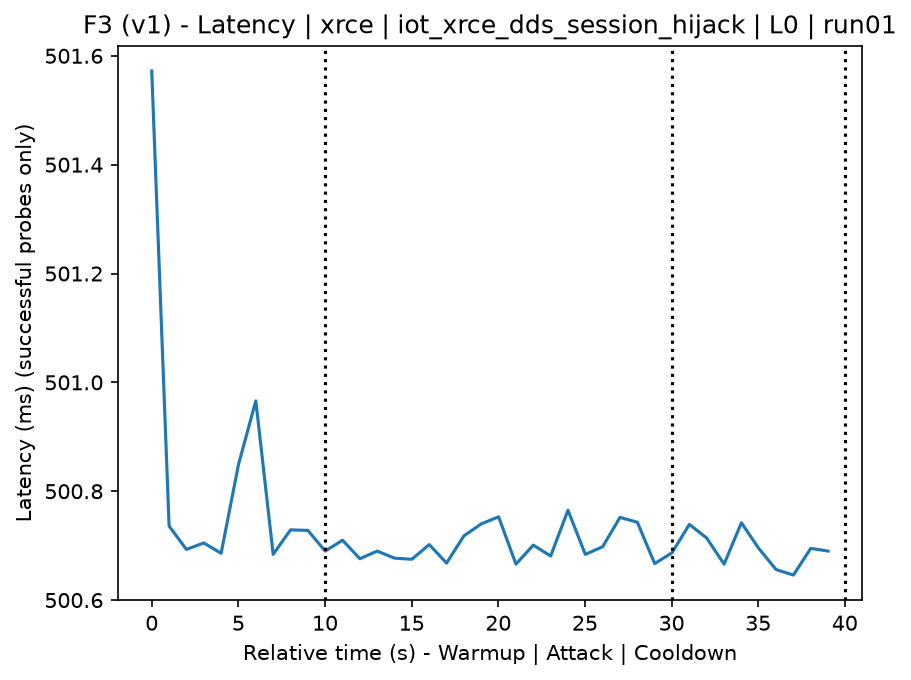
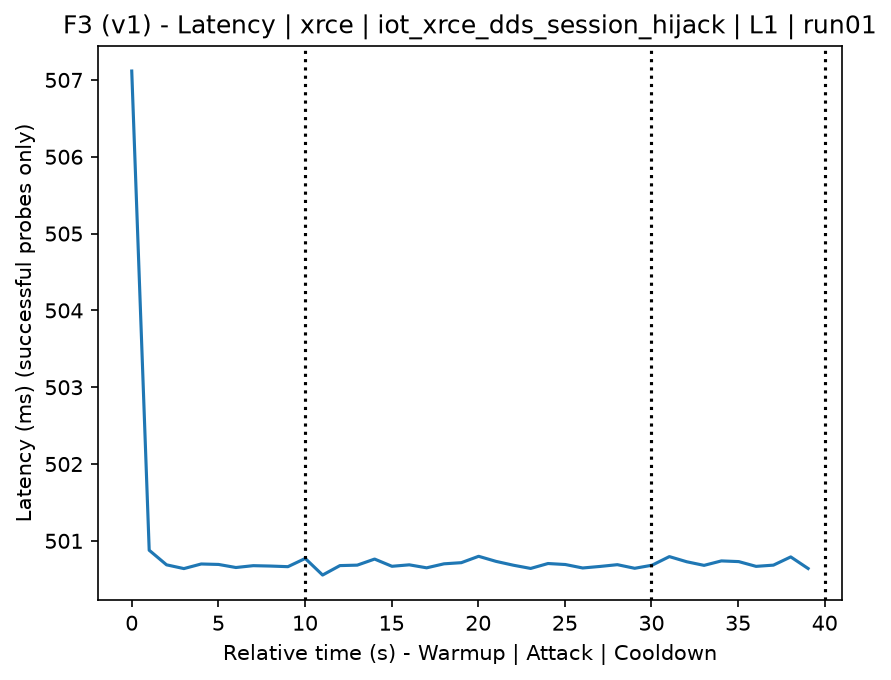
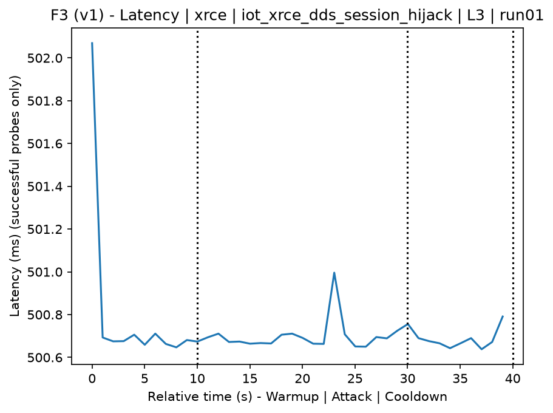
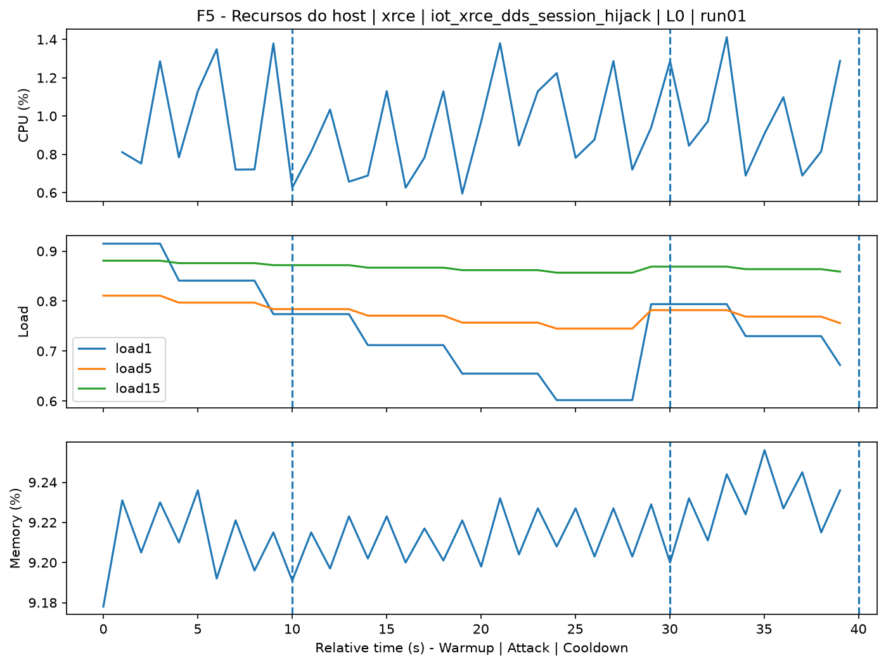
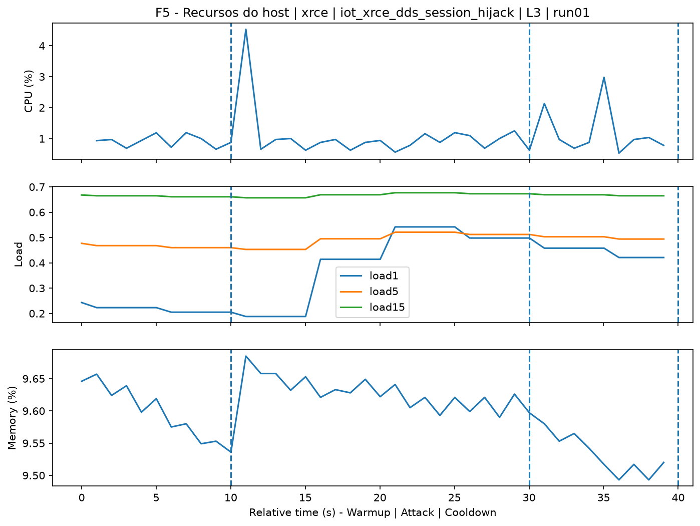
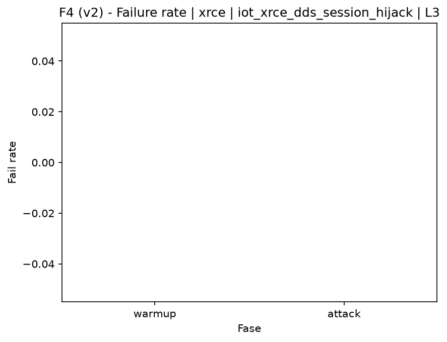

# XRCE-DDS Session Hijack (`iot_xrce_dds_session_hijack`)

[Campaign index](README.md)

This document summarizes the published campaign execution of attack `iot_xrce_dds_session_hijack`. In the local catalog, the attack is described as: XRCE-DDS session hijacking or collision attempts through manipulation of identifiers, keys, or session fields. The full execution artifacts are not versioned in this repository; retrieve the generated dataset CSVs from the Figshare dataset linked in the campaign index. Raw PCAP captures are not included in that archive. The selected figures below are stored under `contrib/assets/campaign_doc`.

## Attack Metadata

| Field | Value |
| --- | --- |
| ID | `iot_xrce_dds_session_hijack` |
| Category | 7) IoT |
| Subcategory | 7.1 IoT Protocols / XRCE-DDS |
| Target services | xrce-dds-agent |
| Image | `attack-xrce-dds-session-hijack:latest` |
| Container | `attack-xrce-dds-session-hijack` |
| Catalog max runtime | 30 s |
| Intensity parameters | duration_s |
| MITRE ATT&CK | [https://attack.mitre.org/tactics/TA0008/](https://attack.mitre.org/tactics/TA0008/) [https://attack.mitre.org/tactics/TA0040/](https://attack.mitre.org/tactics/TA0040/) [https://attack.mitre.org/techniques/T1563/](https://attack.mitre.org/techniques/T1563/) [https://attack.mitre.org/techniques/T1565/](https://attack.mitre.org/techniques/T1565/) [https://attack.mitre.org/techniques/T1565/002/](https://attack.mitre.org/techniques/T1565/002/) |

## Statistical Summary by Level

| Level | Service | Runs | Attack samples | Mean success | Mean failure | Lat p50/p95 ms | Total PCAP MB | Mean dataset (min-max) | Mean exec s | Extractors ok/total | Mean/max CPU | Mean mem MB |
| --- | --- | --- | --- | --- | --- | --- | --- | --- | --- | --- | --- | --- |
| L0 | xrce | 5 | 100 | 100% | 0% | 500,7 / 500,78 | 0,05 | 234 (234-234) | 41,92 | 3/3 | 33,83% / 47,68% | 1.715,84 |
| L1 | xrce | 5 | 100 | 100% | 0% | 500,71 / 500,96 | 0,19 | 546 (546-546) | 41,85 | 3/3 | 38,03% / 56,34% | 1.717,34 |
| L2 | xrce | 5 | 100 | 100% | 0% | 500,71 / 500,86 | 0,19 | 551 (546-558) | 41,82 | 3/3 | 35,8% / 53,03% | 1.717,9 |
| L3 | xrce | 5 | 100 | 100% | 0% | 500,7 / 500,79 | 0,19 | 548 (546-558) | 41,76 | 3/3 | 36,84% / 64,39% | 1.717,77 |

## Stability Across Reruns

| Level | Metric | Runs | Mean | Deviation | CV | Min | Max |
| --- | --- | --- | --- | --- | --- | --- | --- |
| L0 | Mean CPU in attack phase | 5 | 33,83 | 1,35 | 4% | 32,29 | 35,55 |
| L0 | Dataset rows | 5 | 234 | 0 | 0% | 234 | 234 |
| L0 | Execution time | 5 | 41,92 | 0,33 | 0,78% | 41,72 | 42,5 |
| L0 | Failure in attack phase | 5 | 0 | 0 | n/a | 0 | 0 |
| L0 | Censored p95 latency | 5 | 500,78 | 0,07 | 0,01% | 500,73 | 500,91 |
| L1 | Mean CPU in attack phase | 5 | 38,03 | 1,24 | 3,26% | 37,18 | 40,21 |
| L1 | Dataset rows | 5 | 546 | 0 | 0% | 546 | 546 |
| L1 | Execution time | 5 | 41,85 | 0,03 | 0,08% | 41,82 | 41,9 |
| L1 | Failure in attack phase | 5 | 0 | 0 | n/a | 0 | 0 |
| L1 | Censored p95 latency | 5 | 500,96 | 0,17 | 0,03% | 500,77 | 501,22 |
| L2 | Mean CPU in attack phase | 5 | 35,8 | 1,12 | 3,14% | 34,92 | 37,67 |
| L2 | Dataset rows | 5 | 550,8 | 6,57 | 1,19% | 546 | 558 |
| L2 | Execution time | 5 | 41,82 | 0,02 | 0,05% | 41,8 | 41,85 |
| L2 | Failure in attack phase | 5 | 0 | 0 | n/a | 0 | 0 |
| L2 | Censored p95 latency | 5 | 500,86 | 0,11 | 0,02% | 500,73 | 500,98 |
| L3 | Mean CPU in attack phase | 5 | 36,84 | 2,6 | 7,06% | 34,14 | 39,95 |
| L3 | Dataset rows | 5 | 548,4 | 5,37 | 0,98% | 546 | 558 |
| L3 | Execution time | 5 | 41,76 | 0,06 | 0,14% | 41,67 | 41,82 |
| L3 | Failure in attack phase | 5 | 0 | 0 | n/a | 0 | 0 |
| L3 | Censored p95 latency | 5 | 500,79 | 0,08 | 0,02% | 500,72 | 500,92 |

## Artifact Validation

| Level | Runs | Capture | Probe | Features | Dataset | Resources | Server stats | Acceptance |
| --- | --- | --- | --- | --- | --- | --- | --- | --- |
| L0 | 5 | 5/5 | 5/5 | 5/5 | 5/5 | 5/5 | 5/5 | 5/5 |
| L1 | 5 | 5/5 | 5/5 | 5/5 | 5/5 | 5/5 | 5/5 | 5/5 |
| L2 | 5 | 5/5 | 5/5 | 5/5 | 5/5 | 5/5 | 5/5 | 5/5 |
| L3 | 5 | 5/5 | 5/5 | 5/5 | 5/5 | 5/5 | 5/5 | 5/5 |

## Selected Figures

<table>
<tr>
<td> Time series L0 run01</td>
<td> Time series L1 run01</td>
</tr>
<tr>
<td> Time series L2 run01</td>
<td> Time series L3 run01</td>
</tr>
<tr>
<td> Resources L0 run01</td>
<td> Resources L3 run01</td>
</tr>
<tr>
<td> Failure rate L0</td>
<td> Failure rate L3</td>
</tr>
</table>

## Sources Used

- Attack catalog: `docker/attackers/xrce-dds-session-hijack/attack.yaml`
- Full campaign artifacts: available from the Figshare dataset linked in the campaign index; when extracted locally, expected under `experiments/60att_5runs_l0l1l2l3/iot_xrce_dds_session_hijack`.
