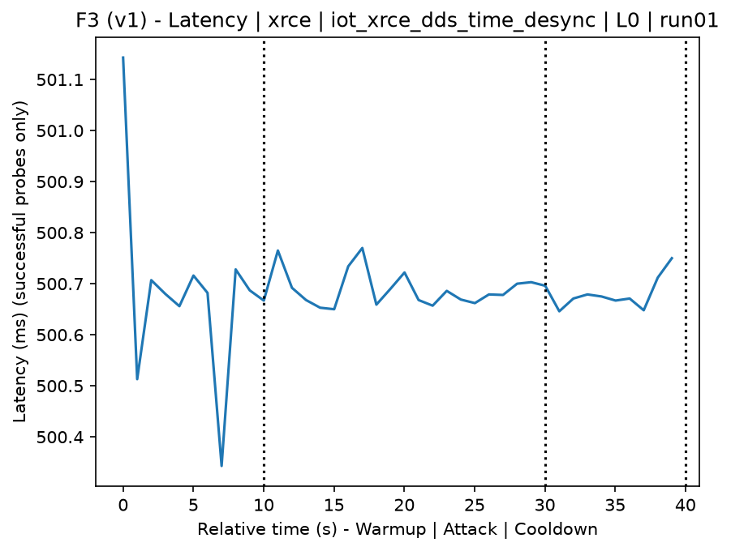
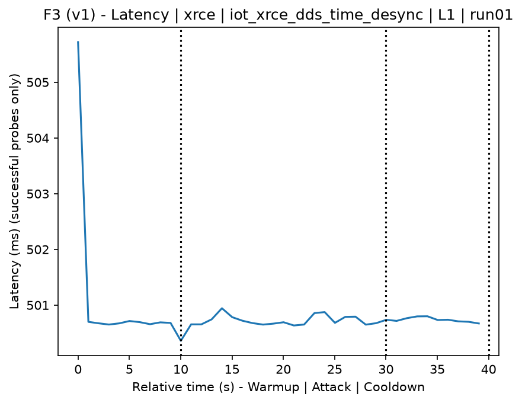
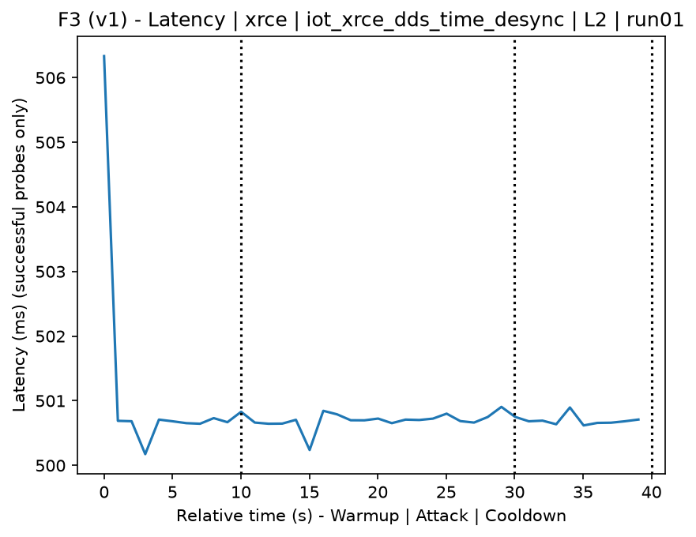
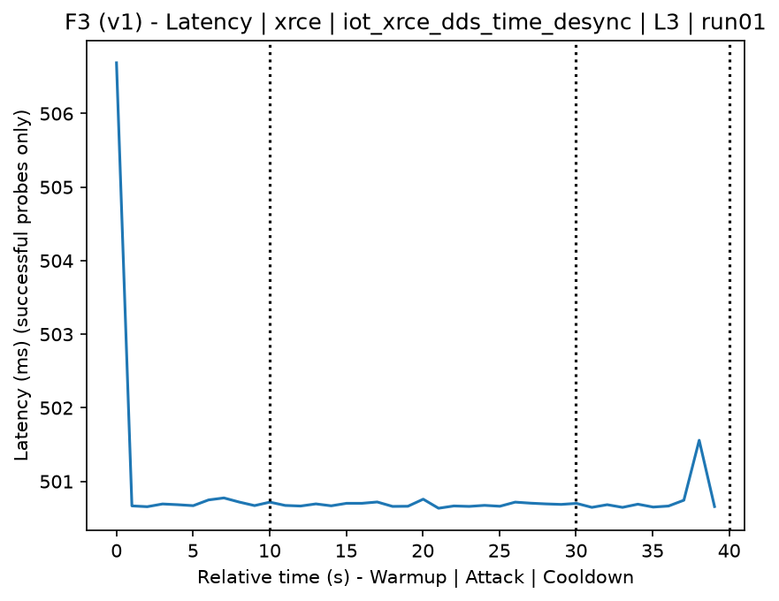
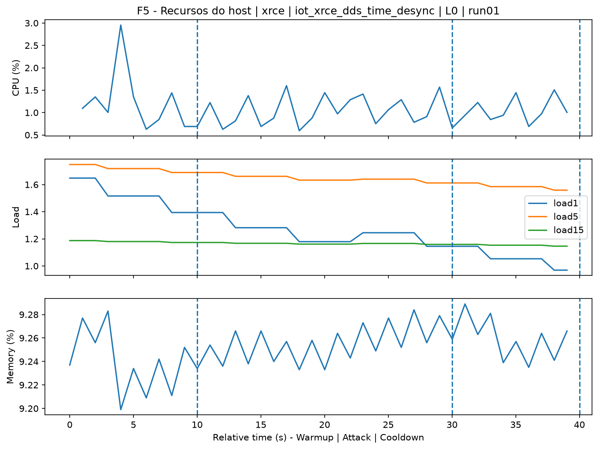
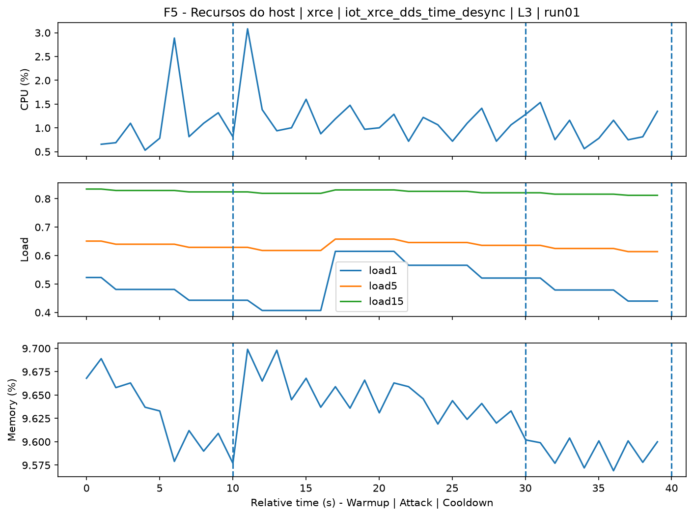
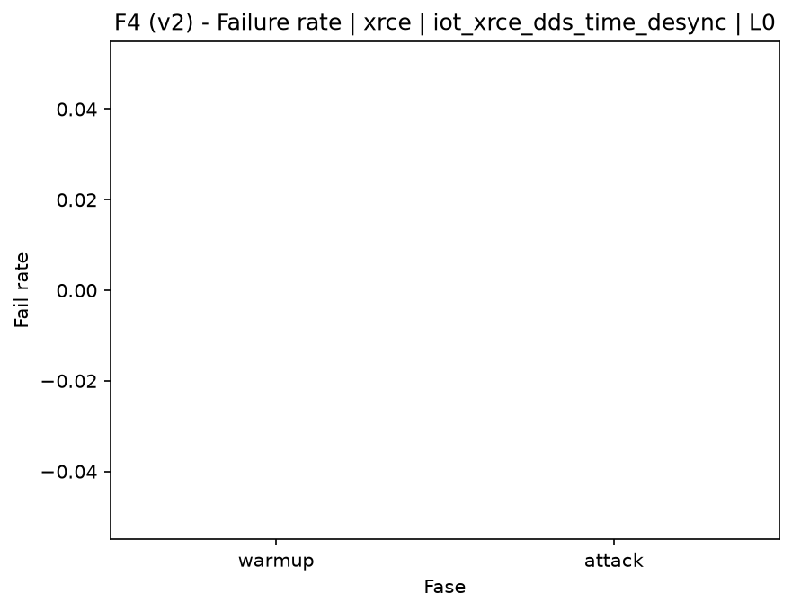
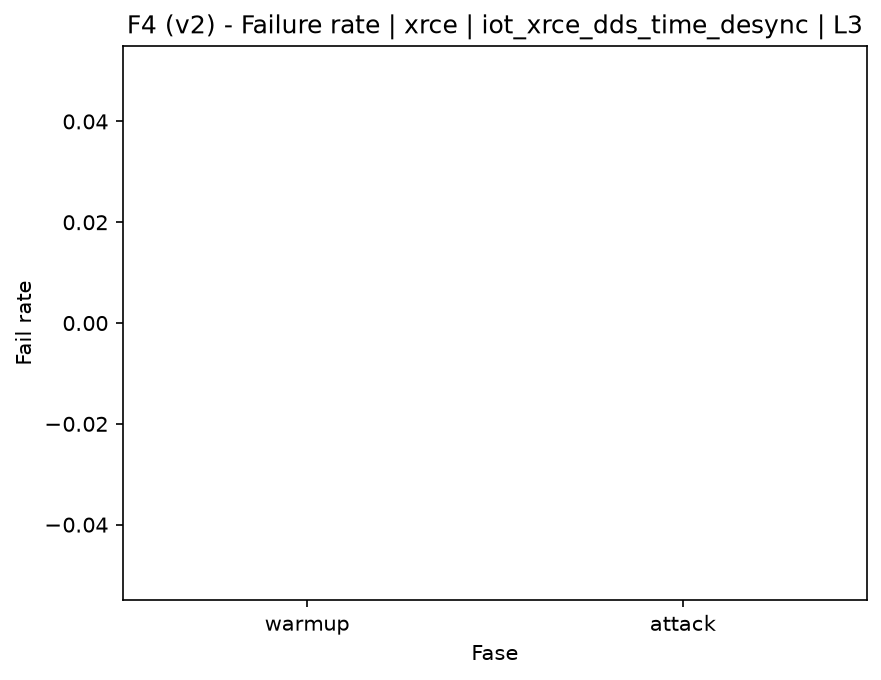

# XRCE-DDS Time Desynchronization (`iot_xrce_dds_time_desync`)

[Campaign index](README.md)

In campaign `experiments/60att_5runs_l0l1l2l3`, this document consolidates the execution of attack `iot_xrce_dds_time_desync`. In the local catalog, the attack is described as: Manipulation of XRCE-DDS messages and time-related fields to induce logical desynchronization between client and agent. The documentation below uses only artifacts already present in the repository, mainly the tables and figures from `experiments/60att_5runs_l0l1l2l3/iot_xrce_dds_time_desync`.

## Attack Metadata

| Field | Value |
| --- | --- |
| ID | `iot_xrce_dds_time_desync` |
| Category | 7) IoT |
| Subcategory | 7.1 IoT Protocols / XRCE-DDS |
| Target services | xrce-dds-agent |
| Image | `attack-xrce-dds-time-desync:latest` |
| Container | `attack-xrce-dds-time-desync` |
| Catalog max runtime | 30 s |
| Intensity parameters | duration_s |
| MITRE ATT&CK | [https://attack.mitre.org/tactics/TA0040/](https://attack.mitre.org/tactics/TA0040/) [https://attack.mitre.org/techniques/T1565/](https://attack.mitre.org/techniques/T1565/) [https://attack.mitre.org/techniques/T1565/002/](https://attack.mitre.org/techniques/T1565/002/) |

## Statistical Summary by Level

| Level | Service | Runs | Attack samples | Mean success | Mean failure | Lat p50/p95 ms | Total PCAP MB | Mean dataset (min-max) | Mean exec s | Extractors ok/total | Mean/max CPU | Mean mem MB |
| --- | --- | --- | --- | --- | --- | --- | --- | --- | --- | --- | --- | --- |
| L0 | xrce | 5 | 100 | 100% | 0% | 500,69 / 500,81 | 0,05 | 234 (234-234) | 41,92 | 3/3 | 34,13% / 46,4% | 1.716,91 |
| L1 | xrce | 5 | 100 | 100% | 0% | 500,67 / 500,77 | 5,18 | 24.714 (24.714-24.714) | 45,2 | 3/3 | 33,77% / 49,1% | 1.716,93 |
| L2 | xrce | 5 | 100 | 100% | 0% | 500,72 / 500,86 | 5,18 | 24.714 (24.714-24.714) | 45,19 | 3/3 | 34,94% / 51,91% | 1.716,91 |
| L3 | xrce | 5 | 100 | 100% | 0% | 500,7 / 500,84 | 5,18 | 24.714 (24.714-24.714) | 45,17 | 3/3 | 36,41% / 51,81% | 1.716,93 |

## Stability Across Reruns

| Level | Metric | Runs | Mean | Deviation | CV | Min | Max |
| --- | --- | --- | --- | --- | --- | --- | --- |
| L0 | Mean CPU in attack phase | 5 | 34,13 | 2,93 | 8,6% | 31,82 | 38,2 |
| L0 | Dataset rows | 5 | 234 | 0 | 0% | 234 | 234 |
| L0 | Execution time | 5 | 41,92 | 0,38 | 0,91% | 41,7 | 42,6 |
| L0 | Failure in attack phase | 5 | 0 | 0 | n/a | 0 | 0 |
| L0 | Censored p95 latency | 5 | 500,81 | 0,06 | 0,01% | 500,77 | 500,89 |
| L1 | Mean CPU in attack phase | 5 | 33,77 | 1,87 | 5,55% | 32,06 | 36,57 |
| L1 | Dataset rows | 5 | 24.714 | 0 | 0% | 24.714 | 24.714 |
| L1 | Execution time | 5 | 45,2 | 0,03 | 0,07% | 45,17 | 45,25 |
| L1 | Failure in attack phase | 5 | 0 | 0 | n/a | 0 | 0 |
| L1 | Censored p95 latency | 5 | 500,77 | 0,07 | 0,01% | 500,71 | 500,88 |
| L2 | Mean CPU in attack phase | 5 | 34,94 | 3,75 | 10,73% | 29,82 | 38,61 |
| L2 | Dataset rows | 5 | 24.714 | 0 | 0% | 24.714 | 24.714 |
| L2 | Execution time | 5 | 45,19 | 0,05 | 0,1% | 45,11 | 45,23 |
| L2 | Failure in attack phase | 5 | 0 | 0 | n/a | 0 | 0 |
| L2 | Censored p95 latency | 5 | 500,86 | 0,12 | 0,02% | 500,72 | 501,03 |
| L3 | Mean CPU in attack phase | 5 | 36,41 | 1,8 | 4,96% | 34,67 | 38,67 |
| L3 | Dataset rows | 5 | 24.714 | 0 | 0% | 24.714 | 24.714 |
| L3 | Execution time | 5 | 45,17 | 0,05 | 0,12% | 45,11 | 45,24 |
| L3 | Failure in attack phase | 5 | 0 | 0 | n/a | 0 | 0 |
| L3 | Censored p95 latency | 5 | 500,84 | 0,1 | 0,02% | 500,72 | 500,95 |

## Artifact Validation

| Level | Runs | Capture | Probe | Features | Dataset | Resources | Server stats | Acceptance |
| --- | --- | --- | --- | --- | --- | --- | --- | --- |
| L0 | 5 | 5/5 | 5/5 | 5/5 | 5/5 | 5/5 | 5/5 | 5/5 |
| L1 | 5 | 5/5 | 5/5 | 5/5 | 5/5 | 5/5 | 5/5 | 5/5 |
| L2 | 5 | 5/5 | 5/5 | 5/5 | 5/5 | 5/5 | 5/5 | 5/5 |
| L3 | 5 | 5/5 | 5/5 | 5/5 | 5/5 | 5/5 | 5/5 | 5/5 |

## Selected Figures

<table>
<tr>
<td> Time series L0 run01</td>
<td> Time series L1 run01</td>
</tr>
<tr>
<td> Time series L2 run01</td>
<td> Time series L3 run01</td>
</tr>
<tr>
<td> Resources L0 run01</td>
<td> Resources L3 run01</td>
</tr>
<tr>
<td> Failure rate L0</td>
<td> Failure rate L3</td>
</tr>
</table>

## Sources Used

- Attack catalog: `docker/attackers/xrce-dds-time-desync/attack.yaml`
- Campaign artifacts: `experiments/60att_5runs_l0l1l2l3/iot_xrce_dds_time_desync`
