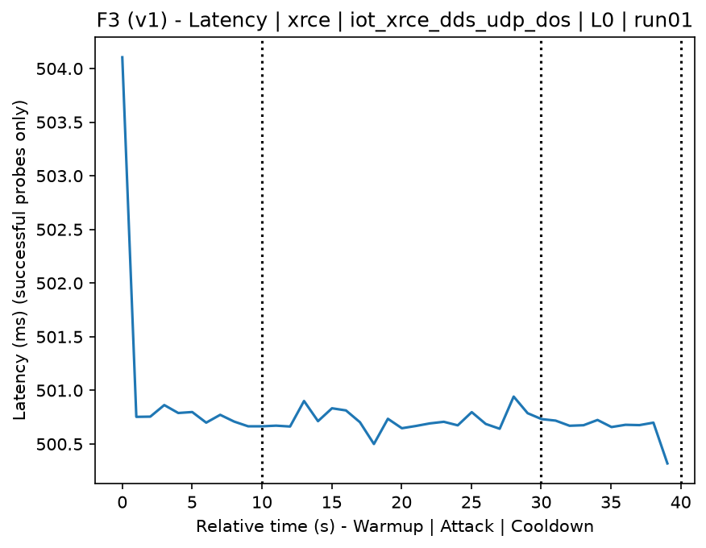
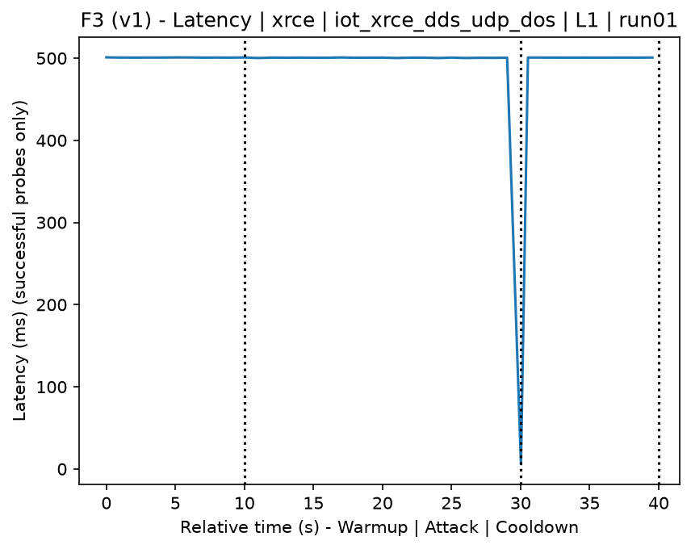
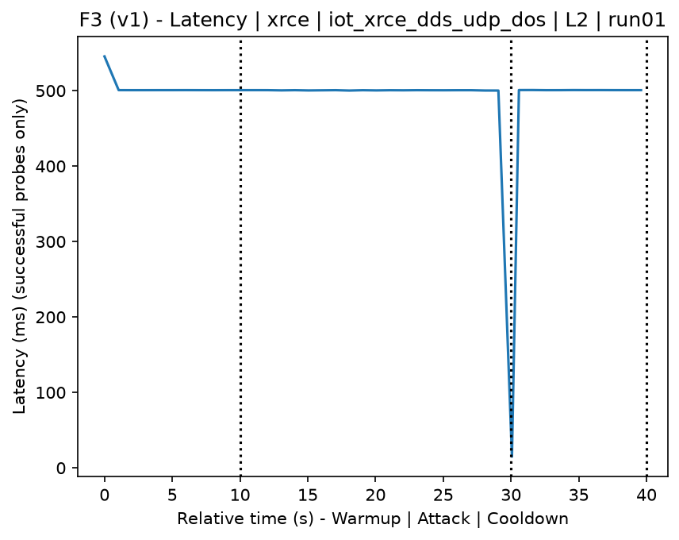
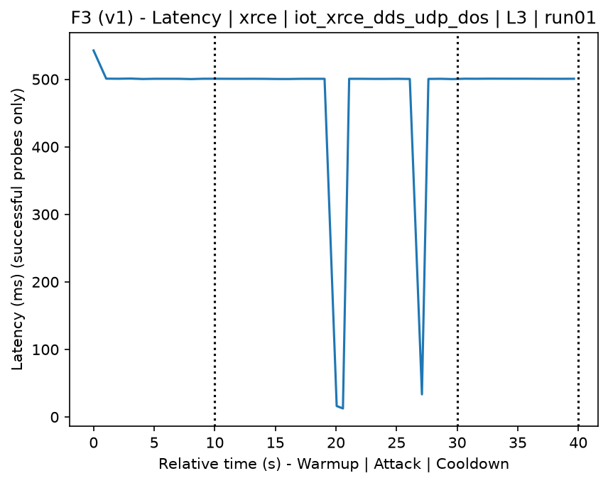
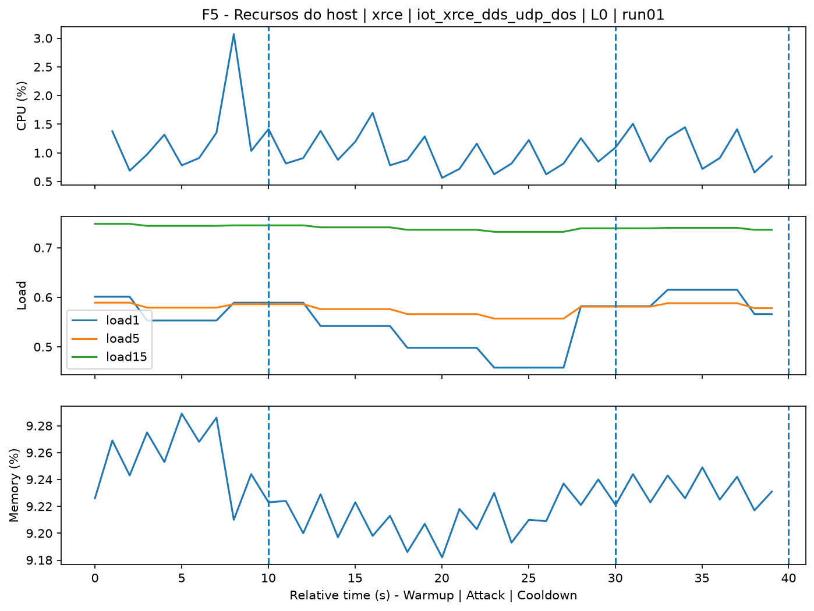
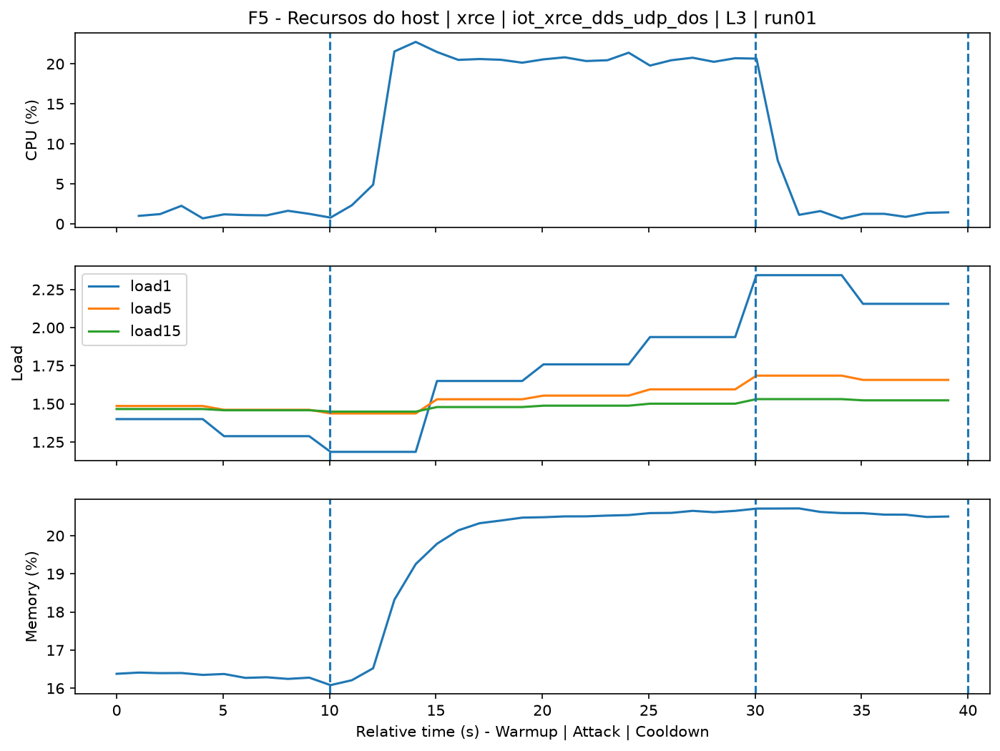
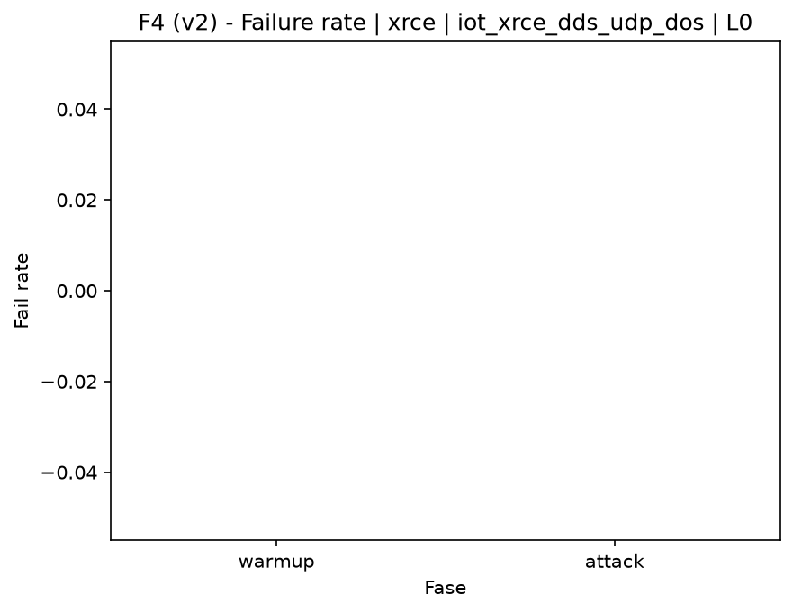
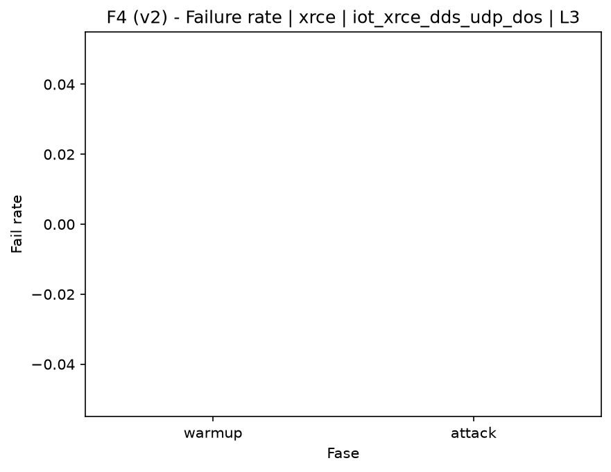

# XRCE-DDS UDP DoS (`iot_xrce_dds_udp_dos`)

[Campaign index](README.md)

This document summarizes the published campaign execution of attack `iot_xrce_dds_udp_dos`. In the local catalog, the attack is described as: UDP packet flood against the XRCE-DDS agent to degrade network or service availability. The full execution artifacts are not versioned in this repository; retrieve the generated dataset CSVs from the Figshare dataset linked in the campaign index. Raw PCAP captures are not included in that archive. The selected figures below are stored under `contrib/assets/campaign_doc`.

## Attack Metadata

| Field | Value |
| --- | --- |
| ID | `iot_xrce_dds_udp_dos` |
| Category | 7) IoT |
| Subcategory | 7.1 IoT Protocols / XRCE-DDS |
| Target services | xrce-dds-agent |
| Image | `attack-xrce-dds-udp-dos:latest` |
| Container | `attack-xrce-dds-udp-dos` |
| Catalog max runtime | 10 s |
| Intensity parameters | duration_s |
| MITRE ATT&CK | [https://attack.mitre.org/tactics/TA0040/](https://attack.mitre.org/tactics/TA0040/) [https://attack.mitre.org/techniques/T1498/](https://attack.mitre.org/techniques/T1498/) [https://attack.mitre.org/techniques/T1498/001/](https://attack.mitre.org/techniques/T1498/001/) [https://attack.mitre.org/techniques/T1499/](https://attack.mitre.org/techniques/T1499/) [https://attack.mitre.org/techniques/T1499/002/](https://attack.mitre.org/techniques/T1499/002/) |

## Statistical Summary by Level

| Level | Service | Runs | Attack samples | Mean success | Mean failure | Lat p50/p95 ms | Total PCAP MB | Mean dataset (min-max) | Mean exec s | Extractors ok/total | Mean/max CPU | Mean mem MB |
| --- | --- | --- | --- | --- | --- | --- | --- | --- | --- | --- | --- | --- |
| L0 | xrce | 5 | 100 | 100% | 0% | 500,69 / 500,81 | 0,05 | 234 (234-234) | 41,93 | 3/3 | 34,2% / 50,77% | 1.716,91 |
| L1 | xrce | 5 | 107 | 100% | 0% | 500,57 / 500,78 | 2.188,72 | 10.205.420 (7.981.848-10.934.412) | 1.515,98 | 3/3 | 192,92% / 230,01% | 1.716,91 |
| L2 | xrce | 5 | 105 | 100% | 0% | 500,48 / 500,69 | 2.297,12 | 10.709.760 (10.578.440-10.941.214) | 1.597,04 | 3/3 | 198,13% / 228,86% | 1.716,91 |
| L3 | xrce | 5 | 104 | 100% | 0% | 500,6 / 500,68 | 2.287,81 | 10.666.311 (9.928.674-11.018.584) | 1.599,34 | 3/3 | 195,4% / 228,67% | 1.716,91 |

## Stability Across Reruns

| Level | Metric | Runs | Mean | Deviation | CV | Min | Max |
| --- | --- | --- | --- | --- | --- | --- | --- |
| L0 | Mean CPU in attack phase | 5 | 34,2 | 2,1 | 6,13% | 31,87 | 37,37 |
| L0 | Dataset rows | 5 | 234 | 0 | 0% | 234 | 234 |
| L0 | Execution time | 5 | 41,93 | 0,35 | 0,84% | 41,75 | 42,57 |
| L0 | Failure in attack phase | 5 | 0 | 0 | n/a | 0 | 0 |
| L0 | Censored p95 latency | 5 | 500,81 | 0,09 | 0,02% | 500,69 | 500,91 |
| L1 | Mean CPU in attack phase | 5 | 192,92 | 17,36 | 9% | 162,65 | 204,11 |
| L1 | Dataset rows | 5 | 10.205.419,6 | 1.250.996,32 | 12,26% | 7.981.848 | 10.934.412 |
| L1 | Execution time | 5 | 1.515,98 | 181,12 | 11,95% | 1.193,15 | 1.614,74 |
| L1 | Failure in attack phase | 5 | 0 | 0 | n/a | 0 | 0 |
| L1 | Censored p95 latency | 5 | 500,78 | 0,07 | 0,01% | 500,71 | 500,85 |
| L2 | Mean CPU in attack phase | 5 | 198,13 | 0,97 | 0,49% | 196,66 | 199,3 |
| L2 | Dataset rows | 5 | 10.709.760,4 | 175.936,02 | 1,64% | 10.578.440 | 10.941.214 |
| L2 | Execution time | 5 | 1.597,04 | 21,47 | 1,34% | 1.574,54 | 1.623,49 |
| L2 | Failure in attack phase | 5 | 0 | 0 | n/a | 0 | 0 |
| L2 | Censored p95 latency | 5 | 500,69 | 0,02 | 0% | 500,66 | 500,72 |
| L3 | Mean CPU in attack phase | 5 | 195,4 | 1,11 | 0,57% | 193,82 | 196,59 |
| L3 | Dataset rows | 5 | 10.666.310,8 | 456.689,09 | 4,28% | 9.928.674 | 11.018.584 |
| L3 | Execution time | 5 | 1.599,34 | 66,03 | 4,13% | 1.495,33 | 1.657,69 |
| L3 | Failure in attack phase | 5 | 0 | 0 | n/a | 0 | 0 |
| L3 | Censored p95 latency | 5 | 500,68 | 0,03 | 0,01% | 500,65 | 500,71 |

## Artifact Validation

| Level | Runs | Capture | Probe | Features | Dataset | Resources | Server stats | Acceptance |
| --- | --- | --- | --- | --- | --- | --- | --- | --- |
| L0 | 5 | 5/5 | 5/5 | 5/5 | 5/5 | 5/5 | 5/5 | 5/5 |
| L1 | 5 | 5/5 | 5/5 | 5/5 | 5/5 | 5/5 | 5/5 | 5/5 |
| L2 | 5 | 5/5 | 5/5 | 5/5 | 5/5 | 5/5 | 5/5 | 5/5 |
| L3 | 5 | 5/5 | 5/5 | 5/5 | 5/5 | 5/5 | 5/5 | 5/5 |

## Selected Figures

<table>
<tr>
<td> Time series L0 run01</td>
<td> Time series L1 run01</td>
</tr>
<tr>
<td> Time series L2 run01</td>
<td> Time series L3 run01</td>
</tr>
<tr>
<td> Resources L0 run01</td>
<td> Resources L3 run01</td>
</tr>
<tr>
<td> Failure rate L0</td>
<td> Failure rate L3</td>
</tr>
</table>

## Sources Used

- Attack catalog: `docker/attackers/xrce-dds-udp-dos/attack.yaml`
- Full campaign artifacts: available from the Figshare dataset linked in the campaign index; when extracted locally, expected under `experiments/60att_5runs_l0l1l2l3/iot_xrce_dds_udp_dos`.
