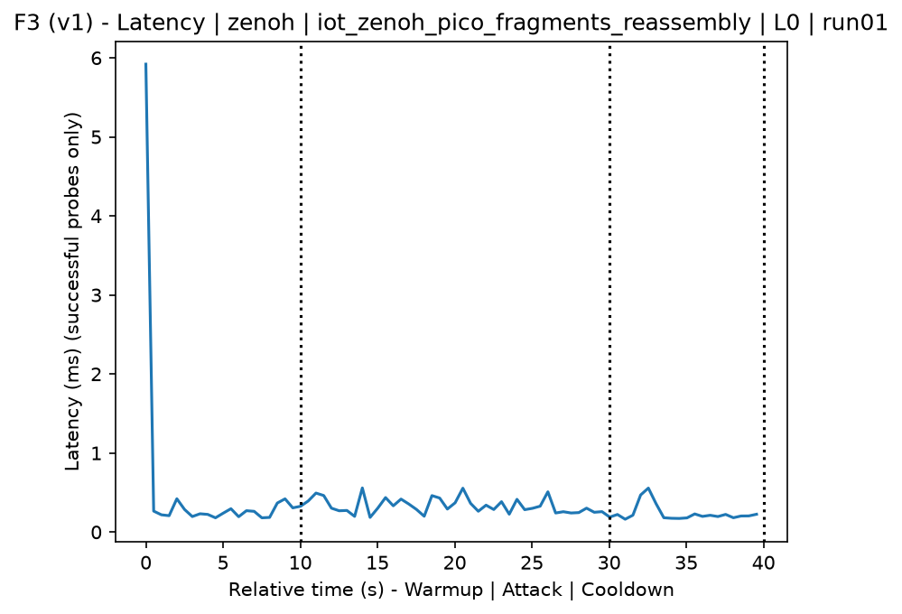
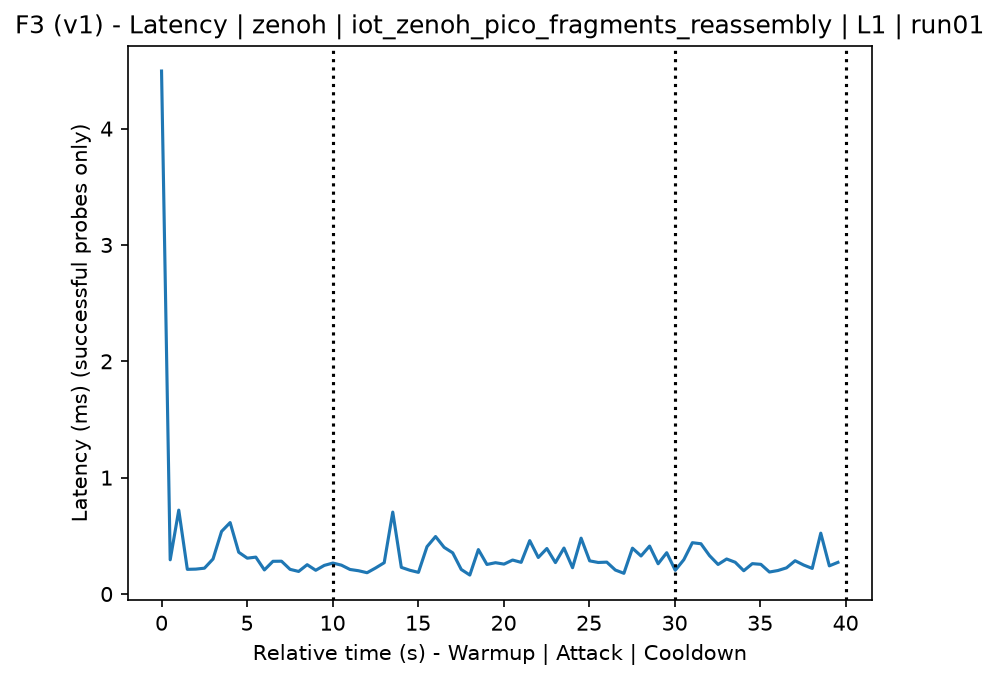
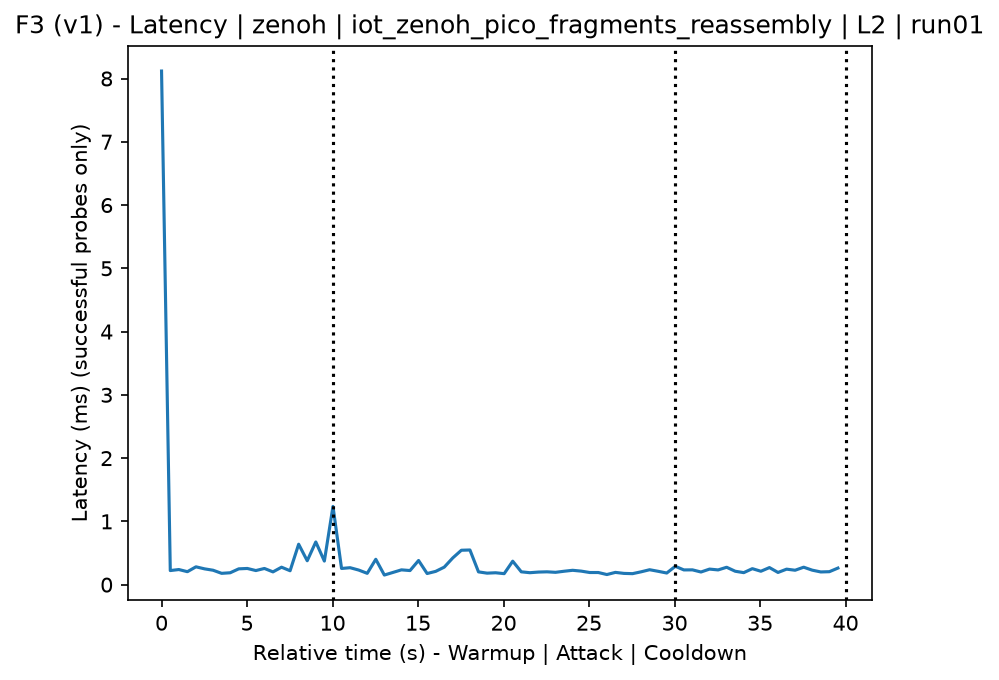
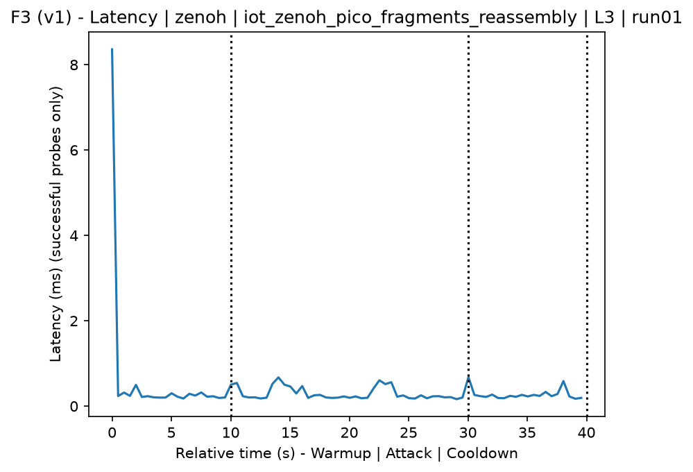
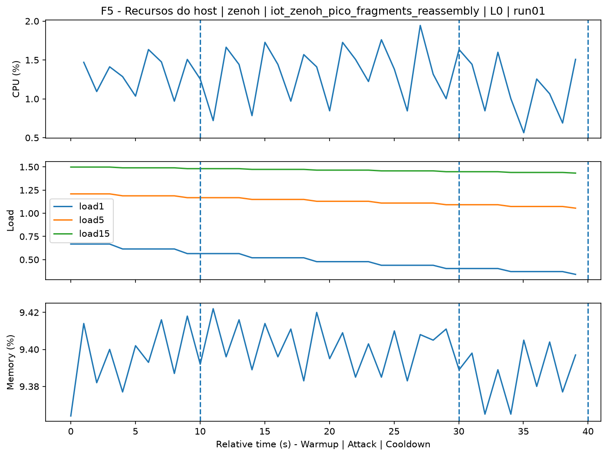
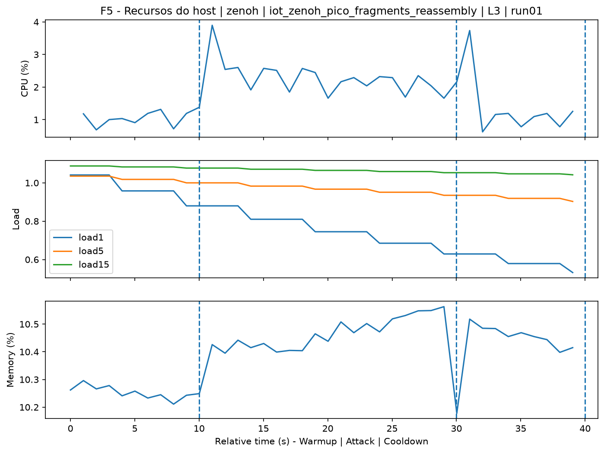
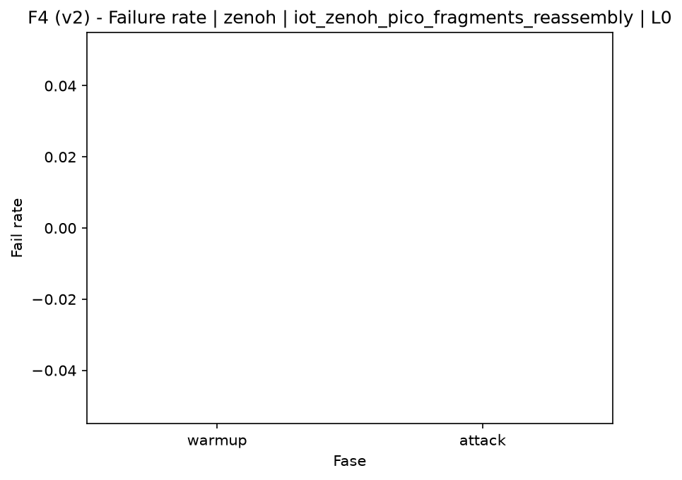

# Zenoh-Pico Fragment Reassembly Flood (`iot_zenoh_pico_fragments_reassembly`)

[Campaign index](README.md)

This document summarizes the published campaign execution of attack `iot_zenoh_pico_fragments_reassembly`. In the local catalog, the attack is described as: Flood of incomplete Zenoh/Zenoh-Pico fragments to stress router or peer buffers and reassembly logic. The full execution artifacts are not versioned in this repository; retrieve the generated dataset CSVs from the Figshare dataset linked in the campaign index. Raw PCAP captures are not included in that archive. The selected figures below are stored under `contrib/assets/campaign_doc`.

## Attack Metadata

| Field | Value |
| --- | --- |
| ID | `iot_zenoh_pico_fragments_reassembly` |
| Category | 7) IoT |
| Subcategory | 7.1 IoT Protocols / Zenoh |
| Target services | zenoh-router |
| Image | `attack-zenoh-pico-fragments-reassembly:latest` |
| Container | `attack-zenoh-pico-fragments-reassembly` |
| Catalog max runtime | 10 s |
| Intensity parameters | duration_s, threads |
| MITRE ATT&CK | [https://attack.mitre.org/tactics/TA0040/](https://attack.mitre.org/tactics/TA0040/) [https://attack.mitre.org/techniques/T1499/](https://attack.mitre.org/techniques/T1499/) [https://attack.mitre.org/techniques/T1499/003/](https://attack.mitre.org/techniques/T1499/003/) [https://attack.mitre.org/techniques/T1499/004/](https://attack.mitre.org/techniques/T1499/004/) |

## Statistical Summary by Level

| Level | Service | Runs | Attack samples | Mean success | Mean failure | Lat p50/p95 ms | Total PCAP MB | Mean dataset (min-max) | Mean exec s | Extractors ok/total | Mean/max CPU | Mean mem MB |
| --- | --- | --- | --- | --- | --- | --- | --- | --- | --- | --- | --- | --- |
| L0 | zenoh | 5 | 200 | 100% | 0% | 0,29 / 0,54 | 0,79 | 3.674 (3.646-3.712) | 42,62 | 3/3 | 0,12% / 0,19% | 5,46 |
| L1 | zenoh | 5 | 200 | 100% | 0% | 0,24 / 0,43 | 2.189,83 | 730.694 (715.666-737.236) | 153,91 | 3/3 | 0,1% / 0,13% | 5,45 |
| L2 | zenoh | 5 | 200 | 100% | 0% | 0,23 / 0,52 | 2.162,92 | 721.768 (669.372-736.626) | 152,59 | 3/3 | 0,11% / 0,16% | 5,45 |
| L3 | zenoh | 5 | 200 | 100% | 0% | 0,23 / 0,48 | 2.202,89 | 735.033 (730.466-738.156) | 154,74 | 3/3 | 0,11% / 0,16% | 5,45 |

## Stability Across Reruns

| Level | Metric | Runs | Mean | Deviation | CV | Min | Max |
| --- | --- | --- | --- | --- | --- | --- | --- |
| L0 | Mean CPU in attack phase | 5 | 0,12 | 0,01 | 6,09% | 0,11 | 0,13 |
| L0 | Dataset rows | 5 | 3.674 | 24,04 | 0,65% | 3.646 | 3.712 |
| L0 | Execution time | 5 | 42,62 | 0,65 | 1,53% | 42,23 | 43,79 |
| L0 | Failure in attack phase | 5 | 0 | 0 | n/a | 0 | 0 |
| L0 | Censored p95 latency | 5 | 0,54 | 0,04 | 8,05% | 0,48 | 0,59 |
| L1 | Mean CPU in attack phase | 5 | 0,1 | 0,01 | 9,19% | 0,09 | 0,11 |
| L1 | Dataset rows | 5 | 730.693,6 | 9.235,74 | 1,26% | 715.666 | 737.236 |
| L1 | Execution time | 5 | 153,91 | 0,95 | 0,62% | 152,48 | 154,98 |
| L1 | Failure in attack phase | 5 | 0 | 0 | n/a | 0 | 0 |
| L1 | Censored p95 latency | 5 | 0,43 | 0,09 | 20,67% | 0,28 | 0,49 |
| L2 | Mean CPU in attack phase | 5 | 0,11 | 0 | 3,27% | 0,1 | 0,11 |
| L2 | Dataset rows | 5 | 721.768 | 29.315,09 | 4,06% | 669.372 | 736.626 |
| L2 | Execution time | 5 | 152,59 | 3,88 | 2,55% | 145,65 | 154,51 |
| L2 | Failure in attack phase | 5 | 0 | 0 | n/a | 0 | 0 |
| L2 | Censored p95 latency | 5 | 0,52 | 0,11 | 21,67% | 0,41 | 0,7 |
| L3 | Mean CPU in attack phase | 5 | 0,11 | 0,01 | 7,36% | 0,11 | 0,13 |
| L3 | Dataset rows | 5 | 735.032,8 | 2.833,23 | 0,39% | 730.466 | 738.156 |
| L3 | Execution time | 5 | 154,74 | 1,22 | 0,79% | 154,03 | 156,9 |
| L3 | Failure in attack phase | 5 | 0 | 0 | n/a | 0 | 0 |
| L3 | Censored p95 latency | 5 | 0,48 | 0,05 | 10,09% | 0,44 | 0,56 |

## Artifact Validation

| Level | Runs | Capture | Probe | Features | Dataset | Resources | Server stats | Acceptance |
| --- | --- | --- | --- | --- | --- | --- | --- | --- |
| L0 | 5 | 5/5 | 5/5 | 5/5 | 5/5 | 5/5 | 5/5 | 5/5 |
| L1 | 5 | 5/5 | 5/5 | 5/5 | 5/5 | 5/5 | 5/5 | 5/5 |
| L2 | 5 | 5/5 | 5/5 | 5/5 | 5/5 | 5/5 | 5/5 | 5/5 |
| L3 | 5 | 5/5 | 5/5 | 5/5 | 5/5 | 5/5 | 5/5 | 5/5 |

## Selected Figures

<table>
<tr>
<td> Time series L0 run01</td>
<td> Time series L1 run01</td>
</tr>
<tr>
<td> Time series L2 run01</td>
<td> Time series L3 run01</td>
</tr>
<tr>
<td> Resources L0 run01</td>
<td> Resources L3 run01</td>
</tr>
<tr>
<td> Failure rate L0</td>
<td> Failure rate L3</td>
</tr>
</table>

## Sources Used

- Attack catalog: `docker/attackers/zenoh-pico-fragments-reassembly/attack.yaml`
- Full campaign artifacts: available from the Figshare dataset linked in the campaign index; when extracted locally, expected under `experiments/60att_5runs_l0l1l2l3/iot_zenoh_pico_fragments_reassembly`.
