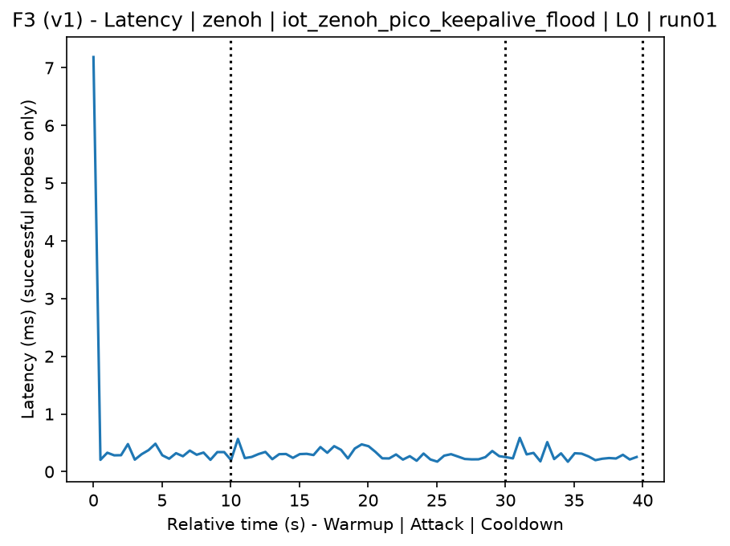
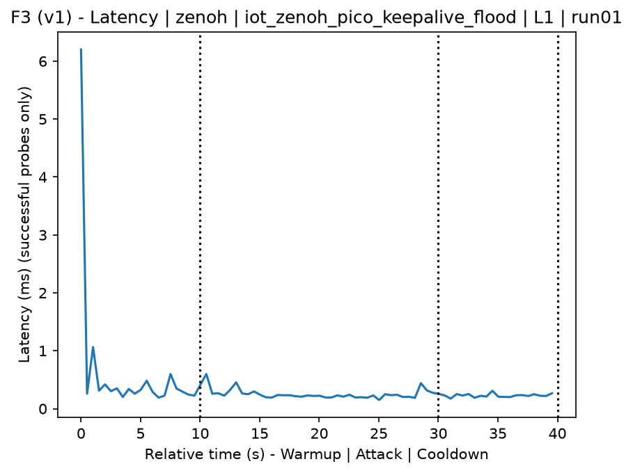
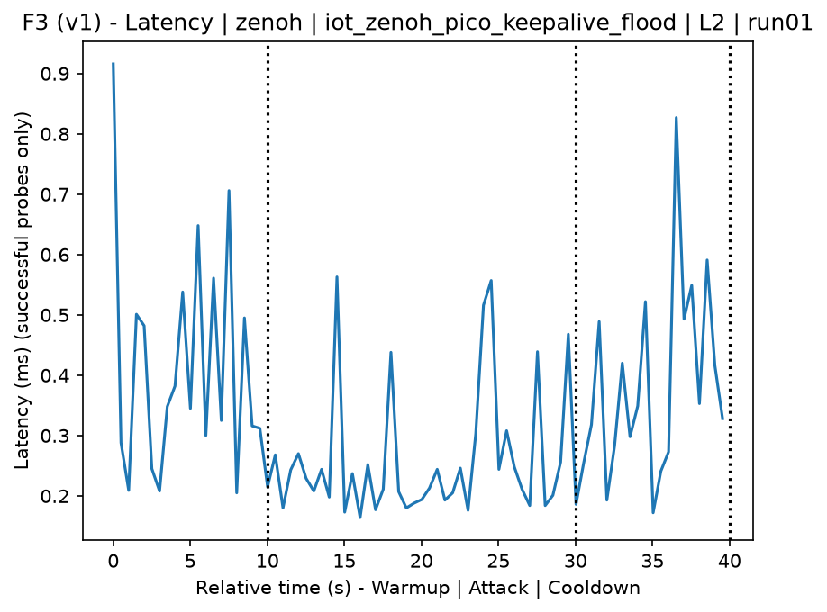
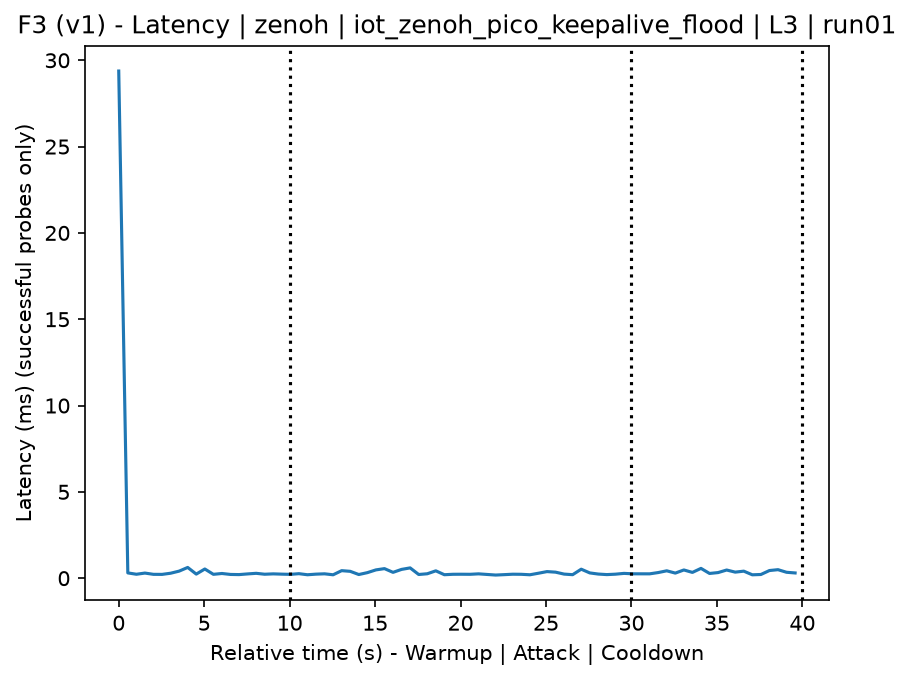
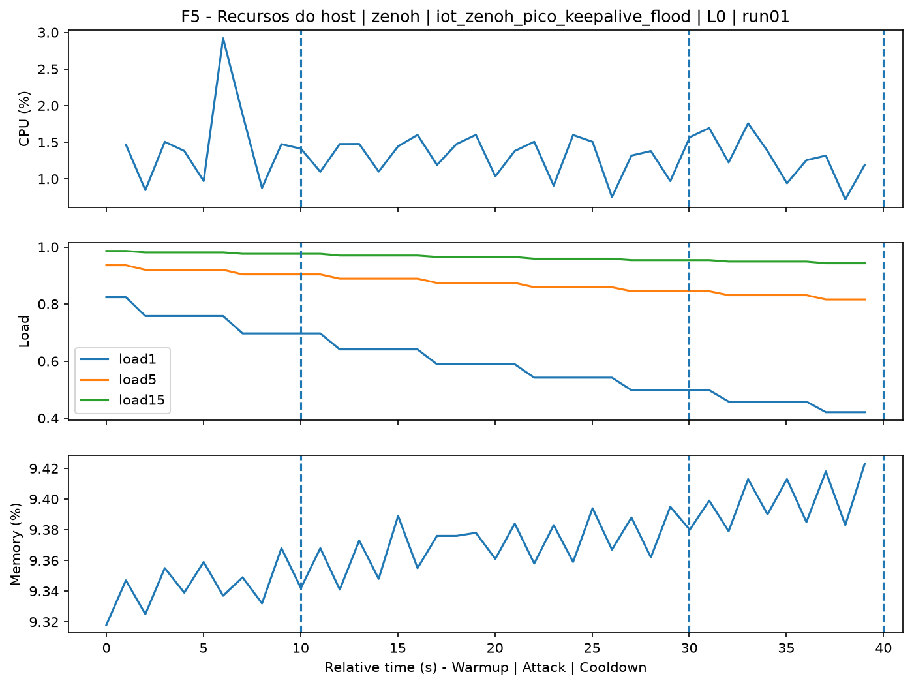
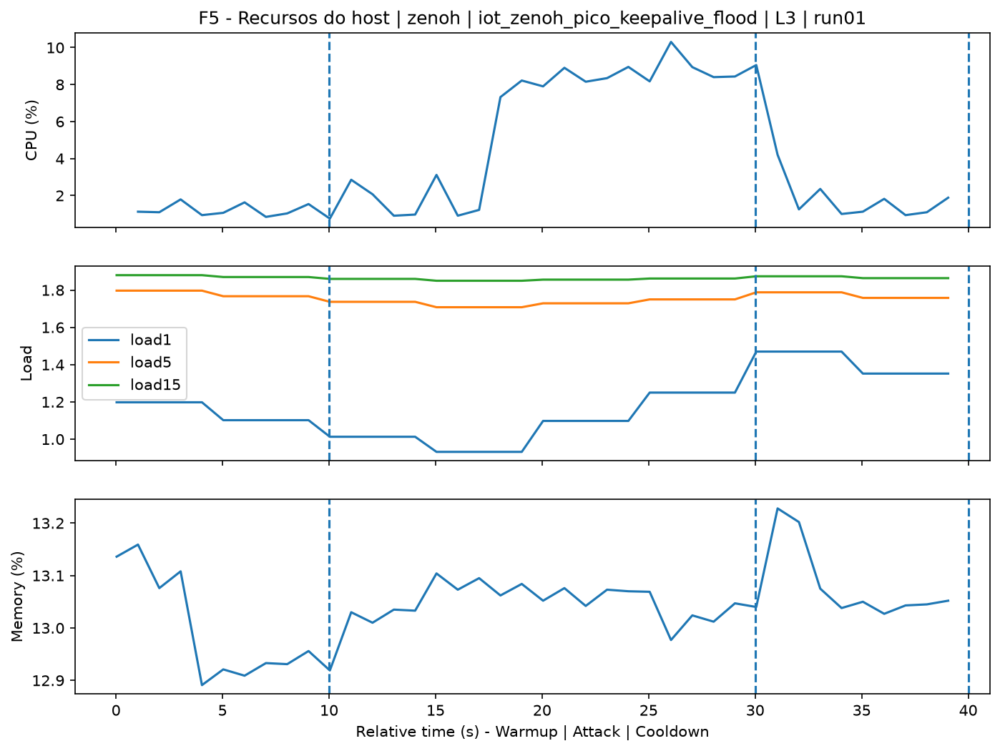
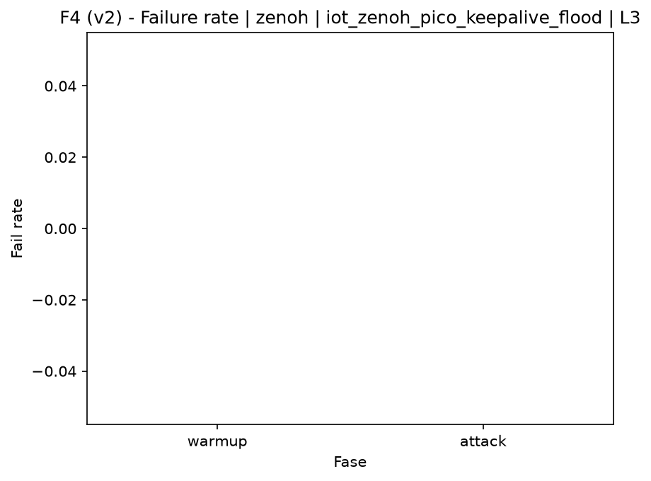

# Zenoh-Pico Keepalive Flood (`iot_zenoh_pico_keepalive_flood`)

[Campaign index](README.md)

This document summarizes the published campaign execution of attack `iot_zenoh_pico_keepalive_flood`. In the local catalog, the attack is described as: Flood of Zenoh/Zenoh-Pico keepalive messages to consume processing and session-handling capacity. The full execution artifacts are not versioned in this repository; retrieve them from the Figshare dataset linked in the campaign index or regenerate the figures with `run_claim_figures.sh`. The selected figures below are stored under `contrib/assets/campaign_doc`.

## Attack Metadata

| Field | Value |
| --- | --- |
| ID | `iot_zenoh_pico_keepalive_flood` |
| Category | 7) IoT |
| Subcategory | 7.1 IoT Protocols / Zenoh |
| Target services | zenoh-router |
| Image | `attack-zenoh-pico-keepalive-flood:latest` |
| Container | `attack-zenoh-pico-keepalive-flood` |
| Catalog max runtime | 10 s |
| Intensity parameters | duration_s, threads |
| MITRE ATT&CK | [https://attack.mitre.org/tactics/TA0040/](https://attack.mitre.org/tactics/TA0040/) [https://attack.mitre.org/techniques/T1498/](https://attack.mitre.org/techniques/T1498/) [https://attack.mitre.org/techniques/T1498/001/](https://attack.mitre.org/techniques/T1498/001/) [https://attack.mitre.org/techniques/T1499/](https://attack.mitre.org/techniques/T1499/) [https://attack.mitre.org/techniques/T1499/002/](https://attack.mitre.org/techniques/T1499/002/) |

## Statistical Summary by Level

| Level | Service | Runs | Attack samples | Mean success | Mean failure | Lat p50/p95 ms | Total PCAP MB | Mean dataset (min-max) | Mean exec s | Extractors ok/total | Mean/max CPU | Mean mem MB |
| --- | --- | --- | --- | --- | --- | --- | --- | --- | --- | --- | --- | --- |
| L0 | zenoh | 5 | 200 | 100% | 0% | 0,28 / 0,47 | 0,79 | 3.665 (3.646-3.680) | 42,48 | 3/3 | 0,12% / 0,16% | 5,45 |
| L1 | zenoh | 5 | 200 | 100% | 0% | 0,25 / 0,45 | 831,04 | 5.361.131 (4.288.772-6.141.316) | 822,58 | 3/3 | 0,1% / 0,15% | 5,45 |
| L2 | zenoh | 5 | 200 | 100% | 0% | 0,22 / 0,46 | 817,88 | 5.276.194 (3.647.092-5.944.726) | 808,42 | 3/3 | 0,1% / 0,13% | 5,44 |
| L3 | zenoh | 5 | 199 | 100% | 0% | 0,25 / 0,52 | 789 | 5.089.792 (3.864.286-6.098.366) | 781,36 | 3/3 | 0,12% / 0,16% | 5,43 |

## Stability Across Reruns

| Level | Metric | Runs | Mean | Deviation | CV | Min | Max |
| --- | --- | --- | --- | --- | --- | --- | --- |
| L0 | Mean CPU in attack phase | 5 | 0,12 | 0,01 | 8,63% | 0,1 | 0,13 |
| L0 | Dataset rows | 5 | 3.664,8 | 17,3 | 0,47% | 3.646 | 3.680 |
| L0 | Execution time | 5 | 42,48 | 0,38 | 0,88% | 42,25 | 43,14 |
| L0 | Failure in attack phase | 5 | 0 | 0 | n/a | 0 | 0 |
| L0 | Censored p95 latency | 5 | 0,47 | 0,05 | 11,03% | 0,39 | 0,51 |
| L1 | Mean CPU in attack phase | 5 | 0,1 | 0,01 | 7,31% | 0,09 | 0,11 |
| L1 | Dataset rows | 5 | 5.361.130,8 | 918.554,86 | 17,13% | 4.288.772 | 6.141.316 |
| L1 | Execution time | 5 | 822,58 | 133,73 | 16,26% | 670,64 | 932,65 |
| L1 | Failure in attack phase | 5 | 0 | 0 | n/a | 0 | 0 |
| L1 | Censored p95 latency | 5 | 0,45 | 0,06 | 13,73% | 0,36 | 0,51 |
| L2 | Mean CPU in attack phase | 5 | 0,1 | 0,01 | 7,85% | 0,1 | 0,12 |
| L2 | Dataset rows | 5 | 5.276.194,4 | 997.634,65 | 18,91% | 3.647.092 | 5.944.726 |
| L2 | Execution time | 5 | 808,42 | 147,59 | 18,26% | 567,79 | 909,01 |
| L2 | Failure in attack phase | 5 | 0 | 0 | n/a | 0 | 0 |
| L2 | Censored p95 latency | 5 | 0,46 | 0,1 | 21,3% | 0,3 | 0,52 |
| L3 | Mean CPU in attack phase | 5 | 0,12 | 0,01 | 9,4% | 0,11 | 0,13 |
| L3 | Dataset rows | 5 | 5.089.792,4 | 927.874,47 | 18,23% | 3.864.286 | 6.098.366 |
| L3 | Execution time | 5 | 781,36 | 135,14 | 17,3% | 604,09 | 931,15 |
| L3 | Failure in attack phase | 5 | 0 | 0 | n/a | 0 | 0 |
| L3 | Censored p95 latency | 5 | 0,52 | 0,03 | 6,36% | 0,46 | 0,55 |

## Artifact Validation

| Level | Runs | Capture | Probe | Features | Dataset | Resources | Server stats | Acceptance |
| --- | --- | --- | --- | --- | --- | --- | --- | --- |
| L0 | 5 | 5/5 | 5/5 | 5/5 | 5/5 | 5/5 | 5/5 | 5/5 |
| L1 | 5 | 5/5 | 5/5 | 5/5 | 5/5 | 5/5 | 5/5 | 5/5 |
| L2 | 5 | 5/5 | 5/5 | 5/5 | 5/5 | 5/5 | 5/5 | 5/5 |
| L3 | 5 | 5/5 | 5/5 | 5/5 | 5/5 | 5/5 | 5/5 | 5/5 |

## Selected Figures

<table>
<tr>
<td> Time series L0 run01</td>
<td> Time series L1 run01</td>
</tr>
<tr>
<td> Time series L2 run01</td>
<td> Time series L3 run01</td>
</tr>
<tr>
<td> Resources L0 run01</td>
<td> Resources L3 run01</td>
</tr>
<tr>
<td> Failure rate L0</td>
<td> Failure rate L3</td>
</tr>
</table>

## Sources Used

- Attack catalog: `docker/attackers/zenoh-pico-keepalive-flood/attack.yaml`
- Full campaign artifacts: available from the Figshare dataset linked in the campaign index; when extracted locally, expected under `experiments/60att_5runs_l0l1l2l3/iot_zenoh_pico_keepalive_flood`.
