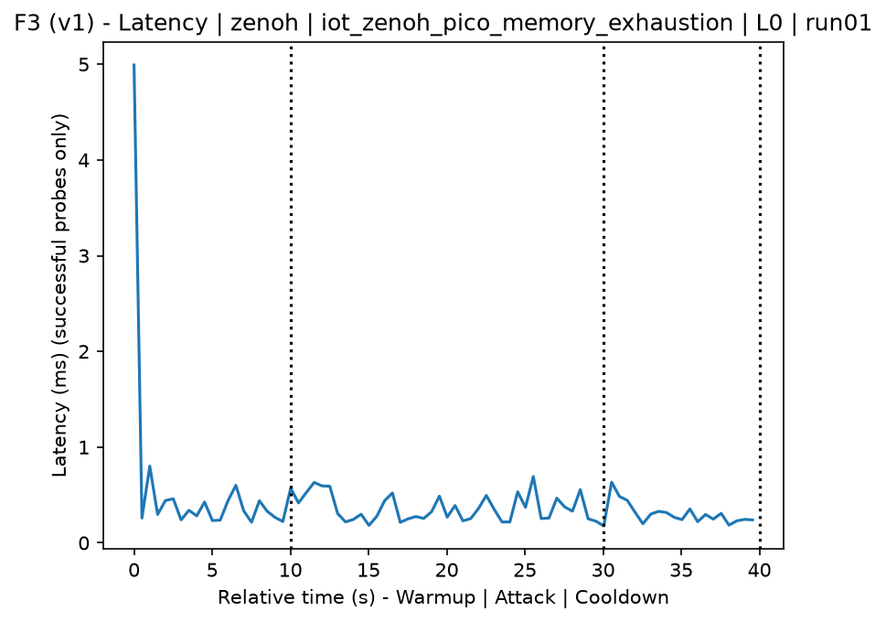
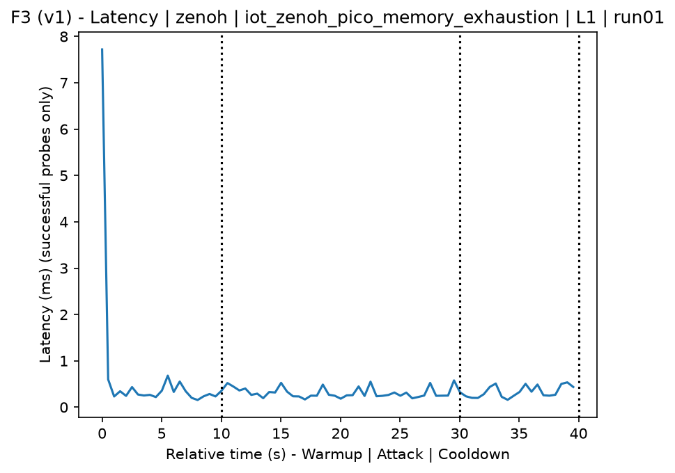
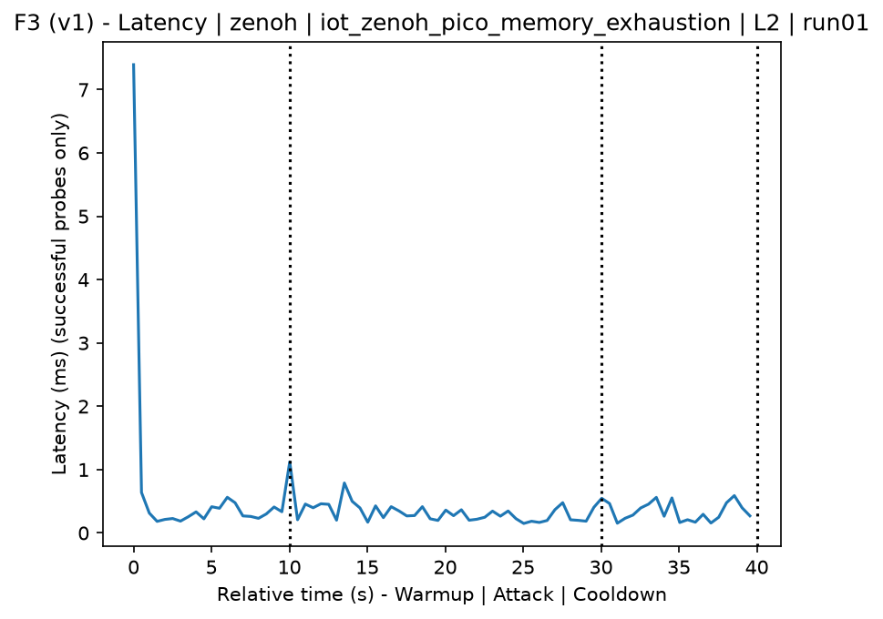
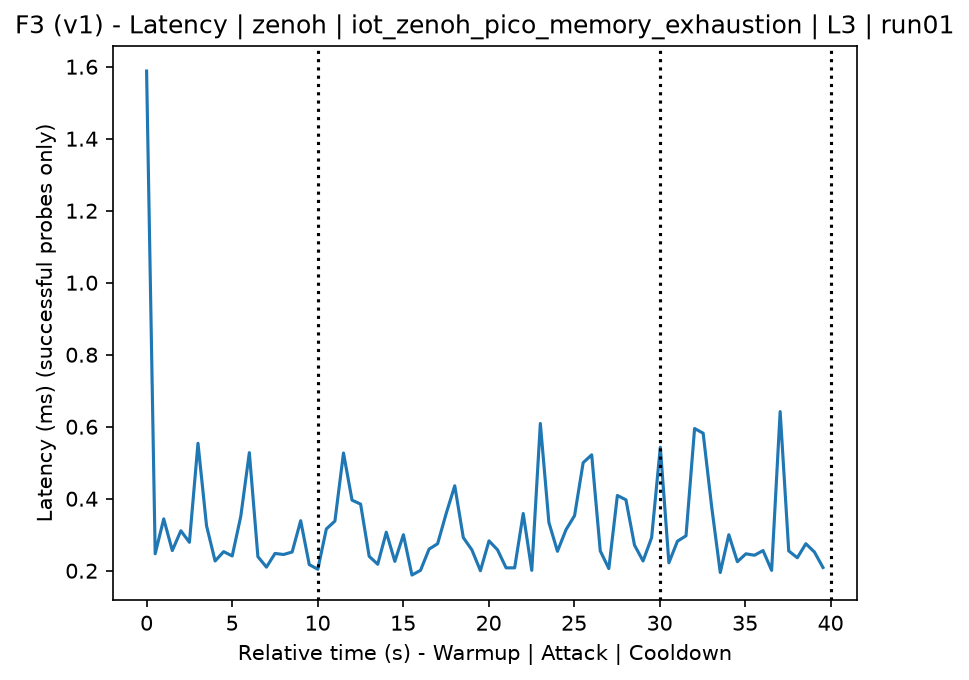
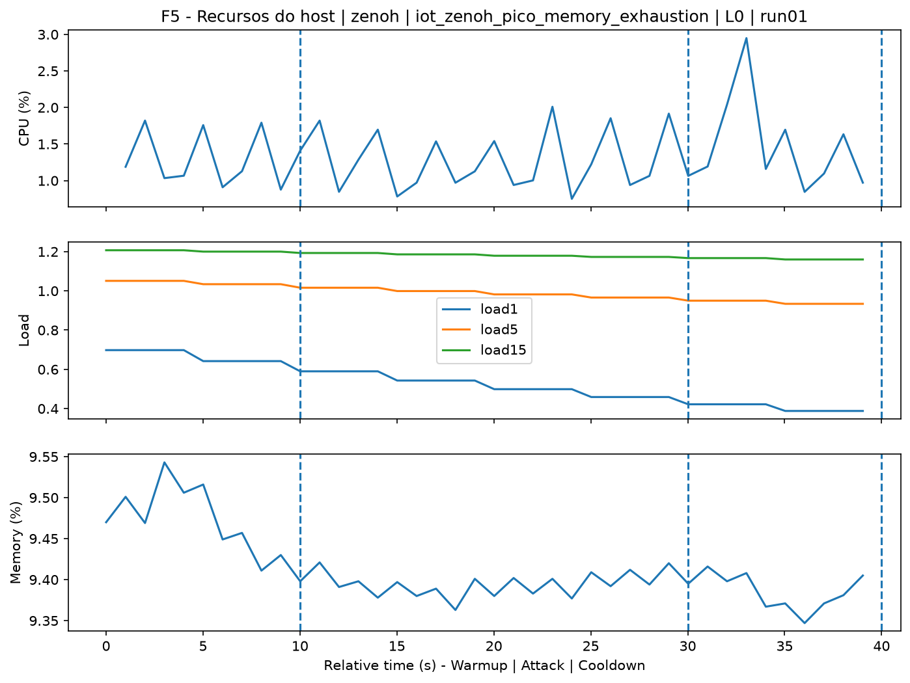
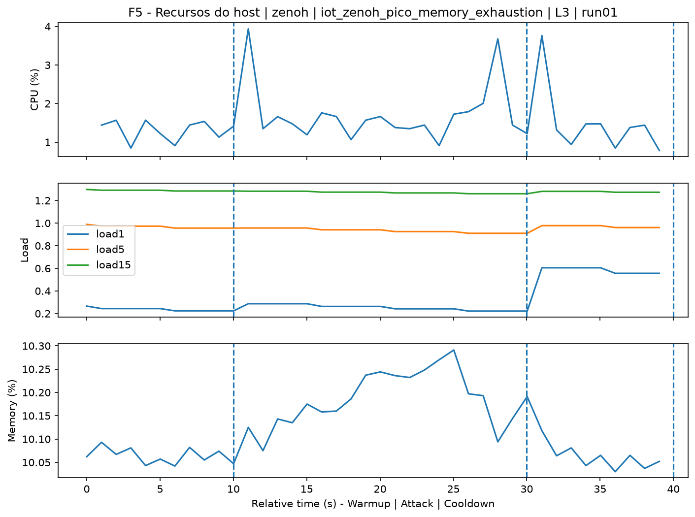
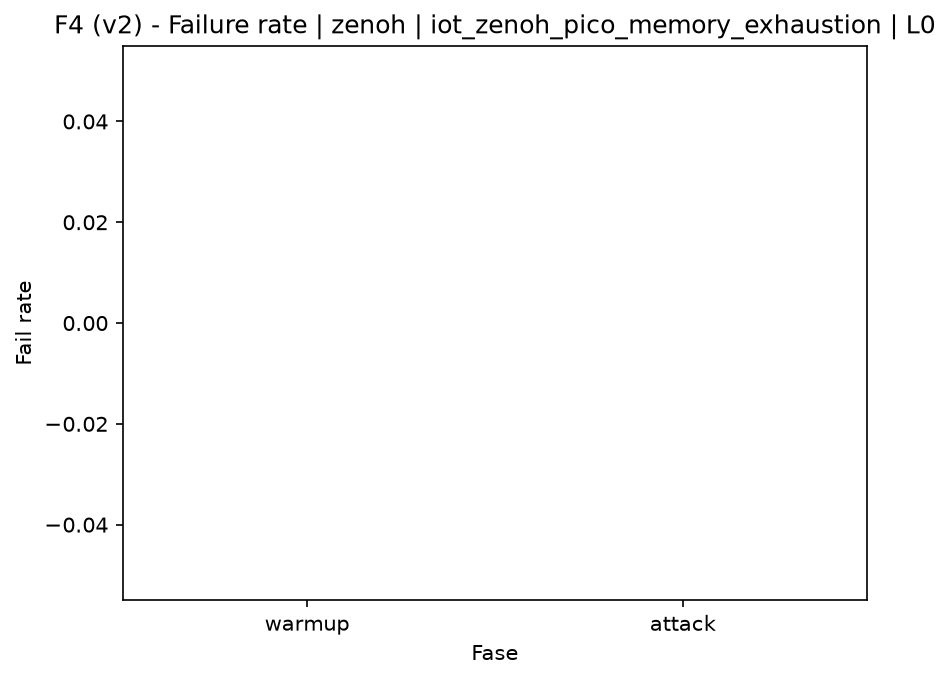
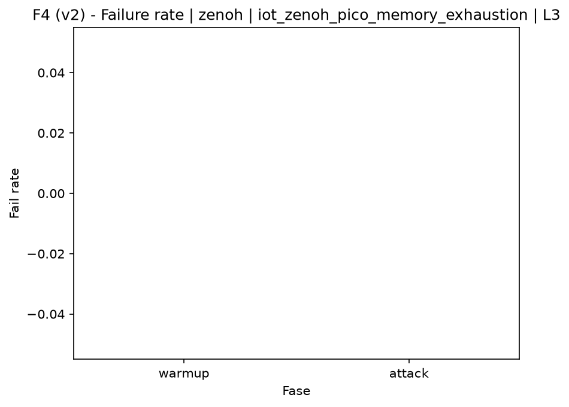

# Zenoh-Pico Memory Exhaustion (`iot_zenoh_pico_memory_exhaustion`)

[Campaign index](README.md)

This document summarizes the published campaign execution of attack `iot_zenoh_pico_memory_exhaustion`. In the local catalog, the attack is described as: Memory exhaustion of the Zenoh router/peer through mass creation of resources, sessions, declarations, or pending messages. The full execution artifacts are not versioned in this repository; retrieve them from the Figshare dataset linked in the campaign index or regenerate the figures with `run_claim_figures.sh`. The selected figures below are stored under `contrib/assets/campaign_doc`.

## Attack Metadata

| Field | Value |
| --- | --- |
| ID | `iot_zenoh_pico_memory_exhaustion` |
| Category | 7) IoT |
| Subcategory | 7.1 IoT Protocols / Zenoh |
| Target services | zenoh-router |
| Image | `attack-zenoh-pico-memory-exhaustion:latest` |
| Container | `attack-zenoh-pico-memory-exhaustion` |
| Catalog max runtime | 10 s |
| Intensity parameters | duration_s, threads |
| MITRE ATT&CK | [https://attack.mitre.org/tactics/TA0040/](https://attack.mitre.org/tactics/TA0040/) [https://attack.mitre.org/techniques/T1499/](https://attack.mitre.org/techniques/T1499/) [https://attack.mitre.org/techniques/T1499/003/](https://attack.mitre.org/techniques/T1499/003/) |

## Statistical Summary by Level

| Level | Service | Runs | Attack samples | Mean success | Mean failure | Lat p50/p95 ms | Total PCAP MB | Mean dataset (min-max) | Mean exec s | Extractors ok/total | Mean/max CPU | Mean mem MB |
| --- | --- | --- | --- | --- | --- | --- | --- | --- | --- | --- | --- | --- |
| L0 | zenoh | 5 | 200 | 100% | 0% | 0,28 / 0,52 | 0,79 | 3.684 (3.664-3.710) | 42,52 | 3/3 | 0,12% / 0,17% | 5,45 |
| L1 | zenoh | 5 | 200 | 100% | 0% | 0,27 / 0,54 | 2.379,75 | 18.892 (18.718-18.958) | 45,61 | 3/3 | 0,12% / 0,17% | 5,42 |
| L2 | zenoh | 5 | 200 | 100% | 0% | 0,27 / 0,55 | 2.397,31 | 19.011 (18.898-19.070) | 45,7 | 3/3 | 0,11% / 0,15% | 5,41 |
| L3 | zenoh | 5 | 200 | 100% | 0% | 0,26 / 0,53 | 2.383,57 | 18.944 (18.766-19.096) | 45,73 | 3/3 | 0,12% / 0,17% | 5,45 |

## Stability Across Reruns

| Level | Metric | Runs | Mean | Deviation | CV | Min | Max |
| --- | --- | --- | --- | --- | --- | --- | --- |
| L0 | Mean CPU in attack phase | 5 | 0,12 | 0,01 | 7,04% | 0,11 | 0,13 |
| L0 | Dataset rows | 5 | 3.684 | 18,6 | 0,5% | 3.664 | 3.710 |
| L0 | Execution time | 5 | 42,52 | 0,42 | 0,99% | 42,23 | 43,25 |
| L0 | Failure in attack phase | 5 | 0 | 0 | n/a | 0 | 0 |
| L0 | Censored p95 latency | 5 | 0,52 | 0,09 | 17,53% | 0,38 | 0,6 |
| L1 | Mean CPU in attack phase | 5 | 0,12 | 0,01 | 8,74% | 0,11 | 0,14 |
| L1 | Dataset rows | 5 | 18.892 | 100,94 | 0,53% | 18.718 | 18.958 |
| L1 | Execution time | 5 | 45,61 | 0,15 | 0,32% | 45,43 | 45,78 |
| L1 | Failure in attack phase | 5 | 0 | 0 | n/a | 0 | 0 |
| L1 | Censored p95 latency | 5 | 0,54 | 0,04 | 7,9% | 0,51 | 0,62 |
| L2 | Mean CPU in attack phase | 5 | 0,11 | 0,01 | 7,19% | 0,1 | 0,12 |
| L2 | Dataset rows | 5 | 19.010,8 | 66,1 | 0,35% | 18.898 | 19.070 |
| L2 | Execution time | 5 | 45,7 | 0,08 | 0,17% | 45,64 | 45,82 |
| L2 | Failure in attack phase | 5 | 0 | 0 | n/a | 0 | 0 |
| L2 | Censored p95 latency | 5 | 0,55 | 0,04 | 7,61% | 0,51 | 0,62 |
| L3 | Mean CPU in attack phase | 5 | 0,12 | 0,01 | 8,15% | 0,11 | 0,13 |
| L3 | Dataset rows | 5 | 18.944,4 | 147,05 | 0,78% | 18.766 | 19.096 |
| L3 | Execution time | 5 | 45,73 | 0,61 | 1,34% | 45,24 | 46,78 |
| L3 | Failure in attack phase | 5 | 0 | 0 | n/a | 0 | 0 |
| L3 | Censored p95 latency | 5 | 0,53 | 0,07 | 13,42% | 0,45 | 0,64 |

## Artifact Validation

| Level | Runs | Capture | Probe | Features | Dataset | Resources | Server stats | Acceptance |
| --- | --- | --- | --- | --- | --- | --- | --- | --- |
| L0 | 5 | 5/5 | 5/5 | 5/5 | 5/5 | 5/5 | 5/5 | 5/5 |
| L1 | 5 | 5/5 | 5/5 | 5/5 | 5/5 | 5/5 | 5/5 | 5/5 |
| L2 | 5 | 5/5 | 5/5 | 5/5 | 5/5 | 5/5 | 5/5 | 5/5 |
| L3 | 5 | 5/5 | 5/5 | 5/5 | 5/5 | 5/5 | 5/5 | 5/5 |

## Selected Figures

<table>
<tr>
<td> Time series L0 run01</td>
<td> Time series L1 run01</td>
</tr>
<tr>
<td> Time series L2 run01</td>
<td> Time series L3 run01</td>
</tr>
<tr>
<td> Resources L0 run01</td>
<td> Resources L3 run01</td>
</tr>
<tr>
<td> Failure rate L0</td>
<td> Failure rate L3</td>
</tr>
</table>

## Sources Used

- Attack catalog: `docker/attackers/zenoh-pico-memory-exhaustion/attack.yaml`
- Full campaign artifacts: available from the Figshare dataset linked in the campaign index; when extracted locally, expected under `experiments/60att_5runs_l0l1l2l3/iot_zenoh_pico_memory_exhaustion`.
