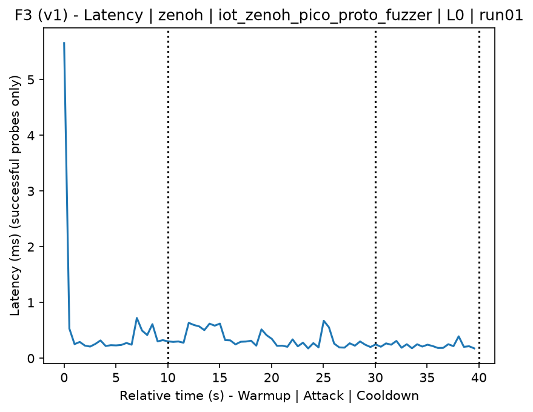
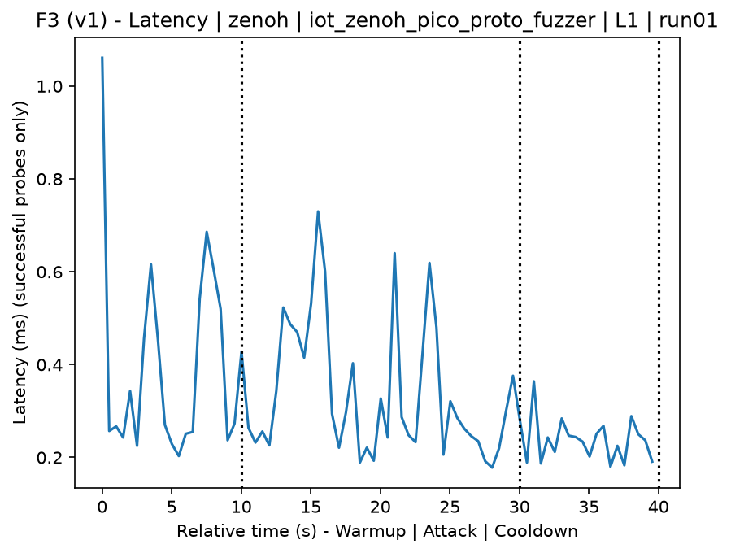
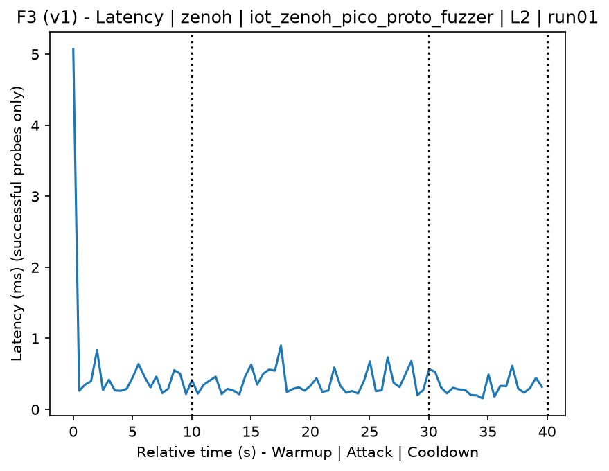
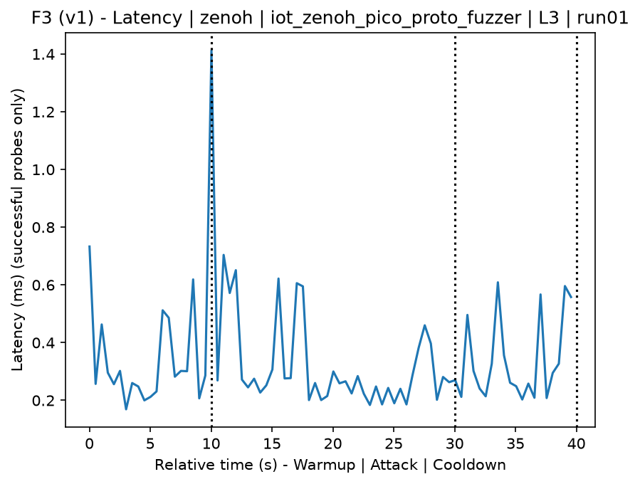
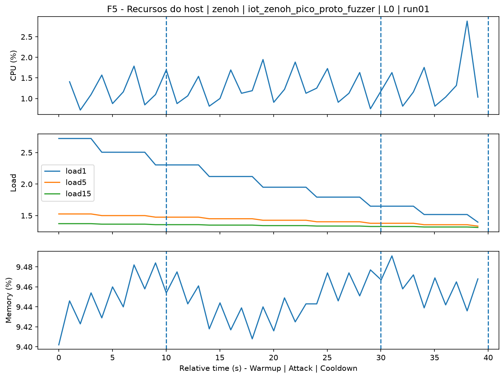
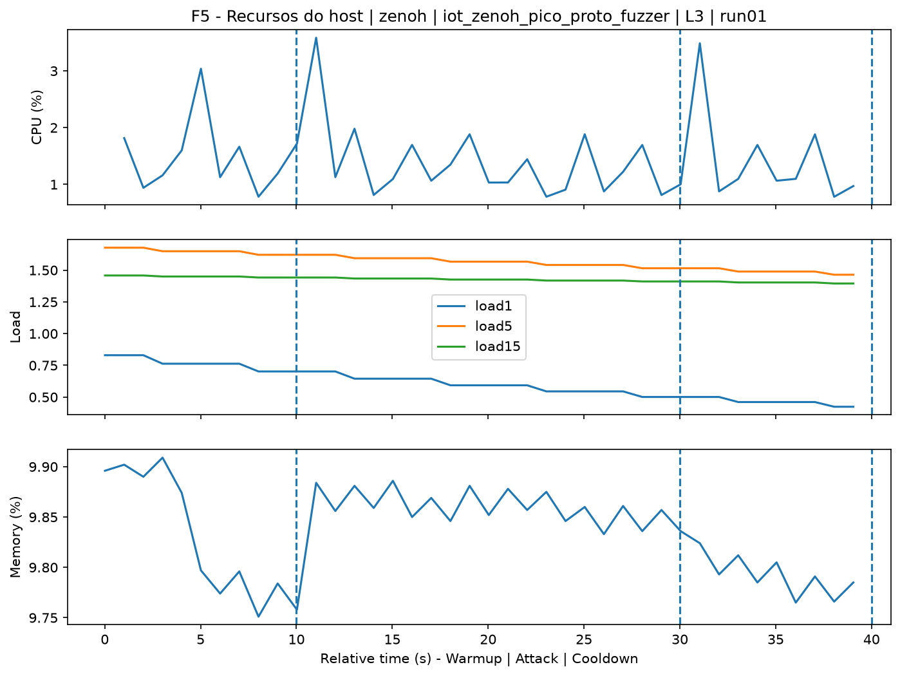
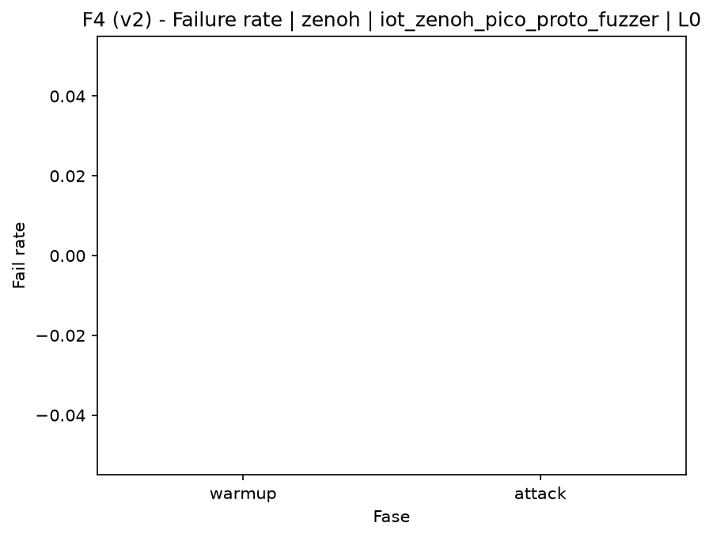
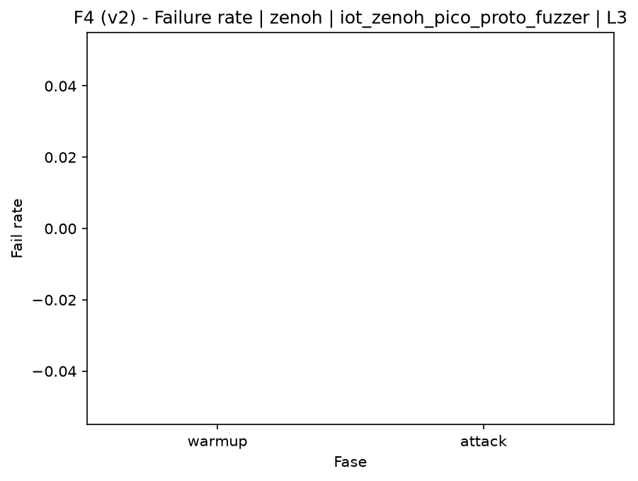

# Zenoh-Pico Protocol Fuzzer (`iot_zenoh_pico_proto_fuzzer`)

[Campaign index](README.md)

In campaign `experiments/60att_5runs_l0l1l2l3`, this document consolidates the execution of attack `iot_zenoh_pico_proto_fuzzer`. In the local catalog, the attack is described as: Sending malformed or mutated Zenoh/Zenoh-Pico messages to trigger errors, exceptions, or crashes on the target. The documentation below uses only artifacts already present in the repository, mainly the tables and figures from `experiments/60att_5runs_l0l1l2l3/iot_zenoh_pico_proto_fuzzer`.

## Attack Metadata

| Field | Value |
| --- | --- |
| ID | `iot_zenoh_pico_proto_fuzzer` |
| Category | 7) IoT |
| Subcategory | 7.1 IoT Protocols / Zenoh |
| Target services | zenoh-router |
| Image | `attack-zenoh-pico-proto-fuzzer:latest` |
| Container | `attack-zenoh-pico-proto-fuzzer` |
| Catalog max runtime | 10 s |
| Intensity parameters | duration_s, count |
| MITRE ATT&CK | [https://attack.mitre.org/tactics/TA0043/](https://attack.mitre.org/tactics/TA0043/) [https://attack.mitre.org/tactics/TA0001/](https://attack.mitre.org/tactics/TA0001/) [https://attack.mitre.org/tactics/TA0040/](https://attack.mitre.org/tactics/TA0040/) [https://attack.mitre.org/techniques/T1595/](https://attack.mitre.org/techniques/T1595/) [https://attack.mitre.org/techniques/T1595/002/](https://attack.mitre.org/techniques/T1595/002/) [https://attack.mitre.org/techniques/T1190/](https://attack.mitre.org/techniques/T1190/) [https://attack.mitre.org/techniques/T1499/](https://attack.mitre.org/techniques/T1499/) [https://attack.mitre.org/techniques/T1499/004/](https://attack.mitre.org/techniques/T1499/004/) |

## Statistical Summary by Level

| Level | Service | Runs | Attack samples | Mean success | Mean failure | Lat p50/p95 ms | Total PCAP MB | Mean dataset (min-max) | Mean exec s | Extractors ok/total | Mean/max CPU | Mean mem MB |
| --- | --- | --- | --- | --- | --- | --- | --- | --- | --- | --- | --- | --- |
| L0 | zenoh | 5 | 200 | 100% | 0% | 0,28 / 0,51 | 0,79 | 3.659 (3.644-3.692) | 42,39 | 3/3 | 0,12% / 0,16% | 5,43 |
| L1 | zenoh | 5 | 200 | 100% | 0% | 0,28 / 0,53 | 2,09 | 4.060 (4.022-4.110) | 42,39 | 3/3 | 0,12% / 0,15% | 5,45 |
| L2 | zenoh | 5 | 200 | 100% | 0% | 0,31 / 0,6 | 2,16 | 4.062 (4.046-4.080) | 42,38 | 3/3 | 0,13% / 0,17% | 5,41 |
| L3 | zenoh | 5 | 200 | 100% | 0% | 0,29 / 0,59 | 2,21 | 4.065 (4.056-4.082) | 42,44 | 3/3 | 0,11% / 0,17% | 5,42 |

## Stability Across Reruns

| Level | Metric | Runs | Mean | Deviation | CV | Min | Max |
| --- | --- | --- | --- | --- | --- | --- | --- |
| L0 | Mean CPU in attack phase | 5 | 0,11 | 0,01 | 10,81% | 0,1 | 0,13 |
| L0 | Dataset rows | 5 | 3.658,8 | 19,06 | 0,52% | 3.644 | 3.692 |
| L0 | Execution time | 5 | 42,39 | 0,32 | 0,75% | 42,17 | 42,96 |
| L0 | Failure in attack phase | 5 | 0 | 0 | n/a | 0 | 0 |
| L0 | Censored p95 latency | 5 | 0,51 | 0,14 | 28,14% | 0,26 | 0,62 |
| L1 | Mean CPU in attack phase | 5 | 0,12 | 0,02 | 17,21% | 0,1 | 0,15 |
| L1 | Dataset rows | 5 | 4.060,4 | 32,69 | 0,81% | 4.022 | 4.110 |
| L1 | Execution time | 5 | 42,39 | 0,04 | 0,09% | 42,32 | 42,42 |
| L1 | Failure in attack phase | 5 | 0 | 0 | n/a | 0 | 0 |
| L1 | Censored p95 latency | 5 | 0,53 | 0,1 | 18,07% | 0,37 | 0,62 |
| L2 | Mean CPU in attack phase | 5 | 0,13 | 0,01 | 10,42% | 0,11 | 0,15 |
| L2 | Dataset rows | 5 | 4.062,4 | 14,93 | 0,37% | 4.046 | 4.080 |
| L2 | Execution time | 5 | 42,38 | 0,05 | 0,12% | 42,31 | 42,45 |
| L2 | Failure in attack phase | 5 | 0 | 0 | n/a | 0 | 0 |
| L2 | Censored p95 latency | 5 | 0,6 | 0,07 | 12,5% | 0,53 | 0,68 |
| L3 | Mean CPU in attack phase | 5 | 0,11 | 0,01 | 9,86% | 0,1 | 0,13 |
| L3 | Dataset rows | 5 | 4.065,2 | 10,26 | 0,25% | 4.056 | 4.082 |
| L3 | Execution time | 5 | 42,44 | 0,08 | 0,19% | 42,34 | 42,51 |
| L3 | Failure in attack phase | 5 | 0 | 0 | n/a | 0 | 0 |
| L3 | Censored p95 latency | 5 | 0,59 | 0,05 | 7,72% | 0,53 | 0,65 |

## Artifact Validation

| Level | Runs | Capture | Probe | Features | Dataset | Resources | Server stats | Acceptance |
| --- | --- | --- | --- | --- | --- | --- | --- | --- |
| L0 | 5 | 5/5 | 5/5 | 5/5 | 5/5 | 5/5 | 5/5 | 5/5 |
| L1 | 5 | 5/5 | 5/5 | 5/5 | 5/5 | 5/5 | 5/5 | 5/5 |
| L2 | 5 | 5/5 | 5/5 | 5/5 | 5/5 | 5/5 | 5/5 | 5/5 |
| L3 | 5 | 5/5 | 5/5 | 5/5 | 5/5 | 5/5 | 5/5 | 5/5 |

## Selected Figures

<table>
<tr>
<td> Time series L0 run01</td>
<td> Time series L1 run01</td>
</tr>
<tr>
<td> Time series L2 run01</td>
<td> Time series L3 run01</td>
</tr>
<tr>
<td> Resources L0 run01</td>
<td> Resources L3 run01</td>
</tr>
<tr>
<td> Failure rate L0</td>
<td> Failure rate L3</td>
</tr>
</table>

## Sources Used

- Attack catalog: `docker/attackers/zenoh-pico-proto-fuzzer/attack.yaml`
- Campaign artifacts: `experiments/60att_5runs_l0l1l2l3/iot_zenoh_pico_proto_fuzzer`
