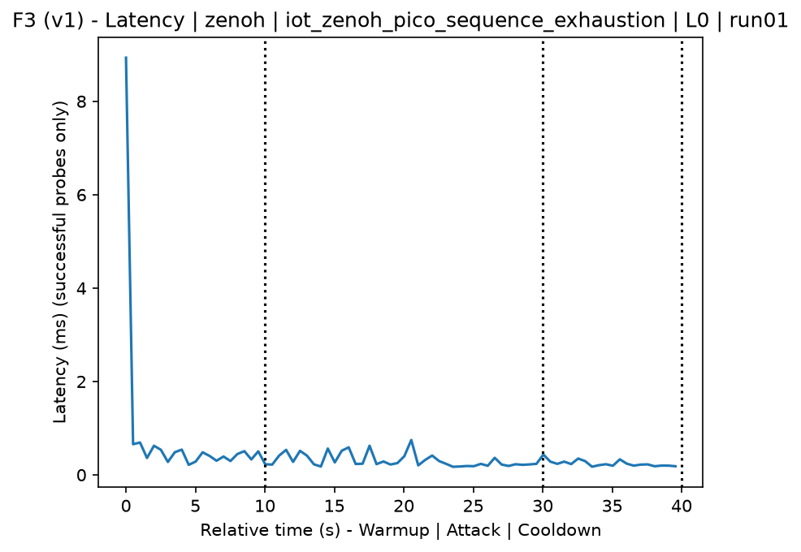
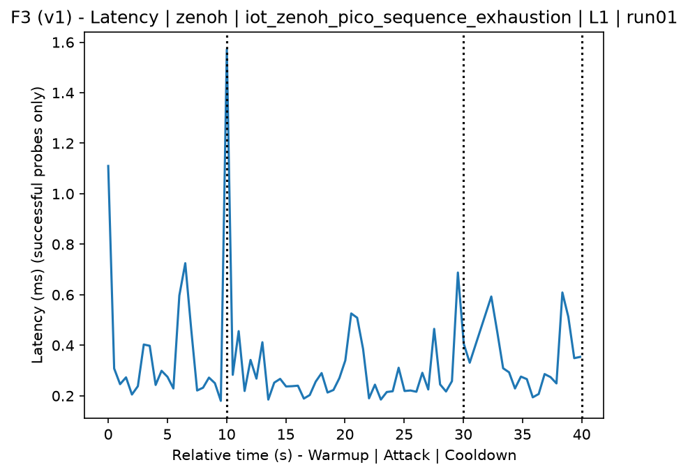
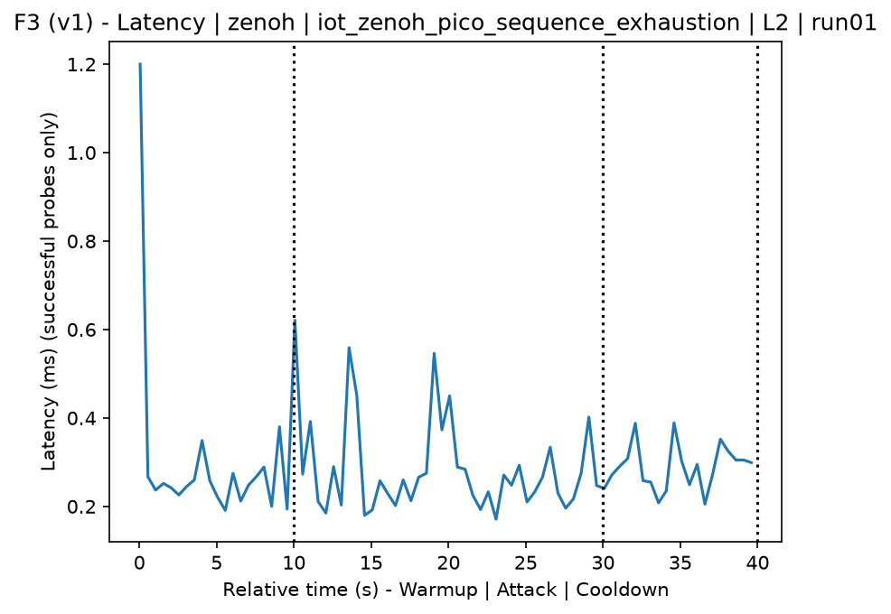
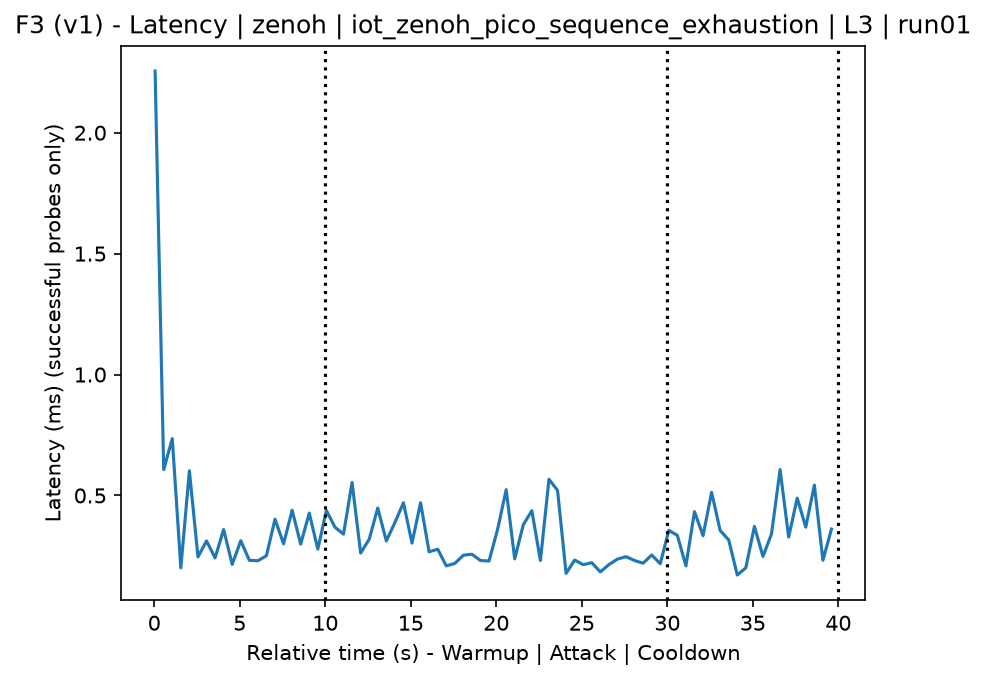
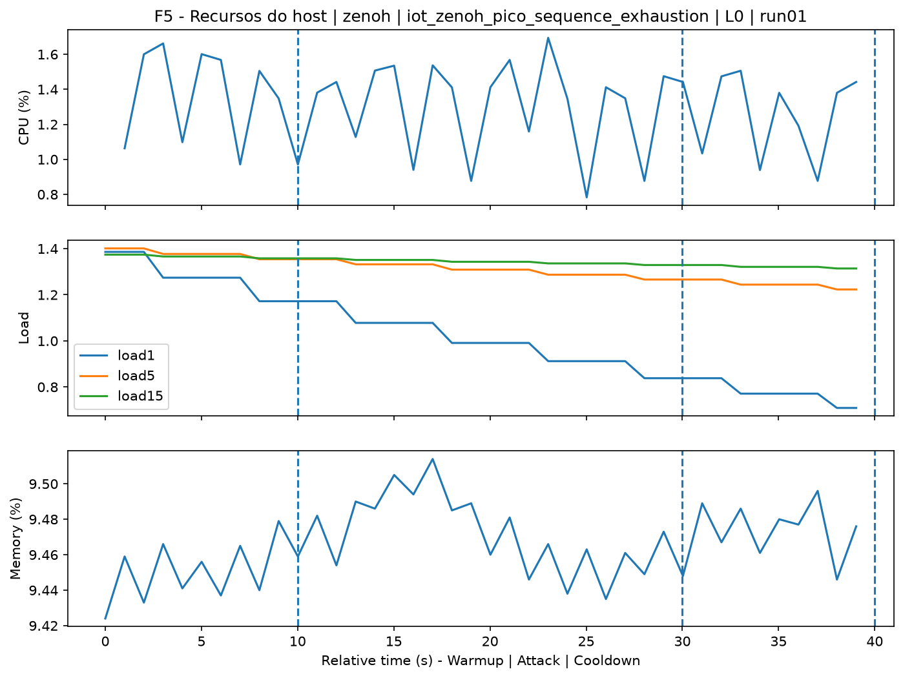
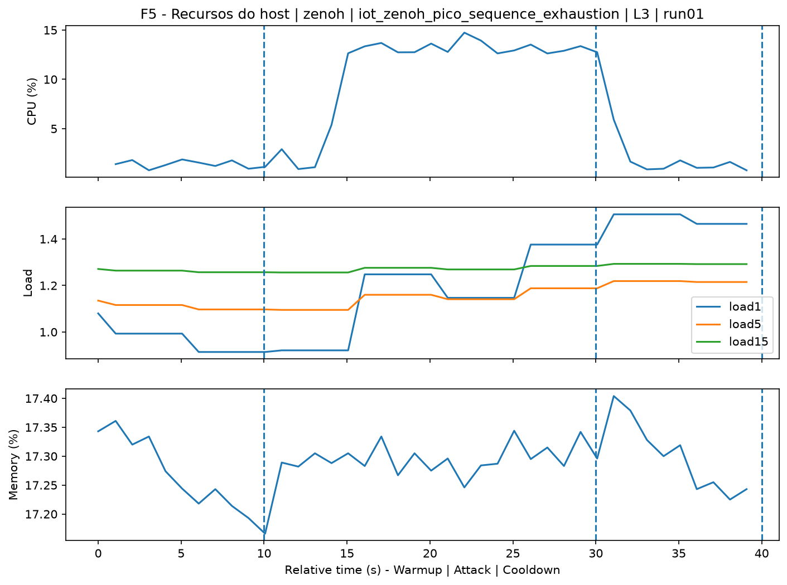
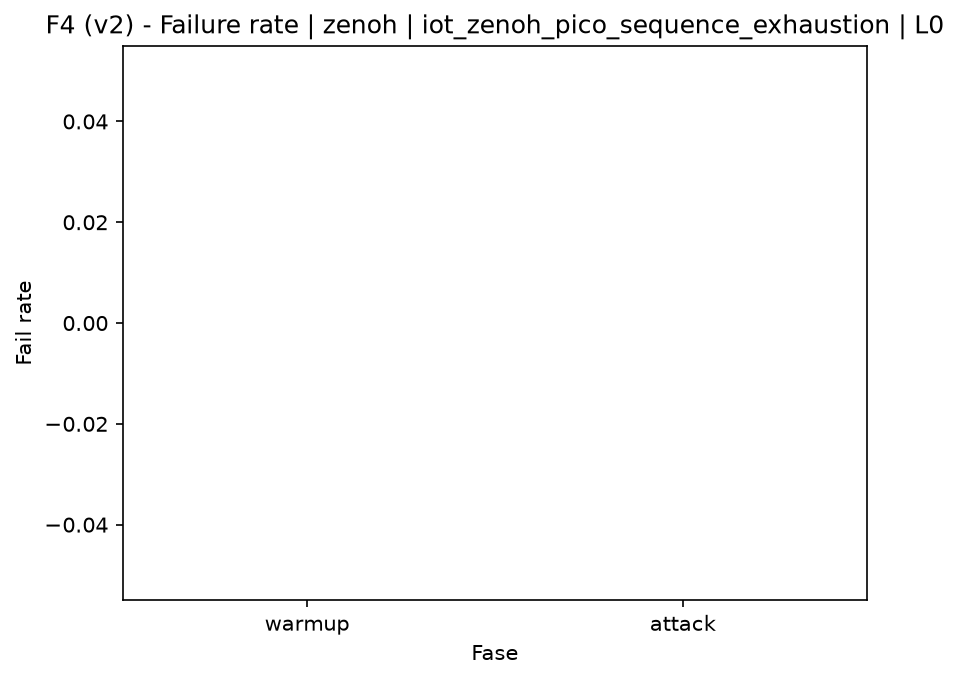
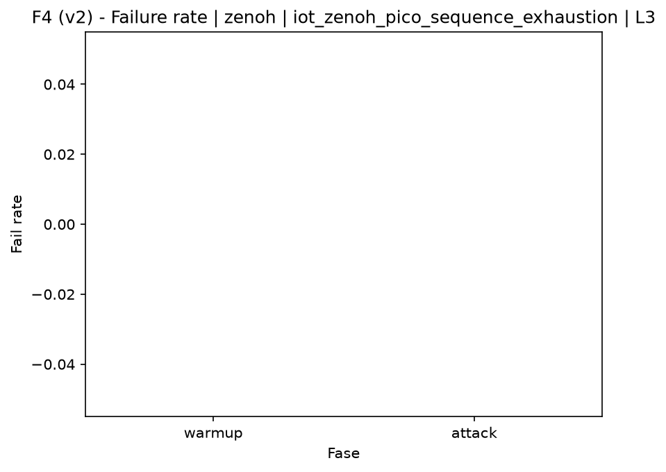

# Zenoh-Pico Sequence Exhaustion (`iot_zenoh_pico_sequence_exhaustion`)

[Campaign index](README.md)

This document summarizes the published campaign execution of attack `iot_zenoh_pico_sequence_exhaustion`. In the local catalog, the attack is described as: Exhaustion or intensive manipulation of Zenoh/Zenoh-Pico sequence numbers to degrade ordering, reliability, or session-state control. The full execution artifacts are not versioned in this repository; retrieve the generated dataset CSVs from the Figshare dataset linked in the campaign index. Raw PCAP captures are not included in that archive. The selected figures below are stored under `contrib/assets/campaign_doc`.

## Attack Metadata

| Field | Value |
| --- | --- |
| ID | `iot_zenoh_pico_sequence_exhaustion` |
| Category | 7) IoT |
| Subcategory | 7.1 IoT Protocols / Zenoh |
| Target services | zenoh-router |
| Image | `attack-zenoh-pico-sequence-exhaustion:latest` |
| Container | `attack-zenoh-pico-sequence-exhaustion` |
| Catalog max runtime | 10 s |
| Intensity parameters | duration_s, threads |
| MITRE ATT&CK | [https://attack.mitre.org/tactics/TA0040/](https://attack.mitre.org/tactics/TA0040/) [https://attack.mitre.org/techniques/T1499/](https://attack.mitre.org/techniques/T1499/) [https://attack.mitre.org/techniques/T1499/003/](https://attack.mitre.org/techniques/T1499/003/) [https://attack.mitre.org/techniques/T1565/](https://attack.mitre.org/techniques/T1565/) [https://attack.mitre.org/techniques/T1565/002/](https://attack.mitre.org/techniques/T1565/002/) |

## Statistical Summary by Level

| Level | Service | Runs | Attack samples | Mean success | Mean failure | Lat p50/p95 ms | Total PCAP MB | Mean dataset (min-max) | Mean exec s | Extractors ok/total | Mean/max CPU | Mean mem MB |
| --- | --- | --- | --- | --- | --- | --- | --- | --- | --- | --- | --- | --- |
| L0 | zenoh | 5 | 200 | 100% | 0% | 0,28 / 0,59 | 0,79 | 3.681 (3.650-3.694) | 42,58 | 3/3 | 0,12% / 0,16% | 5,42 |
| L1 | zenoh | 5 | 200 | 100% | 0% | 0,26 / 0,49 | 1.874,17 | 10.977.814 (10.791.630-11.194.890) | 1.628,15 | 3/3 | 0,11% / 0,15% | 5,41 |
| L2 | zenoh | 5 | 200 | 100% | 0% | 0,26 / 0,5 | 1.867,2 | 10.937.272 (10.898.274-10.988.144) | 1.604,12 | 3/3 | 0,12% / 0,18% | 5,42 |
| L3 | zenoh | 5 | 200 | 100% | 0% | 0,26 / 0,47 | 1.801,32 | 10.553.527 (9.116.110-11.171.668) | 1.548,23 | 3/3 | 0,12% / 0,17% | 5,43 |

## Stability Across Reruns

| Level | Metric | Runs | Mean | Deviation | CV | Min | Max |
| --- | --- | --- | --- | --- | --- | --- | --- |
| L0 | Mean CPU in attack phase | 5 | 0,12 | 0,01 | 6,01% | 0,11 | 0,13 |
| L0 | Dataset rows | 5 | 3.680,8 | 18,74 | 0,51% | 3.650 | 3.694 |
| L0 | Execution time | 5 | 42,58 | 0,35 | 0,83% | 42,33 | 43,19 |
| L0 | Failure in attack phase | 5 | 0 | 0 | n/a | 0 | 0 |
| L0 | Censored p95 latency | 5 | 0,59 | 0,06 | 10,92% | 0,5 | 0,69 |
| L1 | Mean CPU in attack phase | 5 | 0,11 | 0,01 | 8,76% | 0,1 | 0,12 |
| L1 | Dataset rows | 5 | 10.977.814 | 169.681,96 | 1,55% | 10.791.630 | 11.194.890 |
| L1 | Execution time | 5 | 1.628,15 | 18,74 | 1,15% | 1.609,89 | 1.650,98 |
| L1 | Failure in attack phase | 5 | 0 | 0 | n/a | 0 | 0 |
| L1 | Censored p95 latency | 5 | 0,49 | 0,11 | 21,5% | 0,35 | 0,61 |
| L2 | Mean CPU in attack phase | 5 | 0,12 | 0,01 | 5,67% | 0,11 | 0,13 |
| L2 | Dataset rows | 5 | 10.937.272 | 43.110,44 | 0,39% | 10.898.274 | 10.988.144 |
| L2 | Execution time | 5 | 1.604,12 | 15,1 | 0,94% | 1.579,13 | 1.617,72 |
| L2 | Failure in attack phase | 5 | 0 | 0 | n/a | 0 | 0 |
| L2 | Censored p95 latency | 5 | 0,5 | 0,05 | 10,07% | 0,42 | 0,55 |
| L3 | Mean CPU in attack phase | 5 | 0,12 | 0,01 | 6,08% | 0,11 | 0,13 |
| L3 | Dataset rows | 5 | 10.553.527,2 | 832.692,5 | 7,89% | 9.116.110 | 11.171.668 |
| L3 | Execution time | 5 | 1.548,23 | 112,19 | 7,25% | 1.355,48 | 1.641,99 |
| L3 | Failure in attack phase | 5 | 0 | 0 | n/a | 0 | 0 |
| L3 | Censored p95 latency | 5 | 0,47 | 0,08 | 16,92% | 0,33 | 0,53 |

## Artifact Validation

| Level | Runs | Capture | Probe | Features | Dataset | Resources | Server stats | Acceptance |
| --- | --- | --- | --- | --- | --- | --- | --- | --- |
| L0 | 5 | 5/5 | 5/5 | 5/5 | 5/5 | 5/5 | 5/5 | 5/5 |
| L1 | 5 | 5/5 | 5/5 | 5/5 | 5/5 | 5/5 | 5/5 | 5/5 |
| L2 | 5 | 5/5 | 5/5 | 5/5 | 5/5 | 5/5 | 5/5 | 5/5 |
| L3 | 5 | 5/5 | 5/5 | 5/5 | 5/5 | 5/5 | 5/5 | 5/5 |

## Selected Figures

<table>
<tr>
<td> Time series L0 run01</td>
<td> Time series L1 run01</td>
</tr>
<tr>
<td> Time series L2 run01</td>
<td> Time series L3 run01</td>
</tr>
<tr>
<td> Resources L0 run01</td>
<td> Resources L3 run01</td>
</tr>
<tr>
<td> Failure rate L0</td>
<td> Failure rate L3</td>
</tr>
</table>

## Sources Used

- Attack catalog: `docker/attackers/zenoh-pico-sequence-exhaustion/attack.yaml`
- Full campaign artifacts: available from the Figshare dataset linked in the campaign index; when extracted locally, expected under `experiments/all_5runs_4levels/iot_zenoh_pico_sequence_exhaustion`.
