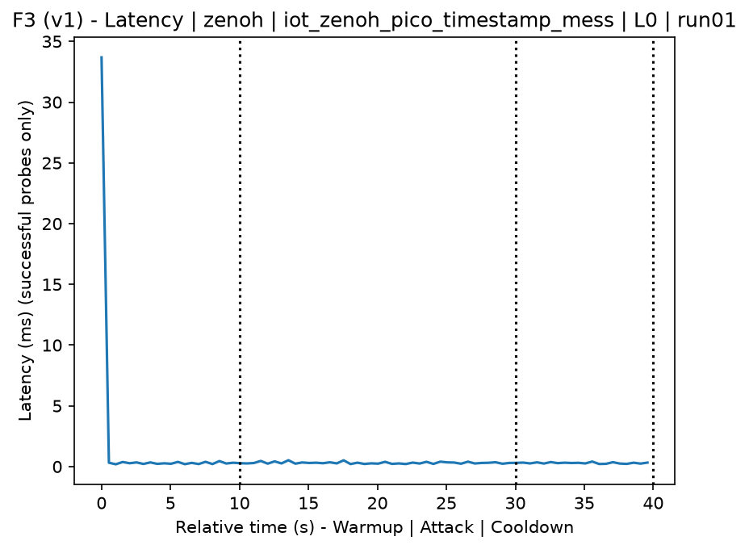
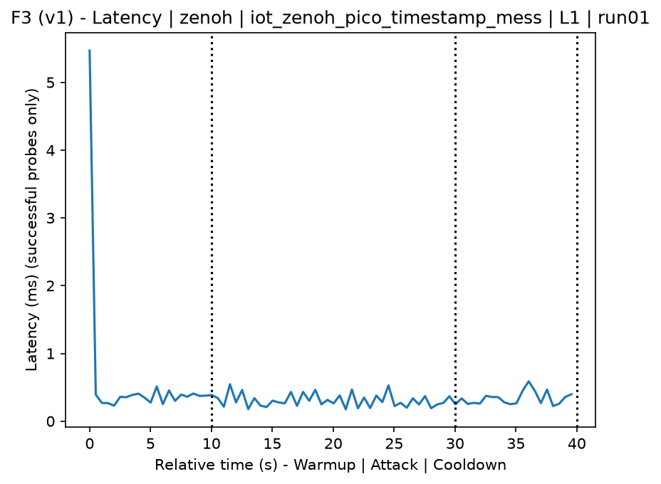
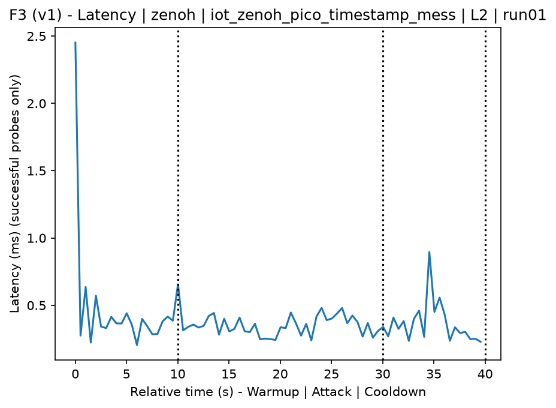
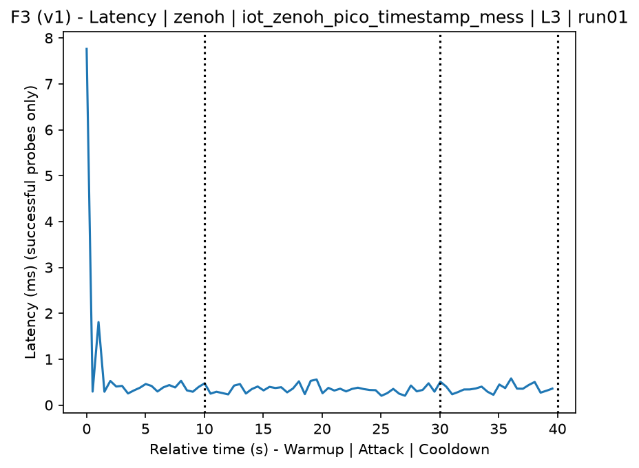
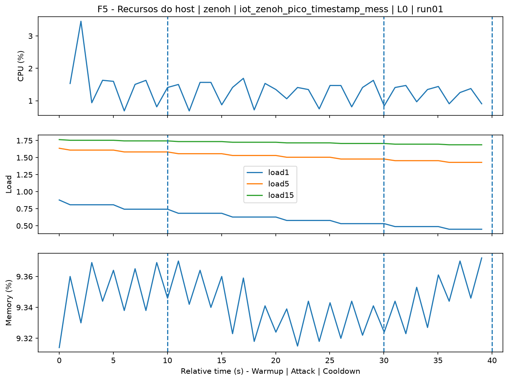
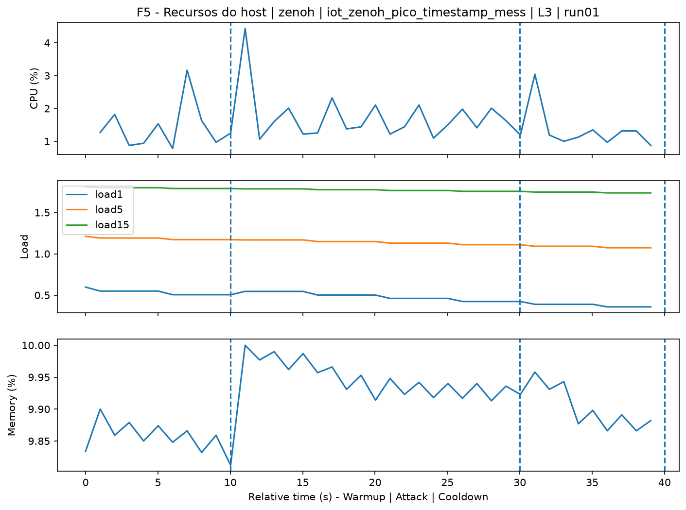
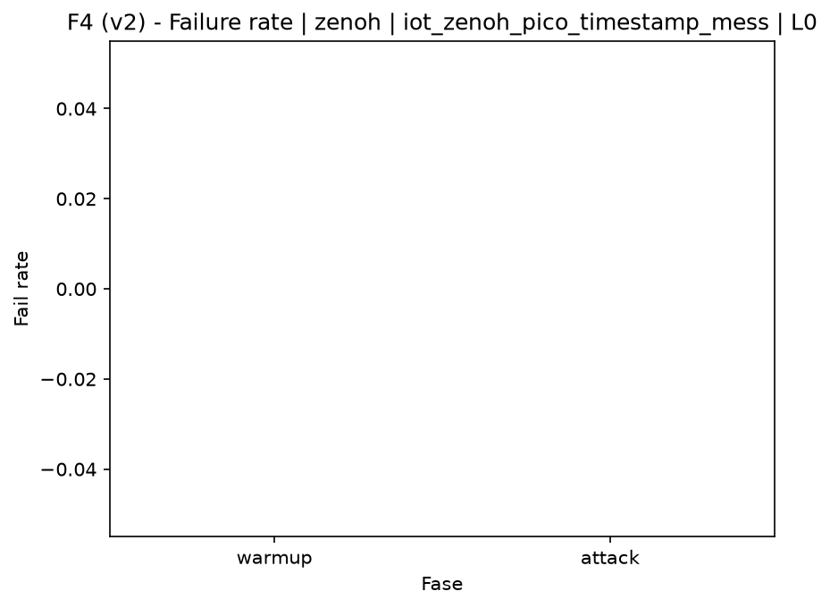

# Zenoh-Pico Timestamp Manipulation Flood (`iot_zenoh_pico_timestamp_mess`)

[Campaign index](README.md)

This document summarizes the published campaign execution of attack `iot_zenoh_pico_timestamp_mess`. In the local catalog, the attack is described as: Flood of Zenoh/Zenoh-Pico packets with manipulated timestamps to affect target ordering, expiration, or time logic. The full execution artifacts are not versioned in this repository; retrieve them from the Figshare dataset linked in the campaign index or regenerate the figures with `run_claim_figures.sh`. The selected figures below are stored under `contrib/assets/campaign_doc`.

## Attack Metadata

| Field | Value |
| --- | --- |
| ID | `iot_zenoh_pico_timestamp_mess` |
| Category | 7) IoT |
| Subcategory | 7.1 IoT Protocols / Zenoh |
| Target services | zenoh-router |
| Image | `attack-zenoh-pico-timestamp-mess:latest` |
| Container | `attack-zenoh-pico-timestamp-mess` |
| Catalog max runtime | 10 s |
| Intensity parameters | duration_s, threads |
| MITRE ATT&CK | [https://attack.mitre.org/tactics/TA0040/](https://attack.mitre.org/tactics/TA0040/) [https://attack.mitre.org/techniques/T1499/](https://attack.mitre.org/techniques/T1499/) [https://attack.mitre.org/techniques/T1499/003/](https://attack.mitre.org/techniques/T1499/003/) [https://attack.mitre.org/techniques/T1565/](https://attack.mitre.org/techniques/T1565/) [https://attack.mitre.org/techniques/T1565/002/](https://attack.mitre.org/techniques/T1565/002/) |

## Statistical Summary by Level

| Level | Service | Runs | Attack samples | Mean success | Mean failure | Lat p50/p95 ms | Total PCAP MB | Mean dataset (min-max) | Mean exec s | Extractors ok/total | Mean/max CPU | Mean mem MB |
| --- | --- | --- | --- | --- | --- | --- | --- | --- | --- | --- | --- | --- |
| L0 | zenoh | 5 | 200 | 100% | 0% | 0,31 / 0,47 | 0,79 | 3.689 (3.674-3.702) | 42,56 | 3/3 | 0,13% / 0,17% | 5,4 |
| L1 | zenoh | 5 | 200 | 100% | 0% | 0,27 / 0,43 | 34,48 | 146.365 (143.784-147.870) | 62,67 | 3/3 | 0,12% / 0,15% | 5,41 |
| L2 | zenoh | 5 | 200 | 100% | 0% | 0,32 / 0,45 | 34,73 | 147.451 (145.744-148.140) | 62,81 | 3/3 | 0,13% / 0,17% | 5,4 |
| L3 | zenoh | 5 | 200 | 100% | 0% | 0,29 / 0,46 | 34,59 | 146.868 (144.664-148.212) | 62,6 | 3/3 | 0,12% / 0,16% | 5,43 |

## Stability Across Reruns

| Level | Metric | Runs | Mean | Deviation | CV | Min | Max |
| --- | --- | --- | --- | --- | --- | --- | --- |
| L0 | Mean CPU in attack phase | 5 | 0,13 | 0,01 | 8,6% | 0,11 | 0,14 |
| L0 | Dataset rows | 5 | 3.688,8 | 10,83 | 0,29% | 3.674 | 3.702 |
| L0 | Execution time | 5 | 42,56 | 0,6 | 1,42% | 42,23 | 43,64 |
| L0 | Failure in attack phase | 5 | 0 | 0 | n/a | 0 | 0 |
| L0 | Censored p95 latency | 5 | 0,47 | 0,04 | 9,37% | 0,43 | 0,54 |
| L1 | Mean CPU in attack phase | 5 | 0,12 | 0,01 | 6,94% | 0,11 | 0,14 |
| L1 | Dataset rows | 5 | 146.365,2 | 1.874,79 | 1,28% | 143.784 | 147.870 |
| L1 | Execution time | 5 | 62,67 | 0,13 | 0,21% | 62,48 | 62,81 |
| L1 | Failure in attack phase | 5 | 0 | 0 | n/a | 0 | 0 |
| L1 | Censored p95 latency | 5 | 0,43 | 0,04 | 8,35% | 0,37 | 0,47 |
| L2 | Mean CPU in attack phase | 5 | 0,13 | 0,01 | 6,89% | 0,12 | 0,14 |
| L2 | Dataset rows | 5 | 147.451,2 | 968,44 | 0,66% | 145.744 | 148.140 |
| L2 | Execution time | 5 | 62,81 | 0,26 | 0,42% | 62,47 | 63,18 |
| L2 | Failure in attack phase | 5 | 0 | 0 | n/a | 0 | 0 |
| L2 | Censored p95 latency | 5 | 0,45 | 0,04 | 9,53% | 0,4 | 0,51 |
| L3 | Mean CPU in attack phase | 5 | 0,12 | 0,01 | 8,58% | 0,11 | 0,14 |
| L3 | Dataset rows | 5 | 146.867,6 | 1.687,79 | 1,15% | 144.664 | 148.212 |
| L3 | Execution time | 5 | 62,6 | 0,42 | 0,67% | 62,01 | 63,16 |
| L3 | Failure in attack phase | 5 | 0 | 0 | n/a | 0 | 0 |
| L3 | Censored p95 latency | 5 | 0,46 | 0,05 | 10,65% | 0,39 | 0,52 |

## Artifact Validation

| Level | Runs | Capture | Probe | Features | Dataset | Resources | Server stats | Acceptance |
| --- | --- | --- | --- | --- | --- | --- | --- | --- |
| L0 | 5 | 5/5 | 5/5 | 5/5 | 5/5 | 5/5 | 5/5 | 5/5 |
| L1 | 5 | 5/5 | 5/5 | 5/5 | 5/5 | 5/5 | 5/5 | 5/5 |
| L2 | 5 | 5/5 | 5/5 | 5/5 | 5/5 | 5/5 | 5/5 | 5/5 |
| L3 | 5 | 5/5 | 5/5 | 5/5 | 5/5 | 5/5 | 5/5 | 5/5 |

## Selected Figures

<table>
<tr>
<td> Time series L0 run01</td>
<td> Time series L1 run01</td>
</tr>
<tr>
<td> Time series L2 run01</td>
<td> Time series L3 run01</td>
</tr>
<tr>
<td> Resources L0 run01</td>
<td> Resources L3 run01</td>
</tr>
<tr>
<td> Failure rate L0</td>
<td> Failure rate L3</td>
</tr>
</table>

## Sources Used

- Attack catalog: `docker/attackers/zenoh-pico-timestamp-mess/attack.yaml`
- Full campaign artifacts: available from the Figshare dataset linked in the campaign index; when extracted locally, expected under `experiments/60att_5runs_l0l1l2l3/iot_zenoh_pico_timestamp_mess`.
