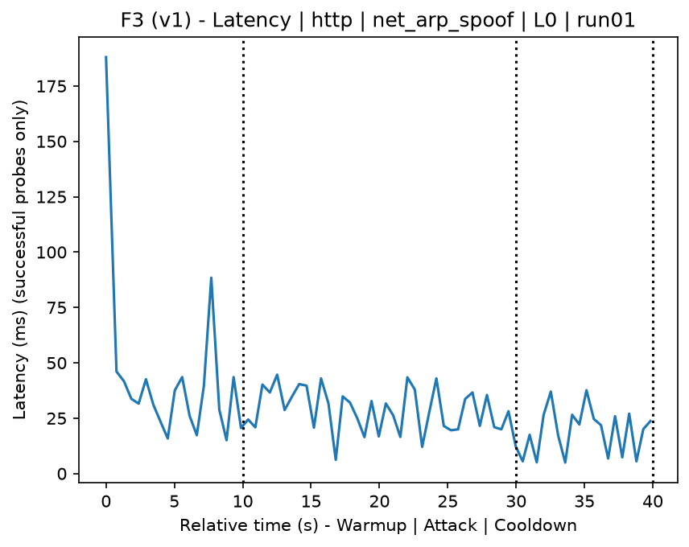
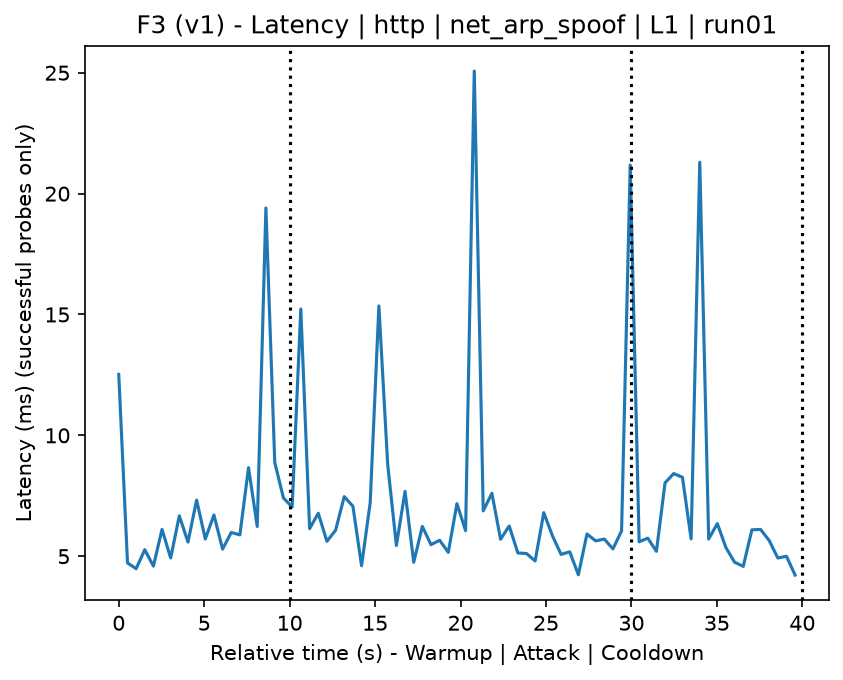
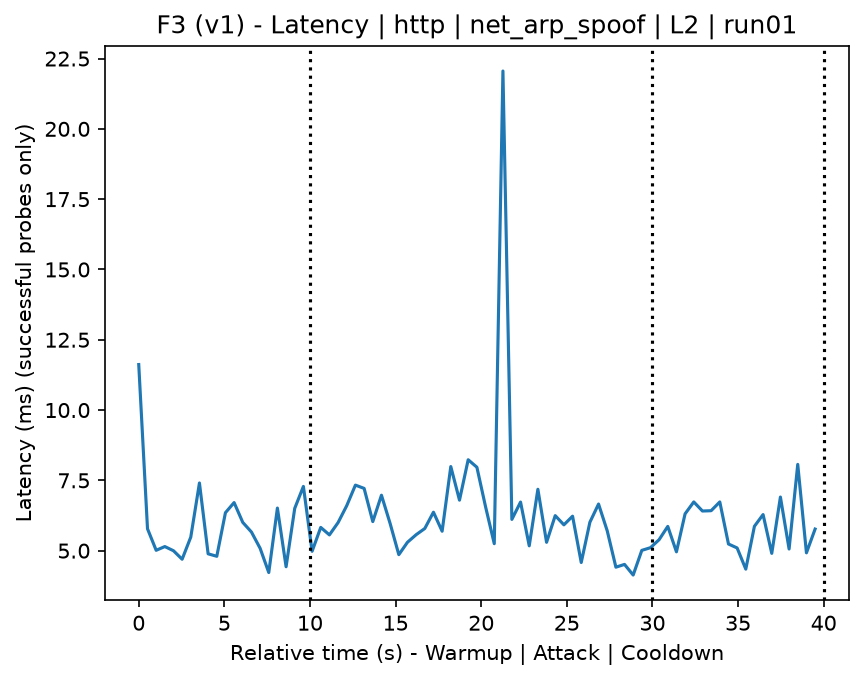
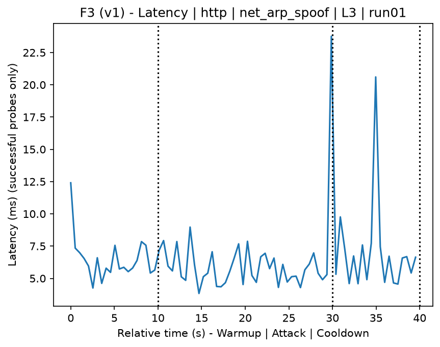
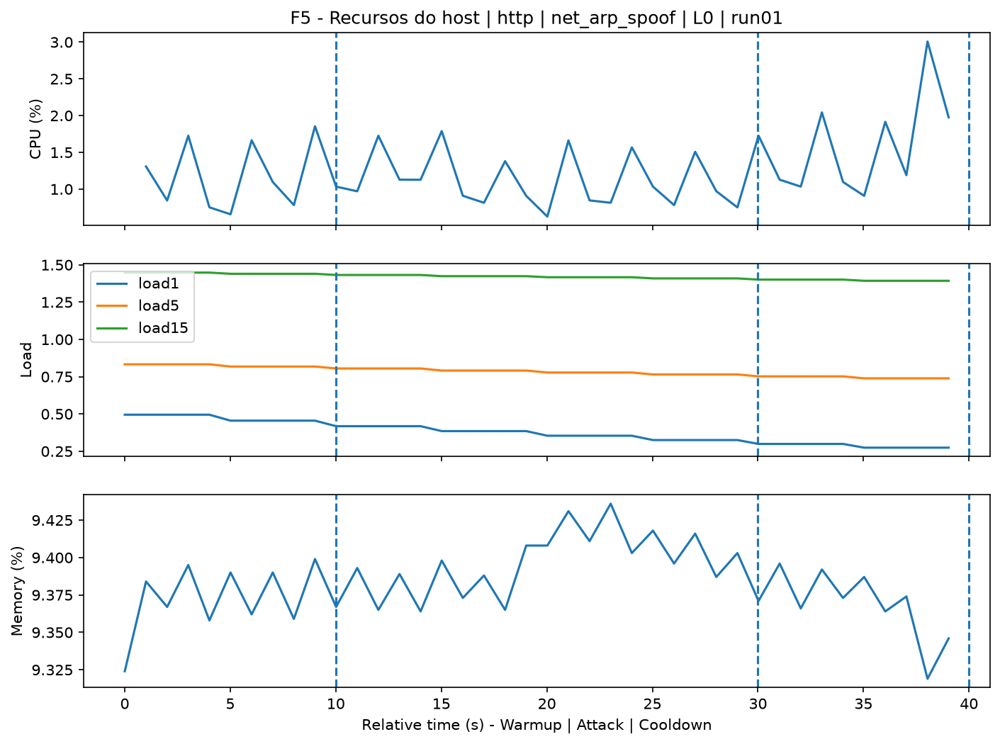
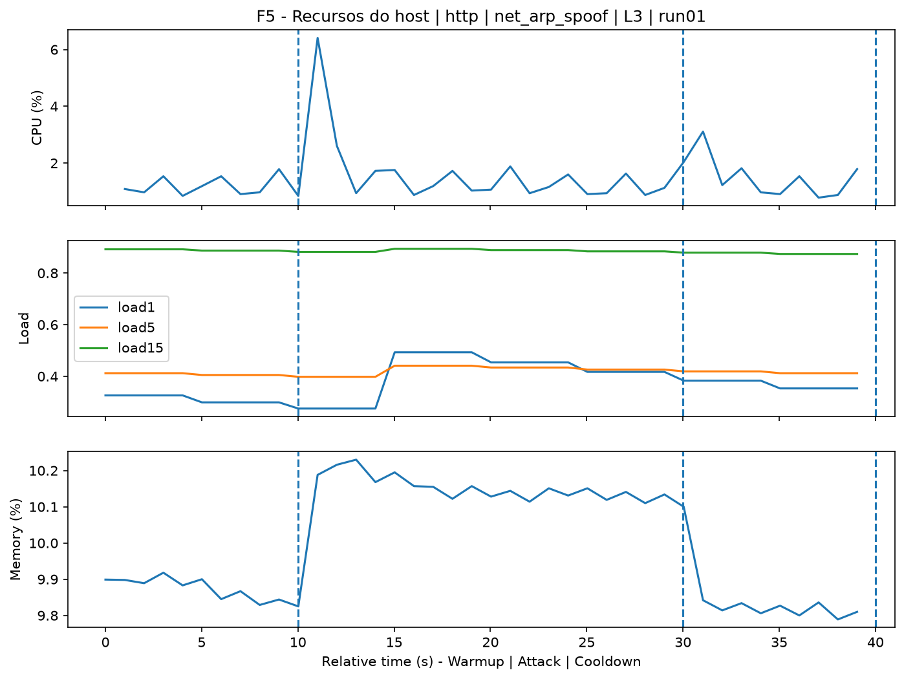
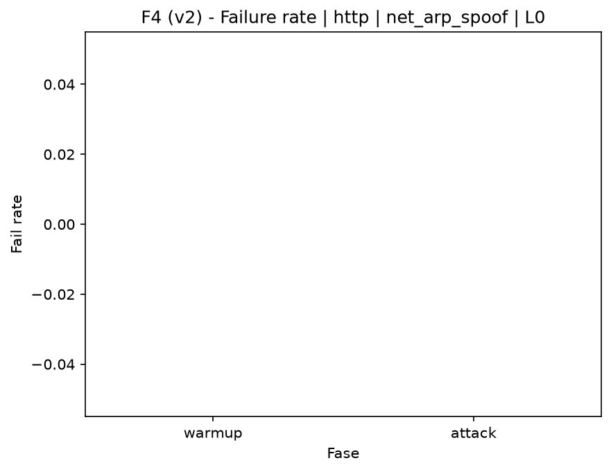
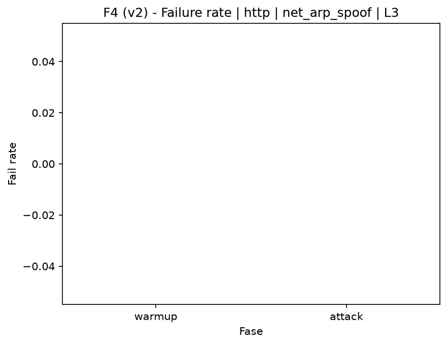

# ARP Spoof (`net_arp_spoof`)

[Campaign index](README.md)

This document summarizes the published campaign execution of attack `net_arp_spoof`. In the local catalog, the attack is described as: Network gateway interception attack through ARP spoofing. The full execution artifacts are not versioned in this repository; retrieve the generated dataset CSVs from the Figshare dataset linked in the campaign index. Raw PCAP captures are not included in that archive. The selected figures below are stored under `contrib/assets/campaign_doc`.

## Attack Metadata

| Field | Value |
| --- | --- |
| ID | `net_arp_spoof` |
| Category | 2) Network Interception and Exploitation |
| Subcategory | 2.1 L2/L3 |
| Target services | local network |
| Image | `attack-arp-spoof:latest` |
| Container | `attack-arp-spoof` |
| Catalog max runtime | 10 s |
| Intensity parameters | n/a |
| MITRE ATT&CK | [https://attack.mitre.org/tactics/TA0006/](https://attack.mitre.org/tactics/TA0006/) [https://attack.mitre.org/tactics/TA0009/](https://attack.mitre.org/tactics/TA0009/) [https://attack.mitre.org/techniques/T1557/](https://attack.mitre.org/techniques/T1557/) [https://attack.mitre.org/techniques/T1557/002/](https://attack.mitre.org/techniques/T1557/002/) |

## Statistical Summary by Level

| Level | Service | Runs | Attack samples | Mean success | Mean failure | Lat p50/p95 ms | Total PCAP MB | Mean dataset (min-max) | Mean exec s | Extractors ok/total | Mean/max CPU | Mean mem MB |
| --- | --- | --- | --- | --- | --- | --- | --- | --- | --- | --- | --- | --- |
| L0 | http | 5 | 194 | 100% | 0% | 11,67 / 29,61 | 43,9 | 39.094 (38.436-39.714) | 47,98 | 3/3 | 0,84% / 1,04% | 108,7 |
| L1 | http | 5 | 200 | 100% | 0% | 5,86 / 11,84 | 46,43 | 41.578 (41.340-41.952) | 48,08 | 3/3 | 0,78% / 1% | 110,97 |
| L2 | http | 5 | 200 | 100% | 0% | 5,58 / 8,22 | 45,45 | 40.844 (40.754-41.194) | 48 | 3/3 | 0,84% / 1,04% | 113,1 |
| L3 | http | 5 | 200 | 100% | 0% | 5,53 / 7,83 | 45,94 | 41.214 (41.058-41.446) | 48,09 | 3/3 | 0,81% / 0,98% | 115,17 |

## Stability Across Reruns

| Level | Metric | Runs | Mean | Deviation | CV | Min | Max |
| --- | --- | --- | --- | --- | --- | --- | --- |
| L0 | Mean CPU in attack phase | 5 | 0,84 | 0,07 | 8,15% | 0,77 | 0,95 |
| L0 | Dataset rows | 5 | 39.093,6 | 504,09 | 1,29% | 38.436 | 39.714 |
| L0 | Execution time | 5 | 47,98 | 0,33 | 0,68% | 47,75 | 48,55 |
| L0 | Failure in attack phase | 5 | 0 | 0 | n/a | 0 | 0 |
| L0 | Censored p95 latency | 5 | 29,61 | 7,9 | 26,66% | 22,42 | 43,07 |
| L1 | Mean CPU in attack phase | 5 | 0,78 | 0,09 | 12,13% | 0,62 | 0,87 |
| L1 | Dataset rows | 5 | 41.578 | 245,35 | 0,59% | 41.340 | 41.952 |
| L1 | Execution time | 5 | 48,08 | 0,1 | 0,21% | 47,96 | 48,16 |
| L1 | Failure in attack phase | 5 | 0 | 0 | n/a | 0 | 0 |
| L1 | Censored p95 latency | 5 | 11,84 | 5,13 | 43,33% | 7,56 | 18,9 |
| L2 | Mean CPU in attack phase | 5 | 0,84 | 0,04 | 4,65% | 0,79 | 0,88 |
| L2 | Dataset rows | 5 | 40.844,4 | 195,45 | 0,48% | 40.754 | 41.194 |
| L2 | Execution time | 5 | 48 | 0,04 | 0,09% | 47,93 | 48,05 |
| L2 | Failure in attack phase | 5 | 0 | 0 | n/a | 0 | 0 |
| L2 | Censored p95 latency | 5 | 8,22 | 1,04 | 12,64% | 7,15 | 9,67 |
| L3 | Mean CPU in attack phase | 5 | 0,81 | 0,02 | 2,91% | 0,79 | 0,84 |
| L3 | Dataset rows | 5 | 41.213,6 | 141,78 | 0,34% | 41.058 | 41.446 |
| L3 | Execution time | 5 | 48,09 | 0,05 | 0,11% | 48,01 | 48,15 |
| L3 | Failure in attack phase | 5 | 0 | 0 | n/a | 0 | 0 |
| L3 | Censored p95 latency | 5 | 7,83 | 0,76 | 9,66% | 6,68 | 8,52 |

## Artifact Validation

| Level | Runs | Capture | Probe | Features | Dataset | Resources | Server stats | Acceptance |
| --- | --- | --- | --- | --- | --- | --- | --- | --- |
| L0 | 5 | 5/5 | 5/5 | 5/5 | 5/5 | 5/5 | 5/5 | 5/5 |
| L1 | 5 | 5/5 | 5/5 | 5/5 | 5/5 | 5/5 | 5/5 | 5/5 |
| L2 | 5 | 5/5 | 5/5 | 5/5 | 5/5 | 5/5 | 5/5 | 5/5 |
| L3 | 5 | 5/5 | 5/5 | 5/5 | 5/5 | 5/5 | 5/5 | 5/5 |

## Selected Figures

<table>
<tr>
<td> Time series L0 run01</td>
<td> Time series L1 run01</td>
</tr>
<tr>
<td> Time series L2 run01</td>
<td> Time series L3 run01</td>
</tr>
<tr>
<td> Resources L0 run01</td>
<td> Resources L3 run01</td>
</tr>
<tr>
<td> Failure rate L0</td>
<td> Failure rate L3</td>
</tr>
</table>

## Sources Used

- Attack catalog: `docker/attackers/arp-spoof/attack.yaml`
- Full campaign artifacts: available from the Figshare dataset linked in the campaign index; when extracted locally, expected under `experiments/all_5runs_4levels/net_arp_spoof`.
