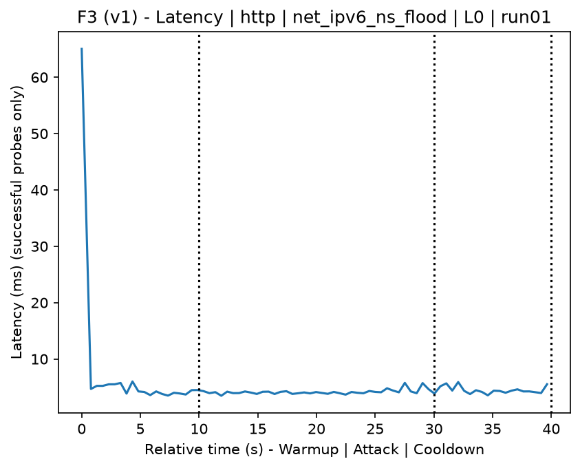
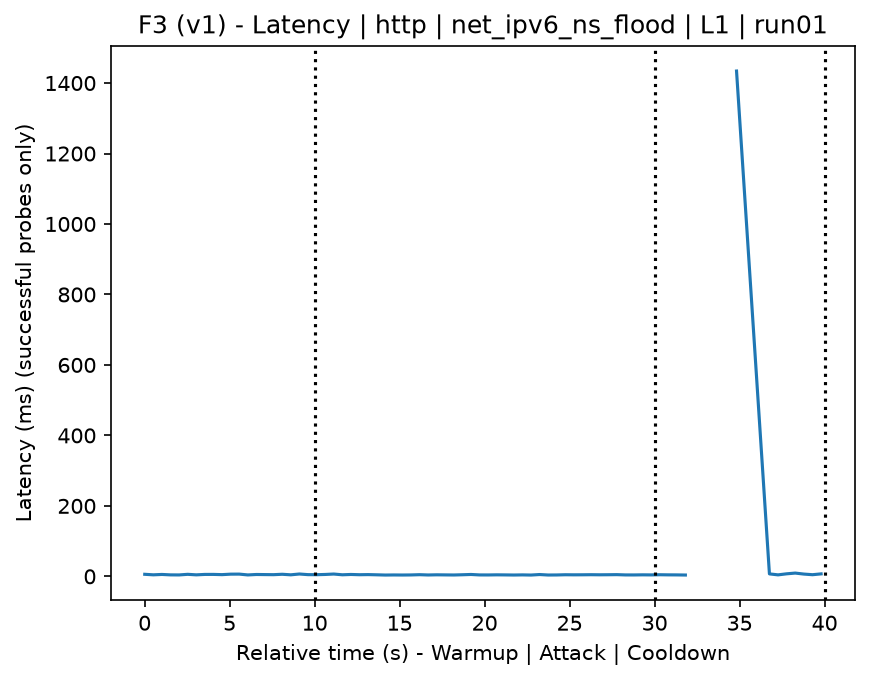
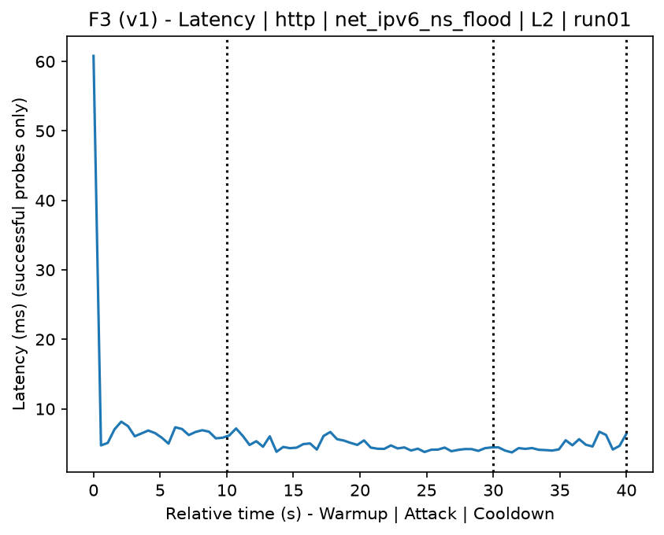
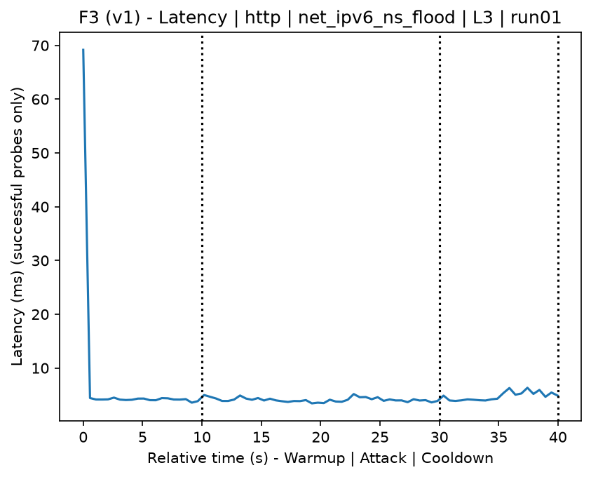
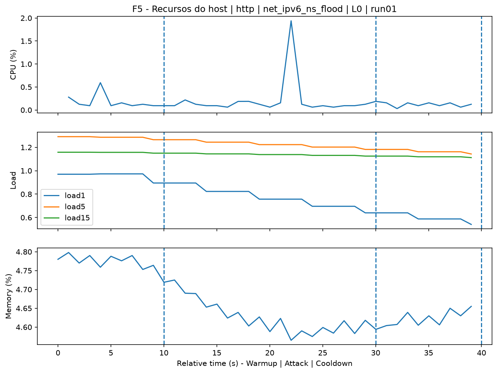
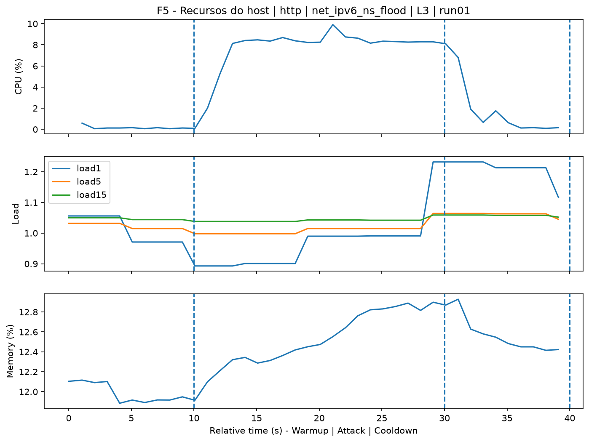
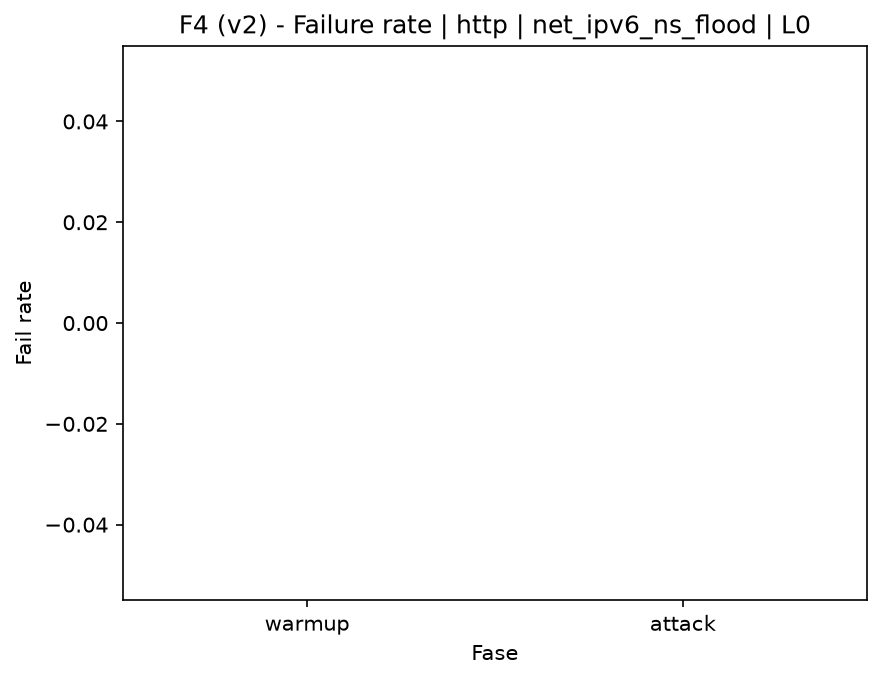

# IPv6 NS Flood (`net_ipv6_ns_flood`)

[Campaign index](README.md)

This document summarizes the published campaign execution of attack `net_ipv6_ns_flood`. In the local catalog, the attack is described as: ICMPv6 Neighbor Solicitation NS (135) flood on the local network. The full execution artifacts are not versioned in this repository; retrieve the generated dataset CSVs from the Figshare dataset linked in the campaign index. Raw PCAP captures are not included in that archive. The selected figures below are stored under `contrib/assets/campaign_doc`.

## Attack Metadata

| Field | Value |
| --- | --- |
| ID | `net_ipv6_ns_flood` |
| Category | 2) Network Interception and Exploitation |
| Subcategory | 2.2 IPv6 |
| Target services | local IPv6 network |
| Image | `attack-ipv6-ns-flood:latest` |
| Container | `attack-ipv6-ns-flood` |
| Catalog max runtime | 10 s |
| Intensity parameters | n/a |
| MITRE ATT&CK | [https://attack.mitre.org/tactics/TA0040/](https://attack.mitre.org/tactics/TA0040/) [https://attack.mitre.org/techniques/T1498/](https://attack.mitre.org/techniques/T1498/) [https://attack.mitre.org/techniques/T1498/001/](https://attack.mitre.org/techniques/T1498/001/) |

## Statistical Summary by Level

| Level | Service | Runs | Attack samples | Mean success | Mean failure | Lat p50/p95 ms | Total PCAP MB | Mean dataset (min-max) | Mean exec s | Extractors ok/total | Mean/max CPU | Mean mem MB |
| --- | --- | --- | --- | --- | --- | --- | --- | --- | --- | --- | --- | --- |
| L0 | http | 5 | 199 | 100% | 0% | 4,68 / 6,31 | 5,19 | 9.920 (9.594-11.182) | 43,6 | 3/3 | 0,74% / 0,91% | 118,14 |
| L1 | http | 5 | 200 | 100% | 0% | 4,44 / 6 | 3.970,47 | 15.410.129 (13.709.440-16.443.054) | 1.562,22 | 3/3 | 0,72% / 0,95% | 123,2 |
| L2 | http | 5 | 199 | 100% | 0% | 4,65 / 6,07 | 4.153,5 | 16.120.792 (15.801.490-16.369.384) | 1.627,37 | 3/3 | 0,7% / 0,87% | 126,02 |
| L3 | http | 5 | 200 | 100% | 0% | 4,28 / 5,98 | 3.909,94 | 15.175.026 (12.540.022-16.408.888) | 1.529,62 | 3/3 | 0,66% / 0,86% | 128,12 |

## Stability Across Reruns

| Level | Metric | Runs | Mean | Deviation | CV | Min | Max |
| --- | --- | --- | --- | --- | --- | --- | --- |
| L0 | Mean CPU in attack phase | 5 | 0,74 | 0,09 | 12,78% | 0,62 | 0,86 |
| L0 | Dataset rows | 5 | 9.920 | 705,63 | 7,11% | 9.594 | 11.182 |
| L0 | Execution time | 5 | 43,6 | 1,29 | 2,96% | 42,91 | 45,91 |
| L0 | Failure in attack phase | 5 | 0 | 0 | n/a | 0 | 0 |
| L0 | Censored p95 latency | 5 | 6,31 | 1,2 | 19,1% | 4,89 | 7,71 |
| L1 | Mean CPU in attack phase | 5 | 0,72 | 0,07 | 9,81% | 0,62 | 0,8 |
| L1 | Dataset rows | 5 | 15.410.128,8 | 1.015.598,34 | 6,59% | 13.709.440 | 16.443.054 |
| L1 | Execution time | 5 | 1.562,22 | 98,67 | 6,32% | 1.398,26 | 1.664,52 |
| L1 | Failure in attack phase | 5 | 0 | 0 | n/a | 0 | 0 |
| L1 | Censored p95 latency | 5 | 6 | 0,79 | 13,22% | 5,26 | 7,22 |
| L2 | Mean CPU in attack phase | 5 | 0,7 | 0,09 | 12,4% | 0,6 | 0,78 |
| L2 | Dataset rows | 5 | 16.120.792 | 220.354,08 | 1,37% | 15.801.490 | 16.369.384 |
| L2 | Execution time | 5 | 1.627,37 | 24 | 1,47% | 1.591,54 | 1.652,76 |
| L2 | Failure in attack phase | 5 | 0 | 0 | n/a | 0 | 0 |
| L2 | Censored p95 latency | 5 | 6,07 | 1,18 | 19,52% | 4,65 | 7,4 |
| L3 | Mean CPU in attack phase | 5 | 0,66 | 0,06 | 8,79% | 0,6 | 0,74 |
| L3 | Dataset rows | 5 | 15.175.026 | 1.532.495,18 | 10,1% | 12.540.022 | 16.408.888 |
| L3 | Execution time | 5 | 1.529,62 | 146,01 | 9,55% | 1.277,3 | 1.640,92 |
| L3 | Failure in attack phase | 5 | 0 | 0 | n/a | 0 | 0 |
| L3 | Censored p95 latency | 5 | 5,98 | 0,97 | 16,16% | 4,89 | 7,13 |

## Artifact Validation

| Level | Runs | Capture | Probe | Features | Dataset | Resources | Server stats | Acceptance |
| --- | --- | --- | --- | --- | --- | --- | --- | --- |
| L0 | 5 | 5/5 | 5/5 | 5/5 | 5/5 | 5/5 | 5/5 | 5/5 |
| L1 | 5 | 5/5 | 5/5 | 5/5 | 5/5 | 5/5 | 5/5 | 5/5 |
| L2 | 5 | 5/5 | 5/5 | 5/5 | 5/5 | 5/5 | 5/5 | 5/5 |
| L3 | 5 | 5/5 | 5/5 | 5/5 | 5/5 | 5/5 | 5/5 | 5/5 |

## Selected Figures

<table>
<tr>
<td> Time series L0 run01</td>
<td> Time series L1 run01</td>
</tr>
<tr>
<td> Time series L2 run01</td>
<td> Time series L3 run01</td>
</tr>
<tr>
<td> Resources L0 run01</td>
<td> Resources L3 run01</td>
</tr>
<tr>
<td> Failure rate L0</td>
<td> Failure rate L3</td>
</tr>
</table>

## Sources Used

- Attack catalog: `docker/attackers/ipv6-ns-flood/attack.yaml`
- Full campaign artifacts: available from the Figshare dataset linked in the campaign index; when extracted locally, expected under `experiments/all_5runs_4levels/net_ipv6_ns_flood`.
