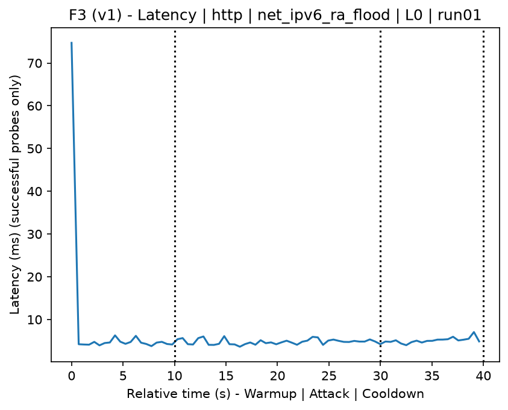
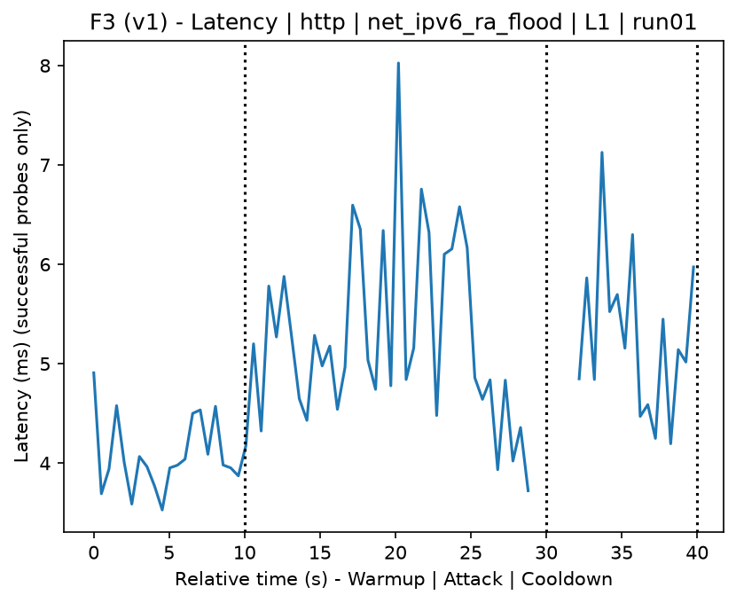
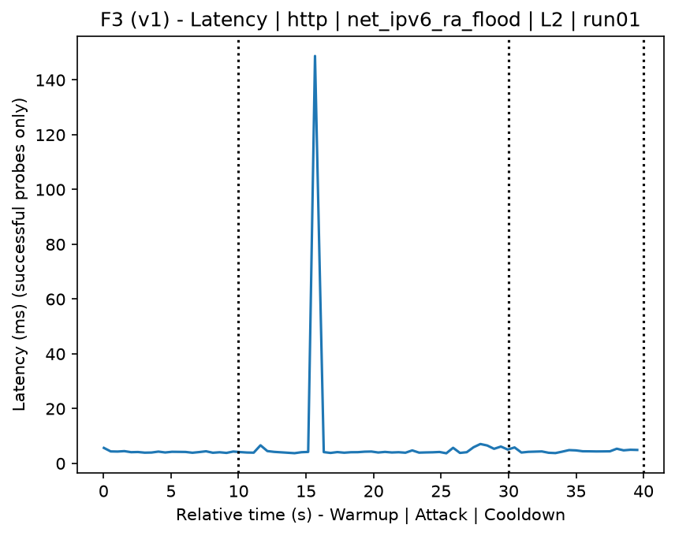
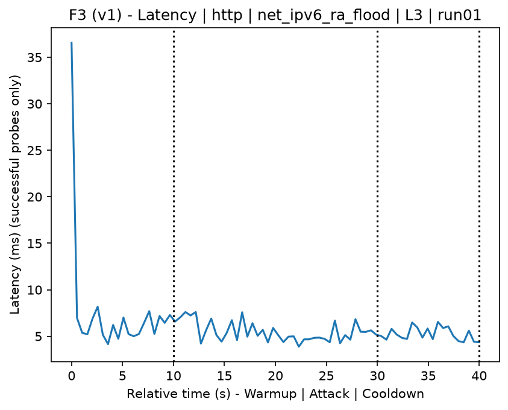
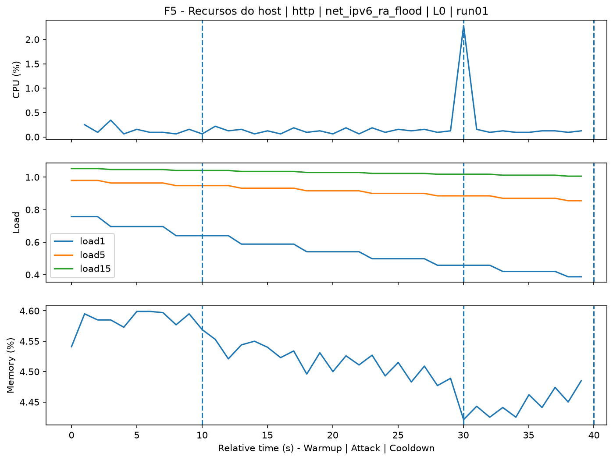
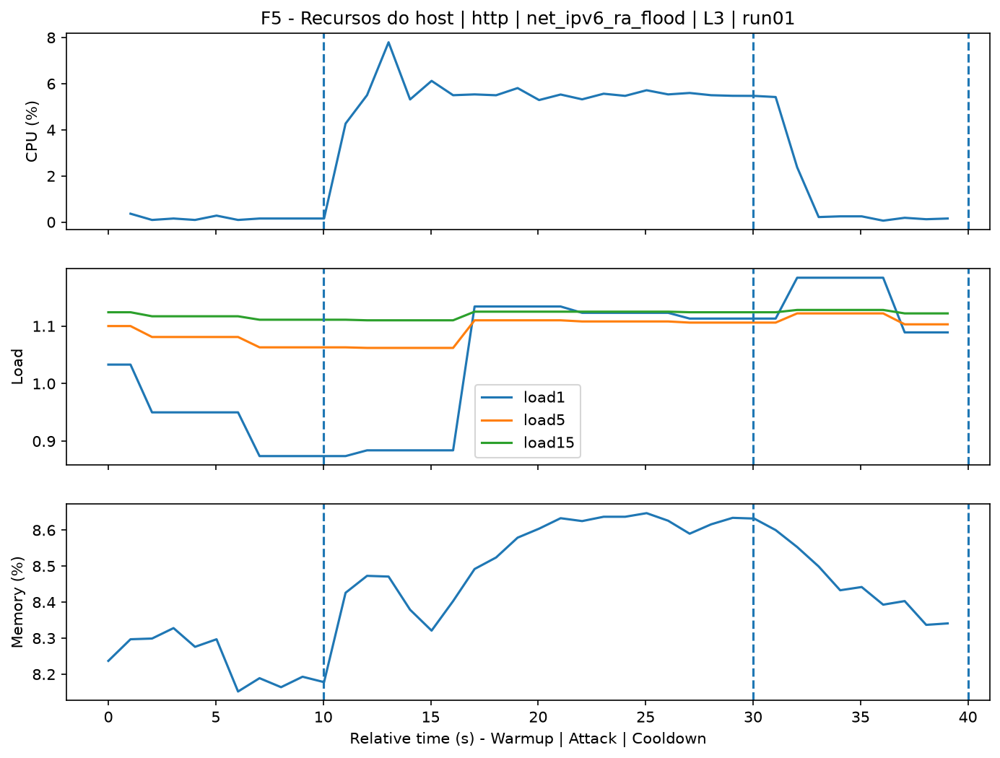
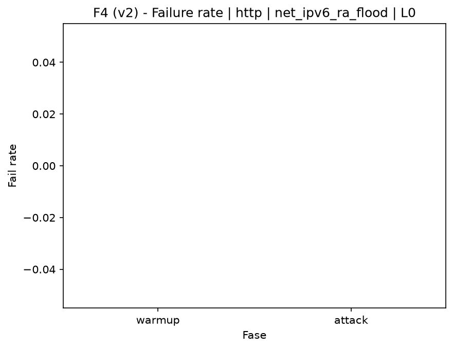
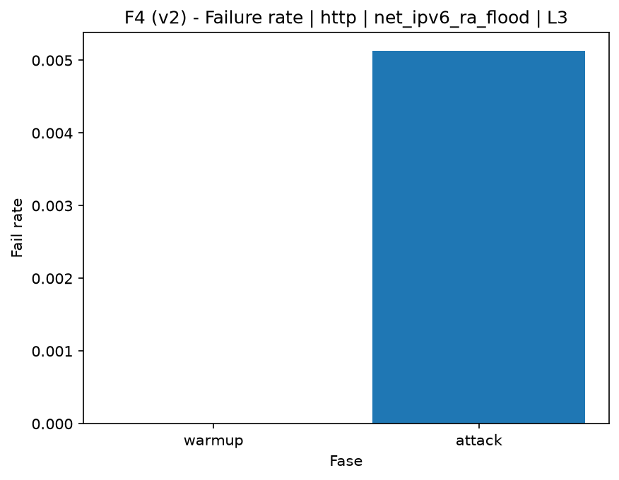

# IPv6 RA Flood (`net_ipv6_ra_flood`)

[Campaign index](README.md)

This document summarizes the published campaign execution of attack `net_ipv6_ra_flood`. In the local catalog, the attack is described as: ICMPv6 Router Advertisement RA (134) flood on the local network. The full execution artifacts are not versioned in this repository; retrieve the generated dataset CSVs from the Figshare dataset linked in the campaign index. Raw PCAP captures are not included in that archive. The selected figures below are stored under `contrib/assets/campaign_doc`.

## Attack Metadata

| Field | Value |
| --- | --- |
| ID | `net_ipv6_ra_flood` |
| Category | 2) Network Interception and Exploitation |
| Subcategory | 2.2 IPv6 |
| Target services | local IPv6 network |
| Image | `attack-ipv6-ra-flood:latest` |
| Container | `attack-ipv6-ra-flood` |
| Catalog max runtime | 10 s |
| Intensity parameters | n/a |
| MITRE ATT&CK | [https://attack.mitre.org/tactics/TA0006/](https://attack.mitre.org/tactics/TA0006/) [https://attack.mitre.org/tactics/TA0009/](https://attack.mitre.org/tactics/TA0009/) [https://attack.mitre.org/tactics/TA0040/](https://attack.mitre.org/tactics/TA0040/) [https://attack.mitre.org/techniques/T1557/](https://attack.mitre.org/techniques/T1557/) [https://attack.mitre.org/techniques/T1498/](https://attack.mitre.org/techniques/T1498/) [https://attack.mitre.org/techniques/T1498/001/](https://attack.mitre.org/techniques/T1498/001/) |

## Statistical Summary by Level

| Level | Service | Runs | Attack samples | Mean success | Mean failure | Lat p50/p95 ms | Total PCAP MB | Mean dataset (min-max) | Mean exec s | Extractors ok/total | Mean/max CPU | Mean mem MB |
| --- | --- | --- | --- | --- | --- | --- | --- | --- | --- | --- | --- | --- |
| L0 | http | 5 | 200 | 100% | 0% | 4,2 / 4,97 | 5,05 | 9.601 (9.590-9.612) | 43,27 | 3/3 | 0,65% / 0,83% | 130,23 |
| L1 | http | 5 | 191 | 98,9% | 1,1% | 4,42 / 5,61 | 2.239,1 | 6.703.052 (5.264.982-7.208.904) | 964,9 | 3/3 | 0,65% / 0,79% | 133,08 |
| L2 | http | 5 | 200 | 100% | 0% | 4,17 / 5,49 | 2.075,81 | 6.213.737 (5.235.654-7.229.628) | 901,23 | 3/3 | 0,64% / 0,75% | 136,15 |
| L3 | http | 5 | 195 | 99,4% | 0,6% | 4,65 / 6,42 | 2.225,05 | 6.660.712 (5.878.524-7.124.444) | 962,3 | 3/3 | 0,7% / 0,88% | 138,2 |

## Stability Across Reruns

| Level | Metric | Runs | Mean | Deviation | CV | Min | Max |
| --- | --- | --- | --- | --- | --- | --- | --- |
| L0 | Mean CPU in attack phase | 5 | 0,65 | 0,07 | 10,28% | 0,6 | 0,76 |
| L0 | Dataset rows | 5 | 9.600,8 | 10,06 | 0,1% | 9.590 | 9.612 |
| L0 | Execution time | 5 | 43,27 | 0,89 | 2,06% | 42,77 | 44,86 |
| L0 | Failure in attack phase | 5 | 0 | 0 | n/a | 0 | 0 |
| L0 | Censored p95 latency | 5 | 4,97 | 0,61 | 12,33% | 4,28 | 5,94 |
| L1 | Mean CPU in attack phase | 5 | 0,65 | 0,06 | 9,01% | 0,62 | 0,76 |
| L1 | Dataset rows | 5 | 6.703.051,6 | 814.069,02 | 12,14% | 5.264.982 | 7.208.904 |
| L1 | Execution time | 5 | 964,9 | 110,58 | 11,46% | 768,77 | 1.029,91 |
| L1 | Failure in attack phase | 5 | 1,14 | 1,57 | 138,04% | 0 | 3,12 |
| L1 | Censored p95 latency | 5 | 5,61 | 0,96 | 17,18% | 4,71 | 6,88 |
| L2 | Mean CPU in attack phase | 5 | 0,64 | 0,04 | 5,73% | 0,58 | 0,68 |
| L2 | Dataset rows | 5 | 6.213.736,8 | 925.420,2 | 14,89% | 5.235.654 | 7.229.628 |
| L2 | Execution time | 5 | 901,23 | 128,99 | 14,31% | 764,94 | 1.040,79 |
| L2 | Failure in attack phase | 5 | 0 | 0 | n/a | 0 | 0 |
| L2 | Censored p95 latency | 5 | 5,49 | 0,78 | 14,13% | 4,61 | 6,64 |
| L3 | Mean CPU in attack phase | 5 | 0,7 | 0,1 | 14,03% | 0,56 | 0,8 |
| L3 | Dataset rows | 5 | 6.660.711,6 | 508.458,95 | 7,63% | 5.878.524 | 7.124.444 |
| L3 | Execution time | 5 | 962,3 | 71,12 | 7,39% | 852,35 | 1.026,51 |
| L3 | Failure in attack phase | 5 | 0,57 | 1,28 | 223,61% | 0 | 2,86 |
| L3 | Censored p95 latency | 5 | 6,42 | 1,01 | 15,74% | 5,07 | 7,59 |

## Artifact Validation

| Level | Runs | Capture | Probe | Features | Dataset | Resources | Server stats | Acceptance |
| --- | --- | --- | --- | --- | --- | --- | --- | --- |
| L0 | 5 | 5/5 | 5/5 | 5/5 | 5/5 | 5/5 | 5/5 | 5/5 |
| L1 | 5 | 5/5 | 5/5 | 5/5 | 5/5 | 5/5 | 5/5 | 5/5 |
| L2 | 5 | 5/5 | 5/5 | 5/5 | 5/5 | 5/5 | 5/5 | 5/5 |
| L3 | 5 | 5/5 | 5/5 | 5/5 | 5/5 | 5/5 | 5/5 | 5/5 |

## Selected Figures

<table>
<tr>
<td> Time series L0 run01</td>
<td> Time series L1 run01</td>
</tr>
<tr>
<td> Time series L2 run01</td>
<td> Time series L3 run01</td>
</tr>
<tr>
<td> Resources L0 run01</td>
<td> Resources L3 run01</td>
</tr>
<tr>
<td> Failure rate L0</td>
<td> Failure rate L3</td>
</tr>
</table>

## Sources Used

- Attack catalog: `docker/attackers/ipv6-ra-flood/attack.yaml`
- Full campaign artifacts: available from the Figshare dataset linked in the campaign index; when extracted locally, expected under `experiments/60att_5runs_l0l1l2l3/net_ipv6_ra_flood`.
