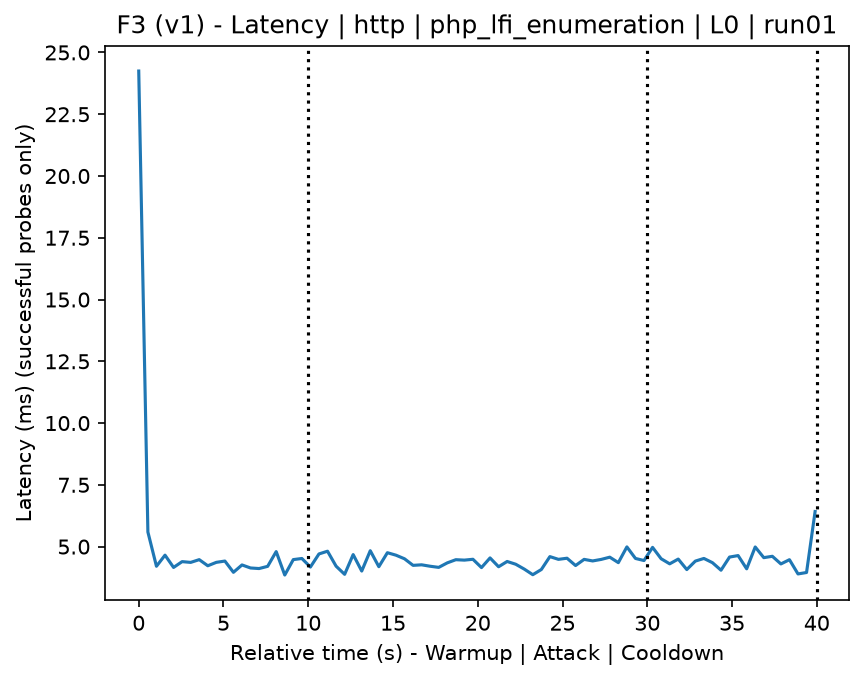
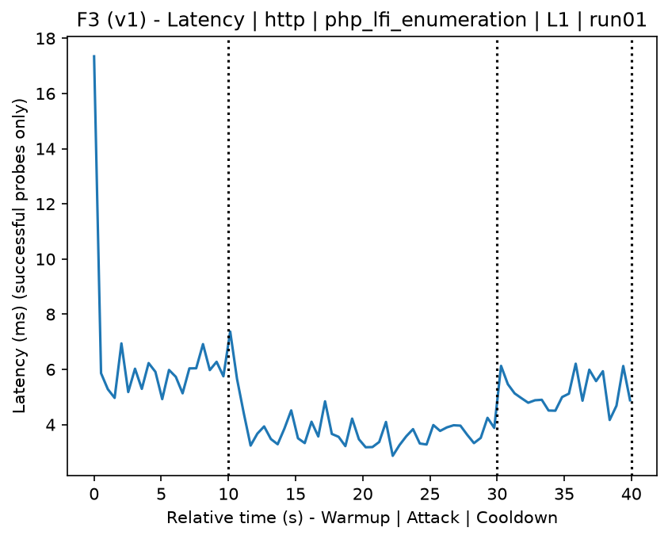
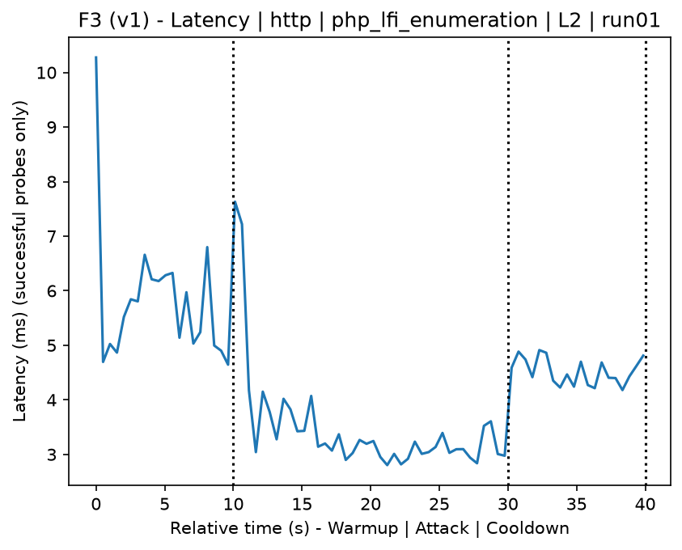
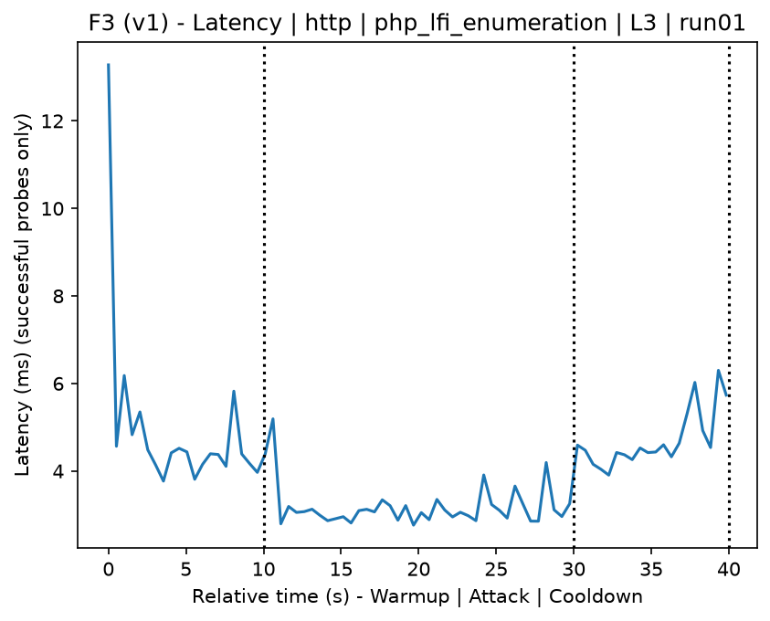
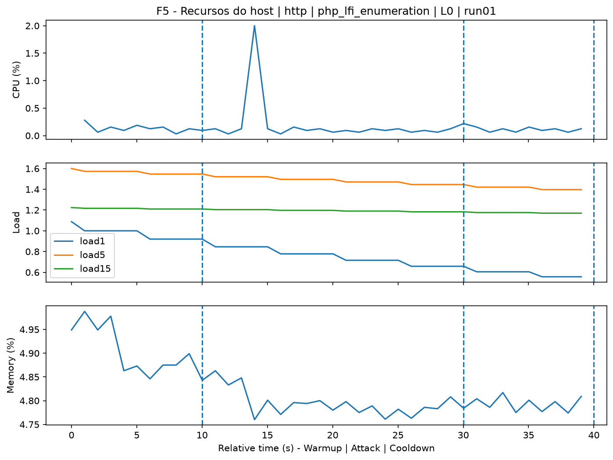
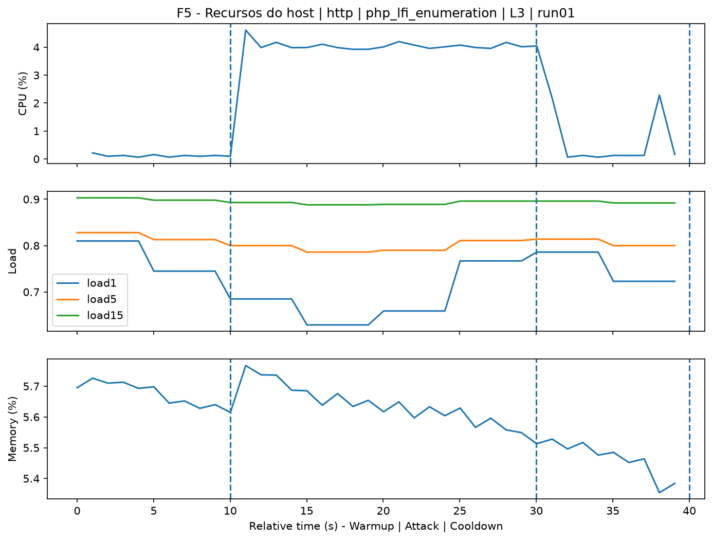
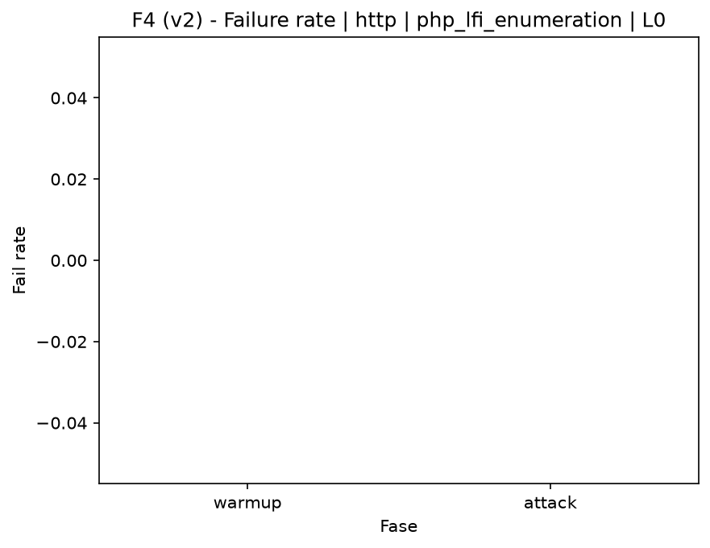

# PHP LFI Enumeration (`php_lfi_enumeration`)

[Índice da campanha](README.md)

Na campanha `experiments/60att_5runs_l0l1l2l3`, este documento consolida a execução do ataque `php_lfi_enumeration`. No catálogo local, o ataque é descrito como: Controlled enumeration of Local File Inclusion (LFI) vectors in a vulnerable PHP application. A documentação abaixo usa apenas artefatos já presentes no repositório, principalmente as tabelas e figuras de `experiments/60att_5runs_l0l1l2l3/php_lfi_enumeration`.

## Metadados do ataque

| Campo | Valor |
| --- | --- |
| ID | `php_lfi_enumeration` |
| Categoria | 3) Web Application Attacks |
| Subcategoria | 3.2 Insecure Direct Object Reference (IDOR) |
| Serviços alvo | http-server |
| Imagem | `attack-php-lfi-enumeration:latest` |
| Container | `attack-php-lfi-enumeration` |
| Runtime máximo do catálogo | 10 s |
| Parâmetros de intensidade | n/d |
| MITRE ATT&CK | [https://attack.mitre.org/tactics/TA0043/](https://attack.mitre.org/tactics/TA0043/) [https://attack.mitre.org/tactics/TA0001/](https://attack.mitre.org/tactics/TA0001/) [https://attack.mitre.org/tactics/TA0009/](https://attack.mitre.org/tactics/TA0009/) [https://attack.mitre.org/techniques/T1595/](https://attack.mitre.org/techniques/T1595/) [https://attack.mitre.org/techniques/T1595/003/](https://attack.mitre.org/techniques/T1595/003/) [https://attack.mitre.org/techniques/T1190/](https://attack.mitre.org/techniques/T1190/) [https://attack.mitre.org/techniques/T1005/](https://attack.mitre.org/techniques/T1005/) |

## Resumo estatístico por nível

| Nível | Serviço | Runs | Amostras attack | Sucesso médio | Falha média | Lat p50/p95 ms | PCAP total MB | Dataset médio (min-max) | Exec média s | Extratores ok/total | CPU média/máx | Mem MB média |
| --- | --- | --- | --- | --- | --- | --- | --- | --- | --- | --- | --- | --- |
| L0 | http | 5 | 200 | 100% | 0% | 5,41 / 6,38 | 1,67 | 3.152 (3.120-3.200) | 42,41 | 3/3 | 0,84% / 0,95% | 420,58 |
| L1 | http | 5 | 200 | 100% | 0% | 3,34 / 4,69 | 74,89 | 137.978 (132.220-144.056) | 61,28 | 3/3 | 49,78% / 54,36% | 468,79 |
| L2 | http | 5 | 200 | 100% | 0% | 3,11 / 4,09 | 76,54 | 141.010 (138.478-143.216) | 60,47 | 3/3 | 49,83% / 54,28% | 562,11 |
| L3 | http | 5 | 200 | 100% | 0% | 2,99 / 4 | 77,67 | 143.094 (141.860-143.676) | 61,39 | 3/3 | 49,59% / 53,55% | 656,33 |

## Estabilidade entre reexecuções

| Nível | Métrica | Runs | Média | Desvio | CV | Min | Max |
| --- | --- | --- | --- | --- | --- | --- | --- |
| L0 | CPU média na fase attack | 5 | 0,84 | 0,11 | 13,22% | 0,69 | 0,97 |
| L0 | Linhas do dataset | 5 | 3.152 | 33,47 | 1,06% | 3.120 | 3.200 |
| L0 | Tempo de execução | 5 | 42,41 | 0,28 | 0,65% | 42,23 | 42,89 |
| L0 | Falha na fase attack | 5 | 0 | 0 | n/d | 0 | 0 |
| L0 | Latência p95 censurada | 5 | 6,38 | 1,15 | 18,03% | 4,82 | 7,55 |
| L1 | CPU média na fase attack | 5 | 49,78 | 1,97 | 3,95% | 46,89 | 51,85 |
| L1 | Linhas do dataset | 5 | 137.977,6 | 5.296,44 | 3,84% | 132.220 | 144.056 |
| L1 | Tempo de execução | 5 | 61,28 | 0,66 | 1,08% | 60,49 | 61,99 |
| L1 | Falha na fase attack | 5 | 0 | 0 | n/d | 0 | 0 |
| L1 | Latência p95 censurada | 5 | 4,69 | 0,67 | 14,28% | 3,86 | 5,56 |
| L2 | CPU média na fase attack | 5 | 49,83 | 0,82 | 1,65% | 48,61 | 50,8 |
| L2 | Linhas do dataset | 5 | 141.010,4 | 2.199,35 | 1,56% | 138.478 | 143.216 |
| L2 | Tempo de execução | 5 | 60,47 | 0,39 | 0,64% | 60,07 | 60,97 |
| L2 | Falha na fase attack | 5 | 0 | 0 | n/d | 0 | 0 |
| L2 | Latência p95 censurada | 5 | 4,09 | 0,25 | 6,01% | 3,79 | 4,33 |
| L3 | CPU média na fase attack | 5 | 49,59 | 0,28 | 0,56% | 49,3 | 50,03 |
| L3 | Linhas do dataset | 5 | 143.093,6 | 748,51 | 0,52% | 141.860 | 143.676 |
| L3 | Tempo de execução | 5 | 61,39 | 0,5 | 0,81% | 60,71 | 61,91 |
| L3 | Falha na fase attack | 5 | 0 | 0 | n/d | 0 | 0 |
| L3 | Latência p95 censurada | 5 | 4 | 0,29 | 7,19% | 3,65 | 4,29 |

## Validação de artefatos

| Nível | Runs | Captura | Probe | Features | Dataset | Recursos | Server stats | Aceite |
| --- | --- | --- | --- | --- | --- | --- | --- | --- |
| L0 | 5 | 5/5 | 5/5 | 5/5 | 5/5 | 5/5 | 5/5 | 5/5 |
| L1 | 5 | 5/5 | 5/5 | 5/5 | 5/5 | 5/5 | 5/5 | 5/5 |
| L2 | 5 | 5/5 | 5/5 | 5/5 | 5/5 | 5/5 | 5/5 | 5/5 |
| L3 | 5 | 5/5 | 5/5 | 5/5 | 5/5 | 5/5 | 5/5 | 5/5 |

## Figuras selecionadas

<table>
<tr>
<td> Série temporal L0 run01</td>
<td> Série temporal L1 run01</td>
</tr>
<tr>
<td> Série temporal L2 run01</td>
<td> Série temporal L3 run01</td>
</tr>
<tr>
<td> Recursos L0 run01</td>
<td> Recursos L3 run01</td>
</tr>
<tr>
<td> Taxa de falha L0</td>
<td> Taxa de falha L3</td>
</tr>
</table>

## Fontes utilizadas

- Catálogo do ataque: `docker/attackers/php-lfi-enumeration/attack.yaml`
- Artefatos da campanha: `experiments/60att_5runs_l0l1l2l3/php_lfi_enumeration`
