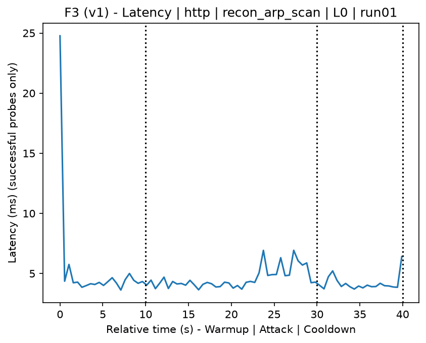
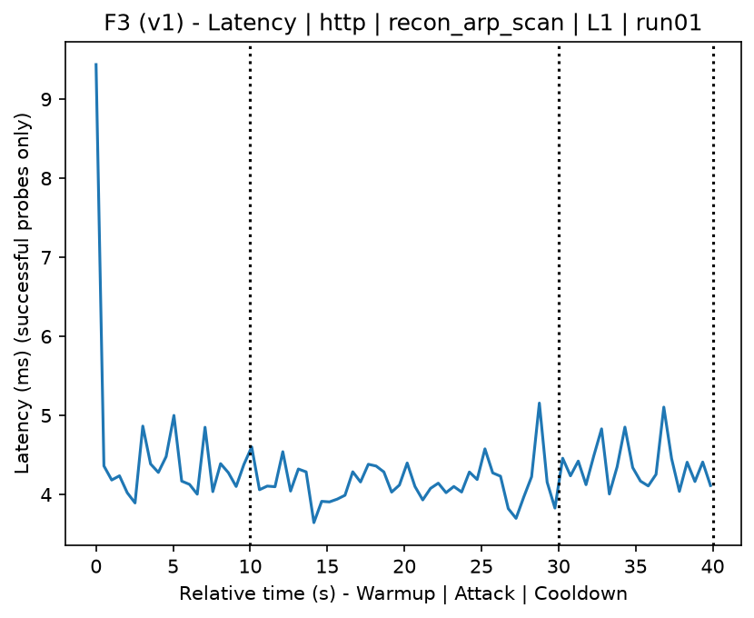
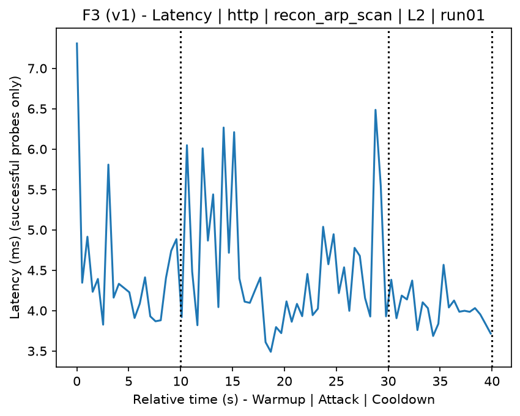
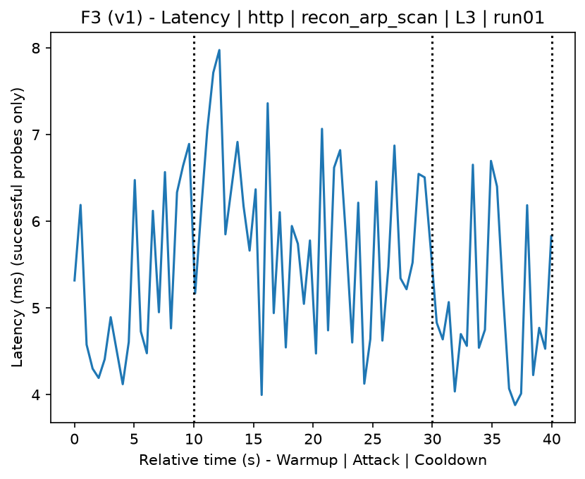
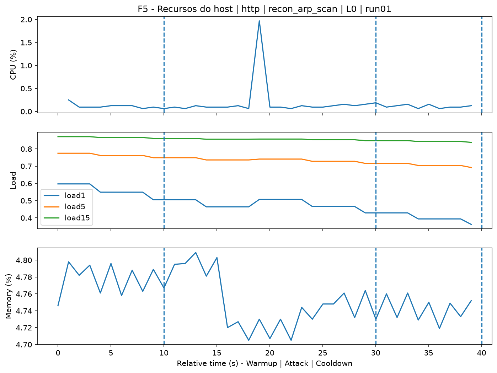
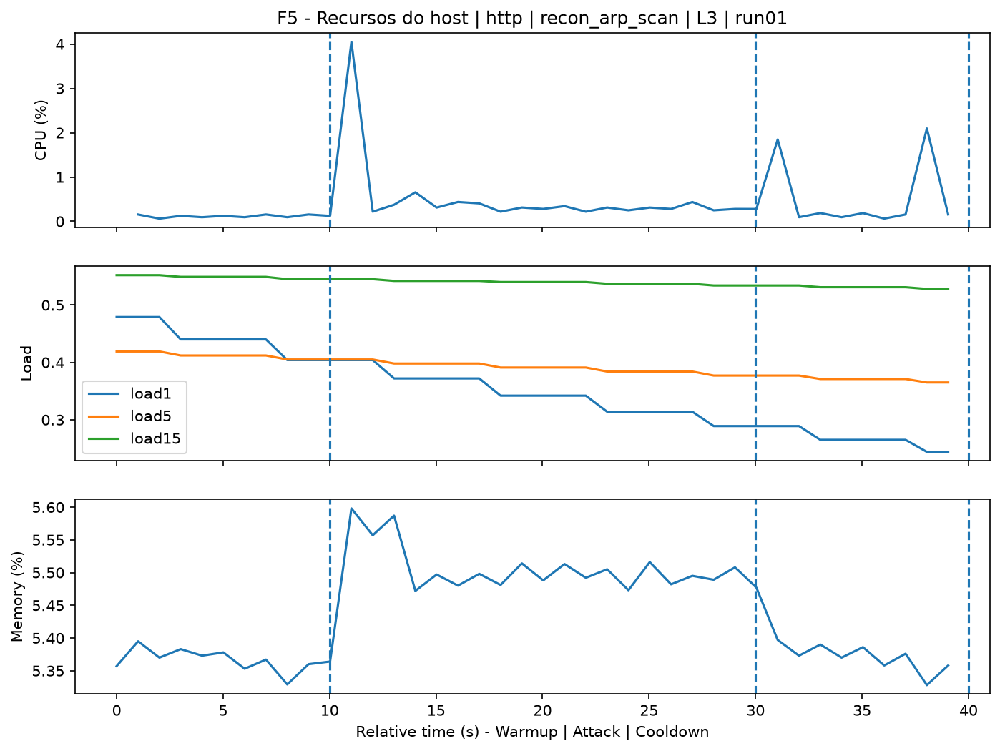
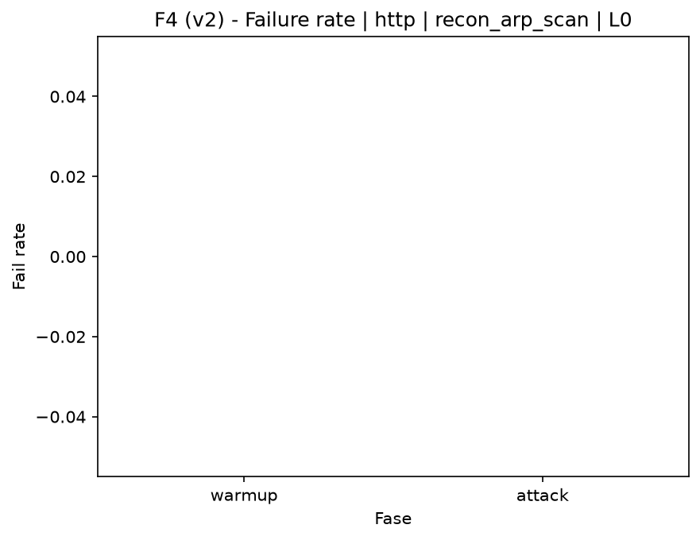
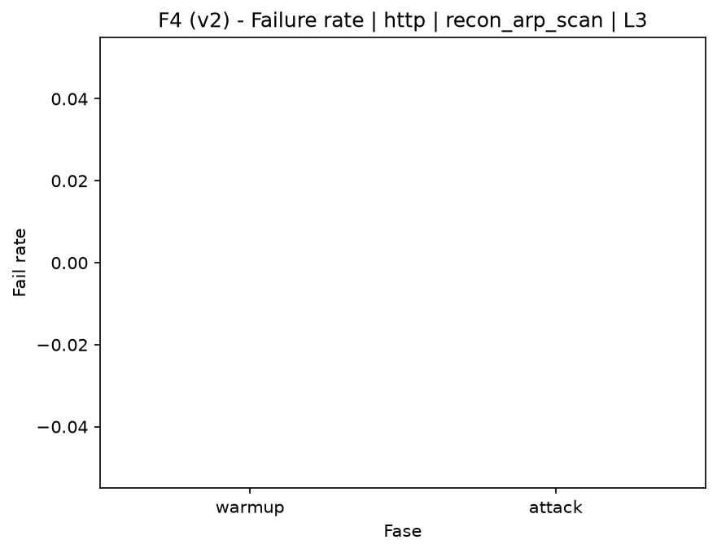

# ARP Scan (`recon_arp_scan`)

[Campaign index](README.md)

This document summarizes the published campaign execution of attack `recon_arp_scan`. In the local catalog, the attack is described as: Host enumeration through ARP on the target network. The full execution artifacts are not versioned in this repository; retrieve the generated dataset CSVs from the Figshare dataset linked in the campaign index. Raw PCAP captures are not included in that archive. The selected figures below are stored under `contrib/assets/campaign_doc`.

## Attack Metadata

| Field | Value |
| --- | --- |
| ID | `recon_arp_scan` |
| Category | 1) Reconnaissance and Discovery |
| Subcategory | 1.1 Network-level host discovery |
| Target services | local network |
| Image | `attack-arp-scan:latest` |
| Container | `attack-arp-scan` |
| Catalog max runtime | 10 s |
| Intensity parameters | n/a |
| MITRE ATT&CK | [https://attack.mitre.org/tactics/TA0043/](https://attack.mitre.org/tactics/TA0043/) [https://attack.mitre.org/tactics/TA0007/](https://attack.mitre.org/tactics/TA0007/) [https://attack.mitre.org/techniques/T1590/](https://attack.mitre.org/techniques/T1590/) [https://attack.mitre.org/techniques/T1595/](https://attack.mitre.org/techniques/T1595/) [https://attack.mitre.org/techniques/T1595/001/](https://attack.mitre.org/techniques/T1595/001/) [https://attack.mitre.org/techniques/T1018/](https://attack.mitre.org/techniques/T1018/) |

## Statistical Summary by Level

| Level | Service | Runs | Attack samples | Mean success | Mean failure | Lat p50/p95 ms | Total PCAP MB | Mean dataset (min-max) | Mean exec s | Extractors ok/total | Mean/max CPU | Mean mem MB |
| --- | --- | --- | --- | --- | --- | --- | --- | --- | --- | --- | --- | --- |
| L0 | http | 5 | 200 | 100% | 0% | 4,36 / 5,63 | 5,06 | 9.620 (9.590-9.718) | 43,13 | 3/3 | 0,73% / 0,89% | 701,9 |
| L1 | http | 5 | 200 | 100% | 0% | 4,36 / 5,54 | 40,04 | 238.923 (234.084-243.542) | 60,85 | 3/3 | 0,67% / 0,78% | 703,89 |
| L2 | http | 5 | 200 | 100% | 0% | 4,38 / 5,82 | 40,73 | 243.436 (242.890-243.946) | 61,15 | 3/3 | 0,71% / 0,89% | 706,09 |
| L3 | http | 5 | 200 | 100% | 0% | 5,16 / 6,94 | 40,72 | 243.358 (242.742-243.654) | 61,15 | 3/3 | 0,79% / 0,96% | 708,21 |

## Stability Across Reruns

| Level | Metric | Runs | Mean | Deviation | CV | Min | Max |
| --- | --- | --- | --- | --- | --- | --- | --- |
| L0 | Mean CPU in attack phase | 5 | 0,73 | 0,08 | 11,2% | 0,62 | 0,85 |
| L0 | Dataset rows | 5 | 9.620,4 | 54,89 | 0,57% | 9.590 | 9.718 |
| L0 | Execution time | 5 | 43,13 | 0,33 | 0,77% | 42,87 | 43,69 |
| L0 | Failure in attack phase | 5 | 0 | 0 | n/a | 0 | 0 |
| L0 | Censored p95 latency | 5 | 5,63 | 0,9 | 15,91% | 4,46 | 6,53 |
| L1 | Mean CPU in attack phase | 5 | 0,67 | 0,04 | 6,16% | 0,63 | 0,73 |
| L1 | Dataset rows | 5 | 238.922,8 | 4.484,55 | 1,88% | 234.084 | 243.542 |
| L1 | Execution time | 5 | 60,85 | 0,29 | 0,47% | 60,4 | 61,18 |
| L1 | Failure in attack phase | 5 | 0 | 0 | n/a | 0 | 0 |
| L1 | Censored p95 latency | 5 | 5,54 | 1,19 | 21,38% | 4,58 | 7,58 |
| L2 | Mean CPU in attack phase | 5 | 0,71 | 0,07 | 9,96% | 0,6 | 0,79 |
| L2 | Dataset rows | 5 | 243.436,4 | 404,42 | 0,17% | 242.890 | 243.946 |
| L2 | Execution time | 5 | 61,15 | 0,19 | 0,31% | 60,93 | 61,35 |
| L2 | Failure in attack phase | 5 | 0 | 0 | n/a | 0 | 0 |
| L2 | Censored p95 latency | 5 | 5,82 | 0,86 | 14,74% | 4,42 | 6,52 |
| L3 | Mean CPU in attack phase | 5 | 0,79 | 0,06 | 7,79% | 0,7 | 0,86 |
| L3 | Dataset rows | 5 | 243.358 | 364,9 | 0,15% | 242.742 | 243.654 |
| L3 | Execution time | 5 | 61,15 | 0,14 | 0,23% | 60,93 | 61,31 |
| L3 | Failure in attack phase | 5 | 0 | 0 | n/a | 0 | 0 |
| L3 | Censored p95 latency | 5 | 6,94 | 0,8 | 11,58% | 5,94 | 8 |

## Artifact Validation

| Level | Runs | Capture | Probe | Features | Dataset | Resources | Server stats | Acceptance |
| --- | --- | --- | --- | --- | --- | --- | --- | --- |
| L0 | 5 | 5/5 | 5/5 | 5/5 | 5/5 | 5/5 | 5/5 | 5/5 |
| L1 | 5 | 5/5 | 5/5 | 5/5 | 5/5 | 5/5 | 5/5 | 5/5 |
| L2 | 5 | 5/5 | 5/5 | 5/5 | 5/5 | 5/5 | 5/5 | 5/5 |
| L3 | 5 | 5/5 | 5/5 | 5/5 | 5/5 | 5/5 | 5/5 | 5/5 |

## Selected Figures

<table>
<tr>
<td> Time series L0 run01</td>
<td> Time series L1 run01</td>
</tr>
<tr>
<td> Time series L2 run01</td>
<td> Time series L3 run01</td>
</tr>
<tr>
<td> Resources L0 run01</td>
<td> Resources L3 run01</td>
</tr>
<tr>
<td> Failure rate L0</td>
<td> Failure rate L3</td>
</tr>
</table>

## Sources Used

- Attack catalog: `docker/attackers/arp-scan/attack.yaml`
- Full campaign artifacts: available from the Figshare dataset linked in the campaign index; when extracted locally, expected under `experiments/60att_5runs_l0l1l2l3/recon_arp_scan`.
