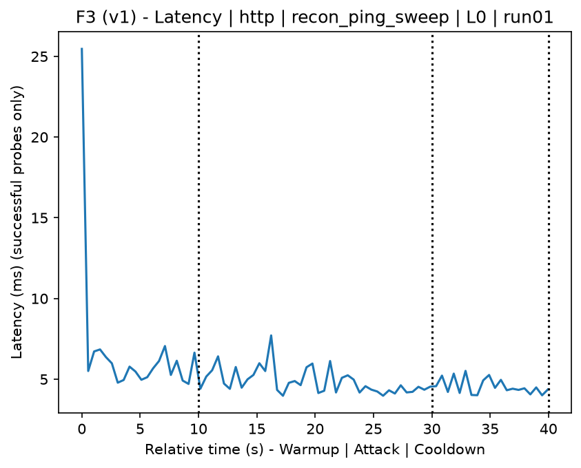
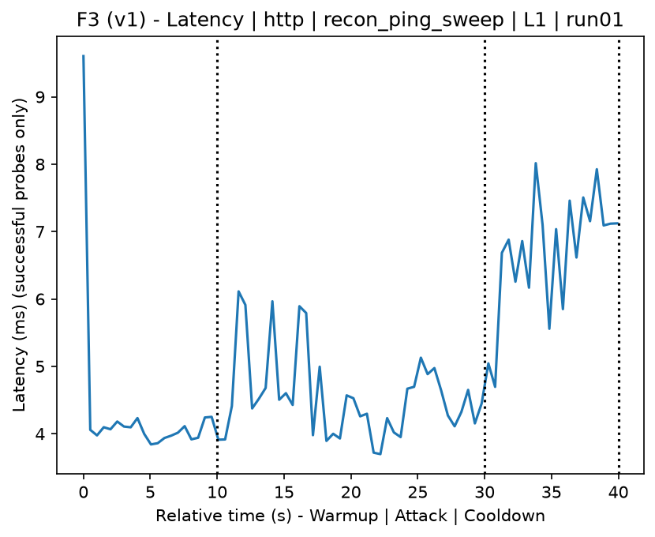
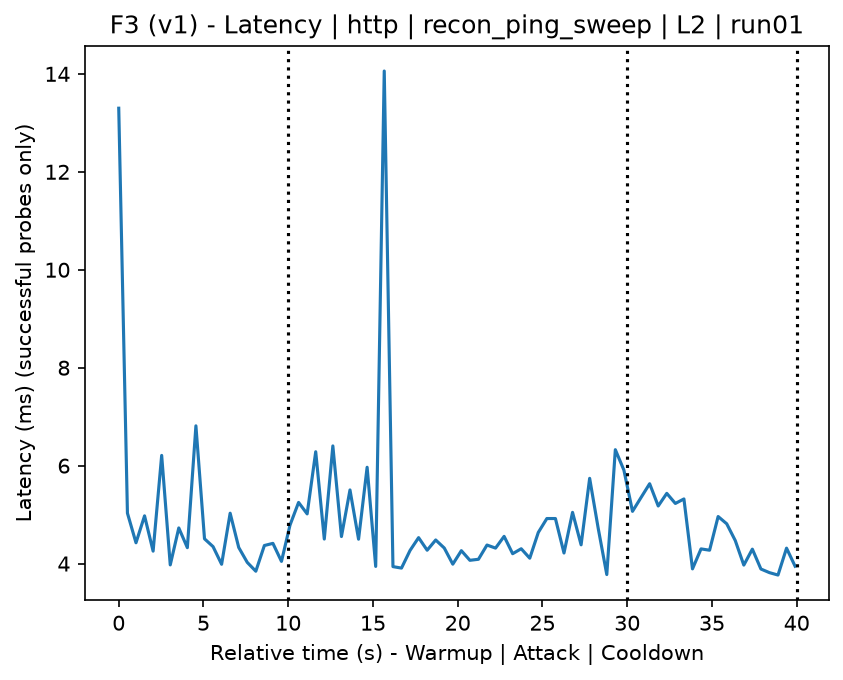
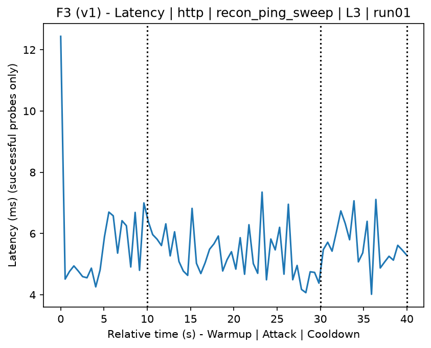
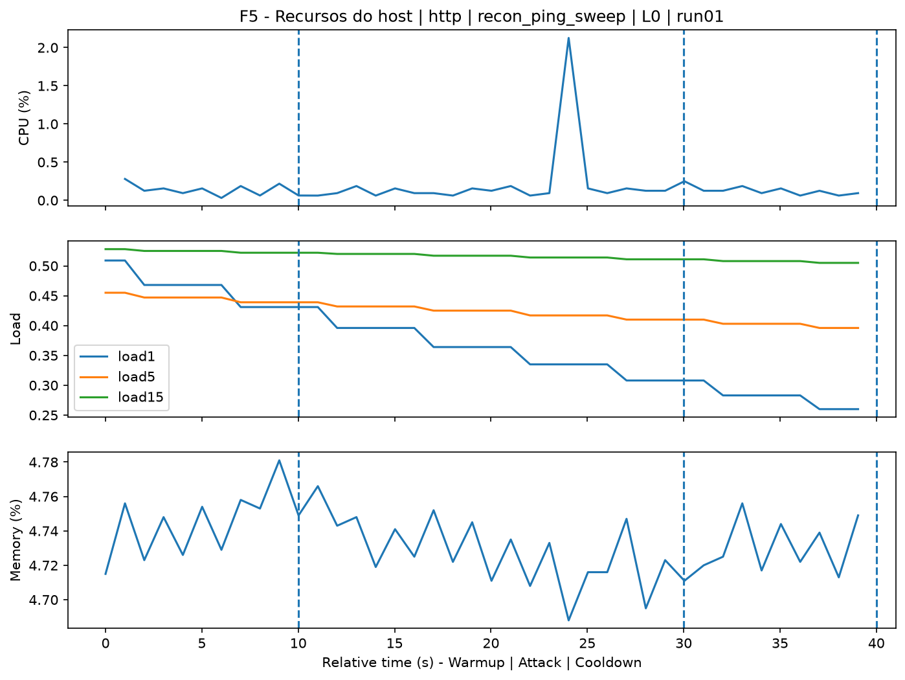
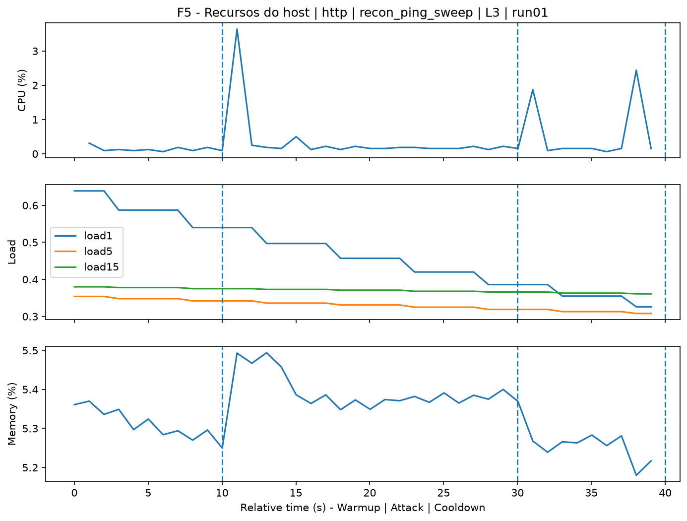
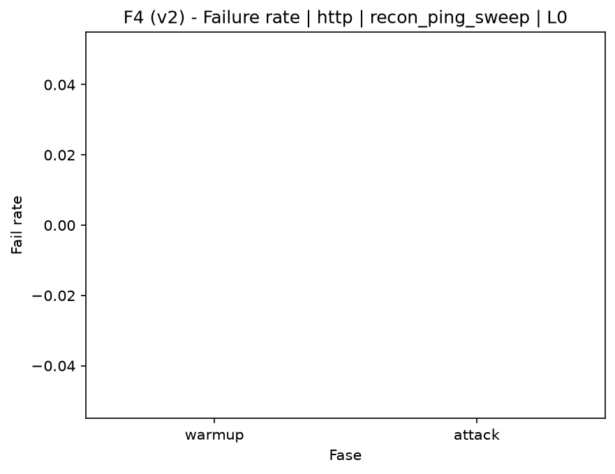

# Ping Sweep (`recon_ping_sweep`)

[Campaign index](README.md)

This document summarizes the published campaign execution of attack `recon_ping_sweep`. In the local catalog, the attack is described as: ICMP sweep for host discovery. The full execution artifacts are not versioned in this repository; retrieve the generated dataset CSVs from the Figshare dataset linked in the campaign index. Raw PCAP captures are not included in that archive. The selected figures below are stored under `contrib/assets/campaign_doc`.

## Attack Metadata

| Field | Value |
| --- | --- |
| ID | `recon_ping_sweep` |
| Category | 1) Reconnaissance and Discovery |
| Subcategory | 1.1 Network-level host discovery |
| Target services | local network |
| Image | `attack-ping-sweep:latest` |
| Container | `attack-ping-sweep` |
| Catalog max runtime | 10 s |
| Intensity parameters | n/a |
| MITRE ATT&CK | [https://attack.mitre.org/tactics/TA0043/](https://attack.mitre.org/tactics/TA0043/) [https://attack.mitre.org/tactics/TA0007/](https://attack.mitre.org/tactics/TA0007/) [https://attack.mitre.org/techniques/T1590/](https://attack.mitre.org/techniques/T1590/) [https://attack.mitre.org/techniques/T1595/](https://attack.mitre.org/techniques/T1595/) [https://attack.mitre.org/techniques/T1595/001/](https://attack.mitre.org/techniques/T1595/001/) [https://attack.mitre.org/techniques/T1018/](https://attack.mitre.org/techniques/T1018/) |

## Statistical Summary by Level

| Level | Service | Runs | Attack samples | Mean success | Mean failure | Lat p50/p95 ms | Total PCAP MB | Mean dataset (min-max) | Mean exec s | Extractors ok/total | Mean/max CPU | Mean mem MB |
| --- | --- | --- | --- | --- | --- | --- | --- | --- | --- | --- | --- | --- |
| L0 | http | 5 | 200 | 100% | 0% | 4,45 / 5,79 | 5,06 | 9.628 (9.600-9.718) | 43,13 | 3/3 | 0,73% / 0,88% | 710,32 |
| L1 | http | 5 | 200 | 100% | 0% | 5,28 / 6,9 | 17,63 | 92.014 (89.990-94.078) | 49,53 | 3/3 | 0,79% / 0,98% | 712,56 |
| L2 | http | 5 | 199 | 100% | 0% | 4,69 / 5,93 | 17,32 | 90.024 (78.976-94.240) | 49,28 | 3/3 | 0,71% / 0,8% | 714,83 |
| L3 | http | 5 | 200 | 100% | 0% | 4,77 / 6,29 | 17,02 | 88.050 (81.228-91.574) | 49,14 | 3/3 | 0,78% / 0,97% | 716,9 |

## Stability Across Reruns

| Level | Metric | Runs | Mean | Deviation | CV | Min | Max |
| --- | --- | --- | --- | --- | --- | --- | --- |
| L0 | Mean CPU in attack phase | 5 | 0,73 | 0,09 | 12,32% | 0,63 | 0,84 |
| L0 | Dataset rows | 5 | 9.628,4 | 50,29 | 0,52% | 9.600 | 9.718 |
| L0 | Execution time | 5 | 43,13 | 0,38 | 0,87% | 42,8 | 43,76 |
| L0 | Failure in attack phase | 5 | 0 | 0 | n/a | 0 | 0 |
| L0 | Censored p95 latency | 5 | 5,79 | 0,65 | 11,15% | 4,65 | 6,14 |
| L1 | Mean CPU in attack phase | 5 | 0,79 | 0,13 | 16,77% | 0,68 | 1,02 |
| L1 | Dataset rows | 5 | 92.014,4 | 1.577,72 | 1,71% | 89.990 | 94.078 |
| L1 | Execution time | 5 | 49,53 | 0,25 | 0,5% | 49,23 | 49,89 |
| L1 | Failure in attack phase | 5 | 0 | 0 | n/a | 0 | 0 |
| L1 | Censored p95 latency | 5 | 6,9 | 0,98 | 14,16% | 5,91 | 8,34 |
| L2 | Mean CPU in attack phase | 5 | 0,71 | 0,09 | 12,53% | 0,64 | 0,86 |
| L2 | Dataset rows | 5 | 90.023,6 | 6.338,63 | 7,04% | 78.976 | 94.240 |
| L2 | Execution time | 5 | 49,28 | 0,47 | 0,96% | 48,47 | 49,68 |
| L2 | Failure in attack phase | 5 | 0 | 0 | n/a | 0 | 0 |
| L2 | Censored p95 latency | 5 | 5,93 | 1,24 | 20,97% | 4,52 | 7,5 |
| L3 | Mean CPU in attack phase | 5 | 0,78 | 0,09 | 11,55% | 0,68 | 0,9 |
| L3 | Dataset rows | 5 | 88.050 | 4.086,29 | 4,64% | 81.228 | 91.574 |
| L3 | Execution time | 5 | 49,14 | 0,37 | 0,75% | 48,52 | 49,49 |
| L3 | Failure in attack phase | 5 | 0 | 0 | n/a | 0 | 0 |
| L3 | Censored p95 latency | 5 | 6,29 | 0,8 | 12,74% | 5,18 | 7,1 |

## Artifact Validation

| Level | Runs | Capture | Probe | Features | Dataset | Resources | Server stats | Acceptance |
| --- | --- | --- | --- | --- | --- | --- | --- | --- |
| L0 | 5 | 5/5 | 5/5 | 5/5 | 5/5 | 5/5 | 5/5 | 5/5 |
| L1 | 5 | 5/5 | 5/5 | 5/5 | 5/5 | 5/5 | 5/5 | 5/5 |
| L2 | 5 | 5/5 | 5/5 | 5/5 | 5/5 | 5/5 | 5/5 | 5/5 |
| L3 | 5 | 5/5 | 5/5 | 5/5 | 5/5 | 5/5 | 5/5 | 5/5 |

## Selected Figures

<table>
<tr>
<td> Time series L0 run01</td>
<td> Time series L1 run01</td>
</tr>
<tr>
<td> Time series L2 run01</td>
<td> Time series L3 run01</td>
</tr>
<tr>
<td> Resources L0 run01</td>
<td> Resources L3 run01</td>
</tr>
<tr>
<td> Failure rate L0</td>
<td> Failure rate L3</td>
</tr>
</table>

## Sources Used

- Attack catalog: `docker/attackers/ping-sweep/attack.yaml`
- Full campaign artifacts: available from the Figshare dataset linked in the campaign index; when extracted locally, expected under `experiments/60att_5runs_l0l1l2l3/recon_ping_sweep`.
