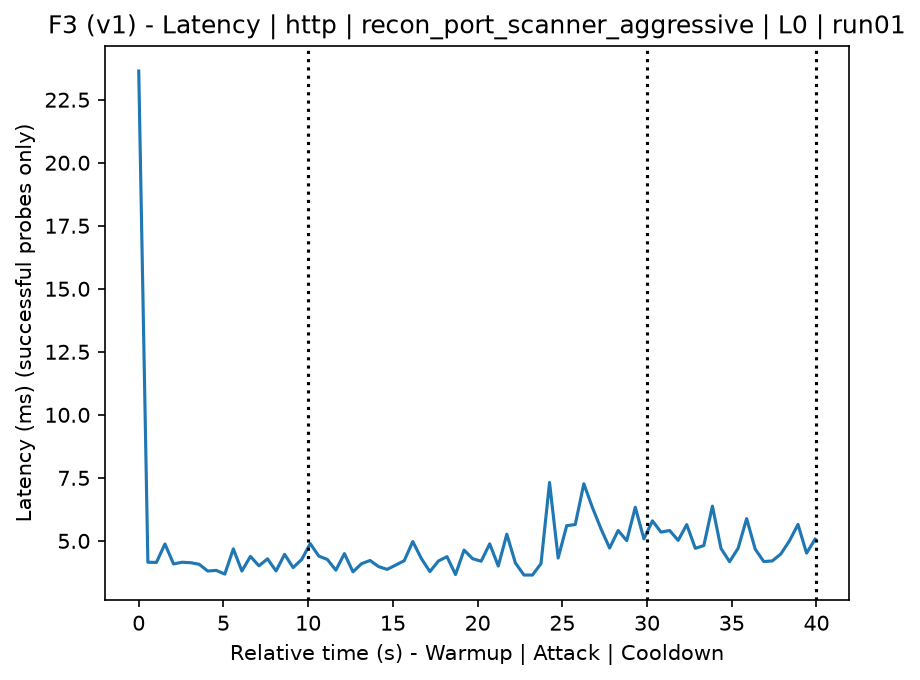
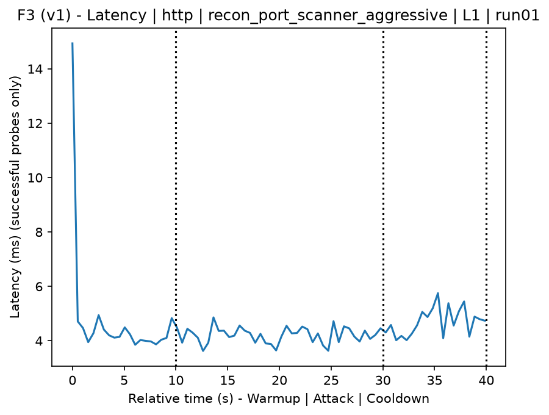
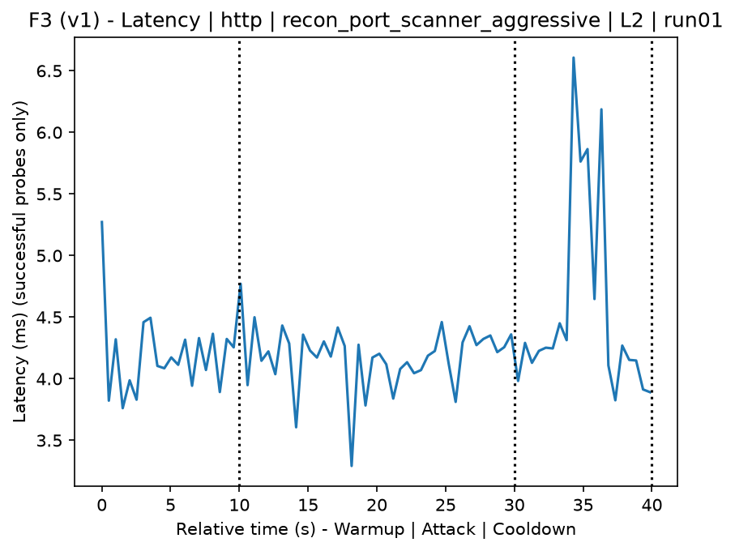
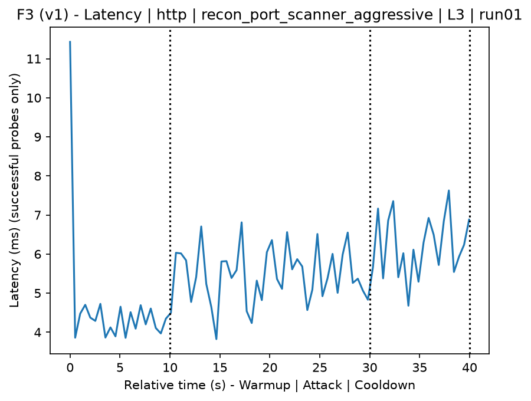
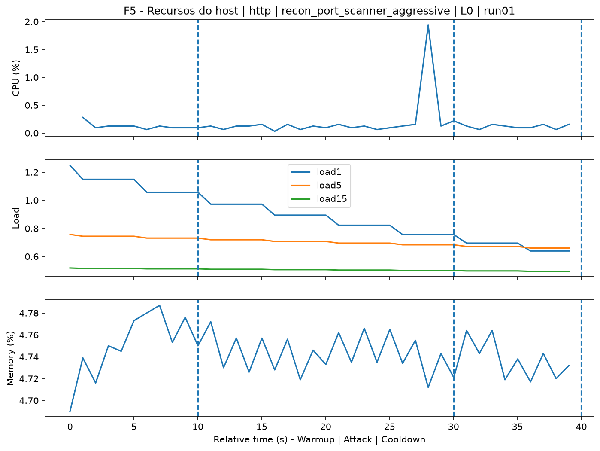
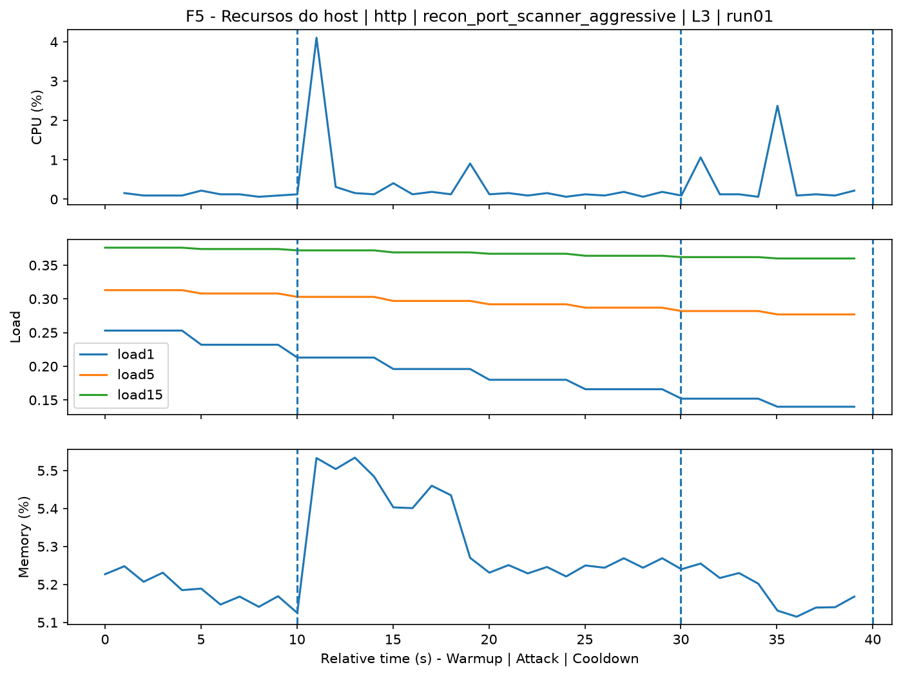
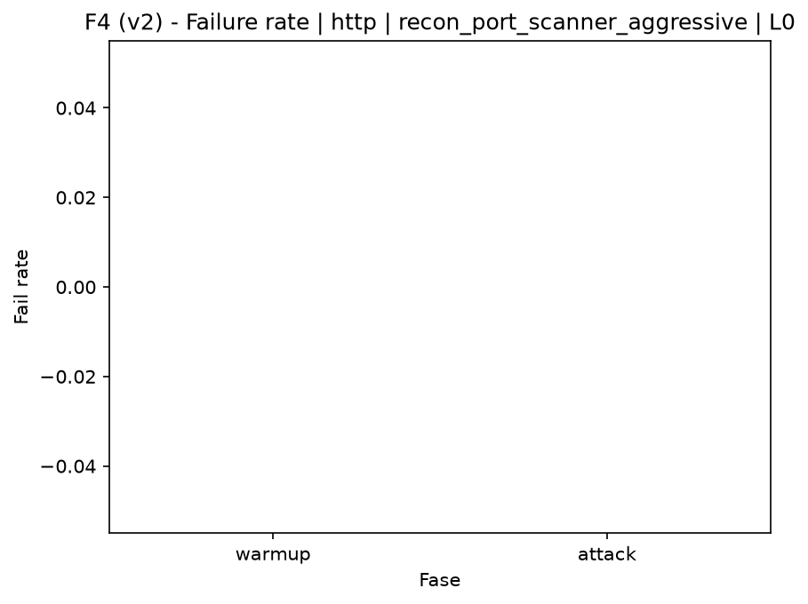
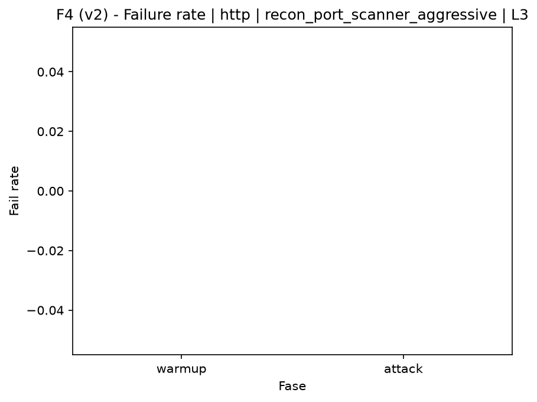

# Port Scanner Aggressive (`recon_port_scanner_aggressive`)

[Índice da campanha](README.md)

Na campanha `experiments/60att_5runs_l0l1l2l3`, este documento consolida a execução do ataque `recon_port_scanner_aggressive`. No catálogo local, o ataque é descrito como: Aggressive-profile port and service scan. A documentação abaixo usa apenas artefatos já presentes no repositório, principalmente as tabelas e figuras de `experiments/60att_5runs_l0l1l2l3/recon_port_scanner_aggressive`.

## Metadados do ataque

| Campo | Valor |
| --- | --- |
| ID | `recon_port_scanner_aggressive` |
| Categoria | 1) Reconnaissance and Discovery |
| Subcategoria | 1.2 Port, service, OS, and vulnerability scanning |
| Serviços alvo | target IP service |
| Imagem | `attack-port-scanner-aggressive:latest` |
| Container | `attack-port-scanner-aggressive` |
| Runtime máximo do catálogo | 180 s |
| Parâmetros de intensidade | n/d |
| MITRE ATT&CK | [https://attack.mitre.org/tactics/TA0043/](https://attack.mitre.org/tactics/TA0043/) [https://attack.mitre.org/tactics/TA0007/](https://attack.mitre.org/tactics/TA0007/) [https://attack.mitre.org/techniques/T1590/](https://attack.mitre.org/techniques/T1590/) [https://attack.mitre.org/techniques/T1592/](https://attack.mitre.org/techniques/T1592/) [https://attack.mitre.org/techniques/T1595/](https://attack.mitre.org/techniques/T1595/) [https://attack.mitre.org/techniques/T1595/001/](https://attack.mitre.org/techniques/T1595/001/) [https://attack.mitre.org/techniques/T1595/002/](https://attack.mitre.org/techniques/T1595/002/) [https://attack.mitre.org/techniques/T1046/](https://attack.mitre.org/techniques/T1046/) |

## Resumo estatístico por nível

| Nível | Serviço | Runs | Amostras attack | Sucesso médio | Falha média | Lat p50/p95 ms | PCAP total MB | Dataset médio (min-max) | Exec média s | Extratores ok/total | CPU média/máx | Mem MB média |
| --- | --- | --- | --- | --- | --- | --- | --- | --- | --- | --- | --- | --- |
| L0 | http | 5 | 200 | 100% | 0% | 4,33 / 5,4 | 5,06 | 9.622 (9.584-9.716) | 43,06 | 3/3 | 0,67% / 0,76% | 718,75 |
| L1 | http | 5 | 200 | 100% | 0% | 4,31 / 5,56 | 7,12 | 19.320 (19.212-19.424) | 44,08 | 3/3 | 0,72% / 1,17% | 721,08 |
| L2 | http | 5 | 199 | 100% | 0% | 4,28 / 4,98 | 7,18 | 19.506 (19.414-19.856) | 44,11 | 3/3 | 0,67% / 0,82% | 723,51 |
| L3 | http | 5 | 200 | 100% | 0% | 5,41 / 6,76 | 7,19 | 19.524 (19.300-20.158) | 44,27 | 3/3 | 0,86% / 1,03% | 726,19 |

## Estabilidade entre reexecuções

| Nível | Métrica | Runs | Média | Desvio | CV | Min | Max |
| --- | --- | --- | --- | --- | --- | --- | --- |
| L0 | CPU média na fase attack | 5 | 0,67 | 0,01 | 1,1% | 0,67 | 0,69 |
| L0 | Linhas do dataset | 5 | 9.621,6 | 53,56 | 0,56% | 9.584 | 9.716 |
| L0 | Tempo de execução | 5 | 43,06 | 0,38 | 0,88% | 42,86 | 43,74 |
| L0 | Falha na fase attack | 5 | 0 | 0 | n/d | 0 | 0 |
| L0 | Latência p95 censurada | 5 | 5,4 | 0,62 | 11,46% | 4,82 | 6,38 |
| L1 | CPU média na fase attack | 5 | 0,72 | 0,09 | 12,36% | 0,63 | 0,83 |
| L1 | Linhas do dataset | 5 | 19.320,4 | 77,71 | 0,4% | 19.212 | 19.424 |
| L1 | Tempo de execução | 5 | 44,08 | 0,04 | 0,1% | 44,04 | 44,13 |
| L1 | Falha na fase attack | 5 | 0 | 0 | n/d | 0 | 0 |
| L1 | Latência p95 censurada | 5 | 5,56 | 1,32 | 23,65% | 4,57 | 7,75 |
| L2 | CPU média na fase attack | 5 | 0,67 | 0,03 | 3,86% | 0,64 | 0,71 |
| L2 | Linhas do dataset | 5 | 19.505,6 | 195,93 | 1% | 19.414 | 19.856 |
| L2 | Tempo de execução | 5 | 44,11 | 0,07 | 0,17% | 44,02 | 44,19 |
| L2 | Falha na fase attack | 5 | 0 | 0 | n/d | 0 | 0 |
| L2 | Latência p95 censurada | 5 | 4,98 | 0,79 | 15,91% | 4,46 | 6,38 |
| L3 | CPU média na fase attack | 5 | 0,86 | 0,1 | 11,81% | 0,73 | 1,01 |
| L3 | Linhas do dataset | 5 | 19.524 | 357,93 | 1,83% | 19.300 | 20.158 |
| L3 | Tempo de execução | 5 | 44,27 | 0,06 | 0,14% | 44,19 | 44,37 |
| L3 | Falha na fase attack | 5 | 0 | 0 | n/d | 0 | 0 |
| L3 | Latência p95 censurada | 5 | 6,76 | 0,62 | 9,19% | 6,13 | 7,75 |

## Validação de artefatos

| Nível | Runs | Captura | Probe | Features | Dataset | Recursos | Server stats | Aceite |
| --- | --- | --- | --- | --- | --- | --- | --- | --- |
| L0 | 5 | 5/5 | 5/5 | 5/5 | 5/5 | 5/5 | 5/5 | 5/5 |
| L1 | 5 | 5/5 | 5/5 | 5/5 | 5/5 | 5/5 | 5/5 | 5/5 |
| L2 | 5 | 5/5 | 5/5 | 5/5 | 5/5 | 5/5 | 5/5 | 5/5 |
| L3 | 5 | 5/5 | 5/5 | 5/5 | 5/5 | 5/5 | 5/5 | 5/5 |

## Figuras selecionadas

<table>
<tr>
<td> Série temporal L0 run01</td>
<td> Série temporal L1 run01</td>
</tr>
<tr>
<td> Série temporal L2 run01</td>
<td> Série temporal L3 run01</td>
</tr>
<tr>
<td> Recursos L0 run01</td>
<td> Recursos L3 run01</td>
</tr>
<tr>
<td> Taxa de falha L0</td>
<td> Taxa de falha L3</td>
</tr>
</table>

## Fontes utilizadas

- Catálogo do ataque: `docker/attackers/port-scanner-aggressive/attack.yaml`
- Artefatos da campanha: `experiments/60att_5runs_l0l1l2l3/recon_port_scanner_aggressive`
