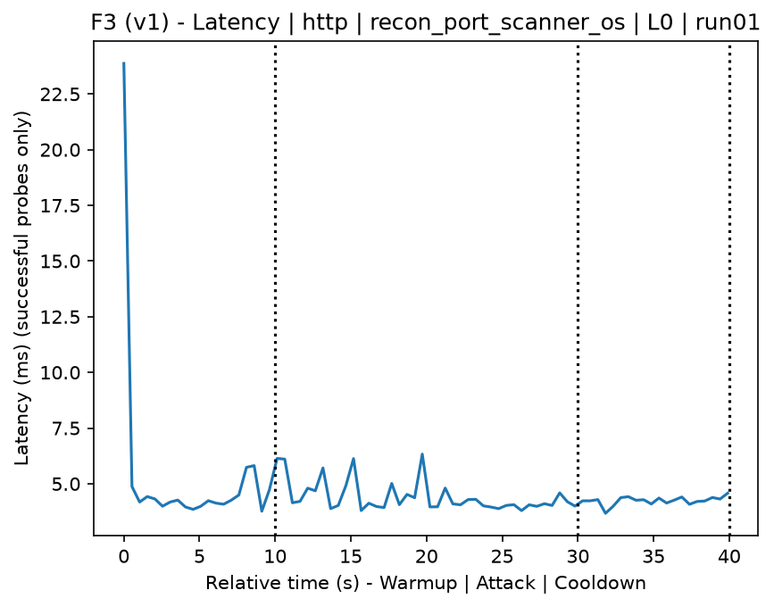
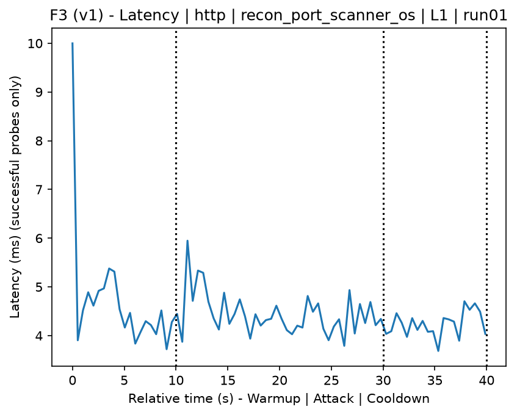
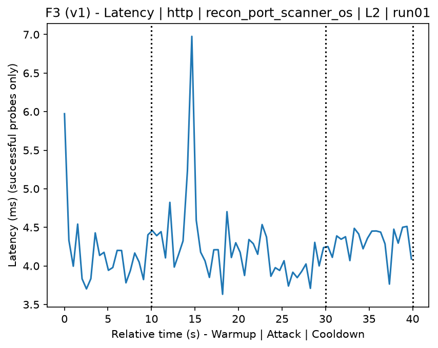
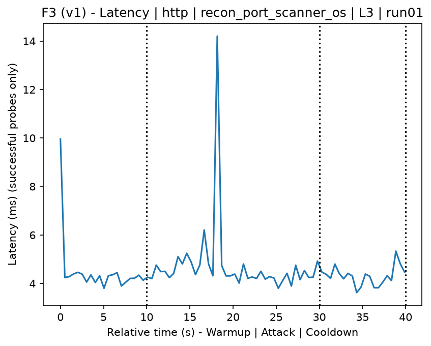
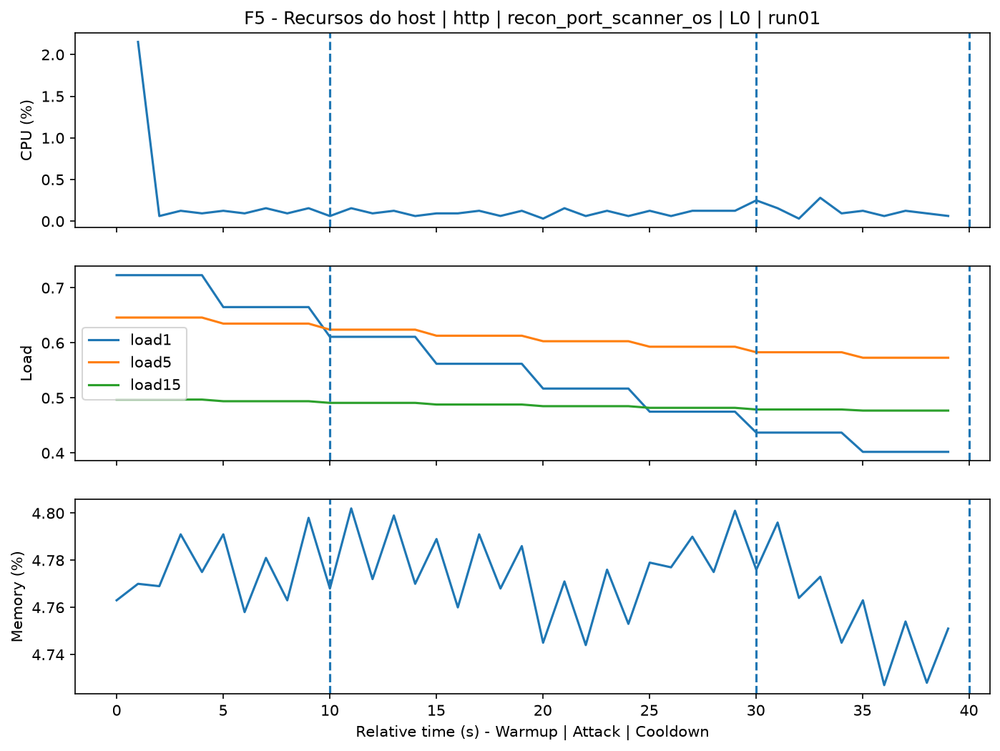
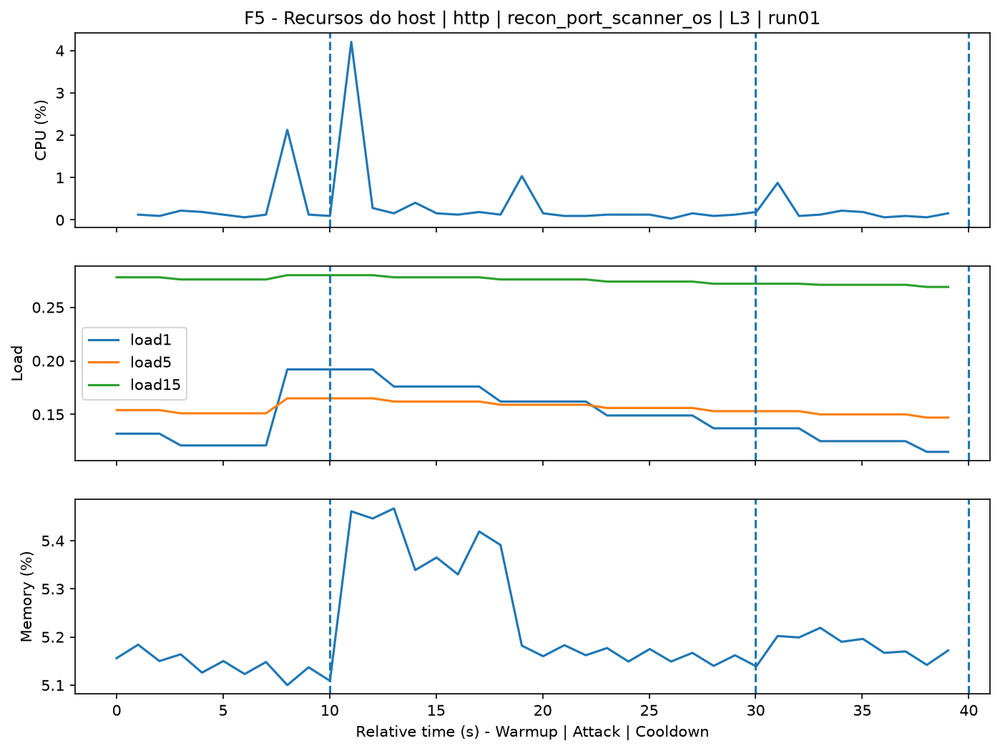
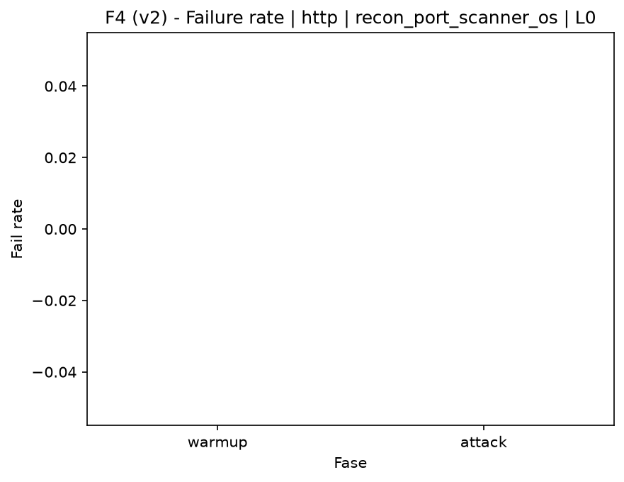
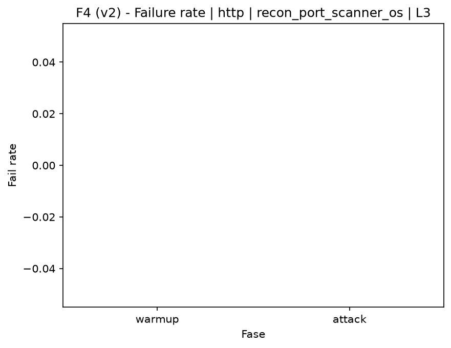

# Port Scanner OS (`recon_port_scanner_os`)

[Campaign index](README.md)

This document summarizes the published campaign execution of attack `recon_port_scanner_os`. In the local catalog, the attack is described as: Target operating system detection (fingerprinting). The full execution artifacts are not versioned in this repository; retrieve them from the Figshare dataset linked in the campaign index or regenerate the figures with `run_claim_figures.sh`. The selected figures below are stored under `contrib/assets/campaign_doc`.

## Attack Metadata

| Field | Value |
| --- | --- |
| ID | `recon_port_scanner_os` |
| Category | 1) Reconnaissance and Discovery |
| Subcategory | 1.2 Port, service, OS, and vulnerability scanning |
| Target services | target IP service |
| Image | `attack-port-scanner-os:latest` |
| Container | `attack-port-scanner-os` |
| Catalog max runtime | 120 s |
| Intensity parameters | n/a |
| MITRE ATT&CK | [https://attack.mitre.org/tactics/TA0043/](https://attack.mitre.org/tactics/TA0043/) [https://attack.mitre.org/tactics/TA0007/](https://attack.mitre.org/tactics/TA0007/) [https://attack.mitre.org/techniques/T1592/](https://attack.mitre.org/techniques/T1592/) [https://attack.mitre.org/techniques/T1595/](https://attack.mitre.org/techniques/T1595/) [https://attack.mitre.org/techniques/T1595/001/](https://attack.mitre.org/techniques/T1595/001/) [https://attack.mitre.org/techniques/T1046/](https://attack.mitre.org/techniques/T1046/) |

## Statistical Summary by Level

| Level | Service | Runs | Attack samples | Mean success | Mean failure | Lat p50/p95 ms | Total PCAP MB | Mean dataset (min-max) | Mean exec s | Extractors ok/total | Mean/max CPU | Mean mem MB |
| --- | --- | --- | --- | --- | --- | --- | --- | --- | --- | --- | --- | --- |
| L0 | http | 5 | 200 | 100% | 0% | 4,34 / 5,4 | 5,06 | 9.620 (9.590-9.706) | 43,12 | 3/3 | 0,7% / 0,81% | 728,41 |
| L1 | http | 5 | 200 | 100% | 0% | 4,52 / 6 | 7,15 | 19.381 (19.292-19.434) | 44,12 | 3/3 | 0,75% / 1,09% | 730,81 |
| L2 | http | 5 | 200 | 100% | 0% | 4,36 / 5,16 | 7,16 | 19.401 (19.330-19.426) | 44,13 | 3/3 | 0,68% / 0,8% | 733,43 |
| L3 | http | 5 | 200 | 100% | 0% | 5,27 / 6,72 | 7,16 | 19.399 (19.310-19.430) | 44,18 | 3/3 | 0,84% / 1,05% | 737,59 |

## Stability Across Reruns

| Level | Metric | Runs | Mean | Deviation | CV | Min | Max |
| --- | --- | --- | --- | --- | --- | --- | --- |
| L0 | Mean CPU in attack phase | 5 | 0,7 | 0,04 | 6,15% | 0,65 | 0,77 |
| L0 | Dataset rows | 5 | 9.619,6 | 48,53 | 0,5% | 9.590 | 9.706 |
| L0 | Execution time | 5 | 43,12 | 0,43 | 1% | 42,87 | 43,89 |
| L0 | Failure in attack phase | 5 | 0 | 0 | n/a | 0 | 0 |
| L0 | Censored p95 latency | 5 | 5,4 | 0,75 | 13,89% | 4,77 | 6,3 |
| L1 | Mean CPU in attack phase | 5 | 0,75 | 0,08 | 10,17% | 0,68 | 0,88 |
| L1 | Dataset rows | 5 | 19.381,2 | 64,2 | 0,33% | 19.292 | 19.434 |
| L1 | Execution time | 5 | 44,12 | 0,03 | 0,07% | 44,1 | 44,17 |
| L1 | Failure in attack phase | 5 | 0 | 0 | n/a | 0 | 0 |
| L1 | Censored p95 latency | 5 | 6 | 1,2 | 20,01% | 4,9 | 8 |
| L2 | Mean CPU in attack phase | 5 | 0,68 | 0,04 | 5,18% | 0,65 | 0,74 |
| L2 | Dataset rows | 5 | 19.401,2 | 40,16 | 0,21% | 19.330 | 19.426 |
| L2 | Execution time | 5 | 44,13 | 0,09 | 0,2% | 43,99 | 44,22 |
| L2 | Failure in attack phase | 5 | 0 | 0 | n/a | 0 | 0 |
| L2 | Censored p95 latency | 5 | 5,16 | 0,63 | 12,23% | 4,55 | 6,01 |
| L3 | Mean CPU in attack phase | 5 | 0,84 | 0,11 | 13,3% | 0,71 | 0,97 |
| L3 | Dataset rows | 5 | 19.398,8 | 49,93 | 0,26% | 19.310 | 19.430 |
| L3 | Execution time | 5 | 44,18 | 0,08 | 0,18% | 44,09 | 44,29 |
| L3 | Failure in attack phase | 5 | 0 | 0 | n/a | 0 | 0 |
| L3 | Censored p95 latency | 5 | 6,72 | 0,96 | 14,34% | 5,29 | 7,61 |

## Artifact Validation

| Level | Runs | Capture | Probe | Features | Dataset | Resources | Server stats | Acceptance |
| --- | --- | --- | --- | --- | --- | --- | --- | --- |
| L0 | 5 | 5/5 | 5/5 | 5/5 | 5/5 | 5/5 | 5/5 | 5/5 |
| L1 | 5 | 5/5 | 5/5 | 5/5 | 5/5 | 5/5 | 5/5 | 5/5 |
| L2 | 5 | 5/5 | 5/5 | 5/5 | 5/5 | 5/5 | 5/5 | 5/5 |
| L3 | 5 | 5/5 | 5/5 | 5/5 | 5/5 | 5/5 | 5/5 | 5/5 |

## Selected Figures

<table>
<tr>
<td> Time series L0 run01</td>
<td> Time series L1 run01</td>
</tr>
<tr>
<td> Time series L2 run01</td>
<td> Time series L3 run01</td>
</tr>
<tr>
<td> Resources L0 run01</td>
<td> Resources L3 run01</td>
</tr>
<tr>
<td> Failure rate L0</td>
<td> Failure rate L3</td>
</tr>
</table>

## Sources Used

- Attack catalog: `docker/attackers/port-scanner-os/attack.yaml`
- Full campaign artifacts: available from the Figshare dataset linked in the campaign index; when extracted locally, expected under `experiments/60att_5runs_l0l1l2l3/recon_port_scanner_os`.
