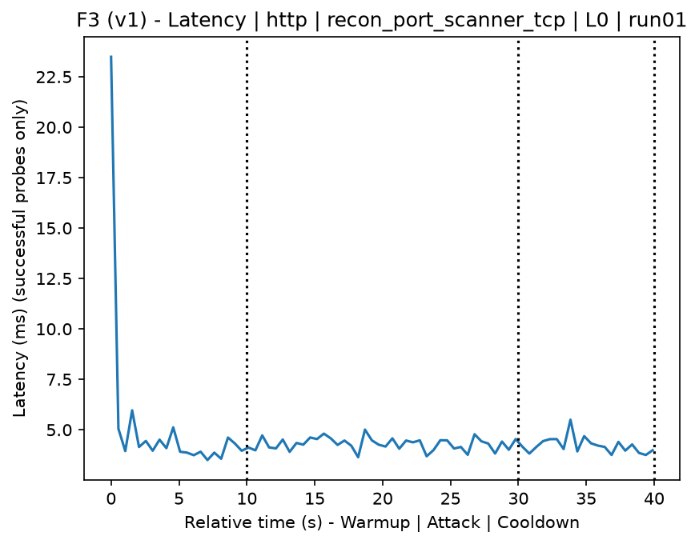
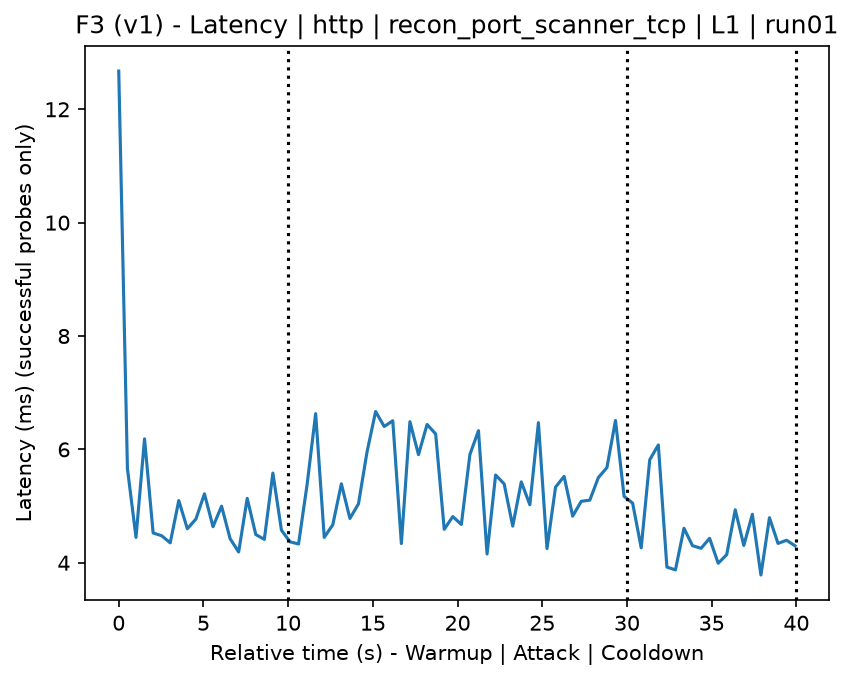
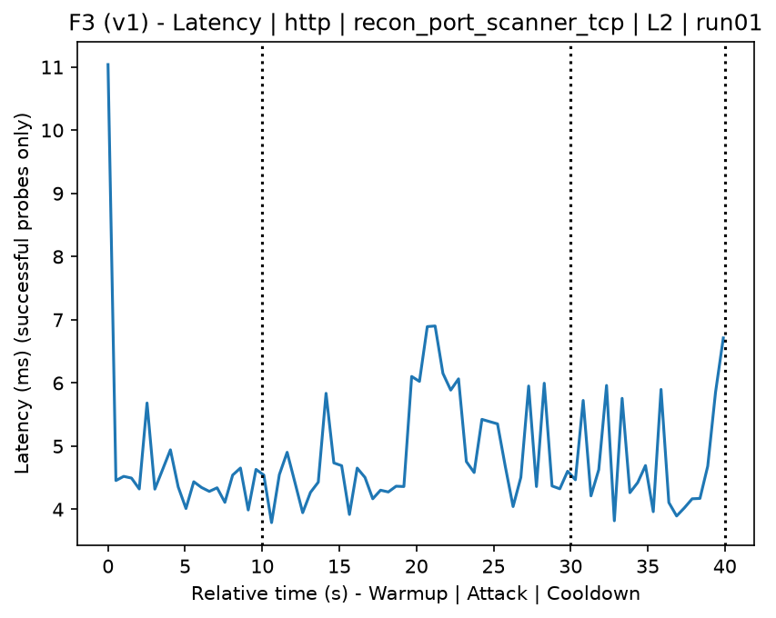
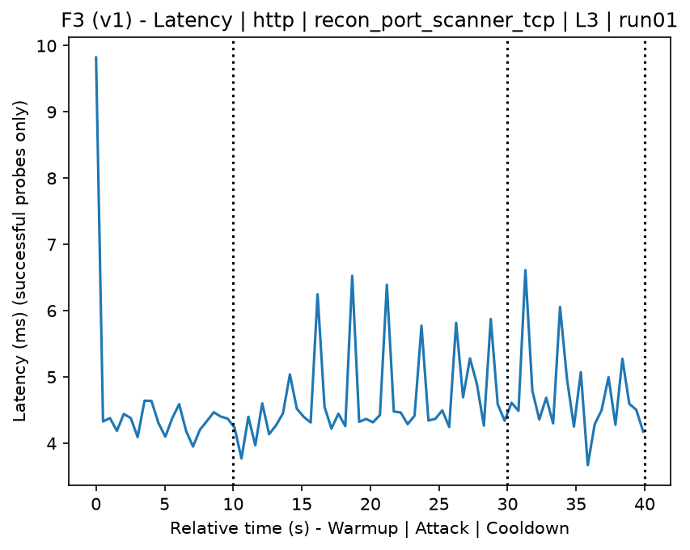
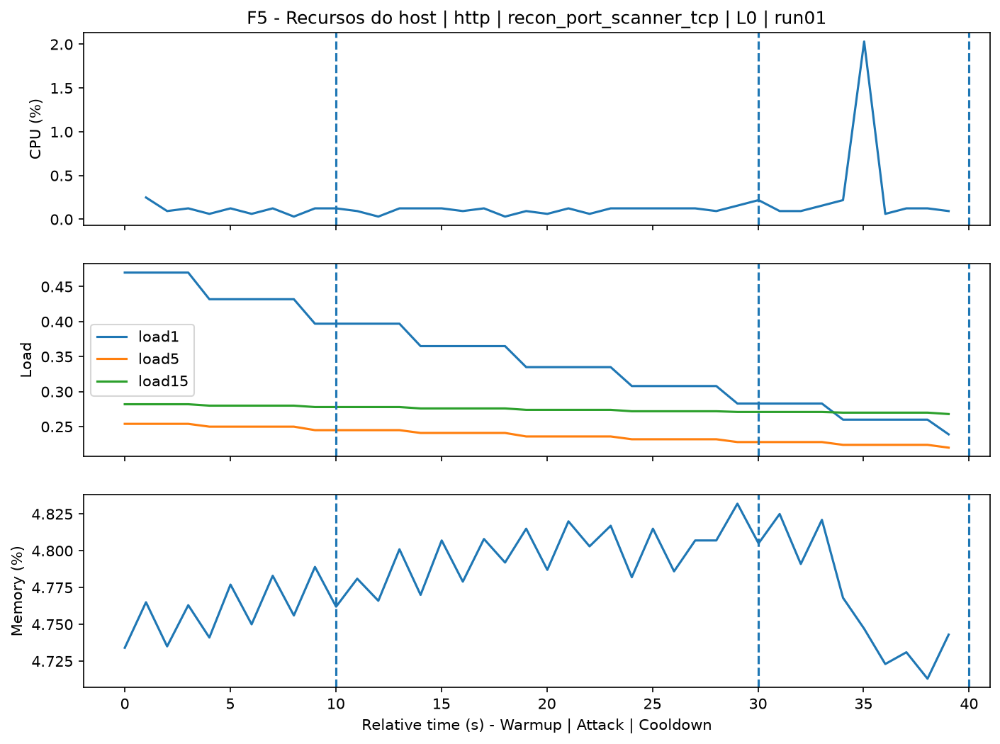
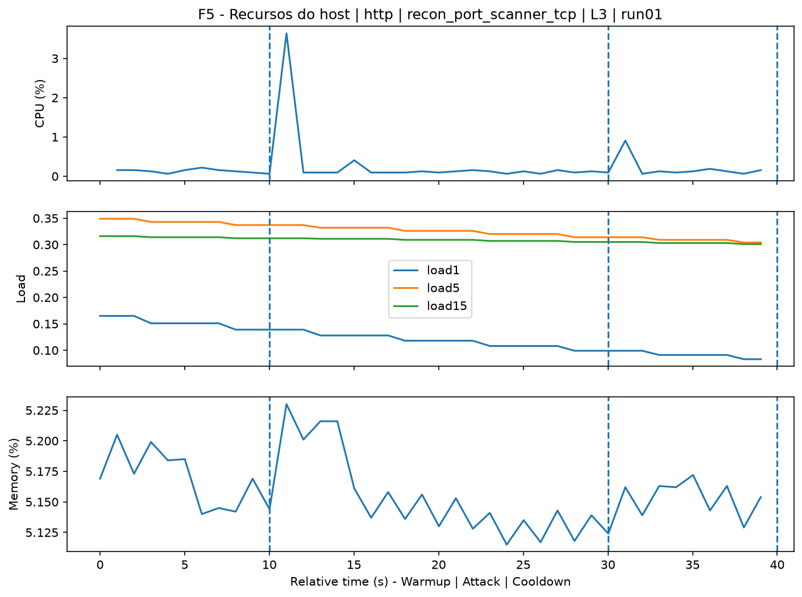
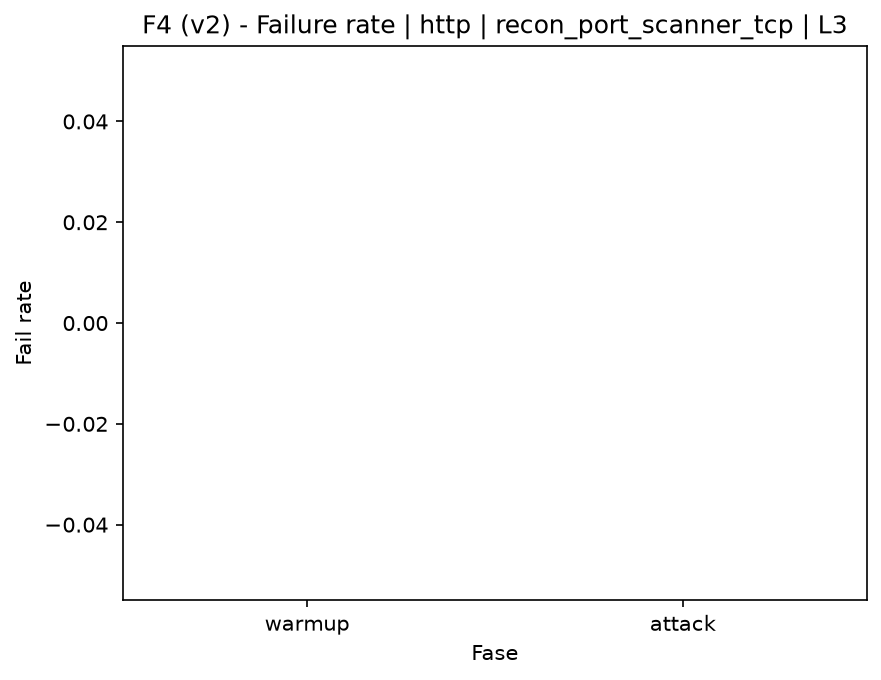

# Port Scanner TCP (`recon_port_scanner_tcp`)

[Índice da campanha](README.md)

Na campanha `experiments/60att_5runs_l0l1l2l3`, este documento consolida a execução do ataque `recon_port_scanner_tcp`. No catálogo local, o ataque é descrito como: TCP port scan of the target. A documentação abaixo usa apenas artefatos já presentes no repositório, principalmente as tabelas e figuras de `experiments/60att_5runs_l0l1l2l3/recon_port_scanner_tcp`.

## Metadados do ataque

| Campo | Valor |
| --- | --- |
| ID | `recon_port_scanner_tcp` |
| Categoria | 1) Reconnaissance and Discovery |
| Subcategoria | 1.2 Port, service, OS, and vulnerability scanning |
| Serviços alvo | target IP service |
| Imagem | `attack-port-scanner-tcp:latest` |
| Container | `attack-port-scanner-tcp` |
| Runtime máximo do catálogo | 120 s |
| Parâmetros de intensidade | n/d |
| MITRE ATT&CK | [https://attack.mitre.org/tactics/TA0043/](https://attack.mitre.org/tactics/TA0043/) [https://attack.mitre.org/tactics/TA0007/](https://attack.mitre.org/tactics/TA0007/) [https://attack.mitre.org/techniques/T1590/](https://attack.mitre.org/techniques/T1590/) [https://attack.mitre.org/techniques/T1595/](https://attack.mitre.org/techniques/T1595/) [https://attack.mitre.org/techniques/T1595/001/](https://attack.mitre.org/techniques/T1595/001/) [https://attack.mitre.org/techniques/T1046/](https://attack.mitre.org/techniques/T1046/) |

## Resumo estatístico por nível

| Nível | Serviço | Runs | Amostras attack | Sucesso médio | Falha média | Lat p50/p95 ms | PCAP total MB | Dataset médio (min-max) | Exec média s | Extratores ok/total | CPU média/máx | Mem MB média |
| --- | --- | --- | --- | --- | --- | --- | --- | --- | --- | --- | --- | --- |
| L0 | http | 5 | 200 | 100% | 0% | 4,39 / 5,14 | 5,06 | 9.625 (9.600-9.720) | 43,08 | 3/3 | 0,67% / 0,74% | 739,97 |
| L1 | http | 5 | 200 | 100% | 0% | 4,82 / 5,92 | 6,73 | 17.863 (17.856-17.872) | 43,96 | 3/3 | 0,75% / 0,92% | 742,05 |
| L2 | http | 5 | 200 | 100% | 0% | 4,49 / 5,54 | 6,73 | 17.861 (17.858-17.862) | 43,98 | 3/3 | 0,72% / 0,86% | 744,05 |
| L3 | http | 5 | 200 | 100% | 0% | 4,96 / 6,33 | 6,72 | 17.832 (17.732-17.860) | 44,02 | 3/3 | 0,77% / 0,92% | 746,17 |

## Estabilidade entre reexecuções

| Nível | Métrica | Runs | Média | Desvio | CV | Min | Max |
| --- | --- | --- | --- | --- | --- | --- | --- |
| L0 | CPU média na fase attack | 5 | 0,67 | 0,04 | 5,65% | 0,63 | 0,72 |
| L0 | Linhas do dataset | 5 | 9.624,8 | 53,25 | 0,55% | 9.600 | 9.720 |
| L0 | Tempo de execução | 5 | 43,08 | 0,35 | 0,81% | 42,86 | 43,69 |
| L0 | Falha na fase attack | 5 | 0 | 0 | n/d | 0 | 0 |
| L0 | Latência p95 censurada | 5 | 5,14 | 0,66 | 12,79% | 4,63 | 6,25 |
| L1 | CPU média na fase attack | 5 | 0,75 | 0,09 | 11,43% | 0,65 | 0,88 |
| L1 | Linhas do dataset | 5 | 17.862,8 | 6,87 | 0,04% | 17.856 | 17.872 |
| L1 | Tempo de execução | 5 | 43,96 | 0,05 | 0,11% | 43,91 | 44 |
| L1 | Falha na fase attack | 5 | 0 | 0 | n/d | 0 | 0 |
| L1 | Latência p95 censurada | 5 | 5,92 | 1 | 16,82% | 4,75 | 7,08 |
| L2 | CPU média na fase attack | 5 | 0,72 | 0,06 | 8,85% | 0,63 | 0,78 |
| L2 | Linhas do dataset | 5 | 17.861,2 | 1,79 | 0,01% | 17.858 | 17.862 |
| L2 | Tempo de execução | 5 | 43,98 | 0,07 | 0,16% | 43,9 | 44,05 |
| L2 | Falha na fase attack | 5 | 0 | 0 | n/d | 0 | 0 |
| L2 | Latência p95 censurada | 5 | 5,54 | 0,83 | 14,93% | 4,59 | 6,33 |
| L3 | CPU média na fase attack | 5 | 0,77 | 0,11 | 14,43% | 0,67 | 0,95 |
| L3 | Linhas do dataset | 5 | 17.832 | 55,95 | 0,31% | 17.732 | 17.860 |
| L3 | Tempo de execução | 5 | 44,02 | 0,06 | 0,13% | 43,95 | 44,11 |
| L3 | Falha na fase attack | 5 | 0 | 0 | n/d | 0 | 0 |
| L3 | Latência p95 censurada | 5 | 6,33 | 1,36 | 21,55% | 4,72 | 8,46 |

## Validação de artefatos

| Nível | Runs | Captura | Probe | Features | Dataset | Recursos | Server stats | Aceite |
| --- | --- | --- | --- | --- | --- | --- | --- | --- |
| L0 | 5 | 5/5 | 5/5 | 5/5 | 5/5 | 5/5 | 5/5 | 5/5 |
| L1 | 5 | 5/5 | 5/5 | 5/5 | 5/5 | 5/5 | 5/5 | 5/5 |
| L2 | 5 | 5/5 | 5/5 | 5/5 | 5/5 | 5/5 | 5/5 | 5/5 |
| L3 | 5 | 5/5 | 5/5 | 5/5 | 5/5 | 5/5 | 5/5 | 5/5 |

## Figuras selecionadas

<table>
<tr>
<td> Série temporal L0 run01</td>
<td> Série temporal L1 run01</td>
</tr>
<tr>
<td> Série temporal L2 run01</td>
<td> Série temporal L3 run01</td>
</tr>
<tr>
<td> Recursos L0 run01</td>
<td> Recursos L3 run01</td>
</tr>
<tr>
<td> Taxa de falha L0</td>
<td> Taxa de falha L3</td>
</tr>
</table>

## Fontes utilizadas

- Catálogo do ataque: `docker/attackers/port-scanner-tcp/attack.yaml`
- Artefatos da campanha: `experiments/60att_5runs_l0l1l2l3/recon_port_scanner_tcp`
