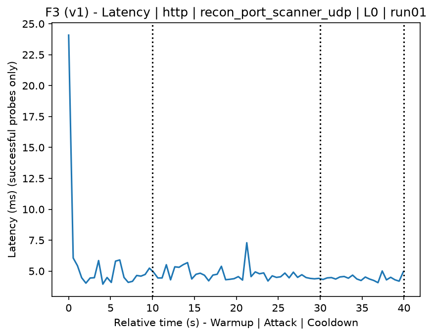
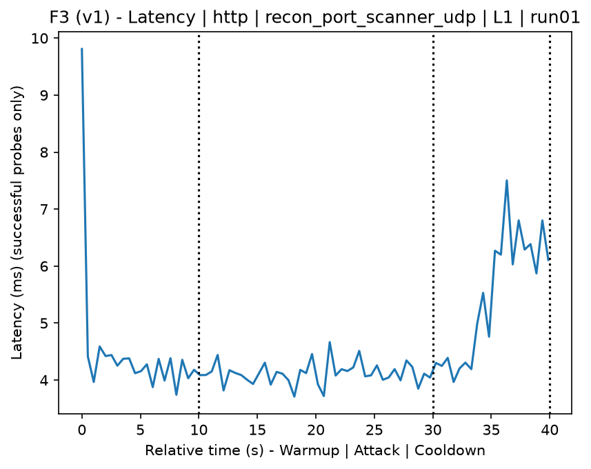
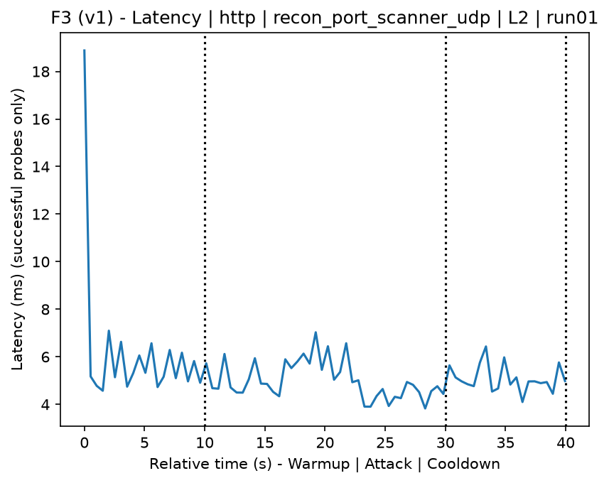
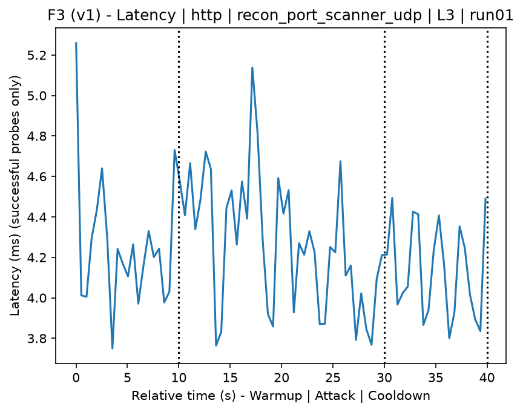
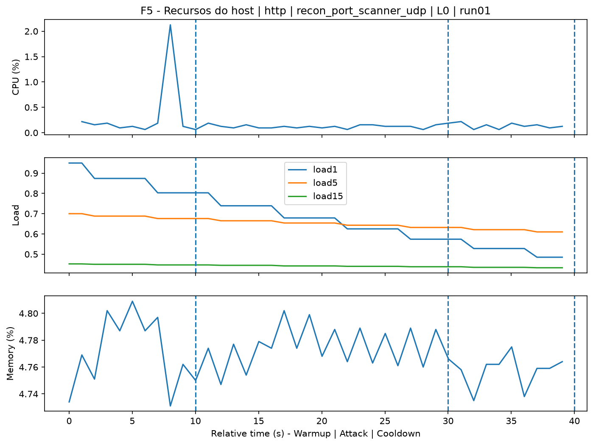
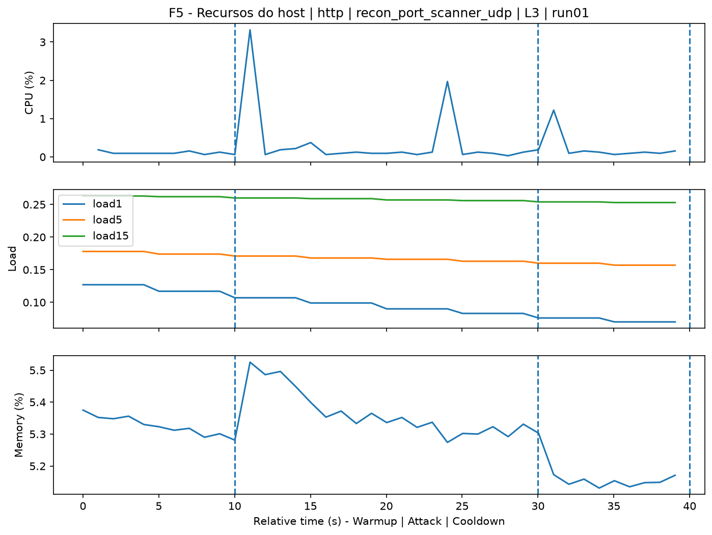
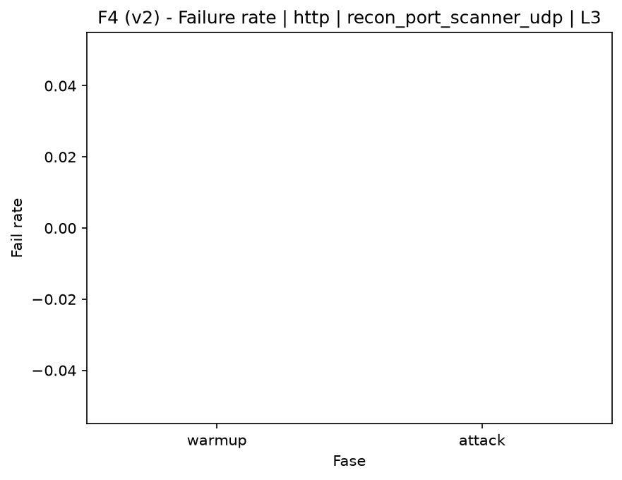

# Port Scanner UDP (`recon_port_scanner_udp`)

[Campaign index](README.md)

This document summarizes the published campaign execution of attack `recon_port_scanner_udp`. In the local catalog, the attack is described as: UDP port scan of the target. The full execution artifacts are not versioned in this repository; retrieve them from the Figshare dataset linked in the campaign index or regenerate the figures with `run_claim_figures.sh`. The selected figures below are stored under `contrib/assets/campaign_doc`.

## Attack Metadata

| Field | Value |
| --- | --- |
| ID | `recon_port_scanner_udp` |
| Category | 1) Reconnaissance and Discovery |
| Subcategory | 1.2 Port, service, OS, and vulnerability scanning |
| Target services | target IP service |
| Image | `attack-port-scanner-udp:latest` |
| Container | `attack-port-scanner-udp` |
| Catalog max runtime | 300 s |
| Intensity parameters | n/a |
| MITRE ATT&CK | [https://attack.mitre.org/tactics/TA0043/](https://attack.mitre.org/tactics/TA0043/) [https://attack.mitre.org/tactics/TA0007/](https://attack.mitre.org/tactics/TA0007/) [https://attack.mitre.org/techniques/T1590/](https://attack.mitre.org/techniques/T1590/) [https://attack.mitre.org/techniques/T1595/](https://attack.mitre.org/techniques/T1595/) [https://attack.mitre.org/techniques/T1595/001/](https://attack.mitre.org/techniques/T1595/001/) [https://attack.mitre.org/techniques/T1046/](https://attack.mitre.org/techniques/T1046/) |

## Statistical Summary by Level

| Level | Service | Runs | Attack samples | Mean success | Mean failure | Lat p50/p95 ms | Total PCAP MB | Mean dataset (min-max) | Mean exec s | Extractors ok/total | Mean/max CPU | Mean mem MB |
| --- | --- | --- | --- | --- | --- | --- | --- | --- | --- | --- | --- | --- |
| L0 | http | 5 | 200 | 100% | 0% | 5,06 / 6,59 | 5,05 | 9.606 (9.540-9.716) | 43,16 | 3/3 | 0,78% / 0,94% | 748,35 |
| L1 | http | 5 | 200 | 100% | 0% | 4,17 / 4,97 | 5,26 | 10.673 (10.378-11.112) | 43,11 | 3/3 | 0,65% / 0,73% | 750,34 |
| L2 | http | 5 | 200 | 100% | 0% | 5,08 / 6,54 | 5,23 | 10.525 (10.360-11.038) | 43,23 | 3/3 | 0,78% / 0,87% | 752,4 |
| L3 | http | 5 | 200 | 100% | 0% | 5,14 / 6,4 | 5,22 | 10.494 (10.370-10.954) | 43,15 | 3/3 | 0,81% / 0,94% | 754,68 |

## Stability Across Reruns

| Level | Metric | Runs | Mean | Deviation | CV | Min | Max |
| --- | --- | --- | --- | --- | --- | --- | --- |
| L0 | Mean CPU in attack phase | 5 | 0,78 | 0,11 | 13,88% | 0,67 | 0,96 |
| L0 | Dataset rows | 5 | 9.605,6 | 66,73 | 0,69% | 9.540 | 9.716 |
| L0 | Execution time | 5 | 43,16 | 0,37 | 0,86% | 42,95 | 43,82 |
| L0 | Failure in attack phase | 5 | 0 | 0 | n/a | 0 | 0 |
| L0 | Censored p95 latency | 5 | 6,59 | 1,02 | 15,45% | 5,53 | 8,06 |
| L1 | Mean CPU in attack phase | 5 | 0,65 | 0,04 | 5,8% | 0,61 | 0,71 |
| L1 | Dataset rows | 5 | 10.672,8 | 379,57 | 3,56% | 10.378 | 11.112 |
| L1 | Execution time | 5 | 43,11 | 0,14 | 0,33% | 42,96 | 43,26 |
| L1 | Failure in attack phase | 5 | 0 | 0 | n/a | 0 | 0 |
| L1 | Censored p95 latency | 5 | 4,97 | 0,65 | 13,1% | 4,46 | 6,06 |
| L2 | Mean CPU in attack phase | 5 | 0,78 | 0,03 | 3,88% | 0,73 | 0,8 |
| L2 | Dataset rows | 5 | 10.525,2 | 290,88 | 2,76% | 10.360 | 11.038 |
| L2 | Execution time | 5 | 43,23 | 0,1 | 0,22% | 43,11 | 43,38 |
| L2 | Failure in attack phase | 5 | 0 | 0 | n/a | 0 | 0 |
| L2 | Censored p95 latency | 5 | 6,54 | 0,19 | 2,88% | 6,27 | 6,75 |
| L3 | Mean CPU in attack phase | 5 | 0,81 | 0,11 | 13,99% | 0,66 | 0,94 |
| L3 | Dataset rows | 5 | 10.494,4 | 257,06 | 2,45% | 10.370 | 10.954 |
| L3 | Execution time | 5 | 43,15 | 0,1 | 0,22% | 43,03 | 43,26 |
| L3 | Failure in attack phase | 5 | 0 | 0 | n/a | 0 | 0 |
| L3 | Censored p95 latency | 5 | 6,4 | 1,21 | 18,88% | 4,73 | 7,89 |

## Artifact Validation

| Level | Runs | Capture | Probe | Features | Dataset | Resources | Server stats | Acceptance |
| --- | --- | --- | --- | --- | --- | --- | --- | --- |
| L0 | 5 | 5/5 | 5/5 | 5/5 | 5/5 | 5/5 | 5/5 | 5/5 |
| L1 | 5 | 5/5 | 5/5 | 5/5 | 5/5 | 5/5 | 5/5 | 5/5 |
| L2 | 5 | 5/5 | 5/5 | 5/5 | 5/5 | 5/5 | 5/5 | 5/5 |
| L3 | 5 | 5/5 | 5/5 | 5/5 | 5/5 | 5/5 | 5/5 | 5/5 |

## Selected Figures

<table>
<tr>
<td> Time series L0 run01</td>
<td> Time series L1 run01</td>
</tr>
<tr>
<td> Time series L2 run01</td>
<td> Time series L3 run01</td>
</tr>
<tr>
<td> Resources L0 run01</td>
<td> Resources L3 run01</td>
</tr>
<tr>
<td> Failure rate L0</td>
<td> Failure rate L3</td>
</tr>
</table>

## Sources Used

- Attack catalog: `docker/attackers/port-scanner-udp/attack.yaml`
- Full campaign artifacts: available from the Figshare dataset linked in the campaign index; when extracted locally, expected under `experiments/60att_5runs_l0l1l2l3/recon_port_scanner_udp`.
