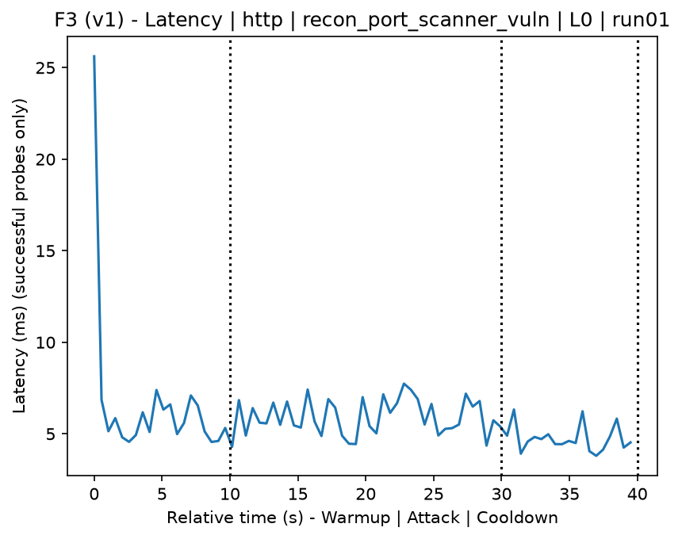
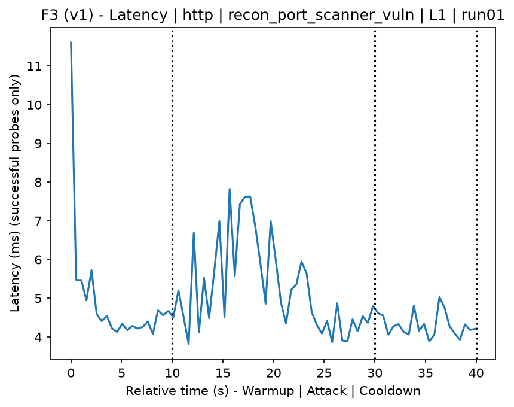
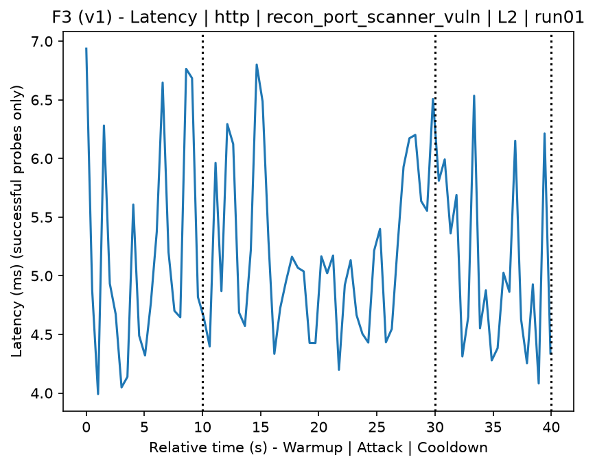
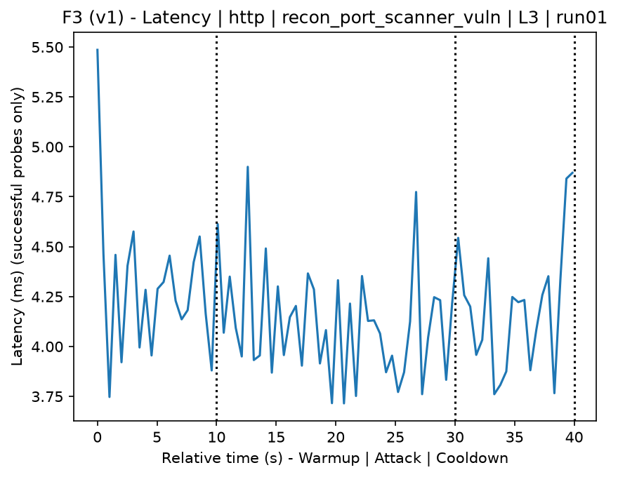
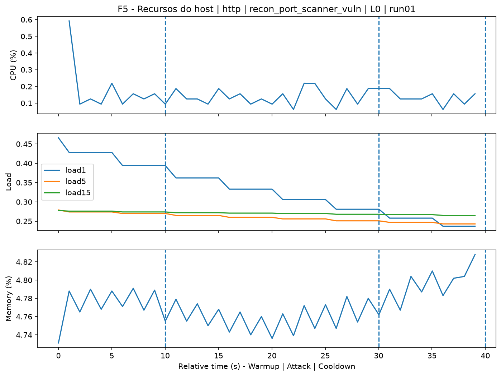
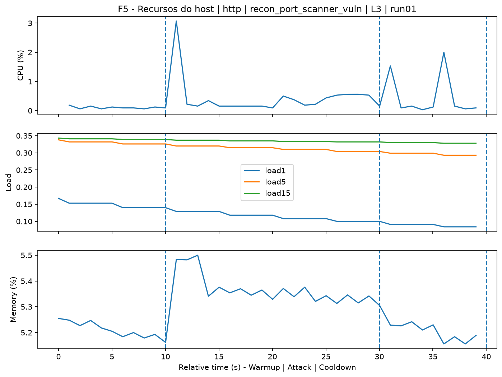
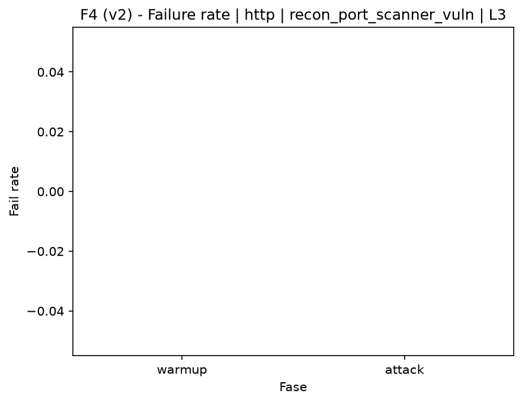

# Port Scanner Vulnerabilities (`recon_port_scanner_vuln`)

[Índice da campanha](README.md)

Na campanha `experiments/60att_5runs_l0l1l2l3`, este documento consolida a execução do ataque `recon_port_scanner_vuln`. No catálogo local, o ataque é descrito como: Port scan and known-vulnerability checks. A documentação abaixo usa apenas artefatos já presentes no repositório, principalmente as tabelas e figuras de `experiments/60att_5runs_l0l1l2l3/recon_port_scanner_vuln`.

## Metadados do ataque

| Campo | Valor |
| --- | --- |
| ID | `recon_port_scanner_vuln` |
| Categoria | 1) Reconnaissance and Discovery |
| Subcategoria | 1.2 Port, service, OS, and vulnerability scanning |
| Serviços alvo | target IP service |
| Imagem | `attack-port-scanner-vulnerabilities:latest` |
| Container | `attack-port-scanner-vulnerabilities` |
| Runtime máximo do catálogo | 300 s |
| Parâmetros de intensidade | n/d |
| MITRE ATT&CK | [https://attack.mitre.org/tactics/TA0043/](https://attack.mitre.org/tactics/TA0043/) [https://attack.mitre.org/tactics/TA0007/](https://attack.mitre.org/tactics/TA0007/) [https://attack.mitre.org/techniques/T1592/](https://attack.mitre.org/techniques/T1592/) [https://attack.mitre.org/techniques/T1595/](https://attack.mitre.org/techniques/T1595/) [https://attack.mitre.org/techniques/T1595/002/](https://attack.mitre.org/techniques/T1595/002/) [https://attack.mitre.org/techniques/T1046/](https://attack.mitre.org/techniques/T1046/) |

## Resumo estatístico por nível

| Nível | Serviço | Runs | Amostras attack | Sucesso médio | Falha média | Lat p50/p95 ms | PCAP total MB | Dataset médio (min-max) | Exec média s | Extratores ok/total | CPU média/máx | Mem MB média |
| --- | --- | --- | --- | --- | --- | --- | --- | --- | --- | --- | --- | --- |
| L0 | http | 5 | 200 | 100% | 0% | 4,65 / 6,14 | 5,04 | 9.594 (9.590-9.602) | 43,12 | 3/3 | 0,74% / 0,95% | 756,7 |
| L1 | http | 5 | 200 | 100% | 0% | 5,03 / 7,14 | 20,62 | 27.446 (27.354-27.534) | 45,54 | 3/3 | 1,91% / 5,28% | 763,67 |
| L2 | http | 5 | 200 | 100% | 0% | 4,59 / 5,73 | 19,7 | 27.110 (26.636-27.366) | 45,23 | 3/3 | 1,69% / 4,47% | 769,62 |
| L3 | http | 5 | 200 | 100% | 0% | 4,34 / 5,5 | 20,6 | 27.400 (27.358-27.456) | 45,25 | 3/3 | 1,66% / 4,71% | 772,27 |

## Estabilidade entre reexecuções

| Nível | Métrica | Runs | Média | Desvio | CV | Min | Max |
| --- | --- | --- | --- | --- | --- | --- | --- |
| L0 | CPU média na fase attack | 5 | 0,74 | 0,08 | 10,73% | 0,66 | 0,85 |
| L0 | Linhas do dataset | 5 | 9.594,4 | 4,56 | 0,05% | 9.590 | 9.602 |
| L0 | Tempo de execução | 5 | 43,12 | 0,41 | 0,96% | 42,85 | 43,85 |
| L0 | Falha na fase attack | 5 | 0 | 0 | n/d | 0 | 0 |
| L0 | Latência p95 censurada | 5 | 6,14 | 1,11 | 18,12% | 4,72 | 7,41 |
| L1 | CPU média na fase attack | 5 | 1,91 | 0,15 | 7,86% | 1,73 | 2,07 |
| L1 | Linhas do dataset | 5 | 27.446 | 80,11 | 0,29% | 27.354 | 27.534 |
| L1 | Tempo de execução | 5 | 45,54 | 0,1 | 0,21% | 45,45 | 45,66 |
| L1 | Falha na fase attack | 5 | 0 | 0 | n/d | 0 | 0 |
| L1 | Latência p95 censurada | 5 | 7,14 | 0,58 | 8,12% | 6,17 | 7,62 |
| L2 | CPU média na fase attack | 5 | 1,69 | 0,16 | 9,34% | 1,53 | 1,94 |
| L2 | Linhas do dataset | 5 | 27.110,4 | 349,79 | 1,29% | 26.636 | 27.366 |
| L2 | Tempo de execução | 5 | 45,23 | 0,07 | 0,16% | 45,18 | 45,35 |
| L2 | Falha na fase attack | 5 | 0 | 0 | n/d | 0 | 0 |
| L2 | Latência p95 censurada | 5 | 5,73 | 1,11 | 19,44% | 4,51 | 7 |
| L3 | CPU média na fase attack | 5 | 1,66 | 0,14 | 8,38% | 1,52 | 1,84 |
| L3 | Linhas do dataset | 5 | 27.399,6 | 46,46 | 0,17% | 27.358 | 27.456 |
| L3 | Tempo de execução | 5 | 45,25 | 0,06 | 0,12% | 45,17 | 45,33 |
| L3 | Falha na fase attack | 5 | 0 | 0 | n/d | 0 | 0 |
| L3 | Latência p95 censurada | 5 | 5,5 | 1,05 | 19,08% | 4,62 | 6,72 |

## Validação de artefatos

| Nível | Runs | Captura | Probe | Features | Dataset | Recursos | Server stats | Aceite |
| --- | --- | --- | --- | --- | --- | --- | --- | --- |
| L0 | 5 | 5/5 | 5/5 | 5/5 | 5/5 | 5/5 | 5/5 | 5/5 |
| L1 | 5 | 5/5 | 5/5 | 5/5 | 5/5 | 5/5 | 5/5 | 5/5 |
| L2 | 5 | 5/5 | 5/5 | 5/5 | 5/5 | 5/5 | 5/5 | 5/5 |
| L3 | 5 | 5/5 | 5/5 | 5/5 | 5/5 | 5/5 | 5/5 | 5/5 |

## Figuras selecionadas

<table>
<tr>
<td> Série temporal L0 run01</td>
<td> Série temporal L1 run01</td>
</tr>
<tr>
<td> Série temporal L2 run01</td>
<td> Série temporal L3 run01</td>
</tr>
<tr>
<td> Recursos L0 run01</td>
<td> Recursos L3 run01</td>
</tr>
<tr>
<td> Taxa de falha L0</td>
<td> Taxa de falha L3</td>
</tr>
</table>

## Fontes utilizadas

- Catálogo do ataque: `docker/attackers/port-scanner-vulnerabilities/attack.yaml`
- Artefatos da campanha: `experiments/60att_5runs_l0l1l2l3/recon_port_scanner_vuln`
