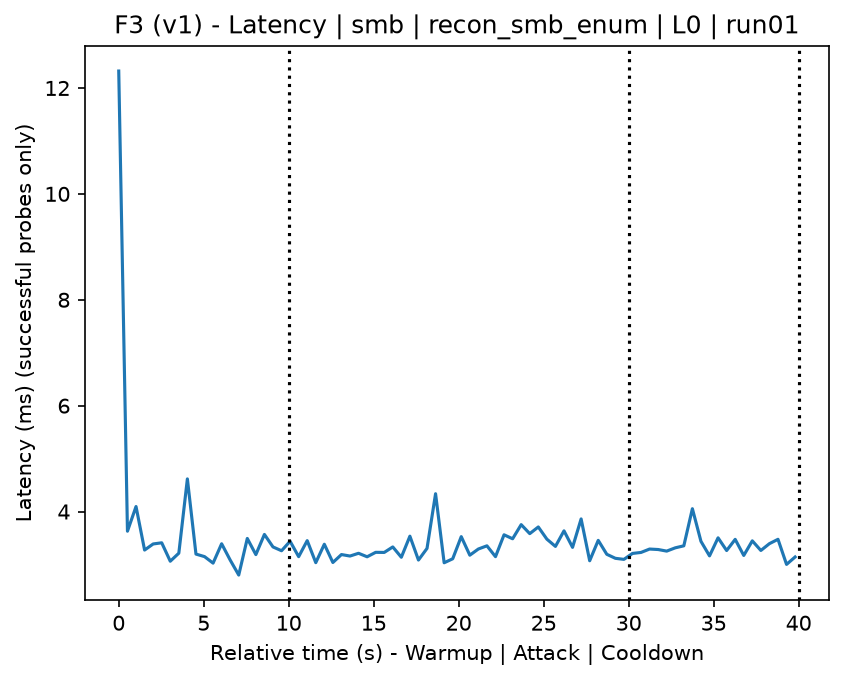
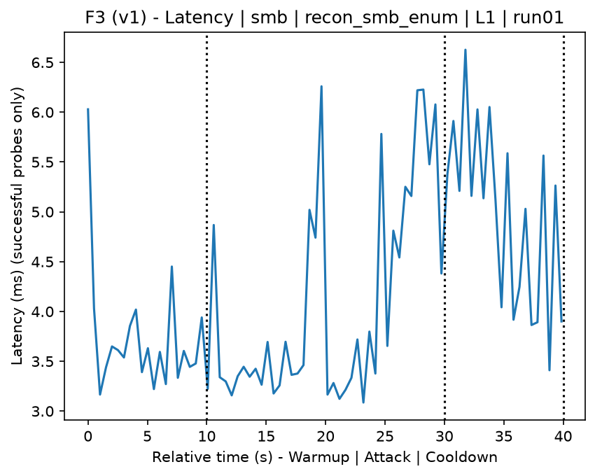
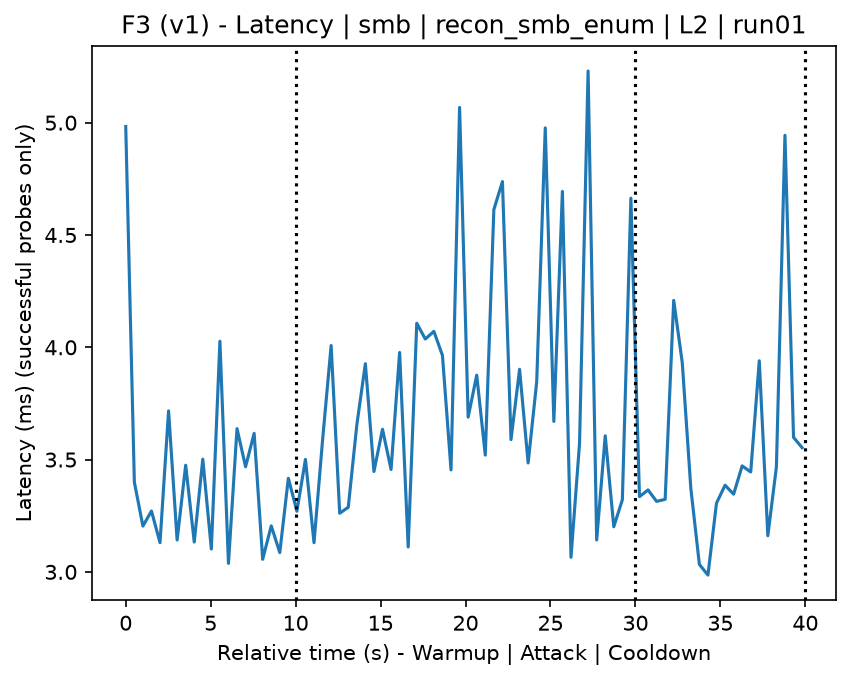
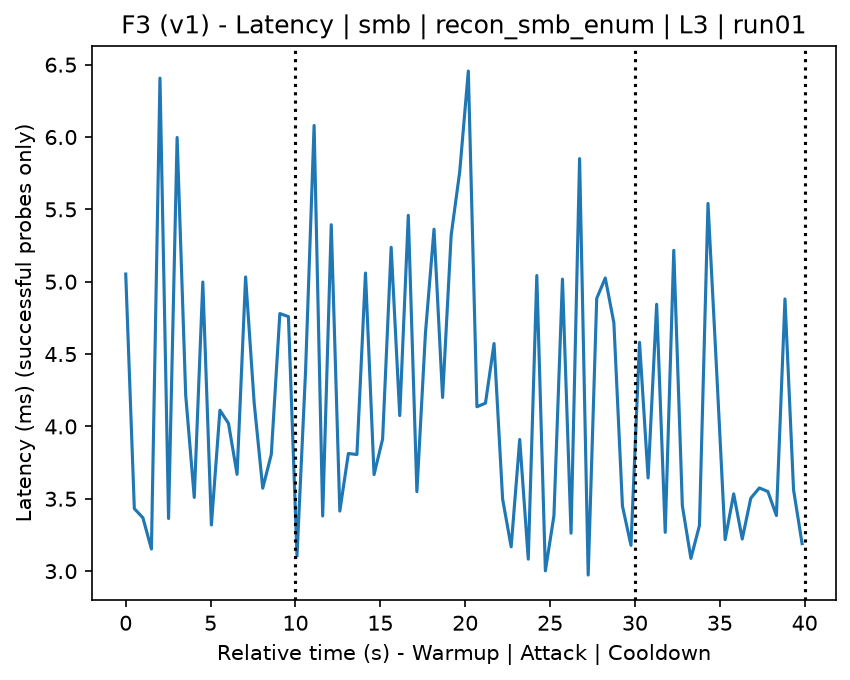
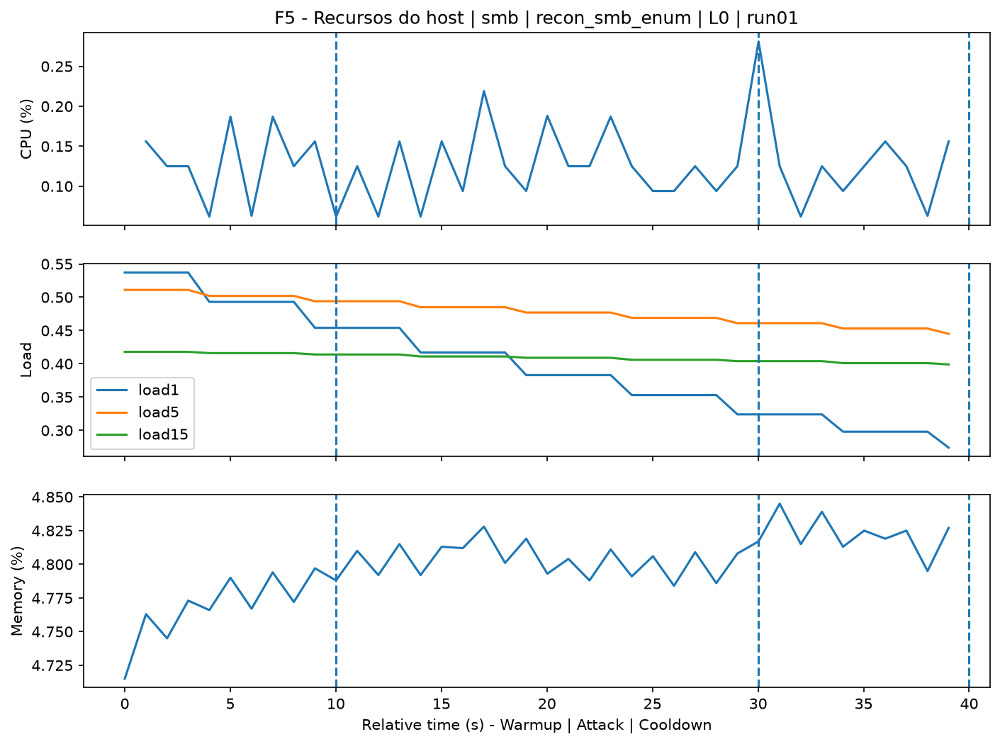
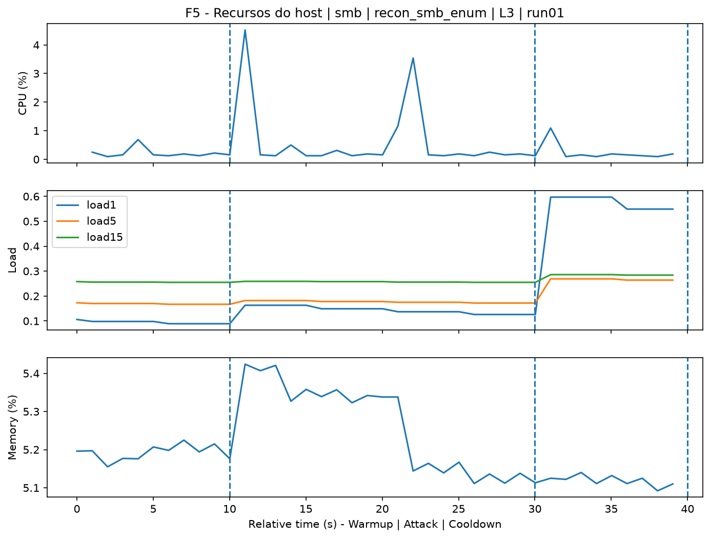
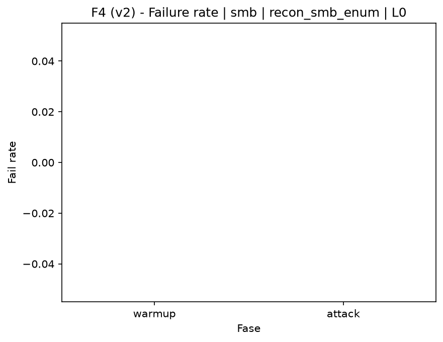
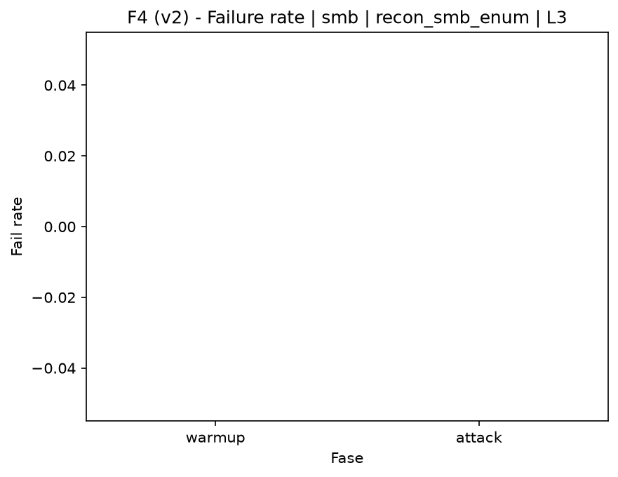

# SMB Enumerating (`recon_smb_enum`)

[Campaign index](README.md)

This document summarizes the published campaign execution of attack `recon_smb_enum`. In the local catalog, the attack is described as: Enumeration of SMB share directories and vulnerabilities. The full execution artifacts are not versioned in this repository; retrieve the generated dataset CSVs from the Figshare dataset linked in the campaign index. Raw PCAP captures are not included in that archive. The selected figures below are stored under `contrib/assets/campaign_doc`.

## Attack Metadata

| Field | Value |
| --- | --- |
| ID | `recon_smb_enum` |
| Category | 1) Reconnaissance and Discovery |
| Subcategory | 1.2 Port, service, OS, and vulnerability scanning |
| Target services | target IP service |
| Image | `attack-smb-enumerating:latest` |
| Container | `attack-smb-enumerating` |
| Catalog max runtime | 10 s |
| Intensity parameters | n/a |
| MITRE ATT&CK | [https://attack.mitre.org/tactics/TA0043/](https://attack.mitre.org/tactics/TA0043/) [https://attack.mitre.org/tactics/TA0007/](https://attack.mitre.org/tactics/TA0007/) [https://attack.mitre.org/techniques/T1590/](https://attack.mitre.org/techniques/T1590/) [https://attack.mitre.org/techniques/T1592/](https://attack.mitre.org/techniques/T1592/) [https://attack.mitre.org/techniques/T1595/](https://attack.mitre.org/techniques/T1595/) [https://attack.mitre.org/techniques/T1595/002/](https://attack.mitre.org/techniques/T1595/002/) [https://attack.mitre.org/techniques/T1046/](https://attack.mitre.org/techniques/T1046/) [https://attack.mitre.org/techniques/T1135/](https://attack.mitre.org/techniques/T1135/) [https://attack.mitre.org/techniques/T1087/](https://attack.mitre.org/techniques/T1087/) [https://attack.mitre.org/techniques/T1069/](https://attack.mitre.org/techniques/T1069/) |

## Statistical Summary by Level

| Level | Service | Runs | Attack samples | Mean success | Mean failure | Lat p50/p95 ms | Total PCAP MB | Mean dataset (min-max) | Mean exec s | Extractors ok/total | Mean/max CPU | Mean mem MB |
| --- | --- | --- | --- | --- | --- | --- | --- | --- | --- | --- | --- | --- |
| L0 | smb | 5 | 200 | 100% | 0% | 3,44 / 4,55 | 1,26 | 4.855 (4.850-4.864) | 42,63 | 3/3 | 1,39% / 1,65% | 36,32 |
| L1 | smb | 5 | 200 | 100% | 0% | 3,67 / 5,31 | 2,34 | 7.317 (7.302-7.350) | 43,06 | 3/3 | 4,52% / 28,43% | 38,52 |
| L2 | smb | 5 | 200 | 100% | 0% | 4,22 / 6,04 | 2,34 | 7.303 (7.294-7.322) | 43,06 | 3/3 | 3,9% / 20,75% | 37,96 |
| L3 | smb | 5 | 200 | 100% | 0% | 3,76 / 5,21 | 2,34 | 7.301 (7.292-7.312) | 43 | 3/3 | 3,51% / 20,3% | 38,32 |

## Stability Across Reruns

| Level | Metric | Runs | Mean | Deviation | CV | Min | Max |
| --- | --- | --- | --- | --- | --- | --- | --- |
| L0 | Mean CPU in attack phase | 5 | 1,39 | 0,06 | 4,17% | 1,31 | 1,46 |
| L0 | Dataset rows | 5 | 4.855,2 | 5,76 | 0,12% | 4.850 | 4.864 |
| L0 | Execution time | 5 | 42,63 | 0,35 | 0,82% | 42,44 | 43,25 |
| L0 | Failure in attack phase | 5 | 0 | 0 | n/a | 0 | 0 |
| L0 | Censored p95 latency | 5 | 4,55 | 0,74 | 16,28% | 3,76 | 5,55 |
| L1 | Mean CPU in attack phase | 5 | 4,52 | 1,93 | 42,78% | 3,44 | 7,94 |
| L1 | Dataset rows | 5 | 7.317,2 | 19,68 | 0,27% | 7.302 | 7.350 |
| L1 | Execution time | 5 | 43,06 | 0,09 | 0,2% | 42,98 | 43,19 |
| L1 | Failure in attack phase | 5 | 0 | 0 | n/a | 0 | 0 |
| L1 | Censored p95 latency | 5 | 5,31 | 0,94 | 17,64% | 3,74 | 6,22 |
| L2 | Mean CPU in attack phase | 5 | 3,9 | 0,3 | 7,66% | 3,42 | 4,13 |
| L2 | Dataset rows | 5 | 7.303,2 | 11,1 | 0,15% | 7.294 | 7.322 |
| L2 | Execution time | 5 | 43,06 | 0,07 | 0,17% | 42,95 | 43,11 |
| L2 | Failure in attack phase | 5 | 0 | 0 | n/a | 0 | 0 |
| L2 | Censored p95 latency | 5 | 6,04 | 0,71 | 11,69% | 4,98 | 6,9 |
| L3 | Mean CPU in attack phase | 5 | 3,51 | 0,28 | 8,07% | 3,12 | 3,81 |
| L3 | Dataset rows | 5 | 7.300,8 | 8,07 | 0,11% | 7.292 | 7.312 |
| L3 | Execution time | 5 | 43 | 0,07 | 0,17% | 42,9 | 43,07 |
| L3 | Failure in attack phase | 5 | 0 | 0 | n/a | 0 | 0 |
| L3 | Censored p95 latency | 5 | 5,21 | 0,9 | 17,29% | 3,71 | 5,86 |

## Artifact Validation

| Level | Runs | Capture | Probe | Features | Dataset | Resources | Server stats | Acceptance |
| --- | --- | --- | --- | --- | --- | --- | --- | --- |
| L0 | 5 | 5/5 | 5/5 | 5/5 | 5/5 | 5/5 | 5/5 | 5/5 |
| L1 | 5 | 5/5 | 5/5 | 5/5 | 5/5 | 5/5 | 5/5 | 5/5 |
| L2 | 5 | 5/5 | 5/5 | 5/5 | 5/5 | 5/5 | 5/5 | 5/5 |
| L3 | 5 | 5/5 | 5/5 | 5/5 | 5/5 | 5/5 | 5/5 | 5/5 |

## Selected Figures

<table>
<tr>
<td> Time series L0 run01</td>
<td> Time series L1 run01</td>
</tr>
<tr>
<td> Time series L2 run01</td>
<td> Time series L3 run01</td>
</tr>
<tr>
<td> Resources L0 run01</td>
<td> Resources L3 run01</td>
</tr>
<tr>
<td> Failure rate L0</td>
<td> Failure rate L3</td>
</tr>
</table>

## Sources Used

- Attack catalog: `docker/attackers/smb-enumerating/attack.yaml`
- Full campaign artifacts: available from the Figshare dataset linked in the campaign index; when extracted locally, expected under `experiments/all_5runs_4levels/recon_smb_enum`.
