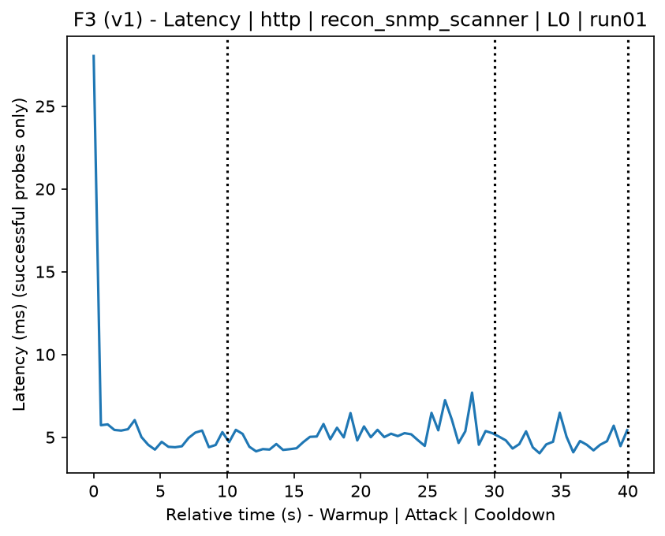
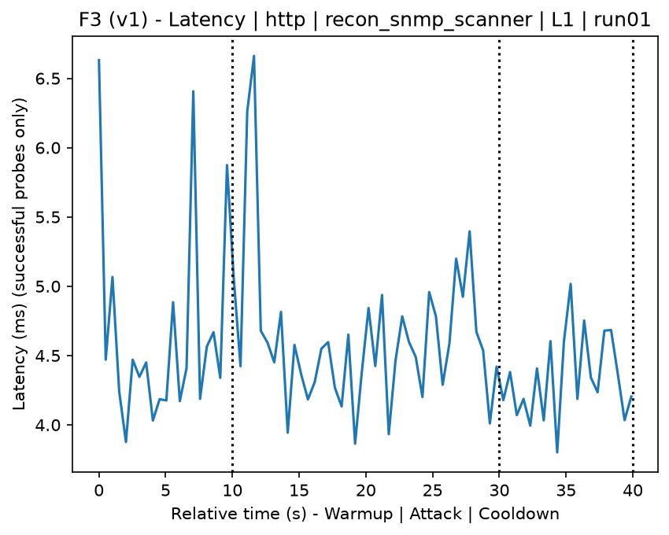
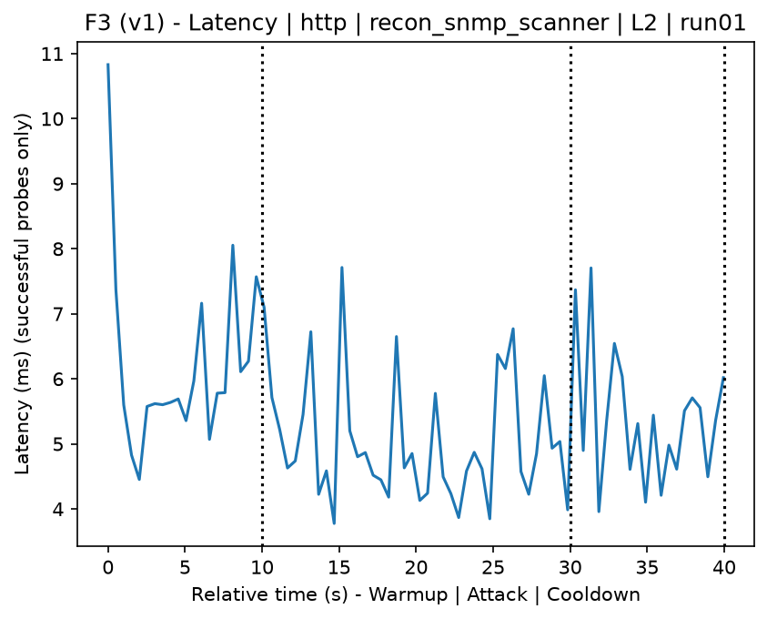
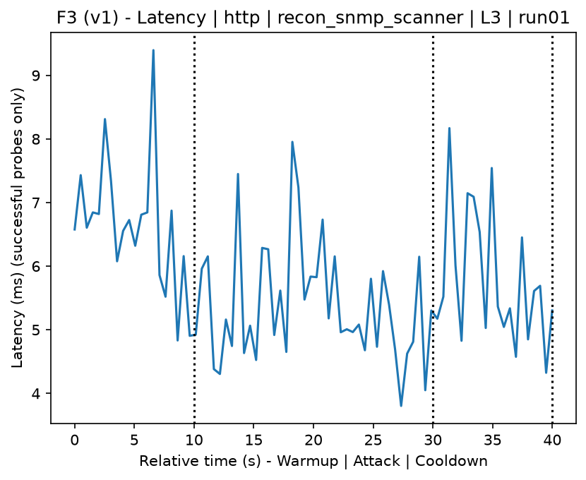
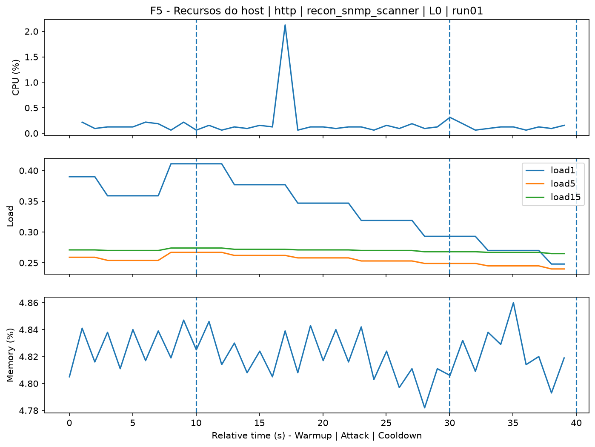
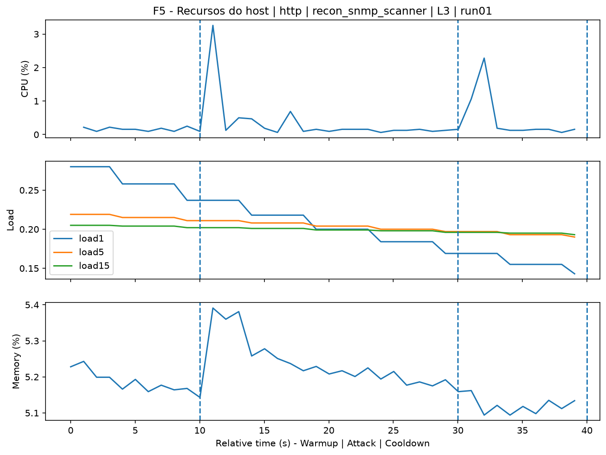
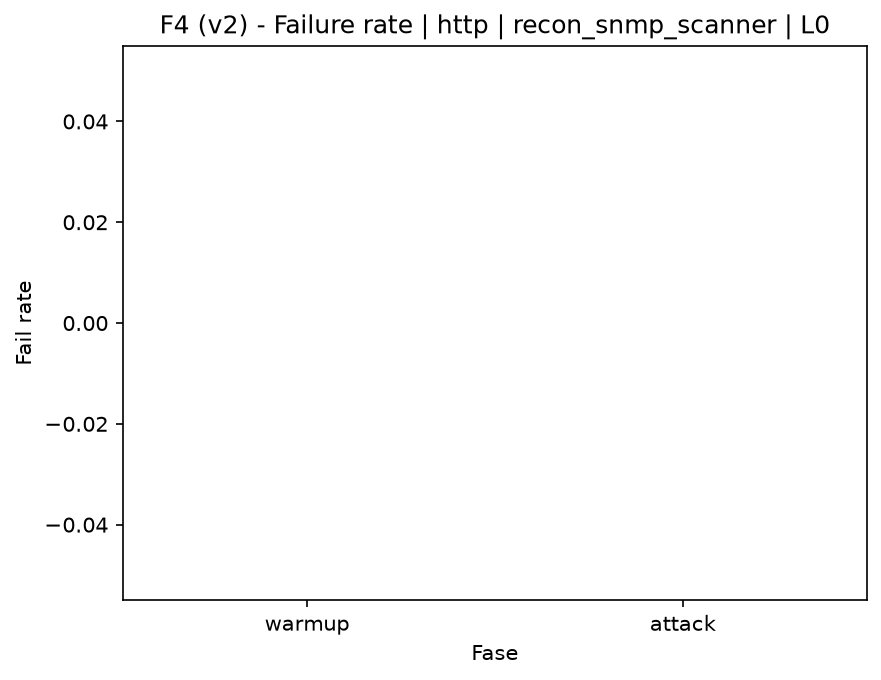

# SNMP Scanner (`recon_snmp_scanner`)

[Índice da campanha](README.md)

Na campanha `experiments/60att_5runs_l0l1l2l3`, este documento consolida a execução do ataque `recon_snmp_scanner`. No catálogo local, o ataque é descrito como: SNMP scan across all hosts in a network using a community-string wordlist. A documentação abaixo usa apenas artefatos já presentes no repositório, principalmente as tabelas e figuras de `experiments/60att_5runs_l0l1l2l3/recon_snmp_scanner`.

## Metadados do ataque

| Campo | Valor |
| --- | --- |
| ID | `recon_snmp_scanner` |
| Categoria | 1) Reconnaissance and Discovery |
| Subcategoria | 1.2 Port, service, OS, and vulnerability scanning |
| Serviços alvo | target IP service |
| Imagem | `attack-snmp-scanner:latest` |
| Container | `attack-snmp-scanner` |
| Runtime máximo do catálogo | 10 s |
| Parâmetros de intensidade | n/d |
| MITRE ATT&CK | [https://attack.mitre.org/tactics/TA0043/](https://attack.mitre.org/tactics/TA0043/) [https://attack.mitre.org/tactics/TA0007/](https://attack.mitre.org/tactics/TA0007/) [https://attack.mitre.org/tactics/TA0006/](https://attack.mitre.org/tactics/TA0006/) [https://attack.mitre.org/techniques/T1590/](https://attack.mitre.org/techniques/T1590/) [https://attack.mitre.org/techniques/T1595/](https://attack.mitre.org/techniques/T1595/) [https://attack.mitre.org/techniques/T1595/001/](https://attack.mitre.org/techniques/T1595/001/) [https://attack.mitre.org/techniques/T1046/](https://attack.mitre.org/techniques/T1046/) [https://attack.mitre.org/techniques/T1110/](https://attack.mitre.org/techniques/T1110/) [https://attack.mitre.org/techniques/T1110/003/](https://attack.mitre.org/techniques/T1110/003/) |

## Resumo estatístico por nível

| Nível | Serviço | Runs | Amostras attack | Sucesso médio | Falha média | Lat p50/p95 ms | PCAP total MB | Dataset médio (min-max) | Exec média s | Extratores ok/total | CPU média/máx | Mem MB média |
| --- | --- | --- | --- | --- | --- | --- | --- | --- | --- | --- | --- | --- |
| L0 | http | 5 | 200 | 100% | 0% | 4,64 / 5,96 | 5,06 | 9.626 (9.592-9.742) | 43,14 | 3/3 | 0,73% / 0,84% | 774,48 |
| L1 | http | 5 | 200 | 100% | 0% | 5,07 / 6,56 | 5,17 | 10.177 (10.108-10.226) | 43,25 | 3/3 | 0,81% / 0,98% | 776,51 |
| L2 | http | 5 | 200 | 100% | 0% | 5,45 / 7,22 | 5,15 | 10.131 (10.100-10.226) | 43,31 | 3/3 | 0,87% / 1,02% | 778,57 |
| L3 | http | 5 | 200 | 100% | 0% | 5,34 / 6,92 | 5,17 | 10.182 (10.104-10.242) | 43,24 | 3/3 | 0,81% / 1,04% | 780,83 |

## Estabilidade entre reexecuções

| Nível | Métrica | Runs | Média | Desvio | CV | Min | Max |
| --- | --- | --- | --- | --- | --- | --- | --- |
| L0 | CPU média na fase attack | 5 | 0,73 | 0,04 | 5,91% | 0,68 | 0,79 |
| L0 | Linhas do dataset | 5 | 9.626,4 | 64,74 | 0,67% | 9.592 | 9.742 |
| L0 | Tempo de execução | 5 | 43,14 | 0,39 | 0,91% | 42,84 | 43,81 |
| L0 | Falha na fase attack | 5 | 0 | 0 | n/d | 0 | 0 |
| L0 | Latência p95 censurada | 5 | 5,96 | 1,04 | 17,46% | 4,9 | 7,47 |
| L1 | CPU média na fase attack | 5 | 0,81 | 0,06 | 7,75% | 0,74 | 0,91 |
| L1 | Linhas do dataset | 5 | 10.177,2 | 62,3 | 0,61% | 10.108 | 10.226 |
| L1 | Tempo de execução | 5 | 43,25 | 0,05 | 0,12% | 43,2 | 43,31 |
| L1 | Falha na fase attack | 5 | 0 | 0 | n/d | 0 | 0 |
| L1 | Latência p95 censurada | 5 | 6,56 | 0,73 | 11,15% | 5,44 | 7,47 |
| L2 | CPU média na fase attack | 5 | 0,87 | 0,1 | 11,05% | 0,78 | 1,02 |
| L2 | Linhas do dataset | 5 | 10.130,8 | 53,84 | 0,53% | 10.100 | 10.226 |
| L2 | Tempo de execução | 5 | 43,31 | 0,05 | 0,11% | 43,24 | 43,35 |
| L2 | Falha na fase attack | 5 | 0 | 0 | n/d | 0 | 0 |
| L2 | Latência p95 censurada | 5 | 7,22 | 0,58 | 7,99% | 6,75 | 8,16 |
| L3 | CPU média na fase attack | 5 | 0,81 | 0,08 | 9,85% | 0,72 | 0,93 |
| L3 | Linhas do dataset | 5 | 10.182 | 66,33 | 0,65% | 10.104 | 10.242 |
| L3 | Tempo de execução | 5 | 43,24 | 0,09 | 0,2% | 43,11 | 43,35 |
| L3 | Falha na fase attack | 5 | 0 | 0 | n/d | 0 | 0 |
| L3 | Latência p95 censurada | 5 | 6,92 | 0,82 | 11,8% | 5,78 | 8,02 |

## Validação de artefatos

| Nível | Runs | Captura | Probe | Features | Dataset | Recursos | Server stats | Aceite |
| --- | --- | --- | --- | --- | --- | --- | --- | --- |
| L0 | 5 | 5/5 | 5/5 | 5/5 | 5/5 | 5/5 | 5/5 | 5/5 |
| L1 | 5 | 5/5 | 5/5 | 5/5 | 5/5 | 5/5 | 5/5 | 5/5 |
| L2 | 5 | 5/5 | 5/5 | 5/5 | 5/5 | 5/5 | 5/5 | 5/5 |
| L3 | 5 | 5/5 | 5/5 | 5/5 | 5/5 | 5/5 | 5/5 | 5/5 |

## Figuras selecionadas

<table>
<tr>
<td> Série temporal L0 run01</td>
<td> Série temporal L1 run01</td>
</tr>
<tr>
<td> Série temporal L2 run01</td>
<td> Série temporal L3 run01</td>
</tr>
<tr>
<td> Recursos L0 run01</td>
<td> Recursos L3 run01</td>
</tr>
<tr>
<td> Taxa de falha L0</td>
<td> Taxa de falha L3</td>
</tr>
</table>

## Fontes utilizadas

- Catálogo do ataque: `docker/attackers/snmp-scanner/attack.yaml`
- Artefatos da campanha: `experiments/60att_5runs_l0l1l2l3/recon_snmp_scanner`
