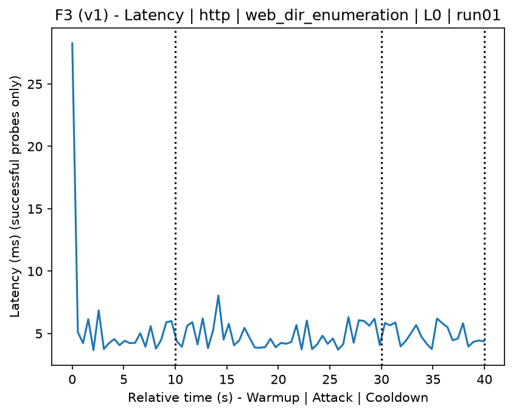
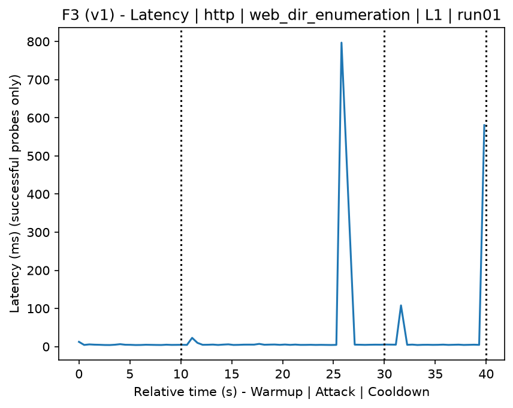
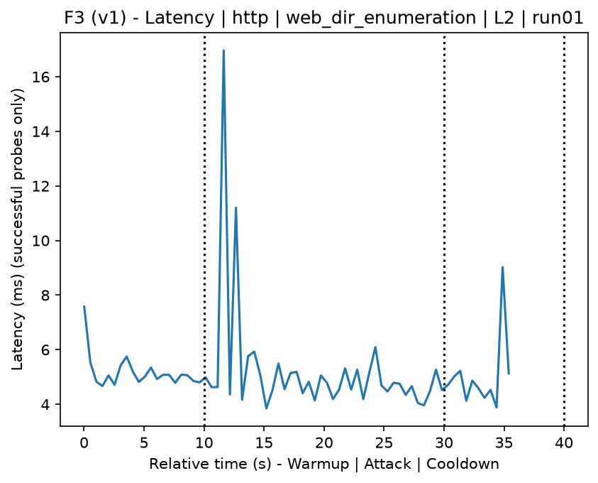
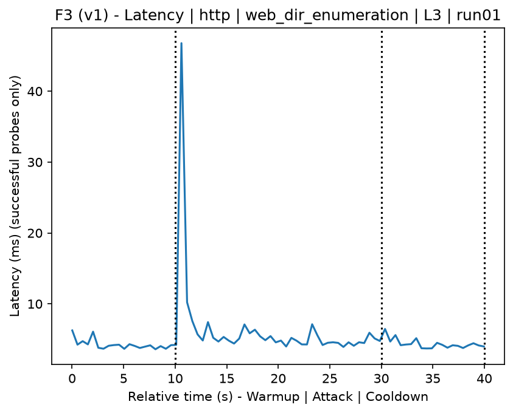
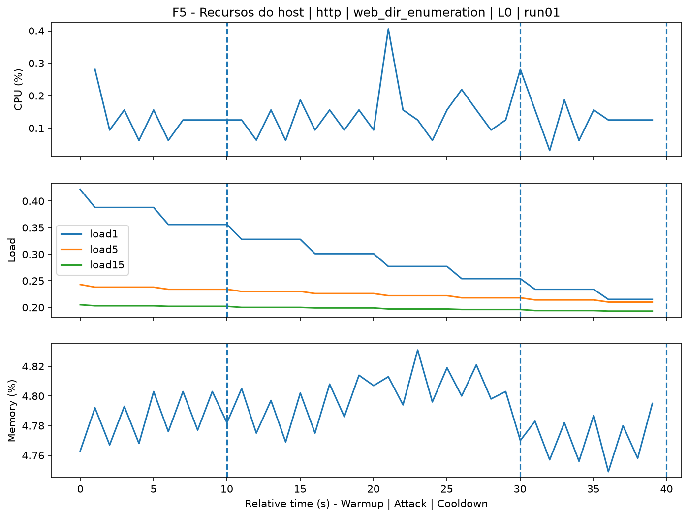
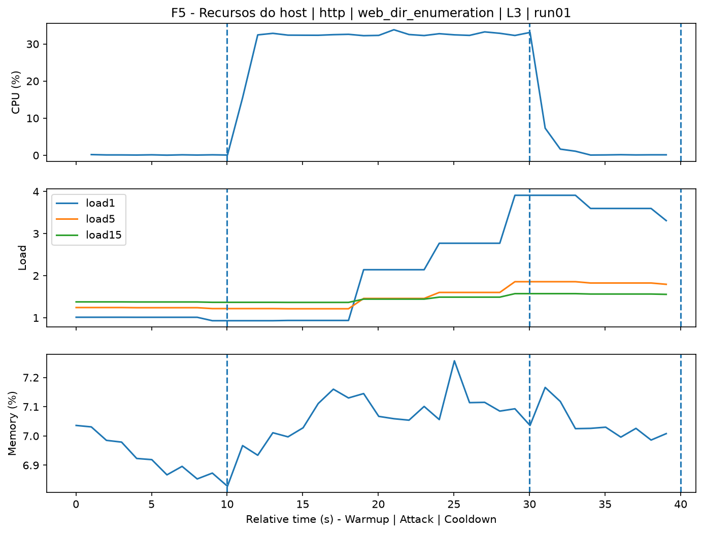
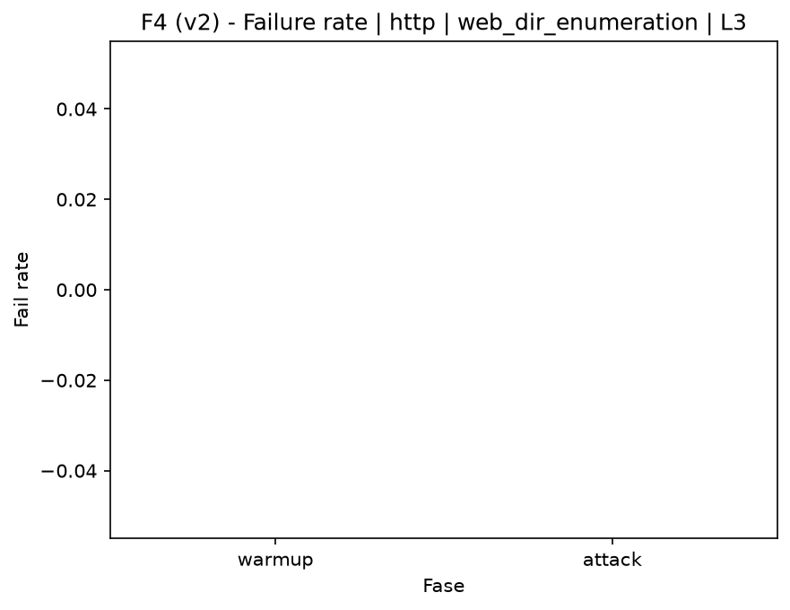

# Web Directory Enumeration (`web_dir_enumeration`)

[Índice da campanha](README.md)

Na campanha `experiments/60att_5runs_l0l1l2l3`, este documento consolida a execução do ataque `web_dir_enumeration`. No catálogo local, o ataque é descrito como: Web server subdirectory and resource enumeration using a wordlist. A documentação abaixo usa apenas artefatos já presentes no repositório, principalmente as tabelas e figuras de `experiments/60att_5runs_l0l1l2l3/web_dir_enumeration`.

## Metadados do ataque

| Campo | Valor |
| --- | --- |
| ID | `web_dir_enumeration` |
| Categoria | 3) Web Application Attacks |
| Subcategoria | 3.1 General Web |
| Serviços alvo | http-server |
| Imagem | `attack-web-dir-enumeration:latest` |
| Container | `attack-web-dir-enumeration` |
| Runtime máximo do catálogo | 10 s |
| Parâmetros de intensidade | n/d |
| MITRE ATT&CK | [https://attack.mitre.org/tactics/TA0043/](https://attack.mitre.org/tactics/TA0043/) [https://attack.mitre.org/techniques/T1595/](https://attack.mitre.org/techniques/T1595/) [https://attack.mitre.org/techniques/T1595/003/](https://attack.mitre.org/techniques/T1595/003/) |

## Resumo estatístico por nível

| Nível | Serviço | Runs | Amostras attack | Sucesso médio | Falha média | Lat p50/p95 ms | PCAP total MB | Dataset médio (min-max) | Exec média s | Extratores ok/total | CPU média/máx | Mem MB média |
| --- | --- | --- | --- | --- | --- | --- | --- | --- | --- | --- | --- | --- |
| L0 | http | 5 | 200 | 100% | 0% | 4,39 / 5,34 | 1,67 | 3.168 (3.160-3.200) | 42,34 | 3/3 | 0,7% / 0,83% | 782,9 |
| L1 | http | 5 | 198 | 100% | 0% | 4,89 / 7,78 | 1.588,8 | 1.900.674 (1.704.782-2.407.134) | 326,79 | 3/3 | 268,21% / 294,43% | 1.301,76 |
| L2 | http | 5 | 200 | 100% | 0% | 4,77 / 7,99 | 1.540,75 | 1.843.304 (1.775.942-1.909.856) | 319,39 | 3/3 | 267,2% / 299,83% | 1.341,23 |
| L3 | http | 5 | 200 | 100% | 0% | 4,94 / 14,14 | 1.471,03 | 1.760.023 (1.583.034-1.905.876) | 306,81 | 3/3 | 271,39% / 308,52% | 989,08 |

## Estabilidade entre reexecuções

| Nível | Métrica | Runs | Média | Desvio | CV | Min | Max |
| --- | --- | --- | --- | --- | --- | --- | --- |
| L0 | CPU média na fase attack | 5 | 0,7 | 0,05 | 7,3% | 0,67 | 0,8 |
| L0 | Linhas do dataset | 5 | 3.168 | 17,89 | 0,56% | 3.160 | 3.200 |
| L0 | Tempo de execução | 5 | 42,34 | 0,47 | 1,11% | 42,06 | 43,17 |
| L0 | Falha na fase attack | 5 | 0 | 0 | n/d | 0 | 0 |
| L0 | Latência p95 censurada | 5 | 5,34 | 0,55 | 10,32% | 4,95 | 6,22 |
| L1 | CPU média na fase attack | 5 | 268,21 | 9,59 | 3,57% | 259,89 | 283,64 |
| L1 | Linhas do dataset | 5 | 1.900.673,6 | 289.220,98 | 15,22% | 1.704.782 | 2.407.134 |
| L1 | Tempo de execução | 5 | 326,79 | 44,67 | 13,67% | 296,06 | 405,18 |
| L1 | Falha na fase attack | 5 | 0 | 0 | n/d | 0 | 0 |
| L1 | Latência p95 censurada | 5 | 7,78 | 2,37 | 30,42% | 6,22 | 11,75 |
| L2 | CPU média na fase attack | 5 | 267,21 | 5,5 | 2,06% | 258,02 | 271,61 |
| L2 | Linhas do dataset | 5 | 1.843.304 | 50.901,61 | 2,76% | 1.775.942 | 1.909.856 |
| L2 | Tempo de execução | 5 | 319,39 | 7,16 | 2,24% | 309,5 | 328,06 |
| L2 | Falha na fase attack | 5 | 0 | 0 | n/d | 0 | 0 |
| L2 | Latência p95 censurada | 5 | 7,99 | 1,81 | 22,64% | 5,97 | 10,32 |
| L3 | CPU média na fase attack | 5 | 271,39 | 26,18 | 9,65% | 232,8 | 296,15 |
| L3 | Linhas do dataset | 5 | 1.760.022,8 | 116.958,86 | 6,65% | 1.583.034 | 1.905.876 |
| L3 | Tempo de execução | 5 | 306,81 | 16,8 | 5,48% | 281,13 | 327,44 |
| L3 | Falha na fase attack | 5 | 0 | 0 | n/d | 0 | 0 |
| L3 | Latência p95 censurada | 5 | 14,14 | 10,54 | 74,54% | 7,18 | 31,49 |

## Validação de artefatos

| Nível | Runs | Captura | Probe | Features | Dataset | Recursos | Server stats | Aceite |
| --- | --- | --- | --- | --- | --- | --- | --- | --- |
| L0 | 5 | 5/5 | 5/5 | 5/5 | 5/5 | 5/5 | 5/5 | 5/5 |
| L1 | 5 | 5/5 | 5/5 | 5/5 | 5/5 | 5/5 | 5/5 | 5/5 |
| L2 | 5 | 5/5 | 5/5 | 5/5 | 5/5 | 5/5 | 5/5 | 5/5 |
| L3 | 5 | 5/5 | 5/5 | 5/5 | 5/5 | 5/5 | 5/5 | 5/5 |

## Figuras selecionadas

<table>
<tr>
<td> Série temporal L0 run01</td>
<td> Série temporal L1 run01</td>
</tr>
<tr>
<td> Série temporal L2 run01</td>
<td> Série temporal L3 run01</td>
</tr>
<tr>
<td> Recursos L0 run01</td>
<td> Recursos L3 run01</td>
</tr>
<tr>
<td> Taxa de falha L0</td>
<td> Taxa de falha L3</td>
</tr>
</table>

## Fontes utilizadas

- Catálogo do ataque: `docker/attackers/web-dir-enumeration/attack.yaml`
- Artefatos da campanha: `experiments/60att_5runs_l0l1l2l3/web_dir_enumeration`
