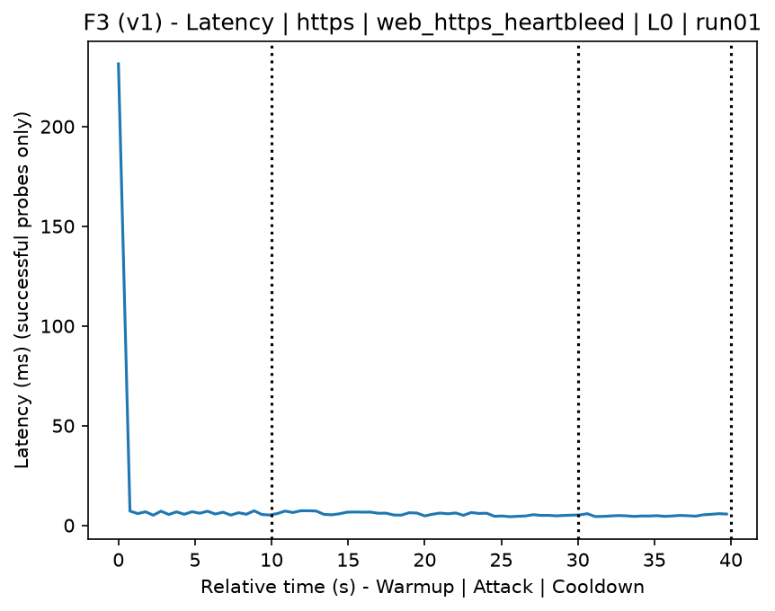
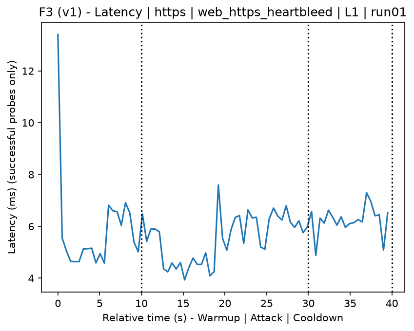
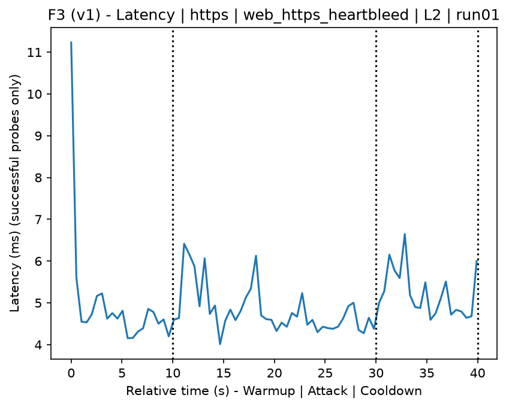
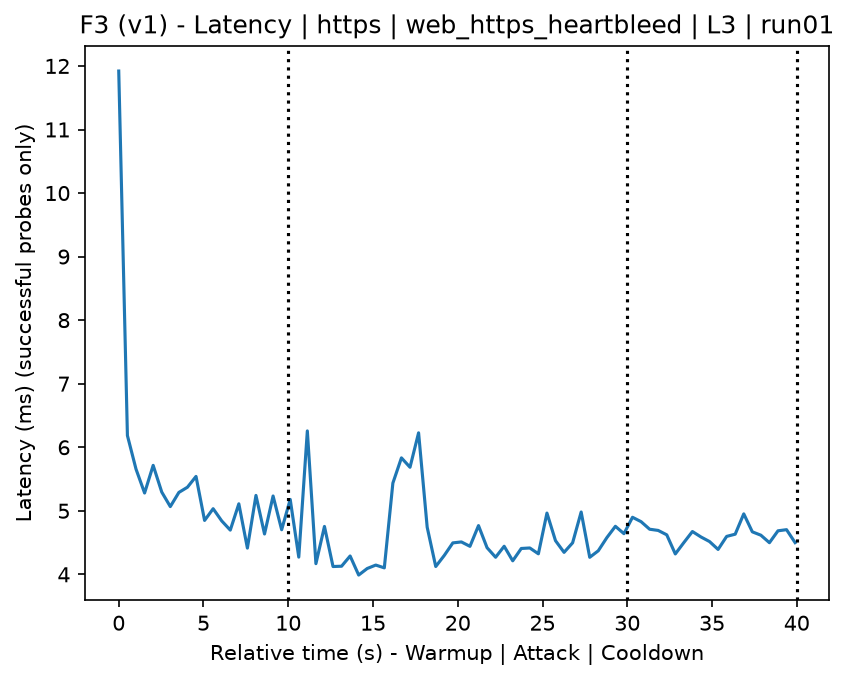
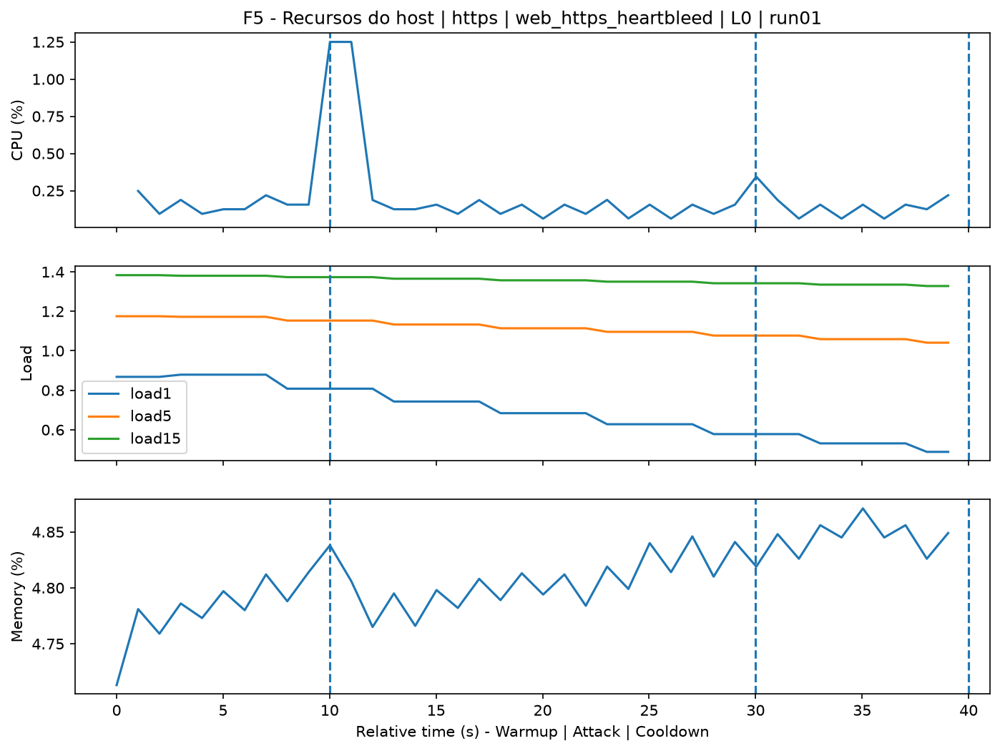
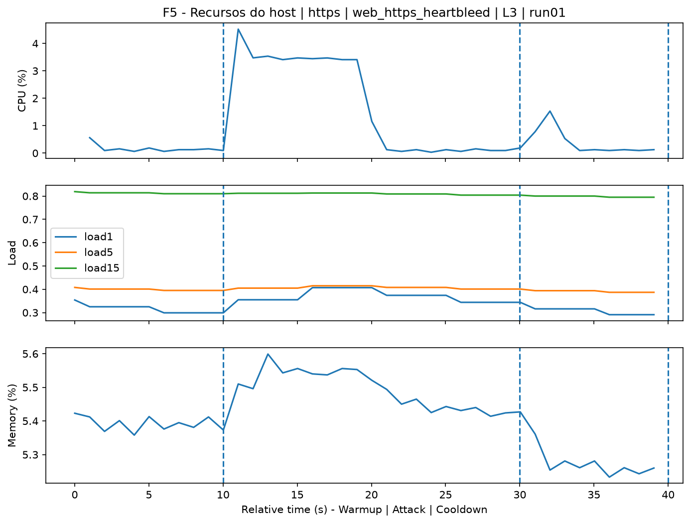
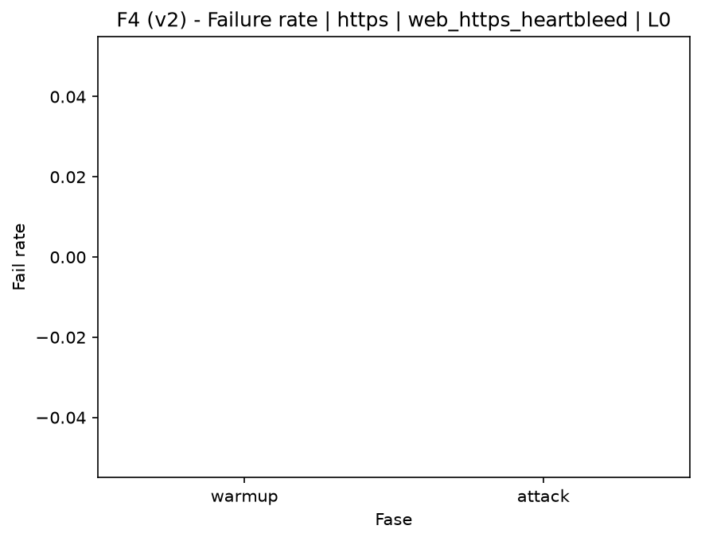
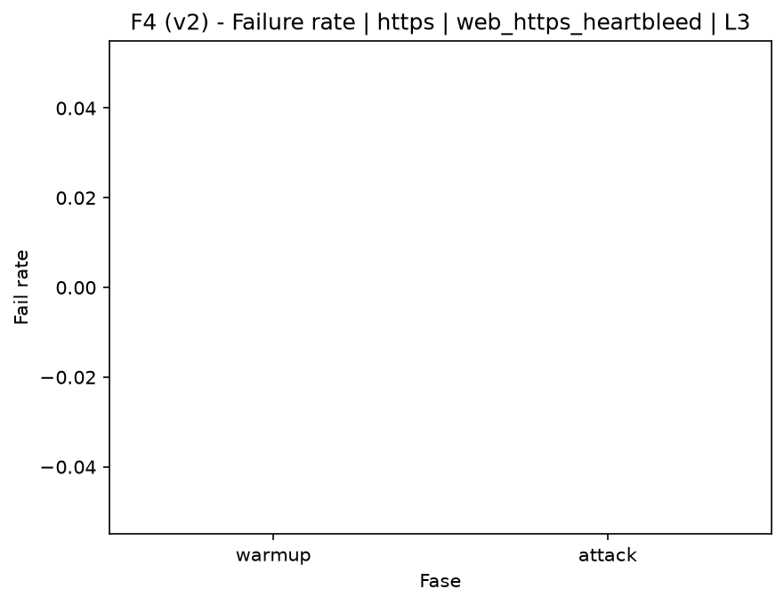

# HTTPS Heartbleed (`web_https_heartbleed`)

[Campaign index](README.md)

This document summarizes the published campaign execution of attack `web_https_heartbleed`. In the local catalog, the attack is described as: Heartbleed scanner/exploitation against a vulnerable HTTPS server. The full execution artifacts are not versioned in this repository; retrieve the generated dataset CSVs from the Figshare dataset linked in the campaign index. Raw PCAP captures are not included in that archive. The selected figures below are stored under `contrib/assets/campaign_doc`.

## Attack Metadata

| Field | Value |
| --- | --- |
| ID | `web_https_heartbleed` |
| Category | 3) Web Application Attacks |
| Subcategory | 3.1 General Web |
| Target services | http-server |
| Image | `attack-web-https-heartbleed:latest` |
| Container | `attack-web-https-heartbleed` |
| Catalog max runtime | 10 s |
| Intensity parameters | n/a |
| MITRE ATT&CK | [https://attack.mitre.org/tactics/TA0043/](https://attack.mitre.org/tactics/TA0043/) [https://attack.mitre.org/tactics/TA0001/](https://attack.mitre.org/tactics/TA0001/) [https://attack.mitre.org/tactics/TA0009/](https://attack.mitre.org/tactics/TA0009/) [https://attack.mitre.org/techniques/T1595/](https://attack.mitre.org/techniques/T1595/) [https://attack.mitre.org/techniques/T1595/002/](https://attack.mitre.org/techniques/T1595/002/) [https://attack.mitre.org/techniques/T1190/](https://attack.mitre.org/techniques/T1190/) [https://attack.mitre.org/techniques/T1005/](https://attack.mitre.org/techniques/T1005/) |

## Statistical Summary by Level

| Level | Service | Runs | Attack samples | Mean success | Mean failure | Lat p50/p95 ms | Total PCAP MB | Mean dataset (min-max) | Mean exec s | Extractors ok/total | Mean/max CPU | Mean mem MB |
| --- | --- | --- | --- | --- | --- | --- | --- | --- | --- | --- | --- | --- |
| L0 | https | 5 | 199 | 100% | 0% | 5,59 / 6,77 | 1,49 | 2.198 (2.184-2.224) | 42,39 | 3/3 | 0,46% / 0,53% | 24,26 |
| L1 | https | 5 | 200 | 100% | 0% | 4,93 / 6,26 | 47,67 | 8.257 (8.222-8.286) | 42,94 | 3/3 | 2,15% / 4,52% | 24,55 |
| L2 | https | 5 | 200 | 100% | 0% | 4,84 / 6,13 | 47,95 | 8.223 (8.206-8.248) | 42,99 | 3/3 | 2,2% / 4,4% | 24,53 |
| L3 | https | 5 | 200 | 100% | 0% | 4,47 / 5,37 | 47,32 | 8.260 (8.242-8.286) | 42,91 | 3/3 | 2,15% / 4,42% | 24,53 |

## Stability Across Reruns

| Level | Metric | Runs | Mean | Deviation | CV | Min | Max |
| --- | --- | --- | --- | --- | --- | --- | --- |
| L0 | Mean CPU in attack phase | 5 | 0,46 | 0,02 | 4,92% | 0,42 | 0,48 |
| L0 | Dataset rows | 5 | 2.198 | 18,11 | 0,82% | 2.184 | 2.224 |
| L0 | Execution time | 5 | 42,39 | 0,55 | 1,3% | 42,11 | 43,37 |
| L0 | Failure in attack phase | 5 | 0 | 0 | n/a | 0 | 0 |
| L0 | Censored p95 latency | 5 | 6,77 | 0,44 | 6,52% | 6,24 | 7,27 |
| L1 | Mean CPU in attack phase | 5 | 2,15 | 0,11 | 5,04% | 2,01 | 2,29 |
| L1 | Dataset rows | 5 | 8.257,2 | 26,86 | 0,33% | 8.222 | 8.286 |
| L1 | Execution time | 5 | 42,94 | 0,06 | 0,14% | 42,86 | 43,01 |
| L1 | Failure in attack phase | 5 | 0 | 0 | n/a | 0 | 0 |
| L1 | Censored p95 latency | 5 | 6,26 | 0,75 | 11,98% | 4,96 | 6,82 |
| L2 | Mean CPU in attack phase | 5 | 2,2 | 0,06 | 2,65% | 2,13 | 2,28 |
| L2 | Dataset rows | 5 | 8.222,8 | 19,01 | 0,23% | 8.206 | 8.248 |
| L2 | Execution time | 5 | 42,99 | 0,09 | 0,22% | 42,88 | 43,12 |
| L2 | Failure in attack phase | 5 | 0 | 0 | n/a | 0 | 0 |
| L2 | Censored p95 latency | 5 | 6,13 | 0,41 | 6,63% | 5,79 | 6,83 |
| L3 | Mean CPU in attack phase | 5 | 2,15 | 0,02 | 1,13% | 2,13 | 2,19 |
| L3 | Dataset rows | 5 | 8.259,6 | 19,31 | 0,23% | 8.242 | 8.286 |
| L3 | Execution time | 5 | 42,91 | 0,05 | 0,11% | 42,86 | 42,98 |
| L3 | Failure in attack phase | 5 | 0 | 0 | n/a | 0 | 0 |
| L3 | Censored p95 latency | 5 | 5,37 | 0,38 | 7,02% | 5 | 5,85 |

## Artifact Validation

| Level | Runs | Capture | Probe | Features | Dataset | Resources | Server stats | Acceptance |
| --- | --- | --- | --- | --- | --- | --- | --- | --- |
| L0 | 5 | 5/5 | 5/5 | 5/5 | 5/5 | 5/5 | 5/5 | 5/5 |
| L1 | 5 | 5/5 | 5/5 | 5/5 | 5/5 | 5/5 | 5/5 | 5/5 |
| L2 | 5 | 5/5 | 5/5 | 5/5 | 5/5 | 5/5 | 5/5 | 5/5 |
| L3 | 5 | 5/5 | 5/5 | 5/5 | 5/5 | 5/5 | 5/5 | 5/5 |

## Selected Figures

<table>
<tr>
<td> Time series L0 run01</td>
<td> Time series L1 run01</td>
</tr>
<tr>
<td> Time series L2 run01</td>
<td> Time series L3 run01</td>
</tr>
<tr>
<td> Resources L0 run01</td>
<td> Resources L3 run01</td>
</tr>
<tr>
<td> Failure rate L0</td>
<td> Failure rate L3</td>
</tr>
</table>

## Sources Used

- Attack catalog: `docker/attackers/web-https-heartbleed/attack.yaml`
- Full campaign artifacts: available from the Figshare dataset linked in the campaign index; when extracted locally, expected under `experiments/60att_5runs_l0l1l2l3/web_https_heartbleed`.
