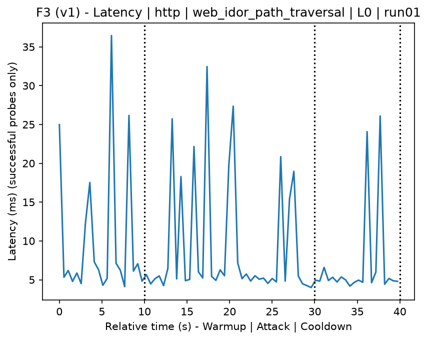
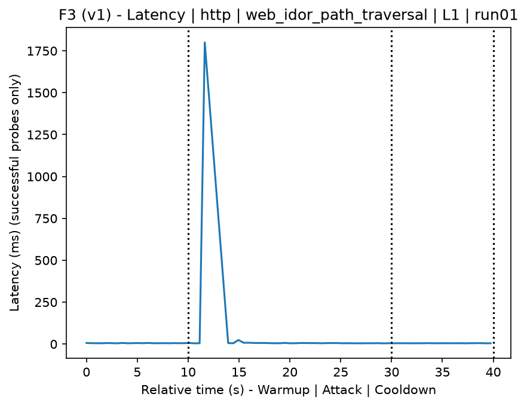
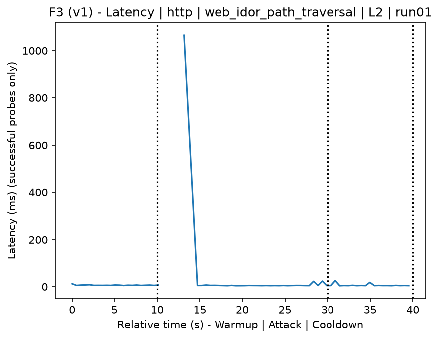
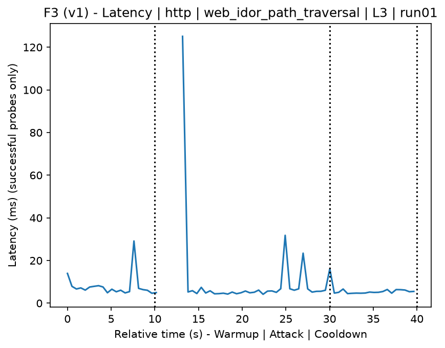
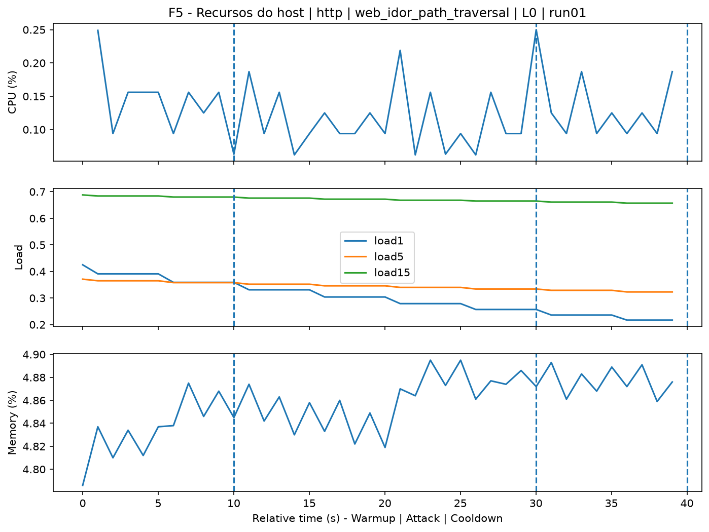
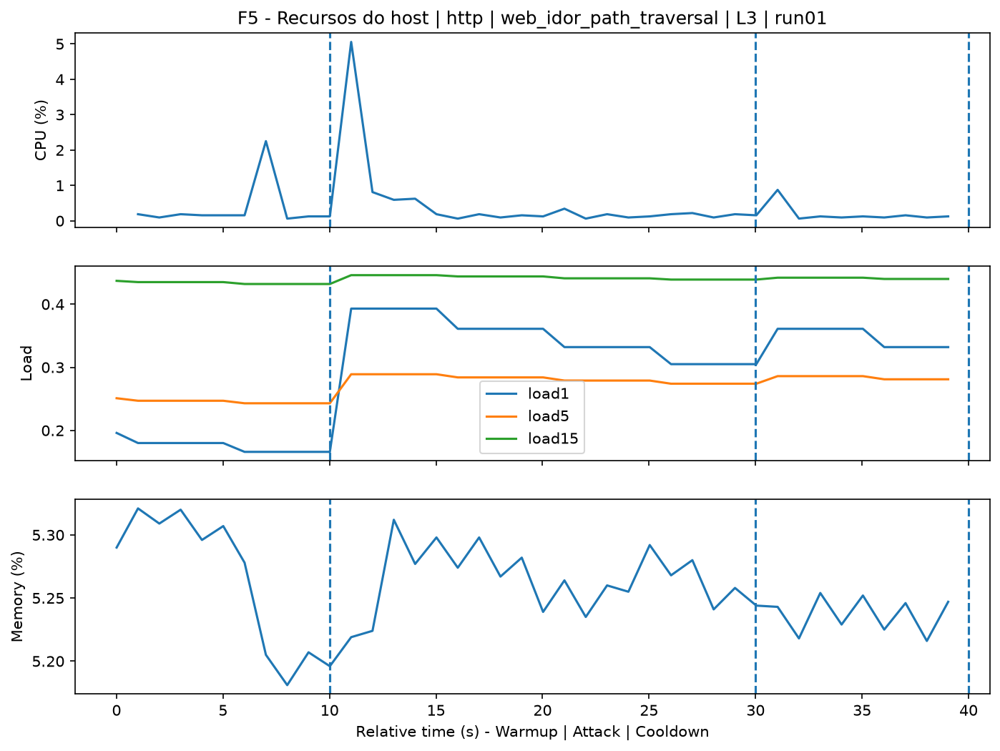
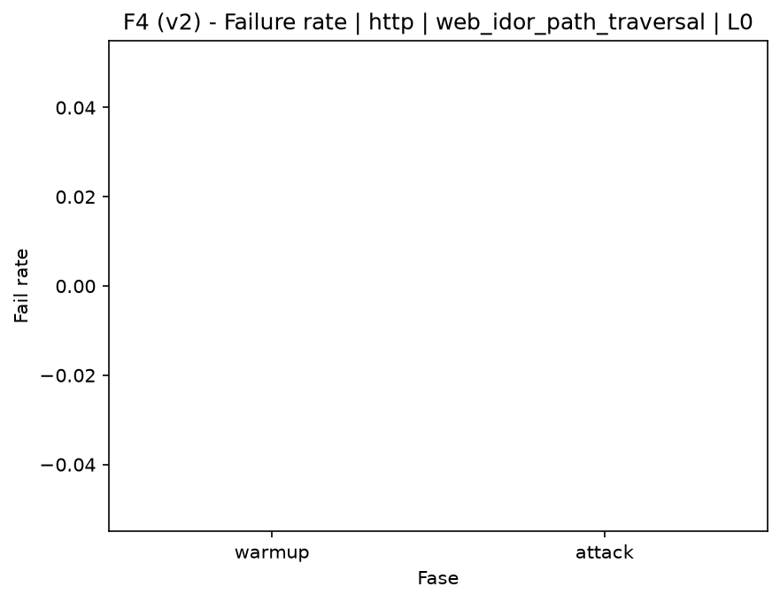
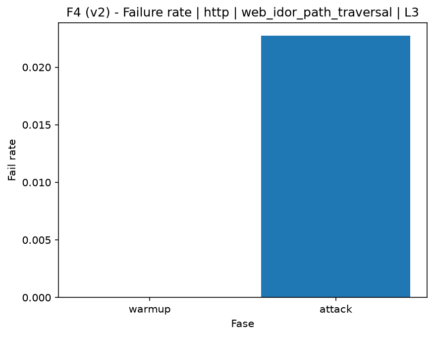

# IDOR Path Traversal (`web_idor_path_traversal`)

[Índice da campanha](README.md)

Na campanha `experiments/60att_5runs_l0l1l2l3`, este documento consolida a execução do ataque `web_idor_path_traversal`. No catálogo local, o ataque é descrito como: Attempts to access local files through the web server using a wordlist. A documentação abaixo usa apenas artefatos já presentes no repositório, principalmente as tabelas e figuras de `experiments/60att_5runs_l0l1l2l3/web_idor_path_traversal`.

## Metadados do ataque

| Campo | Valor |
| --- | --- |
| ID | `web_idor_path_traversal` |
| Categoria | 3) Web Application Attacks |
| Subcategoria | 3.2 Insecure Direct Object Reference (IDOR) |
| Serviços alvo | http-server |
| Imagem | `attack-idor-path-traversal:latest` |
| Container | `attack-idor-path-traversal` |
| Runtime máximo do catálogo | 10 s |
| Parâmetros de intensidade | n/d |
| MITRE ATT&CK | [https://attack.mitre.org/tactics/TA0043/](https://attack.mitre.org/tactics/TA0043/) [https://attack.mitre.org/tactics/TA0001/](https://attack.mitre.org/tactics/TA0001/) [https://attack.mitre.org/tactics/TA0009/](https://attack.mitre.org/tactics/TA0009/) [https://attack.mitre.org/techniques/T1595/](https://attack.mitre.org/techniques/T1595/) [https://attack.mitre.org/techniques/T1595/003/](https://attack.mitre.org/techniques/T1595/003/) [https://attack.mitre.org/techniques/T1190/](https://attack.mitre.org/techniques/T1190/) [https://attack.mitre.org/techniques/T1005/](https://attack.mitre.org/techniques/T1005/) |

## Resumo estatístico por nível

| Nível | Serviço | Runs | Amostras attack | Sucesso médio | Falha média | Lat p50/p95 ms | PCAP total MB | Dataset médio (min-max) | Exec média s | Extratores ok/total | CPU média/máx | Mem MB média |
| --- | --- | --- | --- | --- | --- | --- | --- | --- | --- | --- | --- | --- |
| L0 | http | 5 | 198 | 100% | 0% | 5,52 / 15,78 | 1,65 | 3.120 (3.080-3.160) | 42,3 | 3/3 | 0,77% / 0,94% | 725,29 |
| L1 | http | 5 | 179 | 98,8% | 1,2% | 6,39 / 126,38 | 4,46 | 8.684 (8.612-8.748) | 42,9 | 3/3 | 1,92% / 7,57% | 731,39 |
| L2 | http | 5 | 174 | 97,7% | 2,3% | 5,87 / 191,5 | 4,43 | 8.669 (8.618-8.746) | 42,83 | 3/3 | 2,02% / 8,61% | 734,94 |
| L3 | http | 5 | 176 | 97,7% | 2,3% | 5,6 / 128,69 | 4,44 | 8.675 (8.638-8.706) | 42,85 | 3/3 | 2% / 8,81% | 735,74 |

## Estabilidade entre reexecuções

| Nível | Métrica | Runs | Média | Desvio | CV | Min | Max |
| --- | --- | --- | --- | --- | --- | --- | --- |
| L0 | CPU média na fase attack | 5 | 0,77 | 0,09 | 11,13% | 0,68 | 0,88 |
| L0 | Linhas do dataset | 5 | 3.120,4 | 28,3 | 0,91% | 3.080 | 3.160 |
| L0 | Tempo de execução | 5 | 42,3 | 0,32 | 0,76% | 42,06 | 42,85 |
| L0 | Falha na fase attack | 5 | 0 | 0 | n/d | 0 | 0 |
| L0 | Latência p95 censurada | 5 | 15,78 | 12,22 | 77,46% | 6,51 | 32 |
| L1 | CPU média na fase attack | 5 | 1,92 | 0,59 | 30,89% | 0,93 | 2,42 |
| L1 | Linhas do dataset | 5 | 8.683,6 | 59,37 | 0,68% | 8.612 | 8.748 |
| L1 | Tempo de execução | 5 | 42,9 | 0,05 | 0,11% | 42,85 | 42,97 |
| L1 | Falha na fase attack | 5 | 1,18 | 1,61 | 136,93% | 0 | 2,94 |
| L1 | Latência p95 censurada | 5 | 126,38 | 155,55 | 123,08% | 11,63 | 334,29 |
| L2 | CPU média na fase attack | 5 | 2,02 | 0,25 | 12,44% | 1,77 | 2,44 |
| L2 | Linhas do dataset | 5 | 8.669,2 | 48,47 | 0,56% | 8.618 | 8.746 |
| L2 | Tempo de execução | 5 | 42,83 | 0,1 | 0,23% | 42,77 | 43,01 |
| L2 | Falha na fase attack | 5 | 2,32 | 1,3 | 55,93% | 0 | 2,94 |
| L2 | Latência p95 censurada | 5 | 191,5 | 158,09 | 82,56% | 9,17 | 388,04 |
| L3 | CPU média na fase attack | 5 | 2 | 0,11 | 5,61% | 1,87 | 2,14 |
| L3 | Linhas do dataset | 5 | 8.674,8 | 30,94 | 0,36% | 8.638 | 8.706 |
| L3 | Tempo de execução | 5 | 42,85 | 0,06 | 0,14% | 42,77 | 42,91 |
| L3 | Falha na fase attack | 5 | 2,29 | 1,28 | 55,96% | 0 | 2,94 |
| L3 | Latência p95 censurada | 5 | 128,69 | 140,01 | 108,79% | 21,2 | 354,15 |

## Validação de artefatos

| Nível | Runs | Captura | Probe | Features | Dataset | Recursos | Server stats | Aceite |
| --- | --- | --- | --- | --- | --- | --- | --- | --- |
| L0 | 5 | 5/5 | 5/5 | 5/5 | 5/5 | 5/5 | 5/5 | 5/5 |
| L1 | 5 | 5/5 | 5/5 | 5/5 | 5/5 | 5/5 | 5/5 | 5/5 |
| L2 | 5 | 5/5 | 5/5 | 5/5 | 5/5 | 5/5 | 5/5 | 5/5 |
| L3 | 5 | 5/5 | 5/5 | 5/5 | 5/5 | 5/5 | 5/5 | 5/5 |

## Figuras selecionadas

<table>
<tr>
<td> Série temporal L0 run01</td>
<td> Série temporal L1 run01</td>
</tr>
<tr>
<td> Série temporal L2 run01</td>
<td> Série temporal L3 run01</td>
</tr>
<tr>
<td> Recursos L0 run01</td>
<td> Recursos L3 run01</td>
</tr>
<tr>
<td> Taxa de falha L0</td>
<td> Taxa de falha L3</td>
</tr>
</table>

## Fontes utilizadas

- Catálogo do ataque: `docker/attackers/idor-path-traversal/attack.yaml`
- Artefatos da campanha: `experiments/60att_5runs_l0l1l2l3/web_idor_path_traversal`
