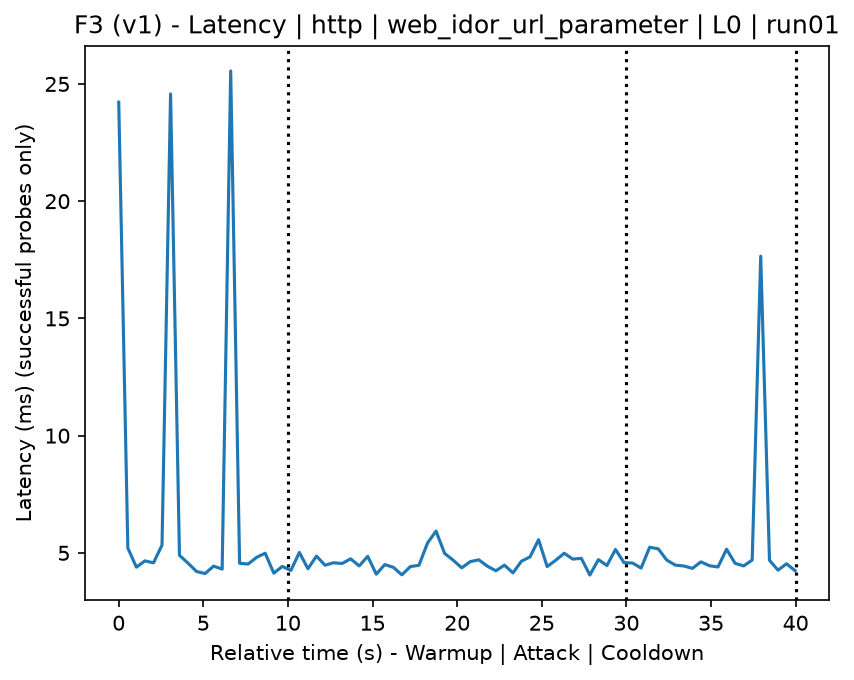
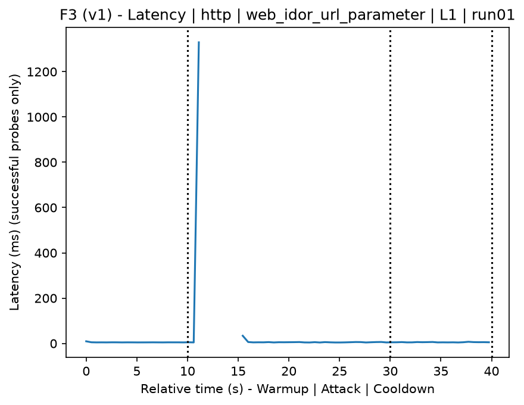
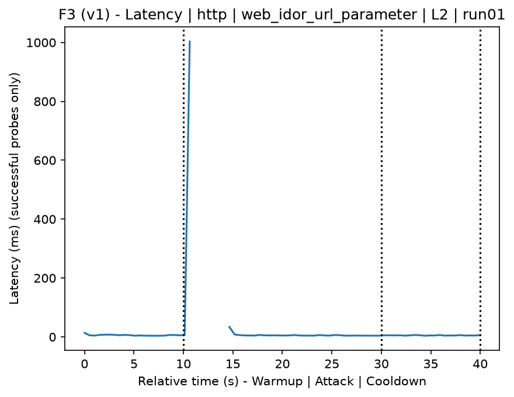
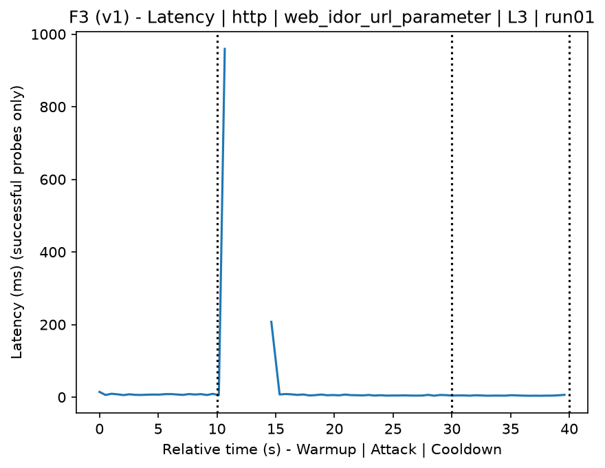
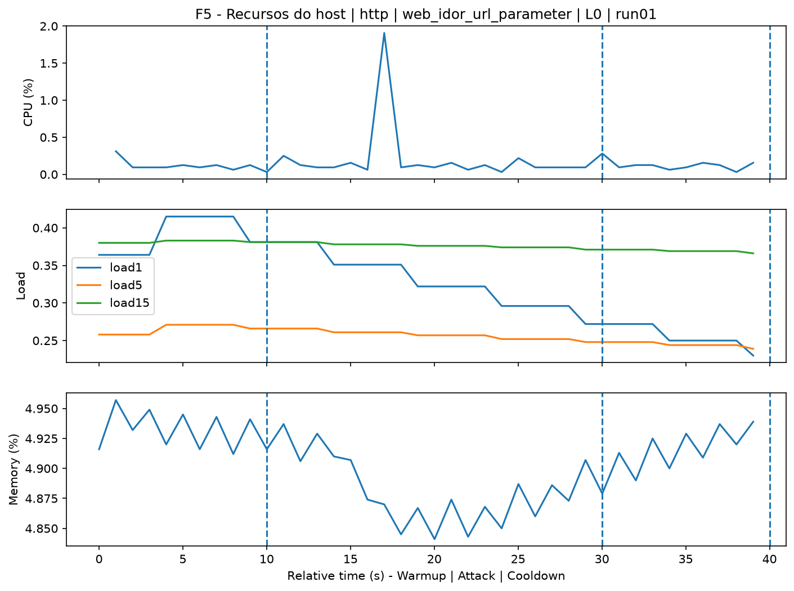
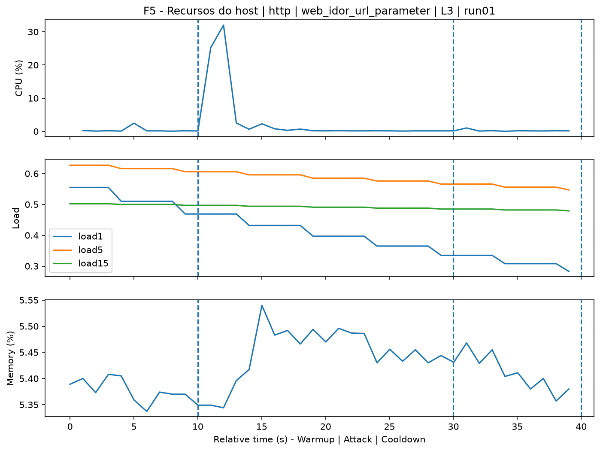
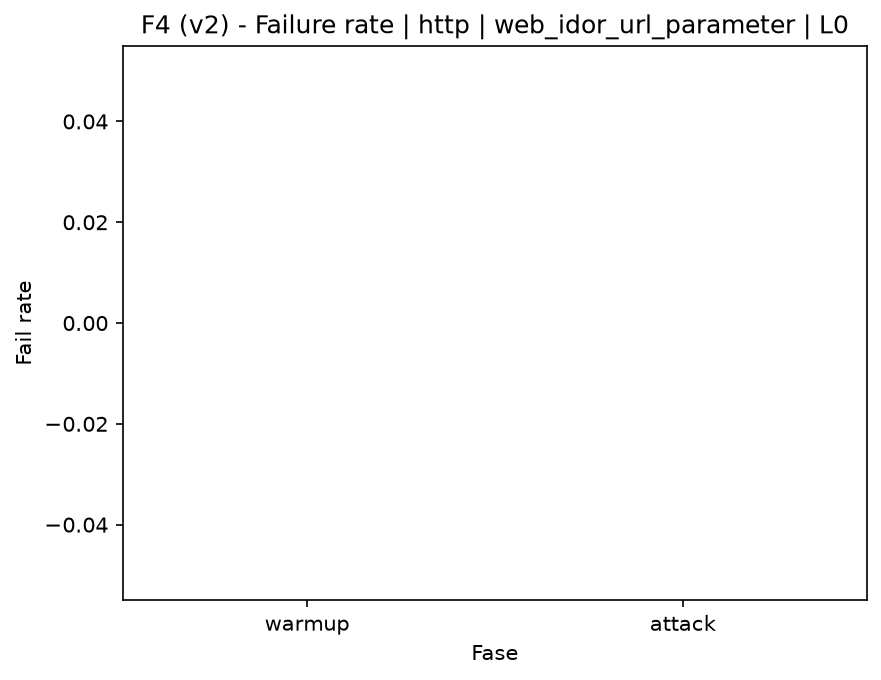
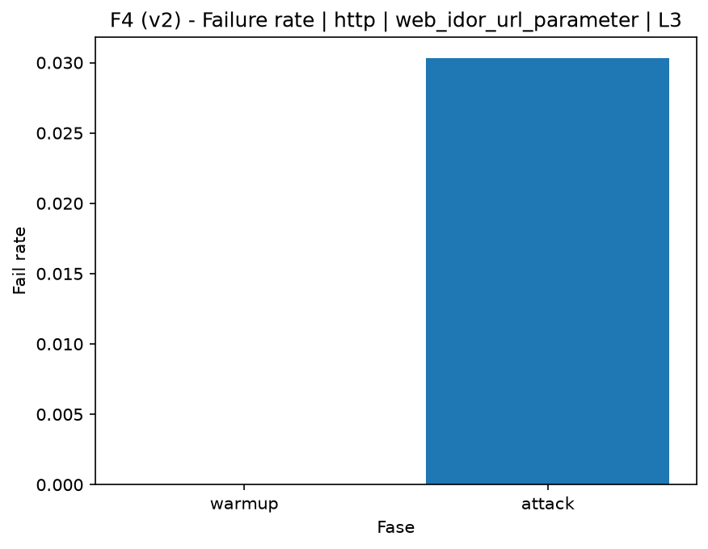

# IDOR URL Parameter (`web_idor_url_parameter`)

[Campaign index](README.md)

This document summarizes the published campaign execution of attack `web_idor_url_parameter`. In the local catalog, the attack is described as: Attempts to access resources through URL parameter manipulation using a wordlist. The full execution artifacts are not versioned in this repository; retrieve them from the Figshare dataset linked in the campaign index or regenerate the figures with `run_claim_figures.sh`. The selected figures below are stored under `contrib/assets/campaign_doc`.

## Attack Metadata

| Field | Value |
| --- | --- |
| ID | `web_idor_url_parameter` |
| Category | 3) Web Application Attacks |
| Subcategory | 3.2 Insecure Direct Object Reference (IDOR) |
| Target services | http-server |
| Image | `attack-idor-url-parameter:latest` |
| Container | `attack-idor-url-parameter` |
| Catalog max runtime | 10 s |
| Intensity parameters | n/a |
| MITRE ATT&CK | [https://attack.mitre.org/tactics/TA0043/](https://attack.mitre.org/tactics/TA0043/) [https://attack.mitre.org/tactics/TA0001/](https://attack.mitre.org/tactics/TA0001/) [https://attack.mitre.org/techniques/T1595/](https://attack.mitre.org/techniques/T1595/) [https://attack.mitre.org/techniques/T1595/003/](https://attack.mitre.org/techniques/T1595/003/) [https://attack.mitre.org/techniques/T1190/](https://attack.mitre.org/techniques/T1190/) |

## Statistical Summary by Level

| Level | Service | Runs | Attack samples | Mean success | Mean failure | Lat p50/p95 ms | Total PCAP MB | Mean dataset (min-max) | Mean exec s | Extractors ok/total | Mean/max CPU | Mean mem MB |
| --- | --- | --- | --- | --- | --- | --- | --- | --- | --- | --- | --- | --- |
| L0 | http | 5 | 200 | 100% | 0% | 4,65 / 11,88 | 1,66 | 3.139 (3.120-3.162) | 42,2 | 3/3 | 0,66% / 0,78% | 732,88 |
| L1 | http | 5 | 166 | 97% | 3% | 5,69 / 560,48 | 42,88 | 28.955 (28.878-29.018) | 46,44 | 3/3 | 53,91% / 493,57% | 821,04 |
| L2 | http | 5 | 166 | 97% | 3% | 5,77 / 631,58 | 42,87 | 28.941 (28.866-29.014) | 46,45 | 3/3 | 56,96% / 548,15% | 900,9 |
| L3 | http | 5 | 165 | 97% | 3% | 5,83 / 580,77 | 42,87 | 28.928 (28.858-28.978) | 46,37 | 3/3 | 56,58% / 544,47% | 981,27 |

## Stability Across Reruns

| Level | Metric | Runs | Mean | Deviation | CV | Min | Max |
| --- | --- | --- | --- | --- | --- | --- | --- |
| L0 | Mean CPU in attack phase | 5 | 0,66 | 0,03 | 4,68% | 0,62 | 0,69 |
| L0 | Dataset rows | 5 | 3.139,2 | 21,15 | 0,67% | 3.120 | 3.162 |
| L0 | Execution time | 5 | 42,2 | 0,37 | 0,88% | 42 | 42,86 |
| L0 | Failure in attack phase | 5 | 0 | 0 | n/a | 0 | 0 |
| L0 | Censored p95 latency | 5 | 11,88 | 8,41 | 70,83% | 5,43 | 23,7 |
| L1 | Mean CPU in attack phase | 5 | 53,91 | 6,91 | 12,82% | 44,85 | 62,7 |
| L1 | Dataset rows | 5 | 28.954,8 | 68,04 | 0,23% | 28.878 | 29.018 |
| L1 | Execution time | 5 | 46,44 | 0,08 | 0,18% | 46,31 | 46,52 |
| L1 | Failure in attack phase | 5 | 3,01 | 0,04 | 1,32% | 2,94 | 3,03 |
| L1 | Censored p95 latency | 5 | 560,48 | 155,48 | 27,74% | 333,68 | 741,65 |
| L2 | Mean CPU in attack phase | 5 | 56,96 | 7,39 | 12,98% | 44,57 | 63,22 |
| L2 | Dataset rows | 5 | 28.941,2 | 64,15 | 0,22% | 28.866 | 29.014 |
| L2 | Execution time | 5 | 46,45 | 0,15 | 0,33% | 46,25 | 46,63 |
| L2 | Failure in attack phase | 5 | 3,01 | 0,08 | 2,54% | 2,94 | 3,12 |
| L2 | Censored p95 latency | 5 | 631,58 | 220,12 | 34,85% | 373,15 | 863,5 |
| L3 | Mean CPU in attack phase | 5 | 56,58 | 7,17 | 12,68% | 44,64 | 63,77 |
| L3 | Dataset rows | 5 | 28.928 | 45,65 | 0,16% | 28.858 | 28.978 |
| L3 | Execution time | 5 | 46,37 | 0,09 | 0,19% | 46,23 | 46,46 |
| L3 | Failure in attack phase | 5 | 3,03 | 0,07 | 2,14% | 2,94 | 3,12 |
| L3 | Censored p95 latency | 5 | 580,77 | 209,85 | 36,13% | 318,03 | 875,91 |

## Artifact Validation

| Level | Runs | Capture | Probe | Features | Dataset | Resources | Server stats | Acceptance |
| --- | --- | --- | --- | --- | --- | --- | --- | --- |
| L0 | 5 | 5/5 | 5/5 | 5/5 | 5/5 | 5/5 | 5/5 | 5/5 |
| L1 | 5 | 5/5 | 5/5 | 5/5 | 5/5 | 5/5 | 5/5 | 5/5 |
| L2 | 5 | 5/5 | 5/5 | 5/5 | 5/5 | 5/5 | 5/5 | 5/5 |
| L3 | 5 | 5/5 | 5/5 | 5/5 | 5/5 | 5/5 | 5/5 | 5/5 |

## Selected Figures

<table>
<tr>
<td> Time series L0 run01</td>
<td> Time series L1 run01</td>
</tr>
<tr>
<td> Time series L2 run01</td>
<td> Time series L3 run01</td>
</tr>
<tr>
<td> Resources L0 run01</td>
<td> Resources L3 run01</td>
</tr>
<tr>
<td> Failure rate L0</td>
<td> Failure rate L3</td>
</tr>
</table>

## Sources Used

- Attack catalog: `docker/attackers/idor-url-parameter/attack.yaml`
- Full campaign artifacts: available from the Figshare dataset linked in the campaign index; when extracted locally, expected under `experiments/60att_5runs_l0l1l2l3/web_idor_url_parameter`.
