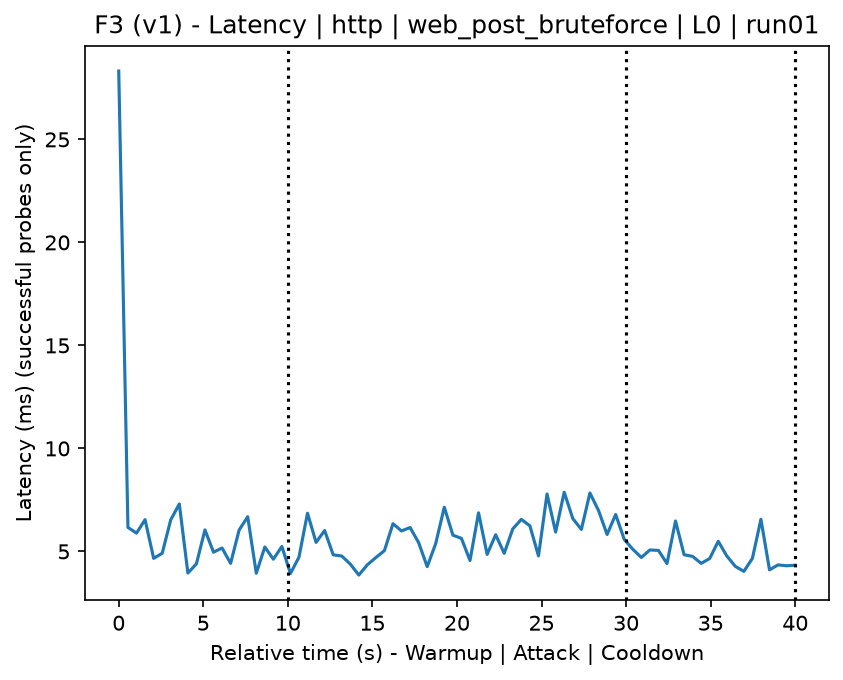
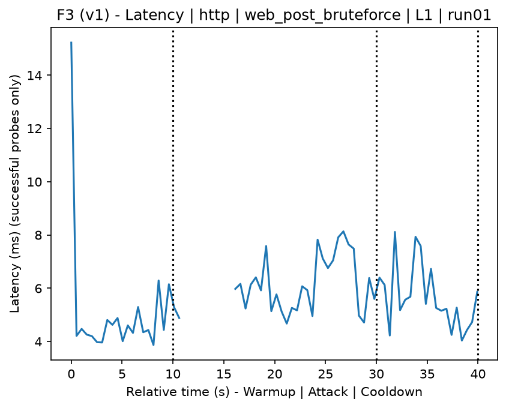
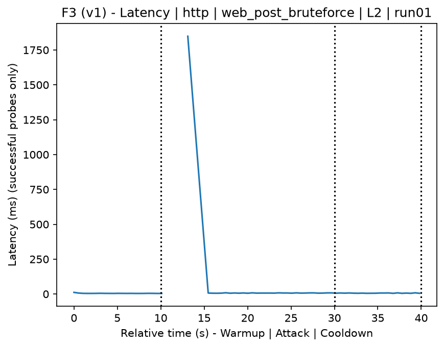
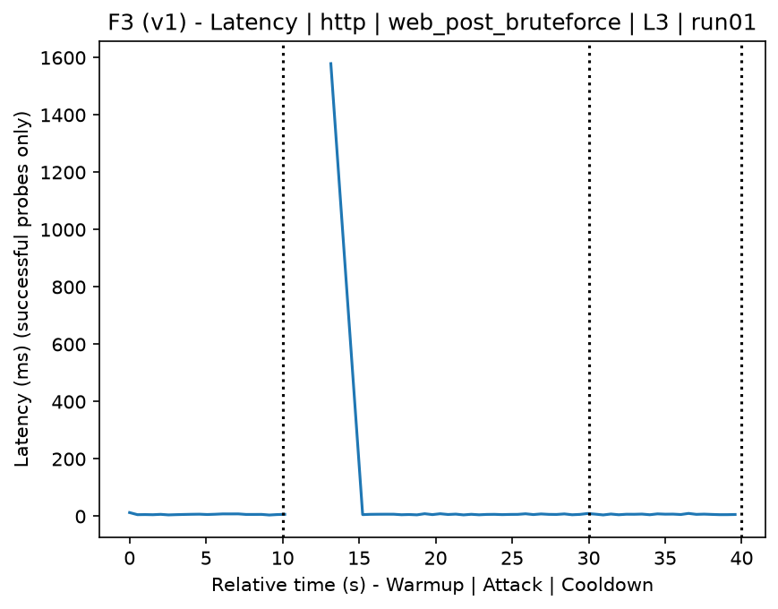
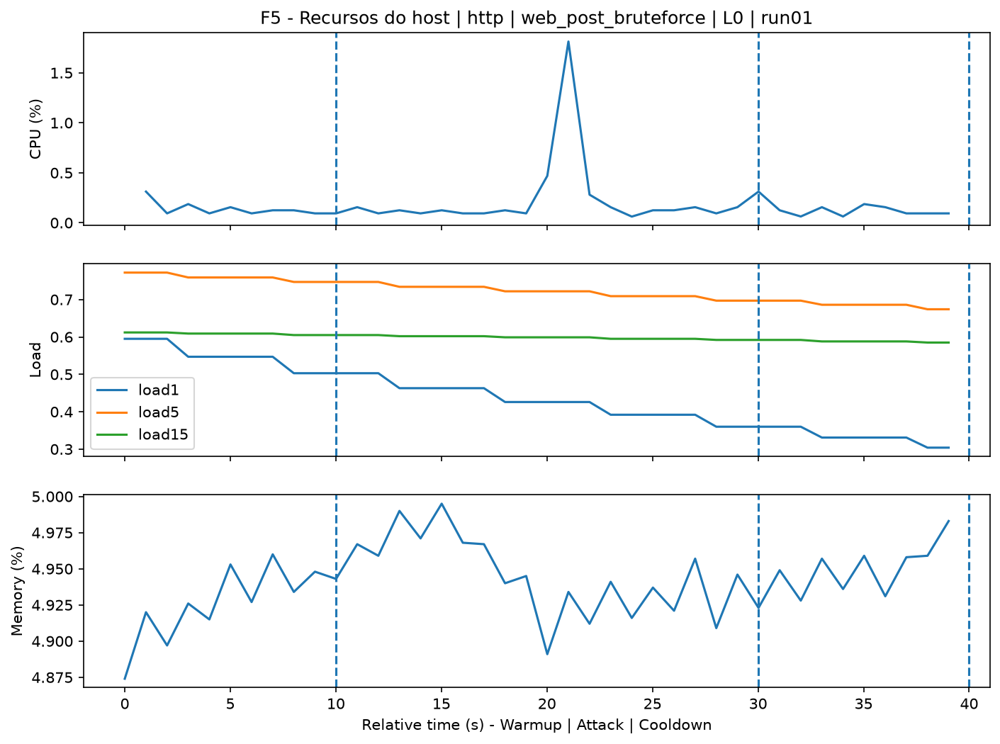
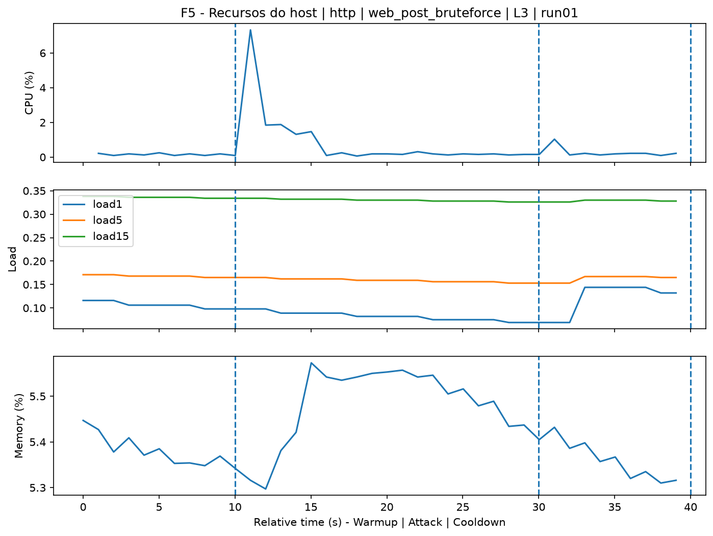
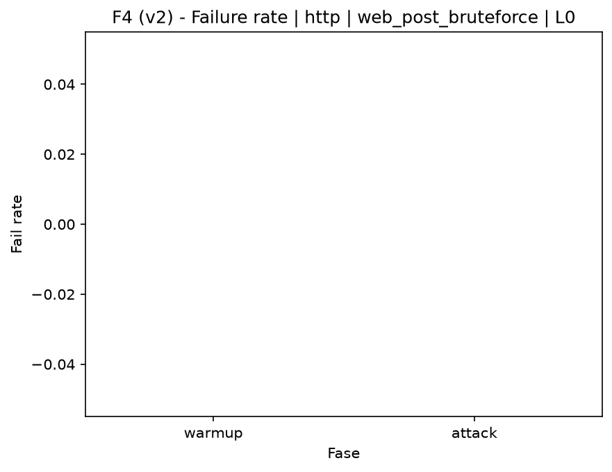
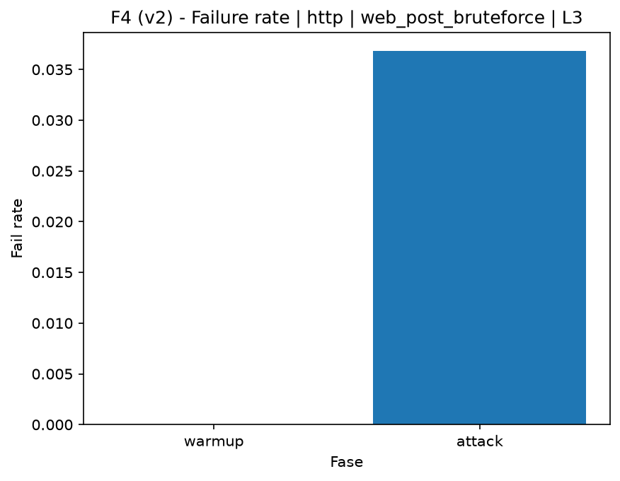

# Web POST Bruteforce (`web_post_bruteforce`)

[Campaign index](README.md)

This document summarizes the published campaign execution of attack `web_post_bruteforce`. In the local catalog, the attack is described as: Web application POST authentication brute force using a wordlist. The full execution artifacts are not versioned in this repository; retrieve the generated dataset CSVs from the Figshare dataset linked in the campaign index. Raw PCAP captures are not included in that archive. The selected figures below are stored under `contrib/assets/campaign_doc`.

## Attack Metadata

| Field | Value |
| --- | --- |
| ID | `web_post_bruteforce` |
| Category | 3) Web Application Attacks |
| Subcategory | 3.1 General Web |
| Target services | http-server |
| Image | `attack-web-post-bruteforce:latest` |
| Container | `attack-web-post-bruteforce` |
| Catalog max runtime | 10 s |
| Intensity parameters | n/a |
| MITRE ATT&CK | [https://attack.mitre.org/tactics/TA0006/](https://attack.mitre.org/tactics/TA0006/) [https://attack.mitre.org/techniques/T1110/](https://attack.mitre.org/techniques/T1110/) [https://attack.mitre.org/techniques/T1110/001/](https://attack.mitre.org/techniques/T1110/001/) |

## Statistical Summary by Level

| Level | Service | Runs | Attack samples | Mean success | Mean failure | Lat p50/p95 ms | Total PCAP MB | Mean dataset (min-max) | Mean exec s | Extractors ok/total | Mean/max CPU | Mean mem MB |
| --- | --- | --- | --- | --- | --- | --- | --- | --- | --- | --- | --- | --- |
| L0 | http | 5 | 200 | 100% | 0% | 4,95 / 6,47 | 1,67 | 3.152 (3.120-3.162) | 42,32 | 3/3 | 0,76% / 0,95% | 961,5 |
| L1 | http | 5 | 161 | 95,6% | 4,4% | 5,35 / 809,77 | 5,25 | 7.600 (7.472-7.698) | 42,82 | 3/3 | 6,73% / 50,94% | 1.004,67 |
| L2 | http | 5 | 169 | 96,9% | 3,1% | 5,95 / 632,7 | 4,65 | 6.944 (4.160-7.662) | 42,72 | 3/3 | 5,84% / 42,31% | 1.009,12 |
| L3 | http | 5 | 163 | 96,3% | 3,7% | 6,12 / 713,47 | 5,24 | 7.560 (7.512-7.622) | 42,86 | 3/3 | 7,17% / 52,93% | 1.015,61 |

## Stability Across Reruns

| Level | Metric | Runs | Mean | Deviation | CV | Min | Max |
| --- | --- | --- | --- | --- | --- | --- | --- |
| L0 | Mean CPU in attack phase | 5 | 0,76 | 0,08 | 10,54% | 0,66 | 0,87 |
| L0 | Dataset rows | 5 | 3.152,4 | 18,13 | 0,58% | 3.120 | 3.162 |
| L0 | Execution time | 5 | 42,32 | 0,34 | 0,8% | 42,07 | 42,91 |
| L0 | Failure in attack phase | 5 | 0 | 0 | n/a | 0 | 0 |
| L0 | Censored p95 latency | 5 | 6,47 | 1,08 | 16,66% | 5,04 | 7,79 |
| L1 | Mean CPU in attack phase | 5 | 6,73 | 0,41 | 6,13% | 6,42 | 7,35 |
| L1 | Dataset rows | 5 | 7.600,4 | 86,57 | 1,14% | 7.472 | 7.698 |
| L1 | Execution time | 5 | 42,82 | 0,09 | 0,22% | 42,7 | 42,93 |
| L1 | Failure in attack phase | 5 | 4,36 | 1,73 | 39,7% | 3,03 | 6,25 |
| L1 | Censored p95 latency | 5 | 809,77 | 114,3 | 14,12% | 632,53 | 906,18 |
| L2 | Mean CPU in attack phase | 5 | 5,84 | 2,53 | 43,27% | 1,38 | 7,34 |
| L2 | Dataset rows | 5 | 6.943,6 | 1.556,2 | 22,41% | 4.160 | 7.662 |
| L2 | Execution time | 5 | 42,72 | 0,29 | 0,67% | 42,21 | 42,9 |
| L2 | Failure in attack phase | 5 | 3,11 | 2,21 | 71,15% | 0 | 6,25 |
| L2 | Censored p95 latency | 5 | 632,7 | 373,51 | 59,03% | 5,8 | 906,66 |
| L3 | Mean CPU in attack phase | 5 | 7,17 | 0,32 | 4,42% | 6,75 | 7,43 |
| L3 | Dataset rows | 5 | 7.559,6 | 55,34 | 0,73% | 7.512 | 7.622 |
| L3 | Execution time | 5 | 42,86 | 0,08 | 0,19% | 42,77 | 42,95 |
| L3 | Failure in attack phase | 5 | 3,69 | 1,43 | 38,72% | 3,03 | 6,25 |
| L3 | Censored p95 latency | 5 | 713,47 | 144,94 | 20,31% | 573,46 | 905,77 |

## Artifact Validation

| Level | Runs | Capture | Probe | Features | Dataset | Resources | Server stats | Acceptance |
| --- | --- | --- | --- | --- | --- | --- | --- | --- |
| L0 | 5 | 5/5 | 5/5 | 5/5 | 5/5 | 5/5 | 5/5 | 5/5 |
| L1 | 5 | 5/5 | 5/5 | 5/5 | 5/5 | 5/5 | 5/5 | 5/5 |
| L2 | 5 | 5/5 | 5/5 | 5/5 | 5/5 | 5/5 | 5/5 | 5/5 |
| L3 | 5 | 5/5 | 5/5 | 5/5 | 5/5 | 5/5 | 5/5 | 5/5 |

## Selected Figures

<table>
<tr>
<td> Time series L0 run01</td>
<td> Time series L1 run01</td>
</tr>
<tr>
<td> Time series L2 run01</td>
<td> Time series L3 run01</td>
</tr>
<tr>
<td> Resources L0 run01</td>
<td> Resources L3 run01</td>
</tr>
<tr>
<td> Failure rate L0</td>
<td> Failure rate L3</td>
</tr>
</table>

## Sources Used

- Attack catalog: `docker/attackers/web-post-bruteforce/attack.yaml`
- Full campaign artifacts: available from the Figshare dataset linked in the campaign index; when extracted locally, expected under `experiments/all_5runs_4levels/web_post_bruteforce`.
